# Capítulo V: Solution UI/UX Design

## 5.1. Style Guidelines

### 5.3.1 Landing Page Wireframe.

Wireframe Landing Page (Desktop)

Sección Principal de la landing page:

  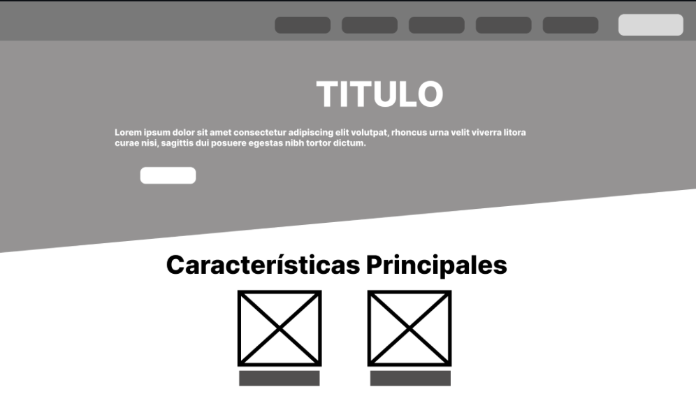

Sección Características y Beneficios:

  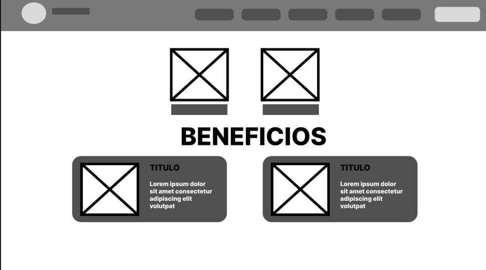

Sección Antecedentes:

  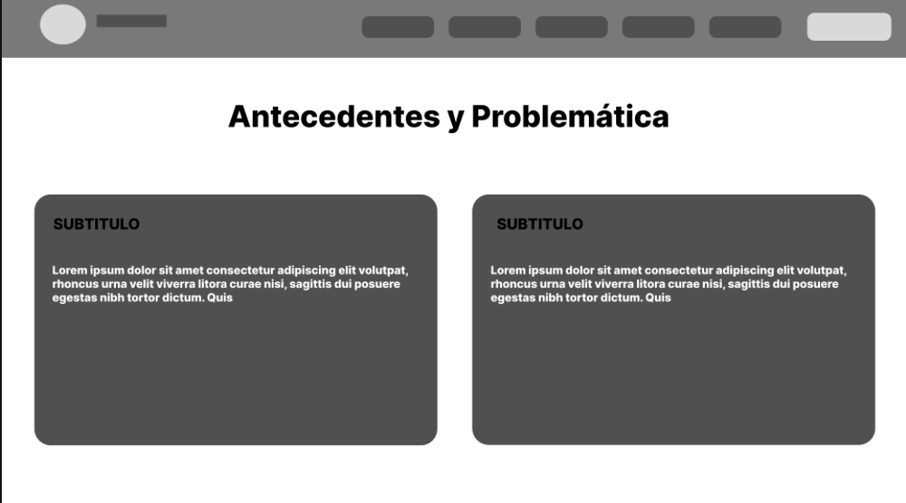

Sección "Acerca de":

  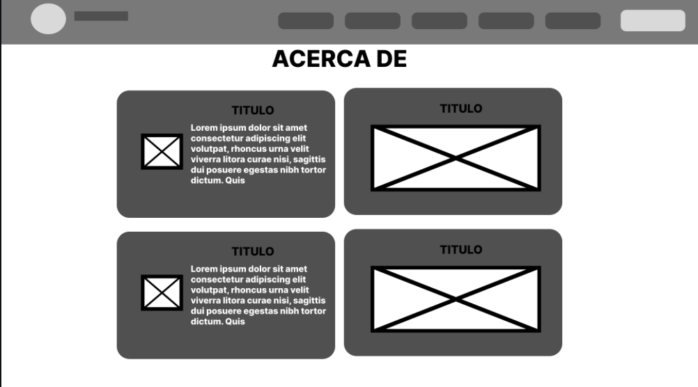

Sección de Formulario de contacto:

  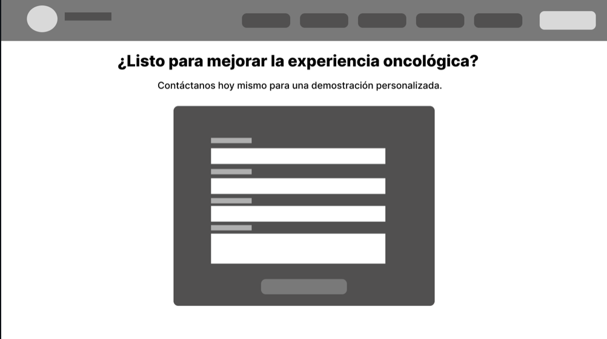

Sección de Descargas de aplicación móvil y pie de página:

  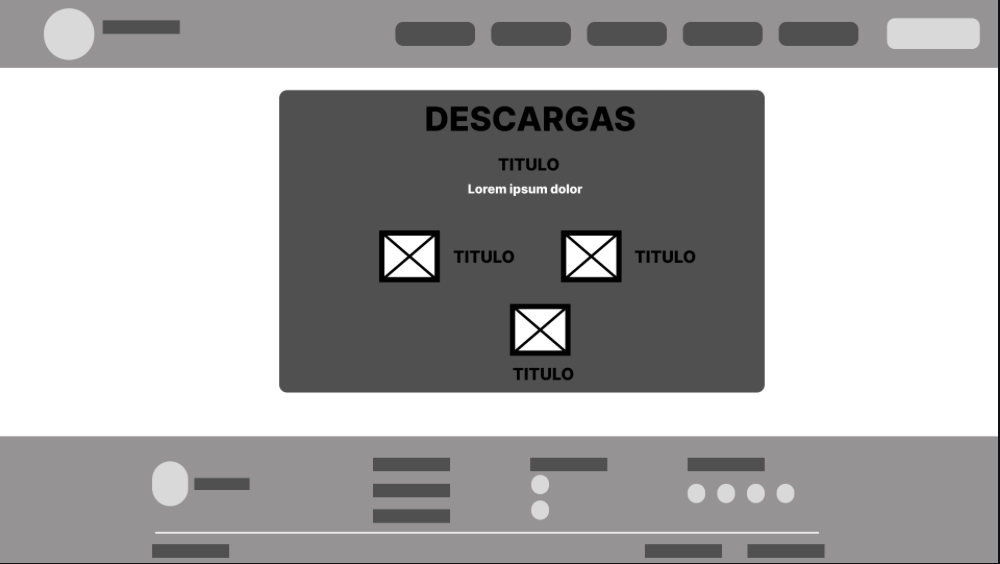

### 5.3.2 Landing Page Mock-up.

## Mockups Landing Page (Desktop)

Sección Principal de la landing page:

  

Sección Características y Beneficios:

  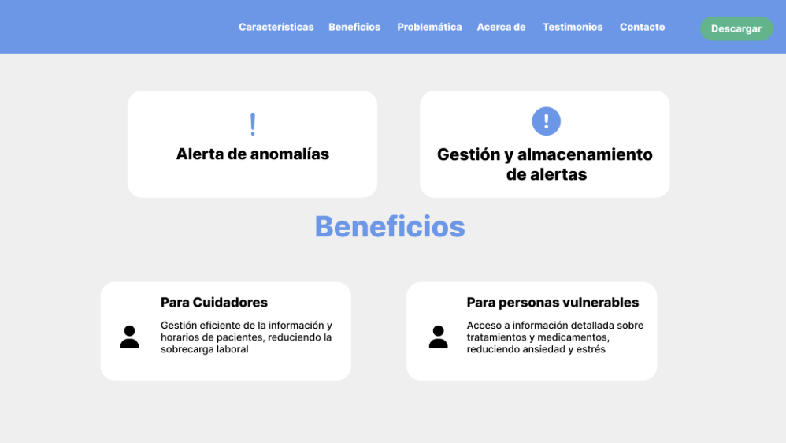

Sección Antecedentes:

  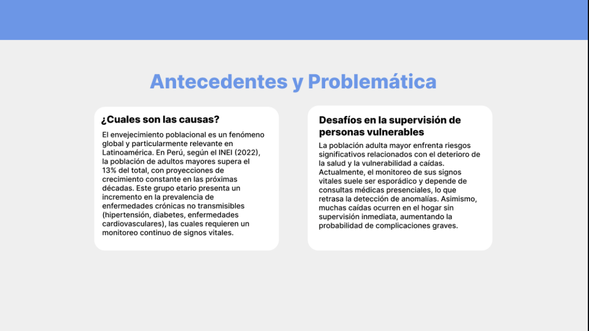

Sección "Acerca de":

  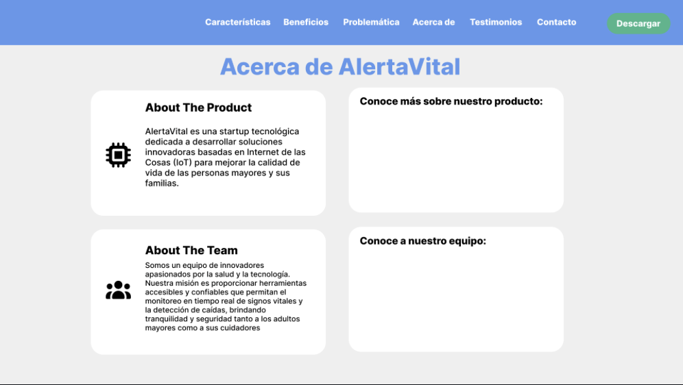

Sección de Formulario de contacto:

  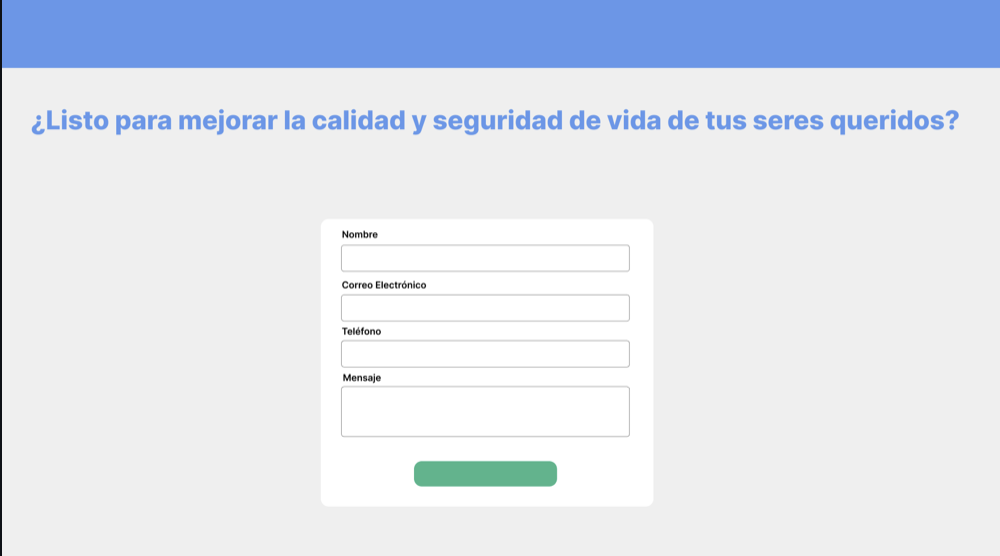

Sección de Descargas de aplicación móvil y pie de página:

  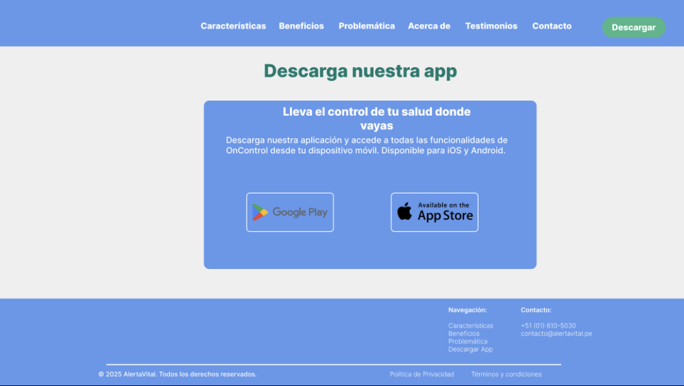

### 5.4.2. Applications Wireflow Diagrams

Esta sección presenta la propuesta de Wireflow Diagrams para la plataforma. Cada diagrama conecta las pantallas principales de la aplicación y muestra la secuencia de acciones necesaria para cumplir los objetivos clave según el rol de usuario.

Los wireflows se construyeron a partir de los mock-ups validados y se organizan en tres perspectivas: usuario final, arrendatario y administrador. Esto permite identificar la ruta principal de navegación, los puntos de decisión y las transiciones operativas específicas de cada rol.

#### Wireflow del Usuario

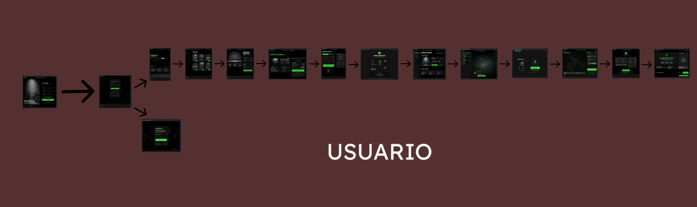

##### Descripción

Este wireflow representa la experiencia integral del cliente durante el servicio de alquiler de bicicletas IoT. El diagrama incluye las etapas de autenticación, exploración, selección, pago, uso de la bicicleta y cierre de servicio, mostrando la continuidad entre pantallas y las decisiones principales del usuario.

##### Explicación del flujo

Ruta principal (de izquierda a derecha):

Crear Cuenta -> Iniciar Sesión -> Página de Inicio -> Explorar Bicicletas -> Detalle de Bicicleta -> Confirmar Reserva -> Método de Pago y QR -> Cobro Final y Comprobante -> Panel de Usuario -> Mapa de Bicicletas Cercanas -> Desbloquear Bicicleta Smart Lock -> Alquiler Activo (Ruta en Vivo) -> Resumen de Finalización -> Bloqueo Automático y Devolución.

Ruta alternativa:

Iniciar Sesión -> Recuperar Contraseña -> Iniciar Sesión.

Este recorrido representa el ciclo completo del usuario, desde el acceso al sistema hasta el cierre del alquiler y la emisión del comprobante final.

#### Wireflow del Arrendatario

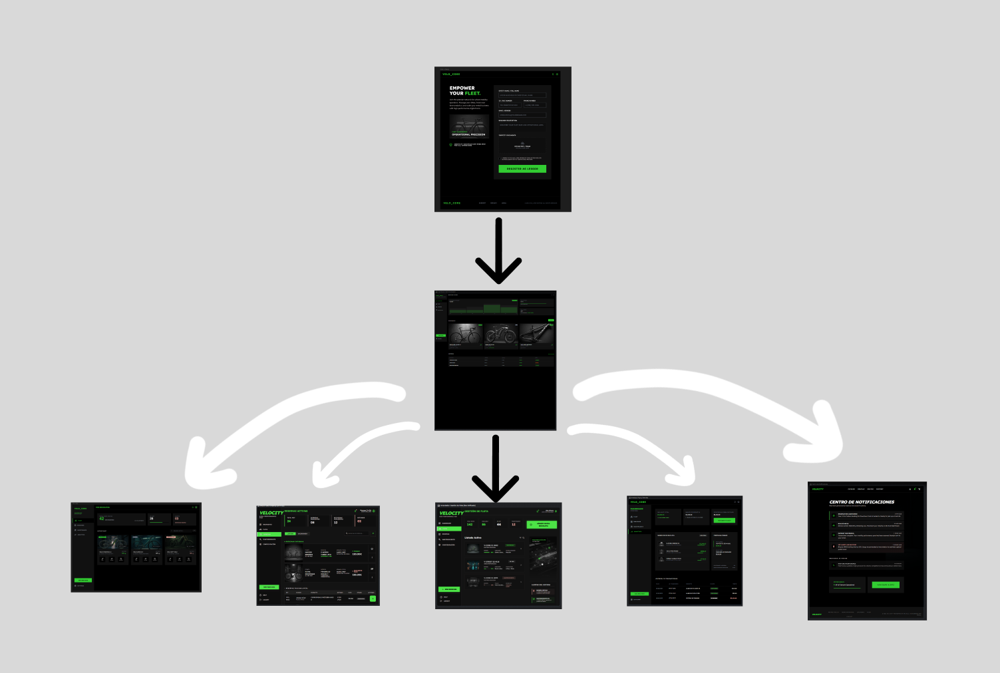

##### Descripción

Este wireflow describe la operación del arrendatario desde su incorporación al sistema hasta la gestión continua de su negocio. El flujo se centra en el dashboard como punto de control para administrar bicicletas, reservas activas, estado de flota, alertas operativas e indicadores económicos.

##### Explicación del flujo

Ruta de entrada:

Crear Cuenta de Arrendador -> Dashboard del Arrendador.

Rutas operativas desde el dashboard:

Dashboard del Arrendador -> Mis Bicicletas -> Registrar Nueva Bicicleta.

Dashboard del Arrendador -> Gestión de Reservas -> Detalle de Alquiler Activo.

Dashboard del Arrendador -> Gestión de Flota.

Dashboard del Arrendador -> Pagos y Ganancias.

Dashboard del Arrendador -> Centro de Notificaciones.

El dashboard funciona como nodo central, concentrando la operación diaria, el control de flota y el monitoreo comercial del arrendatario.

#### Wireflow de Administración

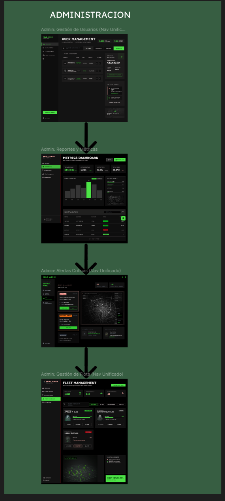

##### Descripción

Este wireflow presenta la ruta de supervisión estratégica del rol administrador. El recorrido vincula la gestión de usuarios con el análisis de métricas, la atención de alertas críticas y la coordinación de la flota, permitiendo una visión global para la toma de decisiones de alto nivel.

##### Explicación del flujo

Secuencia de supervisión:

Gestión de Usuarios -> Reportes y Métricas -> Alertas Críticas -> Gestión de Flota.

Este flujo sintetiza la lógica de control administrativo: primero la gestión de actores del sistema, luego la revisión de indicadores, después la atención de eventos críticos y finalmente la toma de acciones operativas sobre la flota.

#### Versión móvil del usuario

Esta versión muestra el mismo recorrido del usuario final, pero adaptado a una interfaz móvil. El flujo permite registrar sesión, explorar vehículos, revisar detalles, confirmar acciones y continuar el proceso de alquiler desde el teléfono.

#### Versión móvil del arrendatario

Esta versión concentra las tareas operativas del arrendatario en una experiencia móvil. Desde estas pantallas es posible acceder al panel, administrar vehículos, consultar actividad y revisar el estado general de la flota.

### 5.4.3. Applications Mock-ups

### 5.4.4. Applications User Flow Diagrams

Esta sección presenta los diagramas de User Flow, organizados por rol y centrados en los objetivos principales del usuario. Cada flujo muestra la ruta de éxito (happy path), las decisiones críticas y las rutas alternativas ante casos de error o cancelación.

#### User Flow del Cliente: Alquilar una Bicicleta

##### Descripción

El flujo de usuario cliente se estructura alrededor del objetivo central: alquilar una bicicleta de forma rápida y segura. El diagrama incluye el acceso al sistema, la búsqueda y selección de bicicleta, el pago, la ejecución del viaje y el cierre del alquiler con comprobante.

##### Explicación del flujo

**Objetivo principal:** El visitante se registra o inicia sesión para poder acceder a la plataforma y comenzar a usar el servicio de alquiler de bicicletas.

**Ruta principal (Happy Path):** Registrarse o iniciar sesión → Acceder a la plataforma → Explorar bicicletas disponibles → Seleccionar una bicicleta → Confirmar condiciones → Realizar pago → Desbloquear bicicleta → Usar la bicicleta → Finalizar el alquiler.

**Rutas alternativas:**
- Si no tiene cuenta, primero debe registrarse y luego acceder.
- Si el pago falla, debe reintentarlo antes de continuar.
- Si rechaza las condiciones, puede volver a explorar otras bicicletas.

---

#### User Goal 1: Registrarse e iniciar sesión en la aplicación

**Descripción:** El estudiante desea crear una cuenta para acceder a las funcionalidades del sistema y gestionar sus alquileres de forma personalizada.

**Flujo:** El usuario abre la aplicación y selecciona la opción “Registrarse”. Ingresa sus datos personales y confirma el registro. Luego inicia sesión con sus credenciales y accede a su panel principal.

**Pantallas involucradas:**
- Registro de usuario
- Inicio de sesión
- Panel principal

**Comportamientos adicionales:** Si los datos ingresados son inválidos, se muestra un mensaje de error y se solicita corrección. Una vez autenticado, el sistema guarda la sesión activa para próximos ingresos automáticos.

#### User Goal 2: Buscar y filtrar vehículos cercanos

**Descripción:** El estudiante desea explorar las opciones disponibles de bicicletas o scooters cercanos, aplicando filtros por tipo, precio o distancia para encontrar la mejor alternativa.

**Flujo:** El usuario accede al panel principal, abre la pantalla de búsqueda o mapa y aplica filtros para encontrar las opciones cercanas que mejor se ajusten a su necesidad.

**Pantallas involucradas:**
- Panel principal
- Pantalla de búsqueda / mapa
- Detalle del vehículo seleccionado

**Comportamientos adicionales:** El sistema obtiene la ubicación actual del usuario y actualiza los resultados en tiempo real. Si no hay vehículos disponibles, se muestra un mensaje informativo con la opción de ampliar el rango de búsqueda.

#### User Goal 3: Realizar y confirmar una reserva

**Descripción:** El estudiante selecciona un vehículo disponible, define el horario y confirma la reserva para garantizar su uso en el periodo deseado.

**Flujo:** El usuario abre el detalle del vehículo, accede a la pantalla de reserva, define la fecha u horario y confirma la reserva.

**Pantallas involucradas:**
- Detalle del vehículo
- Pantalla de reserva
- Confirmación de reserva

**Comportamientos adicionales:** Si otro usuario reserva el mismo vehículo antes de la confirmación, se notifica la indisponibilidad. Al confirmar, el estado del vehículo cambia automáticamente a “reservado”.

#### User Goal 4: Pagar el alquiler y recibir confirmación

**Descripción:** El estudiante completa el pago del alquiler mediante la pasarela integrada y recibe una confirmación inmediata de la transacción.

**Flujo:** El usuario accede a la pantalla de pago, ingresa el método de pago y confirma la transacción. Luego recibe el comprobante digital y la confirmación del alquiler.

**Pantallas involucradas:**
- Pantalla de pago
- Confirmación de pago
- Recibo o comprobante

**Comportamientos adicionales:** Si el pago falla, el sistema permite reintentar o elegir otro método de pago. Tras un pago exitoso, se genera un comprobante digital y se actualiza el historial del usuario.

#### User Goal 5: Ver y responder calificaciones y reseñas

**Descripción:** El estudiante consulta las valoraciones y comentarios realizados por otros usuarios sobre su servicio, y puede responder para mantener la comunicación.

**Flujo:** El usuario abre la sección de reseñas, revisa los comentarios asociados a su actividad y responde cuando es necesario.

**Pantallas involucradas:**
- Pantalla de reseñas
- Detalle de reseña
- Panel principal

**Comportamientos adicionales:** Al responder una reseña, el sistema notifica al usuario que su comentario fue atendido.

#### User Goal 1: Registrarse como arrendador

**Descripción:** El arrendador crea una cuenta para ofrecer sus vehículos en la plataforma y administrar su disponibilidad.

**Flujo:** El arrendador abre la aplicación, selecciona registrarse, completa los datos de contacto y confirma el alta del perfil.

**Pantallas involucradas:**
- Registro de arrendador
- Inicio de sesión
- Panel principal

**Comportamientos adicionales:** El sistema valida los datos de contacto y activa el perfil tras la verificación del correo electrónico.

#### User Goal 2: Gestionar vehículos publicados

**Descripción:** El arrendador puede agregar, editar o eliminar vehículos, además de cambiar su estado de disponibilidad según la situación.

**Flujo:** El arrendador accede al panel principal, abre la sección de vehículos publicados y realiza las acciones de edición o actualización necesarias.

**Pantallas involucradas:**
- Panel principal
- Pantalla “Mis vehículos”
- Formulario de edición de vehículo

**Comportamientos adicionales:** Los cambios se reflejan en la vista pública del catálogo. Si el vehículo está reservado, el sistema impide su eliminación hasta finalizar el alquiler activo.

#### User Goal 3: Consultar historial de alquileres

**Descripción:** El arrendador revisa los registros de alquileres pasados para llevar control de sus operaciones y analizar la demanda de cada vehículo.

**Flujo:** El arrendador accede al historial, revisa los alquileres almacenados y aplica filtros por fecha o vehículo.

**Pantallas involucradas:**
- Panel principal
- Pantalla de historial de alquileres

**Comportamientos adicionales:** Se permite filtrar el historial por rango de fechas o por vehículo.

#### User Goal 4: Revisar ingresos automáticos

**Descripción:** El arrendador visualiza los ingresos generados por los alquileres, con la posibilidad de filtrarlos por periodo o por tipo de vehículo.

**Flujo:** El arrendador entra a la sección de ingresos, consulta el resumen económico y revisa el detalle de transacciones cuando lo necesita.

**Pantallas involucradas:**
- Panel principal
- Pantalla de ingresos
- Detalle de transacciones

**Comportamientos adicionales:** Los ingresos se actualizan en tiempo real conforme a nuevas reservas. Si no hay movimientos en el periodo seleccionado, el sistema muestra un mensaje informativo.

#### User Goal 5: Ver y responder calificaciones y reseñas

**Descripción:** El arrendador consulta las valoraciones y comentarios realizados por los usuarios sobre sus vehículos, y puede responder para mantener una buena reputación.

**Flujo:** El arrendador abre la sección de reseñas, revisa los comentarios recibidos y responde cuando es necesario.

**Pantallas involucradas:**
- Pantalla de reseñas
- Detalle de reseña
- Panel principal

**Comportamientos adicionales:** Al responder una reseña, el sistema notifica al usuario que su comentario fue atendido.

## 5.5. Applications Prototyping

## 5.6. IoT Device Design

### Introducción y Criterios de Diseño

Esta sección presenta la propuesta de diseño físico y diseño de circuito para el nodo IoT instalado en cada bicicleta de BiciSmartIOT. El objetivo del prototipo es validar, en entorno Wokwi, la interacción entre sensores, actuadores y lógica de control para cubrir tres funciones críticas del sistema: desbloqueo remoto, detección de uso y bloqueo seguro al cierre del alquiler.

Los principales criterios para las decisiones de diseño del hardware son:

- Seguridad operativa: el dispositivo debe responder de forma confiable a comandos de bloqueo y desbloqueo, manteniendo estados consistentes (`LOCKED`, `UNLOCKED`, `LOCKDOWN`).
- Telemetría en tiempo real: el hardware debe capturar eventos de movimiento y estado para alimentar el monitoreo de uso de la bicicleta.
- Bajo consumo y simplicidad de integración: se prioriza un microcontrolador con conectividad inalámbrica y soporte amplio de librerías para acelerar el prototipado.
- Escalabilidad funcional: el diseño debe permitir añadir sensores y reglas (por ejemplo, batería baja o alerta por manipulación) sin rediseñar toda la arquitectura.
- Viabilidad de simulación: los componentes seleccionados deben estar disponibles o ser representables en Wokwi para validar comportamiento antes del montaje físico.

### Relación con la Arquitectura de Información y Guía de Estilos

El diseño de la interfaz física IoT (IoT Device Physical Interfaces) se alinea con la arquitectura del bounded context IoT & Device Control. En este modelo:

- La app y el backend envían comandos de control al dispositivo.
- El dispositivo publica eventos de telemetría para tracking y monitoreo.
- El estado físico de la bicicleta se refleja en la aplicación móvil en tiempo cercano a real.

En la capa de experiencia de usuario, la semántica de estados del hardware se integra con la interfaz visual de la plataforma:

- Estado seguro: indicador equivalente a operación correcta o bicicleta bloqueada.
- Estado activo: indicador equivalente a bicicleta en uso o desbloqueada.
- Estado de alerta: indicador equivalente a evento crítico (bloqueo remoto, manipulación o error de operación).

### Propuesta de Diseño de Circuito (Hardware Schematic)

Para la validación lógica de componentes y conexiones se propone un esquemático en Wokwi con un ESP32 como núcleo del sistema.

Componentes recomendados para el prototipo en Wokwi (alineados a BiciSmartIOT):

1. ESP32 DevKit v1: microcontrolador principal del dispositivo de bicicleta.
2. Servo SG90: simulación del smart lock para comandos `unlock/lock/lockdown`.
3. MPU6050: sensor de movimiento para detectar bicicleta en uso (US28).
4. GPS simulado por Serial (coordenadas mock): tracking de ubicación en la simulación.
5. LED RGB (o 3 LEDs): semaforo de estado operativo (`LOCKED`, `UNLOCKED`, `LOCKDOWN`).
6. Pulsador opcional: simulacion de accion local de seguridad o emparejamiento inicial.

#### Mapeo sugerido de pines (Wokwi)

- `GPIO 21` -> SDA del MPU6050
- `GPIO 22` -> SCL del MPU6050
- `GPIO 18` (etiqueta `D18` en Wokwi) -> señal de control del servo (smart lock simulado)
- `VIN` en Wokwi -> alimentacion del servo a 5V
- `GPIO 4` -> canal rojo LED RGB (con resistencia de 220 ohm)
- `GPIO 2` -> canal verde LED RGB (con resistencia de 220 ohm)
- `GPIO 15` -> canal azul LED RGB (con resistencia de 220 ohm)
- `GPIO 13` -> pulsador (modo `INPUT_PULLUP`)

Notas de montaje en Wokwi:

- Conectar `VCC` y `GND` de todos los módulos correctamente.
- En Wokwi, usa `VIN` como referencia de 5V para el servo.
- Si no usas LED RGB, reemplazar por tres LEDs individuales (uno por estado).
- Usar eventos por monitor serial con formato `GPS:lat,lon` para simular tracking.

### Configuración que debes poner en Wokwi

Para que la simulacion represente tu arquitectura real (App -> Backend -> IoT Device Control), en Wokwi debes preparar lo siguiente:

1. Crear un proyecto nuevo con placa `ESP32`.
2. Agregar los componentes: `Servo`, `MPU6050`, `RGB LED` y `Pushbutton` opcional.
3. Cablear según el mapeo de pines propuesto.
4. Programar una maquina de estados minima del dispositivo:
	- `LOCKED`
	- `UNLOCKED`
	- `LOCKDOWN`
5. Simular comandos del backend por monitor serial (equivalente a MQTT):
	- `CMD:UNLOCK` -> cambia a `UNLOCKED` y posiciona servo en apertura.
	- `CMD:LOCK` -> cambia a `LOCKED` y cierra servo.
	- `CMD:LOCKDOWN` -> fuerza bloqueo de seguridad.
6. Definir reglas de telemetria alineadas a tus historias:
	- US27 (inicio automatico): cuando llega `CMD:UNLOCK` y hay movimiento, registrar `RENTAL_STARTED`.
	- US28 (bicicleta en uso): si MPU6050 supera umbral, publicar `MOTION_DETECTED`; si cae por debajo, `MOTION_IDLE`.
	- Tracking: generar coordenadas mock y publicar `LOCATION_UPDATE` periodico.
7. Imprimir todos los eventos en monitor serial para evidenciar trazabilidad de extremo a extremo.

#### Estructura de mensajes recomendada en Wokwi (para que coincida con tu arquitectura)

- Comandos de entrada simulados:
  - `CMD:UNLOCK`
  - `CMD:LOCK`
  - `CMD:LOCKDOWN`
- Eventos de salida del dispositivo:
  - `EVT:LOCK_STATE=LOCKED|UNLOCKED|LOCKDOWN`
  - `EVT:MOTION=DETECTED|IDLE`
  - `EVT:GPS=-12.0464,-77.0428`
  - `EVT:RENTAL=STARTED|PAUSED|CLOSED`

### Flujos de Interacción del Prototipo IoT

El hardware cubre interacciones físicas que se sincronizan con las vistas de la aplicación móvil, definiendo los siguientes flujos principales:

#### 1. Flujo de Desbloqueo e Inicio de Alquiler

- Paso 1: el backend emite comando `CMD:UNLOCK` (simulado por Serial en Wokwi).
- Paso 2: el actuador cambia a `UNLOCKED` y el LED cambia a estado activo.
- Paso 3: al detectar movimiento inicial, se publica `EVT:RENTAL=STARTED` (US27).

#### 2. Flujo de Monitoreo de Uso

- Paso 1: el MPU6050 reporta aceleracion sobre umbral y emite `EVT:MOTION=DETECTED`.
- Paso 2: el dispositivo envia telemetria de uso y ubicacion (`EVT:GPS=...`).
- Paso 3: si no hay movimiento por un tiempo definido, emite `EVT:MOTION=IDLE` (US28).

#### 3. Flujo de Cierre y Bloqueo Seguro

- Paso 1: el backend envia `CMD:LOCK` al finalizar alquiler.
- Paso 2: el actuador retorna a `LOCKED`.
- Paso 3: se publica `EVT:LOCK_STATE=LOCKED` y `EVT:RENTAL=CLOSED`.

#### 4. Flujo de Seguridad (Lockdown)

- Paso 1: ante evento critico o comando remoto, se envia `CMD:LOCKDOWN`.
- Paso 2: el dispositivo activa estado `LOCKDOWN` y LED en rojo.
- Paso 3: se publica `EVT:LOCK_STATE=LOCKDOWN` para alertar a la plataforma.

### Evidencias (capturas de Wokwi)

Para cerrar correctamente la sección 5.6, a continuación se insertan las capturas generadas en la simulación Wokwi que validan los flujos descritos:

- Circuito y montaje del prototipo:

	
	*Figura — Montaje con ESP32, servo, sensor MPU6050, LED y pulsador.*

- Desbloqueo remoto (comando → efecto):

	
	*Figura — `CMD:UNLOCK` y `EVT:LOCK_STATE=UNLOCKED` (servo abierto / LED activo).* 

- Detección de movimiento y registro de inicio de alquiler:

	
	*Figura — `EVT:MOTION=DETECTED` y `EVT:RENTAL=STARTED` como telemetría del MPU6050.*

- Cierre de alquiler y bloqueo:

	
	*Figura — `CMD:LOCK` y `EVT:RENTAL=CLOSED` (servo en posición cerrada).*

- Evento GPS simulado (tracking):

	
	*Figura — `EVT:GPS=...` (coordenadas mock enviadas por Serial para validar la integración de tracking).* 

Estas capturas sirven como registro de prueba (equivalente a mensajes publicados en un broker MQTT) y deben acompañarse en el informe de las líneas del monitor serial que muestran los mensajes `CMD:*` y `EVT:*` para garantizar trazabilidad.

