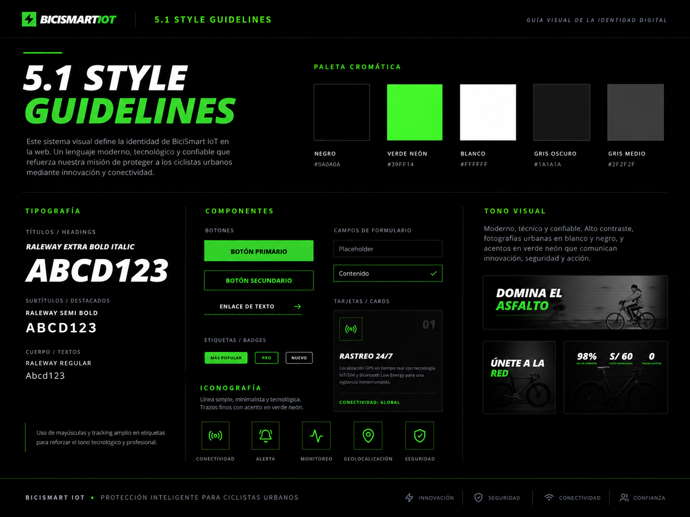
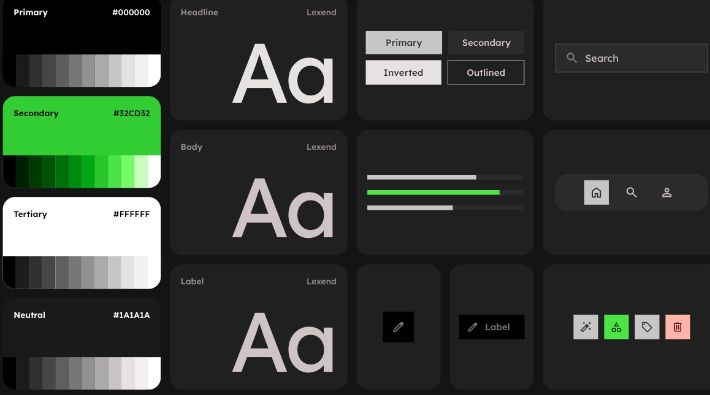

### **Universidad Peruana de Ciencias Aplicadas**

### **Ingeniería de Software**

#### **Periodo 202610**

#### Desarollo De Soluciones IOT
#### Codigo del curso: 1ASI0572

#### **NRC:** 6766

#### **Docente:** LEON BACA,MARCO ANTONIO

---

#### “Informe de Trabajo Final”

**Nombre del StartUp:** *BiciSmartIOT*  
**Nombre del Producto:** *BiciSmartIOT*

---

#### Relación de Integrantes

U20231a804 — Bustamante Leveau, Cameron Charllotte   

U202311745 — Uribe Livia, Renzo Sebastián

U202311842 — Espinoza Quijandria, Oscar Leonardo

U202311828 — Landauri Preciado, Stephano Mayrzon

U202220219 — Belahonia Miranda, Fabrisio

---

Abril, 2026

  

### 5.1.1. General Style Guidelines
Define las normas visuales fundamentales que rigen todo el producto. Incluye la definición de la paleta de **colores** (primarios, secundarios y de estado), la **tipografía** (fuentes, pesos y jerarquías visuales) y la **iconografía**, asegurando que cada elemento gráfico tenga un propósito claro y coherente.

### 5.1.2. Web, Mobile and IoT Style Guidelines
Establece reglas específicas adaptadas a cada plataforma. Se enfoca en la **adaptabilidad (responsive design)** para la web, patrones de **interacción táctil** para dispositivos móviles y interfaces simplificadas de alta visibilidad para dispositivos **IoT**, asegurando una experiencia óptima independientemente del hardware utilizado.

## 5.2. Information Architecture
La Arquitectura de la Información (IA) se centra en organizar, estructurar y etiquetar el contenido de forma efectiva. Su objetivo es ayudar a los usuarios a encontrar información y completar tareas con el menor esfuerzo cognitivo posible.

### 5.2.1. Organization Systems
Describe cómo se categoriza y agrupa la información dentro de la solución. Define si la estructura será **jerárquica** (árbol de decisiones), **secuencial** (paso a paso) o **matricial**, permitiendo que la navegación sea lógica y predecible para el usuario.

| Criterio específico | Acciones realizadas | Conclusiones |
|---------------------|---------------------|--------------|
| 5.c.1 Trabaja en equipo para proporcionar liderazgo en forma conjunta | **Bustamante Leveau, Cameron Charllotte:** TB1:Contribuí en la fase de Requirements Elicitation & Analysis mediante el análisis competitivo, identificando oportunidades frente a competidores y apoyando la definición de estrategias. Participé y facilité el diseño, registro y análisis de entrevistas, obteniendo insights clave de los usuarios. Asimismo, colaboré en actividades de needfinding como User Personas y User Journey Mapping, promoviendo una mejor comprensión del usuario en el equipo. Finalmente, apoyé en la definición del bounded context de Payments, ayudando a clarificar responsabilidades y alineando al equipo.   **Uribe Livia, Renzo Sebastián:** **TB1: Contribuí en el desarrollo del proyecto participando en la organización y estructuración de los requerimientos del sistema, apoyando en la identificación de funcionalidades clave y en la comprensión general del dominio. Asimismo, colaboré en el trabajo en equipo durante la elaboración de artefactos como el backlog y la definición inicial de componentes del sistema, manteniendo comunicación constante con el equipo para asegurar coherencia en el avance del proyecto.**   **Espinoza Quijandria, Oscar Leonardo:** **TB1: Contribuí en la elaboración de la arquitectura del sistema, participando en el diseño de los Context Mapping y en la definición de los bounded contexts, especialmente en el análisis y estructuración del contexto de Tracking & Monitoring. Asimismo, apoyé en la construcción de los diagramas de arquitectura (Landscape, Context, Container y Deployment), asegurando la correcta integración entre componentes IoT, backend y aplicación. Además, colaboré en la organización técnica del proyecto, ayudando a alinear las decisiones de diseño con los requerimientos funcionales y promoviendo una estructura clara y escalable del sistema. **   **Landauri Preciado, Stephano Mayrzon:** **TB1: Durante el desarrollo del TB1, impulsé un ambiente de trabajo donde cada integrante pudo aportar sus ideas en las distintas etapas del diseño estratégico. En las sesiones de EventStorming, me aseguré de que la dinámica fuera participativa, dando espacio para que el equipo debatiera y llegara a acuerdos sobre la estructura del dominio. Respecto a la planificación, establecimos en conjunto las tareas necesarias para completar el Candidate Context Discovery, el modelado de Domain Message Flows y los Bounded Context Canvases, distribuyendo responsabilidades de manera equitativa. El seguimiento constante de estos entregables nos permitió alcanzar los objetivos del sprint dentro de los tiempos acordados. **   **Belahonia Miranda, Fabrisio**:  TB1:Aporté liderazgo conjunto en la definición de User Stories, facilitando su estructuración y promoviendo la claridad en las necesidades del usuario, lo que permitió una mejor priorización de requerimientos. Co-lideré sesiones de Impact Mapping, contribuyendo a identificar objetivos, actores y resultados, alineando al equipo con el valor del negocio. Además, participé activamente en la construcción y priorización del Product Backlog, apoyando la toma de decisiones del equipo. Finalmente, colaboré en la definición de un bounded context, ayudando a delimitar responsabilidades del sistema y mejorando la organización y comunicación del equipo.| **TB1:** En conclusión, el equipo mostró un trabajo basado en la cooperación, la organización y el liderazgo compartido, donde cada miembro participó activamente en la definición de los bounded contexts, la aplicación del proceso Lean UX y el diseño de la arquitectura del sistema. La asignación equilibrada de responsabilidades, el intercambio constante de ideas y la validación conjunta de hipótesis fortalecieron la comunicación y la coordinación del grupo, permitiendo la toma de decisiones consensuadas y una mejor gestión de los desafíos técnicos. Gracias a esta colaboración, se logró estructurar adecuadamente los dominios del proyecto y avanzar de forma ordenada hacia el cumplimiento de los objetivos establecidos. |
| 5.c.2 Crea un entorno colaborativo e inclusivo, establece metas, planifica tareas y cumple objetivos | **Bustamante Leveau, Cameron Charllotte:**  TB1:Contribuí a la creación de un entorno colaborativo durante la fase de Requirements Elicitation & Analysis, promoviendo la participación activa de todos los integrantes del equipo en entrevistas, needfinding y sesiones de análisis. Apoyé en la definición de metas claras para cada actividad, como la obtención de insights de usuarios y la identificación de oportunidades frente a competidores. Asimismo, colaboré en la planificación y organización de tareas del equipo, asegurando una distribución ordenada del trabajo en actividades como User Personas, User Journey Mapping y EventStorming. Finalmente, apoyé el cumplimiento de los objetivos establecidos, contribuyendo a la entrega ordenada de los artefactos del análisis.   **Uribe Livia, Renzo Sebastián:** **TB1: Contribuí en la creación de un entorno colaborativo e inclusivo dentro del equipo, participando activamente en las reuniones de trabajo y aportando ideas durante la definición de requerimientos. Asimismo, apoyé en la planificación de tareas y en la organización del trabajo del equipo, manteniendo una comunicación constante para asegurar el cumplimiento de los objetivos establecidos en el proyecto. **   **Espinoza Quijandria, Oscar Leonardo:** **TB1: Contribuí en la creación de un entorno colaborativo e inclusivo mediante la participación activa en las sesiones de trabajo técnico, aportando en la definición de la arquitectura del sistema y en la elaboración de los diagramas (Context Mapping, Landscape, Context, Container y Deployment). Apoyé en la planificación de tareas relacionadas al diseño técnico, asegurando que los objetivos sean claros y alineados con los requerimientos del proyecto. Además, promoví la organización del trabajo dentro del equipo, facilitando la integración entre los componentes IoT y la arquitectura del sistema, lo que permitió cumplir con los objetivos establecidos. **   **Landauri Preciado, Stephano Mayrzon:** **TB1: Contribuí en la creación de un entorno colaborativo e inclusivo participando activamente en las actividades del equipo y apoyando en la planificación y desarrollo de las tareas asignadas. Asimismo, colaboré en la organización del trabajo y en el seguimiento de los objetivos del proyecto, contribuyendo a mantener una adecuada coordinación entre los integrantes y al cumplimiento de los plazos establecidos. **   **Belahonia Miranda, Fabrisio**:  TB1:Contribuí a la creación de un entorno colaborativo e inclusivo, promoviendo la participación activa de todos los integrantes del equipo y fomentando la comunicación abierta en las sesiones de trabajo. Apoyé en la definición de metas del sprint y en la planificación de tareas, asegurando que los objetivos sean claros y alcanzables. Además, facilité la organización del trabajo mediante la priorización del Product Backlog y el seguimiento del progreso del equipo, lo que permitió cumplir con los objetivos establecidos dentro de los plazos definidos.| **TB1:** En general, el equipo evidenció una dinámica de trabajo colaborativa e inclusiva, donde cada integrante contribuyó desde su rol al logro de los objetivos propuestos. Mediante el uso de enfoques como Lean UX y herramientas como empathy maps, user personas y bounded contexts, se logró identificar necesidades reales de los usuarios, definir objetivos concretos y organizar las tareas de forma estructurada con un adecuado seguimiento. La comunicación continua, la distribución justa de responsabilidades y la apertura a las ideas de todos los miembros fortalecieron el compromiso del grupo, permitiendo cumplir con los entregables dentro de los plazos establecidos y consolidando un flujo de trabajo eficiente y orientado a resultados.. |

### 5.3.1 Landing Page Wireframe.

Wireframe Landing Page (Desktop)

  

  

  

  

### 5.3.2 Landing Page Mock-up.

## Mockups Landing Page (Desktop)

Sección Principal de la landing page:

  

Sección Problemática y Características clave:

  
  

Sección Beneficios:

  

Sección "Acerca de":

  

Sección de Precios y Formulario de contacto:

  
  

  

Sección de Descargas de aplicación móvil y pie de página:

  

## 5.4.1. Applications Wireframes

### 5.4.1.2 Mobile Applications Wireframes

Ciclista 

  

  

  

  

  

  

Arrendador 

  

  

  

  

  

  

### 5.4.1.3 Desktop Applications Wireframes

## 5.4.2. Applications Wireflow Diagrams

Applications Wireflows Diagrams (Desktop)

User Goal: Autenticación y gestión de cuenta

User Goal: Alquiler de bicicleta

User goal: Historial de alquiler de bicicleta

User Goal: Finalización de bicicleta

User Goal:agregar bicicleta

#### Versión móvil del usuario

## 5.4.3. Applications Mock-ups

### 5.4.4.1 Mobile Applications Mock-ups

  

  

  

  

  

  

### 5.4.4.2 Desktop Applications Mock-ups

  

  

  

  

  

  

  

## 5.4.4. Applications User Flow Diagrams

Esta sección presenta los diagramas de User Flow, organizados por rol y centrados en los objetivos principales del usuario. Cada flujo muestra la ruta de éxito (happy path), las decisiones críticas y las rutas alternativas ante casos de error o cancelación.

#### User Flow del Cliente: Alquilar una Bicicleta

##### Descripción

El flujo de usuario cliente se estructura alrededor del objetivo central: alquilar una bicicleta de forma rápida y segura. El diagrama incluye el acceso al sistema, la búsqueda y selección de bicicleta, el pago, la ejecución del viaje y el cierre del alquiler con comprobante.

##### Explicación del flujo

**Objetivo principal:** El visitante se registra o inicia sesión para poder acceder a la plataforma y comenzar a usar el servicio de alquiler de bicicletas.

**Ruta principal (Happy Path):** Registrarse o iniciar sesión → Acceder a la plataforma → Explorar bicicletas disponibles → Seleccionar una bicicleta → Confirmar condiciones → Realizar pago → Desbloquear bicicleta → Usar la bicicleta → Finalizar el alquiler.

**Rutas alternativas:**
- Si no tiene cuenta, primero debe registrarse y luego acceder.
- Si el pago falla, debe reintentarlo antes de continuar.
- Si rechaza las condiciones, puede volver a explorar otras bicicletas.

---

#### User Goal 1: Registrarse e iniciar sesión en la aplicación

**Descripción:** El estudiante desea crear una cuenta para acceder a las funcionalidades del sistema y gestionar sus alquileres de forma personalizada.

**Flujo:** El usuario abre la aplicación y selecciona la opción “Registrarse”. Ingresa sus datos personales y confirma el registro. Luego inicia sesión con sus credenciales y accede a su panel principal.

**Pantallas involucradas:**
- Registro de usuario
- Inicio de sesión
- Panel principal

**Comportamientos adicionales:** Si los datos ingresados son inválidos, se muestra un mensaje de error y se solicita corrección. Una vez autenticado, el sistema guarda la sesión activa para próximos ingresos automáticos.

#### User Goal 2: Buscar y filtrar vehículos cercanos

**Descripción:** El estudiante desea explorar las opciones disponibles de bicicletas o scooters cercanos, aplicando filtros por tipo, precio o distancia para encontrar la mejor alternativa.

**Flujo:** El usuario accede al panel principal, abre la pantalla de búsqueda o mapa y aplica filtros para encontrar las opciones cercanas que mejor se ajusten a su necesidad.

**Pantallas involucradas:**
- Panel principal
- Pantalla de búsqueda / mapa
- Detalle del vehículo seleccionado

**Comportamientos adicionales:** El sistema obtiene la ubicación actual del usuario y actualiza los resultados en tiempo real. Si no hay vehículos disponibles, se muestra un mensaje informativo con la opción de ampliar el rango de búsqueda.

#### User Goal 3: Realizar y confirmar una reserva

**Descripción:** El estudiante selecciona un vehículo disponible, define el horario y confirma la reserva para garantizar su uso en el periodo deseado.

**Flujo:** El usuario abre el detalle del vehículo, accede a la pantalla de reserva, define la fecha u horario y confirma la reserva.

**Pantallas involucradas:**
- Detalle del vehículo
- Pantalla de reserva
- Confirmación de reserva

**Comportamientos adicionales:** Si otro usuario reserva el mismo vehículo antes de la confirmación, se notifica la indisponibilidad. Al confirmar, el estado del vehículo cambia automáticamente a “reservado”.

#### User Goal 4: Pagar el alquiler y recibir confirmación

**Descripción:** El estudiante completa el pago del alquiler mediante la pasarela integrada y recibe una confirmación inmediata de la transacción.

**Flujo:** El usuario accede a la pantalla de pago, ingresa el método de pago y confirma la transacción. Luego recibe el comprobante digital y la confirmación del alquiler.

**Pantallas involucradas:**
- Pantalla de pago
- Confirmación de pago
- Recibo o comprobante

**Comportamientos adicionales:** Si el pago falla, el sistema permite reintentar o elegir otro método de pago. Tras un pago exitoso, se genera un comprobante digital y se actualiza el historial del usuario.

#### User Goal 5: Ver y responder calificaciones y reseñas

**Descripción:** El estudiante consulta las valoraciones y comentarios realizados por otros usuarios sobre su servicio, y puede responder para mantener la comunicación.

**Flujo:** El usuario abre la sección de reseñas, revisa los comentarios asociados a su actividad y responde cuando es necesario.

**Pantallas involucradas:**
- Pantalla de reseñas
- Detalle de reseña
- Panel principal

**Comportamientos adicionales:** Al responder una reseña, el sistema notifica al usuario que su comentario fue atendido.

#### User Goal 1: Registrarse como arrendador

**Descripción:** El arrendador crea una cuenta para ofrecer sus vehículos en la plataforma y administrar su disponibilidad.

**Flujo:** El arrendador abre la aplicación, selecciona registrarse, completa los datos de contacto y confirma el alta del perfil.

**Pantallas involucradas:**
- Registro de arrendador
- Inicio de sesión
- Panel principal

**Comportamientos adicionales:** El sistema valida los datos de contacto y activa el perfil tras la verificación del correo electrónico.

#### User Goal 2: Gestionar vehículos publicados

**Descripción:** El arrendador puede agregar, editar o eliminar vehículos, además de cambiar su estado de disponibilidad según la situación.

**Flujo:** El arrendador accede al panel principal, abre la sección de vehículos publicados y realiza las acciones de edición o actualización necesarias.

**Pantallas involucradas:**
- Panel principal
- Pantalla “Mis vehículos”
- Formulario de edición de vehículo

**Comportamientos adicionales:** Los cambios se reflejan en la vista pública del catálogo. Si el vehículo está reservado, el sistema impide su eliminación hasta finalizar el alquiler activo.

#### User Goal 3: Consultar historial de alquileres

**Descripción:** El arrendador revisa los registros de alquileres pasados para llevar control de sus operaciones y analizar la demanda de cada vehículo.

**Flujo:** El arrendador accede al historial, revisa los alquileres almacenados y aplica filtros por fecha o vehículo.

**Pantallas involucradas:**
- Panel principal
- Pantalla de historial de alquileres

**Comportamientos adicionales:** Se permite filtrar el historial por rango de fechas o por vehículo.

#### User Goal 4: Revisar ingresos automáticos

**Descripción:** El arrendador visualiza los ingresos generados por los alquileres, con la posibilidad de filtrarlos por periodo o por tipo de vehículo.

**Flujo:** El arrendador entra a la sección de ingresos, consulta el resumen económico y revisa el detalle de transacciones cuando lo necesita.

**Pantallas involucradas:**
- Panel principal
- Pantalla de ingresos
- Detalle de transacciones

**Comportamientos adicionales:** Los ingresos se actualizan en tiempo real conforme a nuevas reservas. Si no hay movimientos en el periodo seleccionado, el sistema muestra un mensaje informativo.

#### User Goal 5: Ver y responder calificaciones y reseñas

**Descripción:** El arrendador consulta las valoraciones y comentarios realizados por los usuarios sobre sus vehículos, y puede responder para mantener una buena reputación.

**Flujo:** El arrendador abre la sección de reseñas, revisa los comentarios recibidos y responde cuando es necesario.

**Pantallas involucradas:**
- Pantalla de reseñas
- Detalle de reseña
- Panel principal

**Comportamientos adicionales:** Al responder una reseña, el sistema notifica al usuario que su comentario fue atendido.

## 5.5. Applications Prototyping

  

Link Prototipo:[Ver video](https://upcedupe-my.sharepoint.com/:v:/g/personal/u202220219_upc_edu_pe/IQB-a0BnCjSUR4ZwVEeGGSbBAadbmXSWQ-wATjE8joK3vC4?e=3pUhev&nav=eyJyZWZlcnJhbEluZm8iOnsicmVmZXJyYWxBcHAiOiJTdHJlYW1XZWJBcHAiLCJyZWZlcnJhbFZpZXciOiJTaGFyZURpYWxvZy1MaW5rIiwicmVmZXJyYWxBcHBQbGF0Zm9ybSI6IldlYiIsInJlZmVycmFsTW9kZSI6InZpZXcifX0%3D)
 
enlacees: 
[Arrendador](https://stitch.withgoogle.com/preview/5914202302097093610?node-id=becd46efba38487c905a1fd753300f5c) 
[Arrendatario](https://stitch.withgoogle.com/preview/5914202302097093610?node-id=b293857dd63f455cb7a9769a07d61c5d) 
[Admin](https://stitch.withgoogle.com/preview/5914202302097093610?node-id=630eab06a50841eca5b4bc454a0a4975) 

## 5.6. IoT Device Design

### Introducción y Criterios de Diseño

Esta sección presenta la propuesta de diseño físico y diseño de circuito para el nodo IoT instalado en cada bicicleta de BiciSmartIOT. El objetivo del prototipo es validar, en entorno Wokwi, la interacción entre sensores, actuadores y lógica de control para cubrir tres funciones críticas del sistema: desbloqueo remoto, detección de uso y bloqueo seguro al cierre del alquiler.

Los principales criterios para las decisiones de diseño del hardware son:

- Seguridad operativa: el dispositivo debe responder de forma confiable a comandos de bloqueo y desbloqueo, manteniendo estados consistentes (`LOCKED`, `UNLOCKED`, `LOCKDOWN`).
- Telemetría en tiempo real: el hardware debe capturar eventos de movimiento y estado para alimentar el monitoreo de uso de la bicicleta.
- Bajo consumo y simplicidad de integración: se prioriza un microcontrolador con conectividad inalámbrica y soporte amplio de librerías para acelerar el prototipado.
- Escalabilidad funcional: el diseño debe permitir añadir sensores y reglas (por ejemplo, batería baja o alerta por manipulación) sin rediseñar toda la arquitectura.
- Viabilidad de simulación: los componentes seleccionados deben estar disponibles o ser representables en Wokwi para validar comportamiento antes del montaje físico.

### Relación con la Arquitectura de Información y Guía de Estilos

El diseño de la interfaz física IoT (IoT Device Physical Interfaces) se alinea con la arquitectura del bounded context IoT & Device Control. En este modelo:

- La app y el backend envían comandos de control al dispositivo.
- El dispositivo publica eventos de telemetría para tracking y monitoreo.
- El estado físico de la bicicleta se refleja en la aplicación móvil en tiempo cercano a real.

En la capa de experiencia de usuario, la semántica de estados del hardware se integra con la interfaz visual de la plataforma:

- Estado seguro: indicador equivalente a operación correcta o bicicleta bloqueada.
- Estado activo: indicador equivalente a bicicleta en uso o desbloqueada.
- Estado de alerta: indicador equivalente a evento crítico (bloqueo remoto, manipulación o error de operación).

### Propuesta de Diseño de Circuito (Hardware Schematic)

Para la validación lógica de componentes y conexiones se propone un esquemático en Wokwi con un ESP32 como núcleo del sistema.

Componentes recomendados para el prototipo en Wokwi (alineados a BiciSmartIOT):

1. ESP32 DevKit v1: microcontrolador principal del dispositivo de bicicleta.
2. Servo SG90: simulación del smart lock para comandos `unlock/lock/lockdown`.
3. MPU6050: sensor de movimiento para detectar bicicleta en uso (US28).
4. GPS simulado por Serial (coordenadas mock): tracking de ubicación en la simulación.
5. LED RGB (o 3 LEDs): semaforo de estado operativo (`LOCKED`, `UNLOCKED`, `LOCKDOWN`).
6. Pulsador opcional: simulacion de accion local de seguridad o emparejamiento inicial.

#### Mapeo sugerido de pines (Wokwi)

- `GPIO 21` -> SDA del MPU6050
- `GPIO 22` -> SCL del MPU6050
- `GPIO 18` (etiqueta `D18` en Wokwi) -> señal de control del servo (smart lock simulado)
- `VIN` en Wokwi -> alimentacion del servo a 5V
- `GPIO 4` -> canal rojo LED RGB (con resistencia de 220 ohm)
- `GPIO 2` -> canal verde LED RGB (con resistencia de 220 ohm)
- `GPIO 15` -> canal azul LED RGB (con resistencia de 220 ohm)
- `GPIO 13` -> pulsador (modo `INPUT_PULLUP`)

Notas de montaje en Wokwi:

- Conectar `VCC` y `GND` de todos los módulos correctamente.
- En Wokwi, usa `VIN` como referencia de 5V para el servo.
- Si no usas LED RGB, reemplazar por tres LEDs individuales (uno por estado).
- Usar eventos por monitor serial con formato `GPS:lat,lon` para simular tracking.

### Configuración que debes poner en Wokwi

Para que la simulacion represente tu arquitectura real (App -> Backend -> IoT Device Control), en Wokwi debes preparar lo siguiente:

1. Crear un proyecto nuevo con placa `ESP32`.
2. Agregar los componentes: `Servo`, `MPU6050`, `RGB LED` y `Pushbutton` opcional.
3. Cablear según el mapeo de pines propuesto.
4. Programar una maquina de estados minima del dispositivo:
	- `LOCKED`
	- `UNLOCKED`
	- `LOCKDOWN`
5. Simular comandos del backend por monitor serial (equivalente a MQTT):
	- `CMD:UNLOCK` -> cambia a `UNLOCKED` y posiciona servo en apertura.
	- `CMD:LOCK` -> cambia a `LOCKED` y cierra servo.
	- `CMD:LOCKDOWN` -> fuerza bloqueo de seguridad.
6. Definir reglas de telemetria alineadas a tus historias:
	- US27 (inicio automatico): cuando llega `CMD:UNLOCK` y hay movimiento, registrar `RENTAL_STARTED`.
	- US28 (bicicleta en uso): si MPU6050 supera umbral, publicar `MOTION_DETECTED`; si cae por debajo, `MOTION_IDLE`.
	- Tracking: generar coordenadas mock y publicar `LOCATION_UPDATE` periodico.
7. Imprimir todos los eventos en monitor serial para evidenciar trazabilidad de extremo a extremo.

#### Estructura de mensajes recomendada en Wokwi (para que coincida con tu arquitectura)

- Comandos de entrada simulados:
  - `CMD:UNLOCK`
  - `CMD:LOCK`
  - `CMD:LOCKDOWN`
- Eventos de salida del dispositivo:
  - `EVT:LOCK_STATE=LOCKED|UNLOCKED|LOCKDOWN`
  - `EVT:MOTION=DETECTED|IDLE`
  - `EVT:GPS=-12.0464,-77.0428`
  - `EVT:RENTAL=STARTED|PAUSED|CLOSED`

### Flujos de Interacción del Prototipo IoT

El hardware cubre interacciones físicas que se sincronizan con las vistas de la aplicación móvil, definiendo los siguientes flujos principales:

#### 1. Flujo de Desbloqueo e Inicio de Alquiler

- Paso 1: el backend emite comando `CMD:UNLOCK` (simulado por Serial en Wokwi).
- Paso 2: el actuador cambia a `UNLOCKED` y el LED cambia a estado activo.
- Paso 3: al detectar movimiento inicial, se publica `EVT:RENTAL=STARTED` (US27).

#### 2. Flujo de Monitoreo de Uso

- Paso 1: el MPU6050 reporta aceleracion sobre umbral y emite `EVT:MOTION=DETECTED`.
- Paso 2: el dispositivo envia telemetria de uso y ubicacion (`EVT:GPS=...`).
- Paso 3: si no hay movimiento por un tiempo definido, emite `EVT:MOTION=IDLE` (US28).

#### 3. Flujo de Cierre y Bloqueo Seguro

- Paso 1: el backend envia `CMD:LOCK` al finalizar alquiler.
- Paso 2: el actuador retorna a `LOCKED`.
- Paso 3: se publica `EVT:LOCK_STATE=LOCKED` y `EVT:RENTAL=CLOSED`.

#### 4. Flujo de Seguridad (Lockdown)

- Paso 1: ante evento critico o comando remoto, se envia `CMD:LOCKDOWN`.
- Paso 2: el dispositivo activa estado `LOCKDOWN` y LED en rojo.
- Paso 3: se publica `EVT:LOCK_STATE=LOCKDOWN` para alertar a la plataforma.

### Evidencias (capturas de Wokwi)

Para cerrar correctamente la sección 5.6, a continuación se insertan las capturas generadas en la simulación Wokwi que validan los flujos descritos:

- Circuito y montaje del prototipo:

	
	*Figura — Montaje con ESP32, servo, sensor MPU6050, LED y pulsador.*

- Desbloqueo remoto (comando → efecto):

	
	*Figura — `CMD:UNLOCK` y `EVT:LOCK_STATE=UNLOCKED` (servo abierto / LED activo).* 

- Detección de movimiento y registro de inicio de alquiler:

	
	*Figura — `EVT:MOTION=DETECTED` y `EVT:RENTAL=STARTED` como telemetría del MPU6050.*

- Cierre de alquiler y bloqueo:

	
	*Figura — `CMD:LOCK` y `EVT:RENTAL=CLOSED` (servo en posición cerrada).*

- Evento GPS simulado (tracking):

	
	*Figura — `EVT:GPS=...` (coordenadas mock enviadas por Serial para validar la integración de tracking).* 

Estas capturas sirven como registro de prueba (equivalente a mensajes publicados en un broker MQTT) y deben acompañarse en el informe de las líneas del monitor serial que muestran los mensajes `CMD:*` y `EVT:*` para garantizar trazabilidad.

