<div align="center">


</div>

### **Universidad Peruana de Ciencias Aplicadas**

### **Facultad De Ingenieria**

### **Curso:** 1ASI0572 - Desarollo De Soluciones IOT

#### **NRC:** 6766

#### Nombre del profesor: Marco Antonio León Baca

#### “Informe de Trabajo Final”

**Nombre del Grupo:** *BiciSmartIOT*  
**Nombre del Producto:** *BiciSmartIOT*


#### Integrantes

| Código       | Apellidos y Nombres                    |
|--------------|----------------------------------------|
| U20231a804   | Bustamante Leveau, Cameron Charllotte  |
| U202311745   | Uribe Livia, Renzo Sebastián           |
| U202311842   | Espinoza Quijandria, Oscar Leonardo    |
| U202311828   | Landauri Preciado, Stephano Mayrzon    |
| U202220219   | Belahonia Miranda, Fabrisio            |


Lima - Mayo 2026


<br><br>


</div>


## Registro de Versiones del Informe

| Versión | Fecha | Autor(es) | Descripción de modificación |
|---|---|---|---|
| AV1 | 13/04/2026 | - U20231A804 — Bustamante Leveau, Cameron Charllotte<br>- U202311745 — Uribe Livia, Renzo Sebastián<br>- U202311842 — Espinoza Quijandria, Oscar Leonardo<br>- U202311828 — Landauri Preciado, Stephano Mayrzon<br>- U202220219 — Belahonia Miranda, Fabrisio | Se incluyeron los siguientes capítulos:<br><br>- Capítulo I: Introducción<br>- Capítulo II: Requirements Elicitation & Analysis<br>- Capítulo III: Requirements Specification<br>- Capítulo IV: Solution Software Design |
| TB1 | 14/05/2026 | - U20231A804 — Bustamante Leveau, Cameron Charllotte<br>- U202311745 — Uribe Livia, Renzo Sebastián<br>- U202311842 — Espinoza Quijandria, Oscar Leonardo<br>- U202311828 — Landauri Preciado, Stephano Mayrzon<br>- U202220219 — Belahonia Miranda, Fabrisio | Se realizaron correcciones y mejoras en los siguientes apartados:<br><br>- Capítulo IV: actualización de Context Mapping y diagramas de arquitectura con Structurizr.<br>- Capítulo V: desarrollo de Style Guidelines, Landing Page UI Design, Wireframes, Wireflow Diagrams, Mock-ups, User Flow Diagrams, Prototyping e IoT Device Design.<br>- Capítulo VI: incorporación de Software Configuration Management, Sprint Planning, Sprint Backlog, evidencias de desarrollo, ejecución, despliegue y colaboración del equipo durante el Sprint 1.<br>- Conclusiones de la entrega TB1. |
| AV2 | 14/06/2026 | - U20231A804 — Bustamante Leveau, Cameron Charllotte<br>- U202311745 — Uribe Livia, Renzo Sebastián<br>- U202311842 — Espinoza Quijandria, Oscar Leonardo<br>- U202311828 — Landauri Preciado, Stephano Mayrzon<br>- U202220219 — Belahonia Miranda, Fabrisio | Se incorporó la documentación correspondiente al Sprint 2:<br><br>- Sprint Planning 2, Aspect Leaders and Collaborators y Sprint Backlog 2.<br>- Evidencias de desarrollo, testing, ejecución, documentación de servicios, despliegue y colaboración del equipo.<br>- Indicaciones de ubicación para las capturas requeridas por la guía del proyecto. |


## Student Outcome

| Criterio específico | Acciones realizadas | Conclusiones |
|---------------------|---------------------|--------------|
| 5.c.1 Trabaja en equipo para proporcionar liderazgo en forma conjunta | **Bustamante Leveau, Cameron Charllotte:**<br>AV1:Contribuí en la fase de Requirements Elicitation & Analysis mediante el análisis competitivo, identificando oportunidades frente a competidores y apoyando la definición de estrategias. Participé y facilité el diseño, registro y análisis de entrevistas, obteniendo insights clave de los usuarios. Asimismo, colaboré en actividades de needfinding como User Personas y User Journey Mapping, promoviendo una mejor comprensión del usuario en el equipo. Finalmente, apoyé en la definición del bounded context de Payments, ayudando a clarificar responsabilidades y alineando al equipo.<br>**TB1:** Desarrollé la aplicación frontend y la landing page del proyecto, coordinando constantemente con el equipo para mantener coherencia entre el diseño UI/UX, los requerimientos funcionales y la estructura definida en los capítulos del documento. Asimismo, brindé apoyo técnico durante la implementación visual de las interfaces, contribuyendo en la toma conjunta de decisiones relacionadas con la organización de componentes, navegación y presentación del sistema, favoreciendo el trabajo colaborativo y el liderazgo compartido dentro del equipo. <br><br>**Uribe Livia, Renzo Sebastián:**<br>**AV1: Contribuí en el desarrollo del proyecto participando en la organización y estructuración de los requerimientos del sistema, apoyando en la identificación de funcionalidades clave y en la comprensión general del dominio. Asimismo, colaboré en el trabajo en equipo durante la elaboración de artefactos como el backlog y la definición inicial de componentes del sistema, manteniendo comunicación constante con el equipo para asegurar coherencia en el avance del proyecto.       TB1: Contribuí activamente en el liderazgo compartido del equipo durante la fase de IoT Device Design, asumiendo un rol proactivo en la definición de la arquitectura de hardware y la lógica de control. Participé en la toma de decisiones estratégicas para alinear el diseño del dispositivo con los objetivos del proyecto, aportando soluciones técnicas que facilitaron el consenso grupal. Mi participación permitió que el equipo avanzara de manera coordinada en la integración de sensores y actuadores, asegurando que las decisiones de diseño reflejaran una visión técnica conjunta y sólida.** <br><br>**Espinoza Quijandria, Oscar Leonardo:**<br>**AV1: Contribuí en la elaboración de la arquitectura del sistema, participando en el diseño de los Context Mapping y en la definición de los bounded contexts, especialmente en el análisis y estructuración del contexto de Tracking & Monitoring. Asimismo, apoyé en la construcción de los diagramas de arquitectura (Landscape, Context, Container y Deployment), asegurando la correcta integración entre componentes IoT, backend y aplicación. Además, colaboré en la organización técnica del proyecto, ayudando a alinear las decisiones de diseño con los requerimientos funcionales y promoviendo una estructura clara y escalable del sistema. **<br><br>**Landauri Preciado, Stephano Mayrzon:**<br>**AV1: Durante el desarrollo del AV1, impulsé un ambiente de trabajo donde cada integrante pudo aportar sus ideas en las distintas etapas del diseño estratégico. En las sesiones de EventStorming, me aseguré de que la dinámica fuera participativa, dando espacio para que el equipo debatiera y llegara a acuerdos sobre la estructura del dominio. Respecto a la planificación, establecimos en conjunto las tareas necesarias para completar el Candidate Context Discovery, el modelado de Domain Message Flows y los Bounded Context Canvases, distribuyendo responsabilidades de manera equitativa. El seguimiento constante de estos entregables nos permitió alcanzar los objetivos del sprint dentro de los tiempos acordados. ** <br><br>**Belahonia Miranda, Fabrisio**:<br> **AV1:Aporté liderazgo conjunto en la definición de User Stories, facilitando su estructuración y promoviendo la claridad en las necesidades del usuario, lo que permitió una mejor priorización de requerimientos. Co-lideré sesiones de Impact Mapping, contribuyendo a identificar objetivos, actores y resultados, alineando al equipo con el valor del negocio. Además, participé activamente en la construcción y priorización del Product Backlog, apoyando la toma de decisiones del equipo. Finalmente, colaboré en la definición de un bounded context, ayudando a delimitar responsabilidades del sistema y mejorando la organización y comunicación del equipo.<br> **TB1:** Aporté en la corrección y mejora de las User Stories, incluyendo la revisión de la User Story 42 y el ajuste del formato de las Spike Stories para mantener coherencia con la documentación del proyecto. Asimismo, colaboré en la actualización de la imagen del punto 3.2 Impact Mapping y en la revisión del apartado 3.3 Product Backlog, ordenando adecuadamente las listas para mejorar la claridad y presentación del contenido. Finalmente, desarrollé el punto 5.5 Applications Prototyping, integrando el prototipo de la aplicación y documentando su propósito dentro del diseño UI/UX del producto.| **AV1:** En conclusión, el equipo mostró un trabajo basado en la cooperación, la organización y el liderazgo compartido, donde cada miembro participó activamente en la definición de los bounded contexts, la aplicación del proceso Lean UX y el diseño de la arquitectura del sistema. La asignación equilibrada de responsabilidades, el intercambio constante de ideas y la validación conjunta de hipótesis fortalecieron la comunicación y la coordinación del grupo, permitiendo la toma de decisiones consensuadas y una mejor gestión de los desafíos técnicos. Gracias a esta colaboración, se logró estructurar adecuadamente los dominios del proyecto y avanzar de forma ordenada hacia el cumplimiento de los objetivos establecidos. <br>**TB1:** En conclusión, el equipo evidenció un trabajo colaborativo basado en la coordinación, la participación activa y el liderazgo compartido durante el desarrollo de los capítulos relacionados al diseño UI/UX, implementación y despliegue del producto. Cada integrante asumió responsabilidades específicas en actividades como la elaboración de wireframes, mock-ups, diagramas de flujo, prototipado, arquitectura de despliegue y documentación técnica, permitiendo una distribución equilibrada de tareas y una mejor organización del trabajo grupal. |
| 5.c.2 Crea un entorno colaborativo e inclusivo, establece metas, planifica tareas y cumple objetivos | **Bustamante Leveau, Cameron Charllotte:**<br> AV1:Contribuí a la creación de un entorno colaborativo durante la fase de Requirements Elicitation & Analysis, promoviendo la participación activa de todos los integrantes del equipo en entrevistas, needfinding y sesiones de análisis. Apoyé en la definición de metas claras para cada actividad, como la obtención de insights de usuarios y la identificación de oportunidades frente a competidores. Asimismo, colaboré en la planificación y organización de tareas del equipo, asegurando una distribución ordenada del trabajo en actividades como User Personas, User Journey Mapping y EventStorming. Finalmente, apoyé el cumplimiento de los objetivos establecidos, contribuyendo a la entrega ordenada de los artefactos del análisis.<br> **TB1:** Contribuí al cumplimiento de los objetivos del equipo mediante el desarrollo de la aplicación frontend y la landing page, siguiendo las metas y tareas definidas para la entrega TB1. Asimismo, mantuve una comunicación constante con los integrantes del grupo para coordinar aspectos visuales y funcionales de las interfaces, promoviendo un entorno de trabajo colaborativo y organizado. Gracias a ello, se logró avanzar de manera estructurada en la implementación del producto y en la integración de los entregables relacionados al diseño y experiencia de usuario. <br><br>**Uribe Livia, Renzo Sebastián:**<br>**AV1: Contribuí en la creación de un entorno colaborativo e inclusivo dentro del equipo, participando activamente en las reuniones de trabajo y aportando ideas durante la definición de requerimientos. Asimismo, apoyé en la planificación de tareas y en la organización del trabajo del equipo, manteniendo una comunicación constante para asegurar el cumplimiento de los objetivos establecidos en el proyecto. **<br>** TB1:  Fomenté un entorno de trabajo colaborativo e inclusivo mediante la creación y socialización de los Applications Wireflow Diagrams y los Applications User Flow Diagrams. Utilicé estos entregables como herramientas de planificación para establecer metas claras de desarrollo, organizando las tareas del equipo de manera estructurada. Gracias a una comunicación constante y a la definición precisa de los flujos de usuario, logré optimizar el flujo de trabajo grupal, asegurando el cumplimiento de los hitos establecidos y garantizando que todos los miembros tuvieran claridad sobre los objetivos del sistema. ** <br><br>**Espinoza Quijandria, Oscar Leonardo:**<br>**AV1: Contribuí en la creación de un entorno colaborativo e inclusivo mediante la participación activa en las sesiones de trabajo técnico, aportando en la definición de la arquitectura del sistema y en la elaboración de los diagramas (Context Mapping, Landscape, Context, Container y Deployment). Apoyé en la planificación de tareas relacionadas al diseño técnico, asegurando que los objetivos sean claros y alineados con los requerimientos del proyecto. Además, promoví la organización del trabajo dentro del equipo, facilitando la integración entre los componentes IoT y la arquitectura del sistema, lo que permitió cumplir con los objetivos establecidos. TFomenté un entorno de trabajo colaborativo e inclusivo mediante la creación y socialización de los Applications Wireflow Diagrams y los Applications User Flow Diagrams. Utilicé estos entregables como herramientas de planificación para establecer metas claras de desarrollo, organizando las tareas del equipo de manera estructurada. Gracias a una comunicación constante y a la definición precisa de los flujos de usuario, logré optimizar el flujo de trabajo grupal, asegurando el cumplimiento de los hitos establecidos y garantizando que todos los miembros tuvieran claridad sobre los objetivos del sistema.** <br><br>**Landauri Preciado, Stephano Mayrzon:**<br>**AV1: Contribuí en la creación de un entorno colaborativo e inclusivo participando activamente en las actividades del equipo y apoyando en la planificación y desarrollo de las tareas asignadas. Asimismo, colaboré en la organización del trabajo y en el seguimiento de los objetivos del proyecto, contribuyendo a mantener una adecuada coordinación entre los integrantes y al cumplimiento de los plazos establecidos. ** <br><br>**Belahonia Miranda, Fabrisio**:<br> AV1:Contribuí a la creación de un entorno colaborativo e inclusivo, promoviendo la participación activa de todos los integrantes del equipo y fomentando la comunicación abierta en las sesiones de trabajo. Apoyé en la definición de metas del sprint y en la planificación de tareas, asegurando que los objetivos sean claros y alcanzables. Además, facilité la organización del trabajo mediante la priorización del Product Backlog y el seguimiento del progreso del equipo, lo que permitió cumplir con los objetivos establecidos dentro de los plazos definidos.**TB1:** Contribuí a crear un entorno colaborativo mediante la revisión y corrección de las User Stories, incluyendo la User Story 42 y el formato de las Spike Stories, asegurando que el equipo mantuviera una documentación clara y uniforme. Además, apoyé en la organización de los apartados 3.2 Impact Mapping y 3.3 Product Backlog, ordenando las listas y mejorando la presentación de los entregables. Finalmente, cumplí con la tarea asignada del punto 5.5 Applications Prototyping, aportando al avance de los objetivos planificados para la entrega TB1. | **AV1:** En general, el equipo evidenció una dinámica de trabajo colaborativa e inclusiva, donde cada integrante contribuyó desde su rol al logro de los objetivos propuestos. Mediante el uso de enfoques como Lean UX y herramientas como empathy maps, user personas y bounded contexts, se logró identificar necesidades reales de los usuarios, definir objetivos concretos y organizar las tareas de forma estructurada con un adecuado seguimiento. La comunicación continua, la distribución justa de responsabilidades y la apertura a las ideas de todos los miembros fortalecieron el compromiso del grupo, permitiendo cumplir con los entregables dentro de los plazos establecidos y consolidando un flujo de trabajo eficiente y orientado a resultados.<br> **TB1:** Durante el desarrollo de la presente entrega, el equipo promovió un entorno de trabajo colaborativo e inclusivo, en el cual todos los integrantes participaron activamente en la planificación, desarrollo y revisión de las actividades asignadas. Se establecieron metas claras para cada capítulo y subapartado del documento, definiendo responsables, tiempos de avance y criterios de cumplimiento para asegurar una organización adecuada del trabajo.|

### AV2 Student Outcome Update

| Criterio específico | Acciones realizadas en AV2 | Conclusiones AV2 |
|---------------------|----------------------------|------------------|
| 5.c.1 Trabaja en equipo para proporcionar liderazgo en forma conjunta | Durante el Sprint 2, el equipo distribuyó liderazgos por aspecto técnico: backend services, web application, integración IoT, testing/documentación y deployment. Cada líder coordinó decisiones con los colaboradores para mantener coherencia entre implementación, evidencias y documentación del informe. | El equipo fortaleció el liderazgo compartido al organizar el trabajo por frentes técnicos y al relacionar cada responsabilidad con el Sprint Backlog 2. Esta dinámica permitió mantener trazabilidad entre tareas, evidencias, commits y entregables del sprint. |
| 5.c.2 Crea un entorno colaborativo e inclusivo, establece metas, planifica tareas y cumple objetivos | Se establecieron metas concretas para integrar servicios, documentar endpoints, validar flujos IoT y preparar evidencias de despliegue. La planificación del Sprint 2 permitió asignar tareas, registrar responsables y definir qué capturas debían adjuntarse como soporte de la revisión. | La colaboración del equipo se evidenció en una planificación más estructurada, con objetivos verificables y una matriz de líderes/colaboradores alineada al backlog. Como oportunidad de mejora, se identificó la necesidad de reemplazar oportunamente los marcadores del informe con commits, URLs y capturas reales. |

# Project Report Collaboration Insights

En esta sección se presenta un resumen de las actividades de colaboración realizadas para la elaboración del informe del proyecto.

Se utilizó **GitHub** como plataforma de control de versiones y colaboración en equipo. Se incluye enlace para acceder al repositorio para el reporte del proyecto. [Ver en Github]([https://github.com/BiciSmartIoT/Informe])

Los integrantes del equipo y sus nombres de usuario en GitHub son los siguientes:

| Integrantes                          | Nombre en GitHub               |
|--------------------------------------|--------------------------------|
| Bustamante Leveau, Cameron Charllotte| `CameronBustamanteLeveau2`     |
| Uribe Livia, Renzo Sebastián         | `JKOlimpo`                     |
| Espinoza Quijandria, Oscar Leonardo  | `Carbocnito5443`               |
| Landauri Preciado, Stephano Mayrzon  | `Mayrzon02`                    |
| Belahonia Miranda, Fabrisio          | `devfab17`                     |

Se usó el flujo de trabajo **GitFlow**, que incluye las siguientes ramas principales:

- **main:** Rama principal que contiene la versión estable y consolidada del documento.
- **develop:** Rama de integración utilizada para fusionar los cambios realizados en las ramas de características.
- **Chapter/Chapter-name:** Ramas de características utilizadas para desarrollar secciones específicas del informe.

<hr class="page-break">


## **AV1**  

**Tareas**

Para el desarrollo del AV1, cada participante del equipo realizó las siguientes tareas:

| Integrantes                          | Tarea asignada                 |
|--------------------------------------|--------------------------------|
| Bustamante Leveau, Cameron Charllotte|  - Chapter 2 <br>              |
| Uribe Livia, Renzo Sebastián         |  - Chapter 1 <br>              |
| Espinoza Quijandria, Oscar Leonardo  |  - Chapter 4 <br>              |
| Landauri Preciado, Stephano Mayrzon  |  - Chapter 4 <br>              |
| Belahonia Miranda, Fabrisio          |  - Chapter 3 <br>              |

<hr class="page-break">

## **TB1**  

**Tareas**

Para el desarrollo del TB1, cada participante del equipo realizó las siguientes tareas:

| Integrantes                          | Tarea asignada |
|--------------------------------------|----------------|
| Bustamante Leveau, Cameron Charllotte | - Correcciones del Chapter IV <br> - Actualización de arquitectura y Structurizr <br> - Desarrollo de Sprint 1 |
| Uribe Livia, Renzo Sebastián | - Correcciones generales del documento <br> - Desarrollo de Wireflow y User Flow Diagrams <br> - Capítulo VI y conclusiones |
| Espinoza Quijandria, Oscar Leonardo | - Correcciones de Context Mapping <br> - Desarrollo de arquitectura y Sprint 1 |
| Landauri Preciado, Stephano Mayrzon | - Correcciones del Chapter II <br> - Desarrollo de Landing Page UI Design, Wireframes y Mock-ups |
| Belahonia Miranda, Fabrisio | - Corrección de User Stories y Product Backlog <br> - Organización de listas y diagramas <br> - Desarrollo de Applications Prototyping |
 
<hr class="page-break">

## **AV2**  

**Tareas**

Para el desarrollo del AV2, cada participante del equipo asumió responsabilidades alineadas al Sprint 2 y a la preparación de evidencias solicitadas para la revisión.

| Integrantes                          | Tarea asignada |
|--------------------------------------|----------------|
| Bustamante Leveau, Cameron Charllotte | - Coordinación de despliegue <br> - Evidencias de configuración y publicación <br> - Apoyo en integración frontend/backend |
| Uribe Livia, Renzo Sebastián | - Integración de vistas de aplicación web <br> - Evidencias de ejecución del flujo de reserva y tracking <br> - Actualización de documentación del Sprint 2 |
| Espinoza Quijandria, Oscar Leonardo | - Liderazgo de backend services <br> - Documentación OpenAPI/Swagger <br> - Registro de endpoints y commits de servicios |
| Landauri Preciado, Stephano Mayrzon | - Liderazgo de integración IoT <br> - Simulación de Smart Lock, GPS y sensores <br> - Evidencias de eventos `CMD:*` y `EVT:*` |
| Belahonia Miranda, Fabrisio | - Apoyo en testing y documentación <br> - Diseño de escenarios BDD <br> - Organización de evidencias de colaboración |

<hr class="page-break">


**GitHub Collaboration Insights**

En GitHub se presenta un timeline de las principales ramas creadas por cada integrante del equipo, así como los procesos de merge realizados.  
Todas las ramas fueron gestionadas siguiendo el flujo de trabajo **GitFlow**, adaptado para una organización que utiliza un sistema de control de versiones.

<div style="text-align: center; margin-top: 1rem; margin-bottom: 1rem;">

Gráfico de red (*network graph*) de ramas en el repositorio de GitHub.

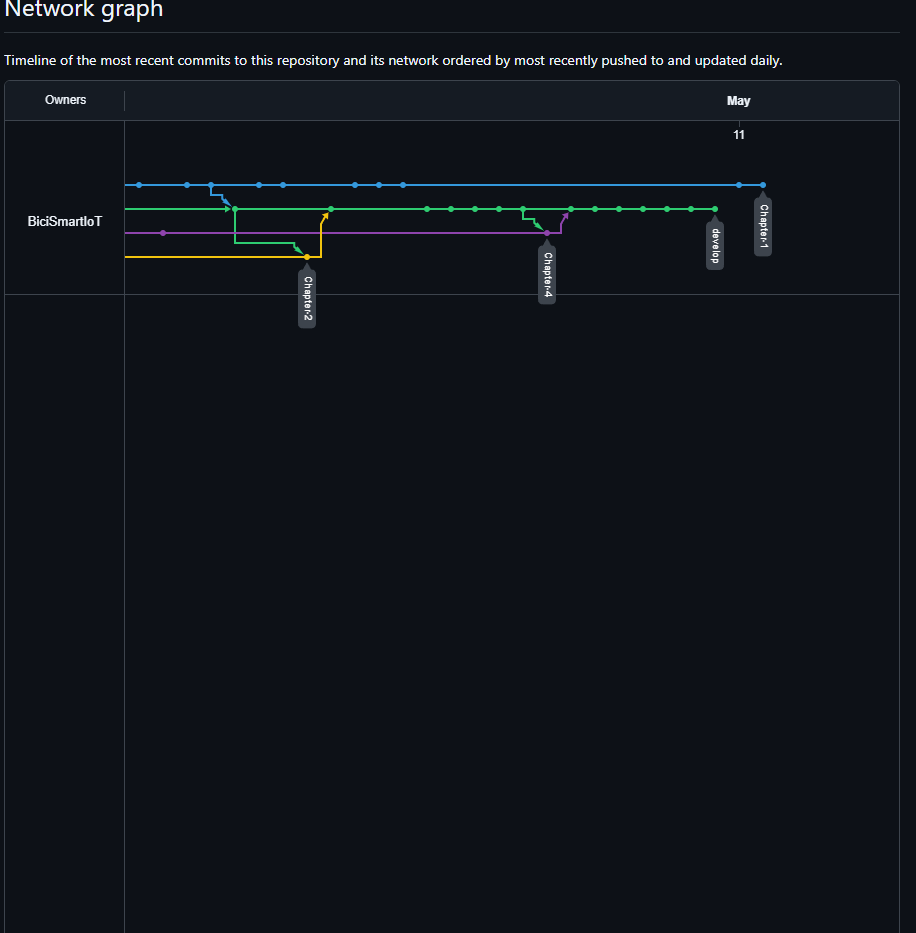

</div>

A continuación, se presentan los gráficos que muestran el análisis de los commits en el repositorio correspondiente al informe.  
Estos gráficos detallan la cantidad de líneas de código añadidas por cada miembro del equipo y la actividad de commits registrada.

<div style="text-align: center; margin-top: 1rem; margin-bottom: 1rem;">

Análisis de líneas de código añadidas por contribuyente.

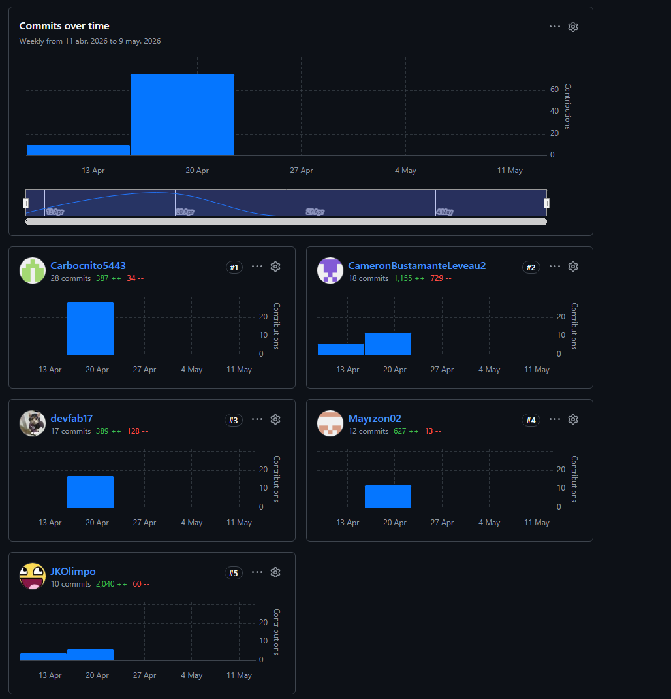

</div>

El siguiente gráfico muestra la cantidad de commits realizados en la semana con mayor actividad en el proyecto.

<div style="text-align: center; margin-top: 1rem; margin-bottom: 1rem;">

Análisis de cantidad de commits realizados por semana.

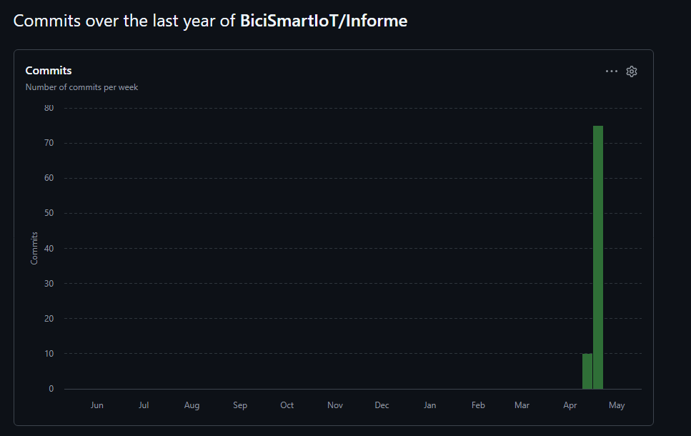

</div>

<hr class="page-break">

# Índice

## Capítulo I: Introducción

### 1.1. Startup Profile
- 1.1.1. Descripción de la Startup
- 1.1.2. Perfiles de integrantes del equipo

### 1.2. Solution Profile
- 1.2.1. Antecedentes y problemática
- 1.2.2. Lean UX Process
  - 1.2.2.1. Lean UX Problem Statements
  - 1.2.2.2. Lean UX Assumptions
  - 1.2.2.3. Lean UX Hypothesis Statements
  - 1.2.2.4. Lean UX Canvas

### 1.3. Segmentos objetivo


## Capítulo II: Requirements Elicitation & Analysis

### 2.1. Competidores
- 2.1.1. Análisis competitivo
- 2.1.2. Estrategias y tácticas frente a competidores

### 2.2. Entrevistas
- 2.2.1. Diseño de entrevistas
- 2.2.2. Registro de entrevistas
- 2.2.3. Análisis de entrevistas

### 2.3. Needfinding
- 2.3.1. User Personas
- 2.3.2. User Task Matrix
- 2.3.3. User Journey Mapping
- 2.3.4. Empathy Mapping

### 2.4. Big Picture EventStorming

### 2.5. Ubiquitous Language


## Capítulo III: Requirements Specification

### 3.1. User Stories

### 3.2. Impact Mapping

### 3.3. Product Backlog

Fabrisio:

<p align="center">
  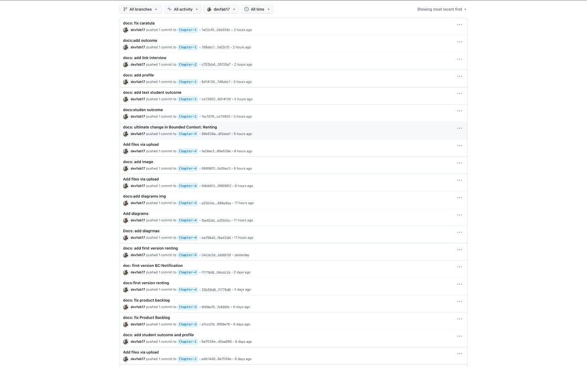
</p>

Oscar:

<p align="center">
  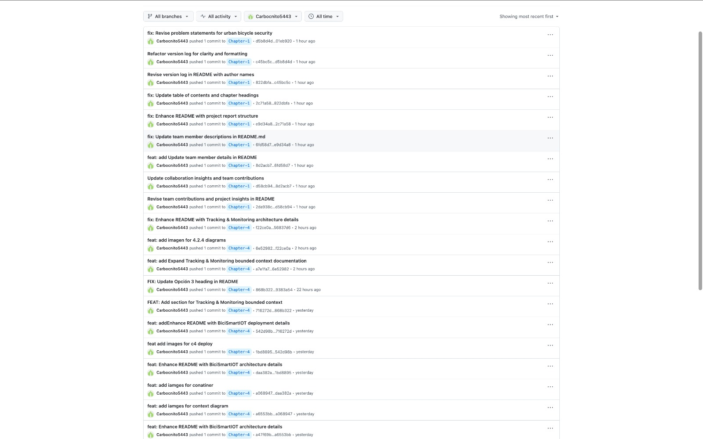
</p>

Renzo:

<p align="center">
  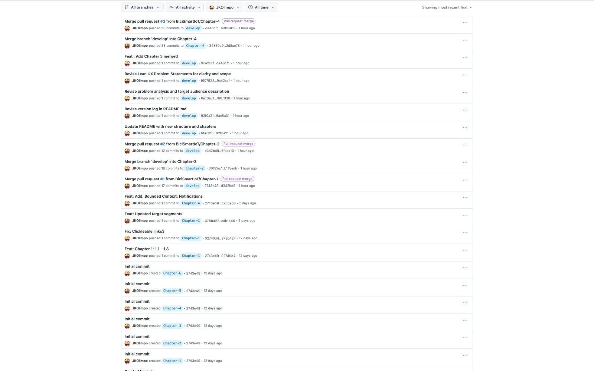
</p>

Stephano:

<p align="center">
  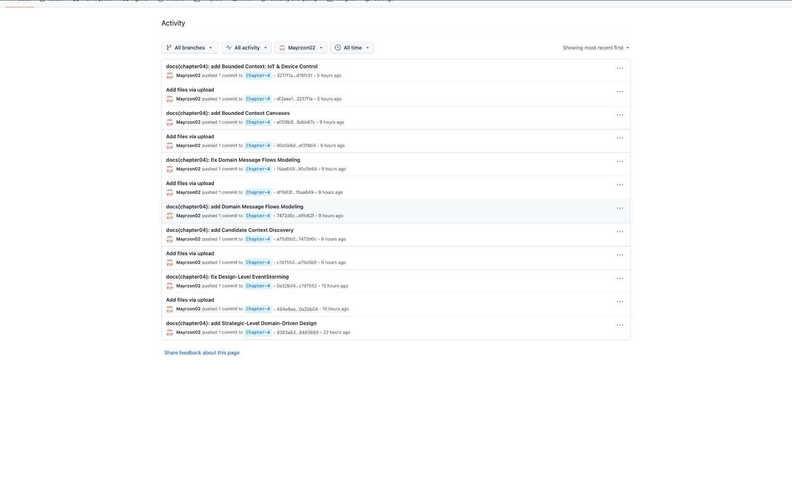
</p>

Cameron:

<p align="center">
  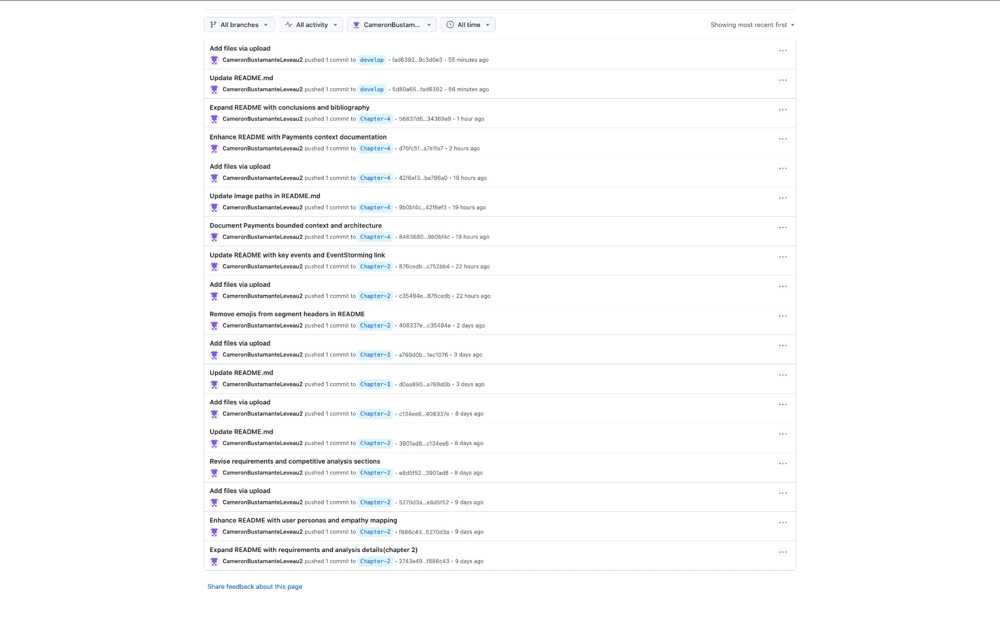
</p>

# Índice

## Capítulo I: Introducción

### 1.1. Startup Profile
- 1.1.1. Descripción de la Startup
- 1.1.2. Perfiles de integrantes del equipo

### 1.2. Solution Profile
- 1.2.1. Antecedentes y problemática
- 1.2.2. Lean UX Process
  - 1.2.2.1. Lean UX Problem Statements
  - 1.2.2.2. Lean UX Assumptions
  - 1.2.2.3. Lean UX Hypothesis Statements
  - 1.2.2.4. Lean UX Canvas

### 1.3. Segmentos objetivo


## Capítulo II: Requirements Elicitation & Analysis

### 2.1. Competidores
- 2.1.1. Análisis competitivo
- 2.1.2. Estrategias y tácticas frente a competidores

### 2.2. Entrevistas
- 2.2.1. Diseño de entrevistas
- 2.2.2. Registro de entrevistas
- 2.2.3. Análisis de entrevistas

### 2.3. Needfinding
- 2.3.1. User Personas
- 2.3.2. User Task Matrix
- 2.3.3. User Journey Mapping
- 2.3.4. Empathy Mapping

### 2.4. Big Picture EventStorming

### 2.5. Ubiquitous Language


## Capítulo III: Requirements Specification

### 3.1. User Stories

### 3.2. Impact Mapping

### 3.3. Product Backlog


## Capítulo IV: Solution Software Design

### 4.1. Strategic-Level Domain-Driven Design

#### 4.1.1. Design-Level EventStorming
- 4.1.1.1 Candidate Context Discovery
- 4.1.1.2 Domain Message Flows Modeling
- 4.1.1.3 Bounded Context Canvases

#### 4.1.2. Context Mapping

#### 4.1.3. Software Architecture
- 4.1.3.1. Software Architecture System Landscape Diagram
- 4.1.3.2. Software Architecture Context Level Diagrams
- 4.1.3.3. Software Architecture Container Level Diagrams
- 4.1.3.4. Software Architecture Deployment Diagrams


### 4.2. Tactical-Level Domain-Driven Design

#### 4.2.1. Bounded Context: Renting
- 4.2.1.1. Domain Layer
- 4.2.1.2. Interface Layer
- 4.2.1.3. Application Layer
- 4.2.1.4. Infrastructure Layer
- 4.2.1.5. Bounded Context Software Architecture Component Level Diagrams
- 4.2.1.6. Bounded Context Software Architecture Code Level Diagrams
  - 4.2.1.6.1. Bounded Context Domain Layer Class Diagrams
  - 4.2.1.6.2. Bounded Context Database Design Diagram

---

#### 4.2.2. Bounded Context: Providing
- 4.2.2.1. Domain Layer
- 4.2.2.2. Interface Layer
- 4.2.2.3. Application Layer
- 4.2.2.4. Infrastructure Layer
- 4.2.2.5. Bounded Context Software Architecture Component Level Diagrams
- 4.2.2.6. Bounded Context Software Architecture Code Level Diagrams
  - 4.2.2.6.1. Bounded Context Domain Layer Class Diagrams
  - 4.2.2.6.2. Bounded Context Database Design Diagram

---

#### 4.2.3. Bounded Context: Payments
- 4.2.3.1. Domain Layer
- 4.2.3.2. Interface Layer
- 4.2.3.3. Application Layer
- 4.2.3.4. Infrastructure Layer
- 4.2.3.5. Bounded Context Software Architecture Component Level Diagrams
- 4.2.3.6. Bounded Context Software Architecture Code Level Diagrams
  - 4.2.3.6.1. Bounded Context Domain Layer Class Diagrams
  - 4.2.3.6.2. Bounded Context Database Design Diagram

---

#### 4.2.4. Bounded Context: IoT & Device Control
- 4.2.4.1. Domain Layer
- 4.2.4.2. Interface Layer
- 4.2.4.3. Application Layer
- 4.2.4.4. Infrastructure Layer
- 4.2.4.5. Bounded Context Software Architecture Component Level Diagrams
- 4.2.4.6. Bounded Context Software Architecture Code Level Diagrams
  - 4.2.4.6.1. Bounded Context Domain Layer Class Diagrams
  - 4.2.4.6.2. Bounded Context Database Design Diagram

---

#### 4.2.5. Bounded Context: Tracking & Monitoring
- 4.2.5.1. Domain Layer
- 4.2.5.2. Interface Layer
- 4.2.5.3. Application Layer
- 4.2.5.4. Infrastructure Layer
- 4.2.5.5. Bounded Context Software Architecture Component Level Diagrams
- 4.2.5.6. Bounded Context Software Architecture Code Level Diagrams
  - 4.2.5.6.1. Bounded Context Domain Layer Class Diagrams
  - 4.2.5.6.2. Bounded Context Database Design Diagram

---

#### 4.2.6. Bounded Context: Notifications
- 4.2.6.1. Domain Layer
- 4.2.6.2. Interface Layer
- 4.2.6.3. Application Layer
- 4.2.6.4. Infrastructure Layer
- 4.2.6.5. Bounded Context Software Architecture Component Level Diagrams
- 4.2.6.6. Bounded Context Software Architecture Code Level Diagrams
  - 4.2.6.6.1. Bounded Context Domain Layer Class Diagrams
  - 4.2.6.6.2. Bounded Context Database Design Diagram


## Conclusiones

## Bibliografía

## Anexos

#### 4.1.2. Context Mapping

#### 4.1.3. Software Architecture
- 4.1.3.1. Software Architecture System Landscape Diagram
- 4.1.3.2. Software Architecture Context Level Diagrams
- 4.1.3.3. Software Architecture Container Level Diagrams
- 4.1.3.4. Software Architecture Deployment Diagrams


### 4.2. Tactical-Level Domain-Driven Design

#### 4.2.1. Bounded Context: Renting
- 4.2.1.1. Domain Layer
- 4.2.1.2. Interface Layer
- 4.2.1.3. Application Layer
- 4.2.1.4. Infrastructure Layer
- 4.2.1.5. Bounded Context Software Architecture Component Level Diagrams
- 4.2.1.6. Bounded Context Software Architecture Code Level Diagrams
  - 4.2.1.6.1. Bounded Context Domain Layer Class Diagrams
  - 4.2.1.6.2. Bounded Context Database Design Diagram

---

#### 4.2.2. Bounded Context: Providing
- 4.2.2.1. Domain Layer
- 4.2.2.2. Interface Layer
- 4.2.2.3. Application Layer
- 4.2.2.4. Infrastructure Layer
- 4.2.2.5. Bounded Context Software Architecture Component Level Diagrams
- 4.2.2.6. Bounded Context Software Architecture Code Level Diagrams
  - 4.2.2.6.1. Bounded Context Domain Layer Class Diagrams
  - 4.2.2.6.2. Bounded Context Database Design Diagram

---

#### 4.2.3. Bounded Context: Payments
- 4.2.3.1. Domain Layer
- 4.2.3.2. Interface Layer
- 4.2.3.3. Application Layer
- 4.2.3.4. Infrastructure Layer
- 4.2.3.5. Bounded Context Software Architecture Component Level Diagrams
- 4.2.3.6. Bounded Context Software Architecture Code Level Diagrams
  - 4.2.3.6.1. Bounded Context Domain Layer Class Diagrams
  - 4.2.3.6.2. Bounded Context Database Design Diagram

---

#### 4.2.4. Bounded Context: IoT & Device Control
- 4.2.4.1. Domain Layer
- 4.2.4.2. Interface Layer
- 4.2.4.3. Application Layer
- 4.2.4.4. Infrastructure Layer
- 4.2.4.5. Bounded Context Software Architecture Component Level Diagrams
- 4.2.4.6. Bounded Context Software Architecture Code Level Diagrams
  - 4.2.4.6.1. Bounded Context Domain Layer Class Diagrams
  - 4.2.4.6.2. Bounded Context Database Design Diagram

---

#### 4.2.5. Bounded Context: Tracking & Monitoring
- 4.2.5.1. Domain Layer
- 4.2.5.2. Interface Layer
- 4.2.5.3. Application Layer
- 4.2.5.4. Infrastructure Layer
- 4.2.5.5. Bounded Context Software Architecture Component Level Diagrams
- 4.2.5.6. Bounded Context Software Architecture Code Level Diagrams
  - 4.2.5.6.1. Bounded Context Domain Layer Class Diagrams
  - 4.2.5.6.2. Bounded Context Database Design Diagram

---

#### 4.2.6. Bounded Context: Notifications
- 4.2.6.1. Domain Layer
- 4.2.6.2. Interface Layer
- 4.2.6.3. Application Layer
- 4.2.6.4. Infrastructure Layer
- 4.2.6.5. Bounded Context Software Architecture Component Level Diagrams
- 4.2.6.6. Bounded Context Software Architecture Code Level Diagrams
  - 4.2.6.6.1. Bounded Context Domain Layer Class Diagrams
  - 4.2.6.6.2. Bounded Context Database Design Diagram

<hr class="page-break">


# Capítulo I: Presentación

## 1.1. Startup Profile

### 1.1.1. Descripción de la Startup

BiciSmartIOT es una startup tecnológica dedicada a la seguridad en el ámbito de la micromovilidad, enfocada principalmente en ciclistas urbanos y deportivos que buscan una forma precisa, segura y confiable de proteger sus bicicletas contra robos. A través de nuestra solución integral basada en el Internet de las Cosas (IoT), los usuarios pueden rastrear en tiempo real sus vehículos y recibir notificaciones ante movimientos anómalos o emergencias, generando confianza y protección de su inversión tanto en la ciudad como en viajes de ruta. De esta manera, promovemos un entorno de transporte más seguro, protegiendo un medio de transporte sustentable y mitigando la principal causa de desuso: el miedo al asalto a un medio desprotegido.

Misión: Facilitar la adopción de bicicletas como transporte sostenible mediante una plataforma y dispositivos de hardware IoT confiables, accesibles e inteligentes para la protección activa en la micromovilidad.

Visión: Convertirnos en la solución y aplicación líder de monitoreo y seguridad para micromovilidad en la región, reconocida por impulsar la confianza, la protección del patrimonio y la innovación.

Valores: Confiabilidad, Responsabilidad, Seguridad, Innovación y Prevención tecnológica.


### 1.1.2. Perfiles de integrantes del equipo

| Integrante | Descripción | Conocimiento |
|------------|-------------|--------------|
| U20231a804 — Bustamante Leveau, Cameron Charllotte  |  Soy estudiante de la Universidad Peruana de Ciencias Aplicadas (UPC) y actualmente curso el octavo ciclo de la carrera de Ingeniería de Software. Tengo 21 años y me interesa el desarrollo de soluciones tecnológicas que combinen innovación, usabilidad y eficiencia.|Puedo aportar con mis conocimientos en desarrollo web (HTML, CSS, JavaScript, React, Node.js, Vue.js), así como en bases de datos (MySQL, SQL Server, MongoDB) y desarrollo móvil con Android Studio (Kotlin/Jetpack Compose). Además, tengo experiencia en gestión de proyectos académicos, trabajo en equipo y un alto dominio de Microsoft Office. |
| U202311745 — Uribe Livia, Renzo Sebastián  | Cuento con una sólida formación en desarrollo Full Stack, con dominio en tecnologías como React, Vue.js y Node.js, además de experiencia en bases de datos relacionales y no relacionales (SQL y MongoDB). Mi perfil técnico se complementa con habilidades en desarrollo móvil nativo usando Kotlin y Jetpack Compose. Me distingo por mi enfoque proactivo y mi capacidad para gestionar proyectos académicos con éxito, siempre orientado a crear soluciones digitales innovadoras en el ámbito de la inteligencia artificial y la productividad. | Puedo aportar con conocimientos en desarrollo Full Stack utilizando tecnologías como React, Vue.js, Node.js, HTML, CSS y JavaScript, además de experiencia en bases de datos relacionales y no relacionales (SQL y MongoDB). Asimismo, tengo conocimientos en desarrollo móvil con Kotlin y Jetpack Compose, integración de APIs, diseño de interfaces y gestión de proyectos tecnológicos orientados a soluciones innovadoras y productivas. |
| U202311842 — Espinoza Quijandria, Oscar Leonardo  | Descripción: Tengo 20 años y soy estudiante de Ingeniería de Software con una fuerte orientación al desarrollo de soluciones tecnológicas. Me caracterizo por mi enfoque analítico y mi capacidad para estructurar sistemas de manera organizada, especialmente en el diseño de arquitecturas y modelado de software. Me gusta trabajar en equipo, aportar ideas técnicas y asegurar que las soluciones sean escalables y bien definidas. Además, tengo interés en el desarrollo backend y en la integración de sistemas, lo que me permite contribuir en la construcción de soluciones completas. | Manejo tecnologías como Java y Spring Boot para el desarrollo backend, así como conceptos de arquitectura de software como Domain-Driven Design (DDD) y diseño de APIs REST. Tengo experiencia en modelado de sistemas mediante diagramas como Context, Container y Deployment, y conocimientos en integración con servicios externos y sistemas IoT. Además, estoy familiarizado con bases de datos relacionales y el diseño de estructuras eficientes para aplicaciones escalables.
| U202311828 — Landauri Preciado, Stephano Mayrzon  |Tengo 20 años y soy un estudiante con fuerte orientación al trabajo en equipo. Me caracterizo por impulsar las habilidades de mis compañeros y mantener una actitud colaborativa en cada etapa del proyecto. Además, tengo facilidad para detectar las necesidades del usuario, lo que me permite aportar una perspectiva centrada en el cliente al momento de tomar decisiones en el equipo.| Manejo lenguajes como Java y C++, con conocimientos en Python, y actualmente me encuentro aprendiendo Kotlin. Complemento estas habilidades con gestión de bases de datos, lo que me permite participar tanto en el diseño como en la implementación de soluciones completas.
| U202220219 — Belahonia Miranda, Fabrisio Andre  |Estudiante de Ingeniería de Software de 7mo ciclo, con interés en el área de ciberseguridad. Se caracteriza por ser responsable, ordenado y empático, con buena capacidad para el trabajo en equipo y resolución de problemas. Busca fortalecer sus habilidades en entornos tecnológicos y de seguridad informática. |Puedo aportar con mis conocimientos en ciberseguridad, especialmente en enfoques de Blue Team y Red Team, incluyendo reconocimiento web, análisis de vulnerabilidades y explotación básica de redes.|

## 1.2. Solution Profile

## 1.2.1. Antecedentes y problemática

Para el análisis de los antecedentes y la problemática se ha empleado la técnica de las 5 W’s y 2 H’s, sustentando la información con datos estadísticos y reportes relacionados con la seguridad ciudadana y el uso de bicicletas en entornos urbanos.

De acuerdo con la Municipalidad Metropolitana de Lima y diversos reportes de seguridad ciudadana, el robo de bicicletas ha incrementado en los últimos años debido al crecimiento de la micromovilidad y al mayor uso de bicicletas como medio de transporte sostenible. Asimismo, estudios de movilidad urbana señalan que muchos usuarios dejan de utilizar bicicletas por temor al robo o por falta de mecanismos de protección y monitoreo en tiempo real.

Además, según la Organización Mundial de la Salud (OMS), los accidentes de tránsito relacionados con ciclistas representan un problema importante en zonas urbanas, especialmente en contextos donde no existen mecanismos de respuesta rápida o asistencia inmediata ante emergencias.

### Análisis 5W + 2H

**¿Quién? (Who):**  
Usuarios urbanos que utilizan bicicletas como medio de transporte, estudiantes universitarios, trabajadores, deportistas y personas que realizan actividades al aire libre.

**¿Qué ocurre? (What):**  
Existe un incremento en los robos de bicicletas y una alta exposición a accidentes o situaciones de emergencia sin asistencia inmediata.

**¿Dónde? (Where):**  
Principalmente en zonas urbanas, estacionamientos públicos, alrededores de universidades, centros laborales y rutas de ciclismo.

**¿Cuándo? (When):**  
Durante todo el día, especialmente cuando los usuarios dejan estacionadas sus bicicletas o realizan recorridos largos en zonas alejadas.

**¿Por qué sucede? (Why):**  
Porque los sistemas tradicionales de seguridad son pasivos y no cuentan con monitoreo en tiempo real, geolocalización ni alertas automáticas.

**¿Cómo sucede? (How):**  
Los robos suelen ocurrir mediante la vulneración de candados tradicionales, mientras que los accidentes pueden suceder sin que el usuario tenga posibilidad de solicitar ayuda inmediata.

**¿Cuánto afecta? (How Much):**  
Genera pérdidas económicas, desconfianza en el uso de bicicletas y riesgos físicos para los usuarios.

---

## 1.2.2. Lean UX Process

### 1.2.2.1. Lean UX Problem Statements

Hemos observado que los usuarios urbanos y ciclistas enfrentan altos niveles de inseguridad debido al robo de bicicletas y la falta de mecanismos de asistencia inmediata en situaciones de emergencia. Los sistemas tradicionales de protección, como candados físicos, no brindan monitoreo ni alertas en tiempo real.

¿Cómo podríamos diseñar una solución IoT inteligente y accesible que permita rastrear bicicletas en tiempo real, detectar movimientos sospechosos y alertar automáticamente a contactos de emergencia ante incidentes o accidentes?

---

### 1.2.2.2. Lean UX Assumptions

1. Creemos que los usuarios estarán dispuestos a utilizar una solución IoT si esta les brinda seguridad y monitoreo en tiempo real.
2. Creemos que las notificaciones instantáneas incrementarán la percepción de protección y control del usuario.
3. Creemos que una integración sencilla entre hardware y aplicación móvil facilitará la adopción del producto.
4. Creemos que las funciones de geolocalización y alertas SOS aportarán valor diferencial frente a soluciones tradicionales.

---

### 1.2.2.3. Lean UX Hypothesis Statements

- Creemos que, al implementar monitoreo y rastreo en tiempo real mediante IoT, lograremos reducir la sensación de inseguridad de los usuarios. Lo sabremos cuando al menos el 70% de los usuarios piloto indiquen sentirse más seguros utilizando la bicicleta.

- Creemos que, al incorporar alertas automáticas de emergencia, lograremos incrementar la confianza y retención de usuarios. Lo sabremos cuando el índice de retención sea superior al 80% después de los primeros tres meses de uso.

---

## 1.2.2.4. Propuesta de Valor

### Propuesta de Valor de BiciSmartIOT

BiciSmartIOT ofrece una solución integral de seguridad para bicicletas basada en tecnología IoT, permitiendo a los usuarios monitorear y proteger sus bicicletas en tiempo real mediante geolocalización, alertas inteligentes y funciones de emergencia.

La propuesta de valor se centra en:

- Incrementar la seguridad de los ciclistas mediante rastreo GPS en tiempo real.
- Reducir el riesgo de robo gracias a alertas automáticas y monitoreo continuo.
- Brindar asistencia rápida en situaciones de emergencia mediante alertas SOS.
- Facilitar una experiencia accesible y sencilla mediante integración con una aplicación móvil intuitiva.
- Promover el uso de transporte sostenible aumentando la confianza de los usuarios.

---

## 1.2.2.5. Lean UX Canvas

A continuación, se presenta el Lean UX Canvas elaborado en la herramienta Miro:

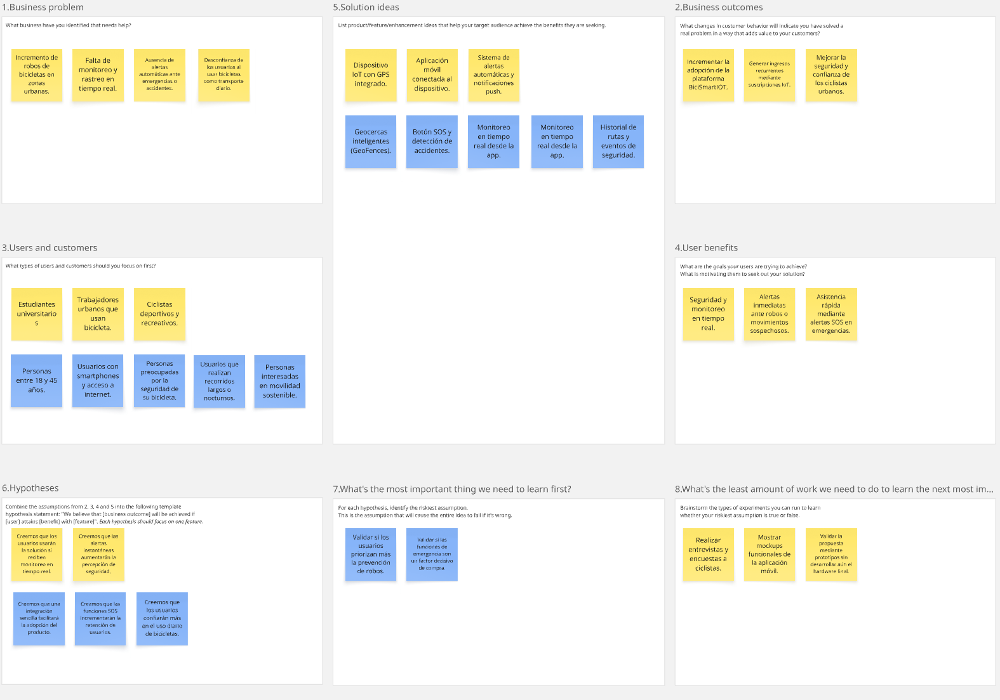

<hr class="page-break">

Enlace al Lean UX Canvas:
[https://miro.com/app/board/uXjVHVeCEt0=/?share_link_id=910519530207] 

## 1.3 Segmentos Objetivo

| Segmento | Descripción | Características |
|----------|-------------|-----------------|
| **Segmento 1: Estudiantes universitarios** | Los estudiantes tienen una vida agitada, una rutina dinámica y ajustada a horarios específicos. Por las mañanas muchos deben desplazarse desde sus residencias hacia sus centros de educación en poco tiempo, además de enfrentar el agobiante tráfico y las deficiencias del transporte público. | - **Edad:** 18 a 30 años <br> - **Ubicación:** Zonas urbanas, cercanas a universidades <br> - **Nivel socioeconómico:** Clase media |
| **Segmento 2: Arriendatarios de bicicletas** | Personas que buscan obtener ingresos adicionales alquilando sus bicicletas a través de una aplicación segura y confiable. Este segmento encuentra atractivo el poder monetizar un bien que ya poseen, al mismo tiempo que contribuyen a una solución de transporte sostenible para estudiantes. Además, buscan alquilar a gente confiable para evitar riesgos. | - **Edad:** 20 a 45 años <br> - **Ubicación:** Zonas urbanas con alta concentración de estudiantes <br> - **Nivel socioeconómico:** Clase media <br> - **Preferencias:** Alquilar a usuarios verificados y confiables |


# Capítulo II: Requirements Development and Software Solution Design 

## 2.1. Competidores 

### 2.1.1. Análisis competitivo 

¿Por qué llevar a cabo este análisis?  
- Deseamos analizar a nuestros competidores para identificar oportunidades de diferenciación mediante el uso de tecnología IoT, enfocándonos en la seguridad activa (anti-robo y monitoreo en tiempo real), ya que la mayoría de soluciones actuales se centran únicamente en la movilidad y no en la protección del usuario y su bicicleta.

|  |  |   BiciSmartIOT |  CityBikeLima |  Grin | Lime |
| :---- | :---- | ----- | :---- | :---- | :---- |
| Perfil | Overview   | Sistema IoT de seguridad para bicicletas con monitoreo en tiempo real, detección de robos y alertas inteligentes mediante app móvil | Red de bicicletas compartidas con estaciones fijas | App de micromovilidad sin estaciones | Empresa global de micromovilidad |
|  | Ventaja competitiva | • Rastreo GPS 24/7 <br>• Alertas de robo en tiempo real <br>• Detección de movimiento sospechoso <br>• Integración hardware + app <br>• GeoFence inteligente | • Infraestructura física estable <br>• Disponibilidad constante | • Uso flexible sin estaciones | • Escala global y tecnología avanzada |
| Perfil de Marketing | Mercado objetivo  | Estudiantes universitarios y arrendatarios | Público urbano | Jóvenes urbanos | Público global |
| Perfil de Producto | • Productos & Servicios  | Dispositivo IoT + app de monitoreo, alertas y seguridad | Bicicletas compartidas | Scooters eléctricos | Scooters y bicis |
|  | Precios & Costos  | Modelo: dispositivo + suscripción IoT | Planes fijos | Pago por minuto | Pago por minuto |
|  | Canales de distribución | App móvil + hardware | App + estaciones | App | App |
| Análisis SWOT | Fortalezas | • Seguridad activa (no solo movilidad) <br>• Diferenciación tecnológica IoT | • Respaldo institucional | • Flexibilidad | • Marca global |
|  | Debilidades | • Hardware requiere adopción inicial | • Infraestructura costosa | • Problemas financieros | • Costos altos |
|  | Oportunidades | • Crecimiento del ciclismo urbano <br>• Necesidad de seguridad | • Expansión urbana | • Retorno al mercado | • Expansión LATAM |
|  | Amenazas | • Competidores tecnológicos <br>• Regulación | • Cambios políticos | • Seguridad vial | • Rechazo urbano |

---

### 2.1.2. Estrategias y tácticas frente a competidores 

#### **Estrategias**

##### **Diferenciación por seguridad IoT**
A diferencia de los competidores, BiciSmartIOT no se enfoca en alquilar vehículos, sino en protegerlos mediante:
- Monitoreo GPS en tiempo real  
- Alertas automáticas ante robos  
- Detección de movimiento sospechoso  

##### **Protección del activo y del usuario**
- Seguridad de la bicicleta (anti-robo)
- Seguridad del usuario (alertas y monitoreo)

##### **Integración tecnológica**
- Hardware IoT discreto
- App móvil intuitiva
- Conectividad en tiempo real (IoT + Bluetooth)

##### **Modelo escalable**
- Venta del dispositivo
- Suscripción mensual por conectividad

---

#### **Tácticas**

- Pilotos en universidades  
- Validación con arrendatarios  
- Feedback continuo desde la app  
- Lanzamiento con descuentos iniciales  

---

## 2.2. Entrevistas

### 2.2.1. Diseño de entrevistas


### 2.2.1. Diseño de entrevistas

<h4> Segmento 1: Estudiantes universitarios</h4>
<ul>
  <li>¿Qué medios de transporte utilizas actualmente para llegar a tu universidad?</li>
  <li>¿Cuánto gastas en promedio al mes en transporte y cómo afecta eso a tu economía?</li>
  <li>¿Has considerado usar bicicleta o scooter como alternativa de transporte? ¿Por qué sí o no?</li>
  <li>¿Qué factores te generan más confianza al usar un servicio de alquiler entre estudiantes (ejemplo: validación de correo universitario, seguro, reseñas)?</li>
  <li>¿Qué medio de pago usarías con mayor frecuencia (Yape, Plin, tarjeta, efectivo)?</li>
  <li>¿Qué tan importante es para ti que el servicio sea rápido y esté disponible cerca de tu universidad?</li>
  <li>¿Qué nivel de importancia le das a la sostenibilidad y al cuidado del medio ambiente en tu elección de transporte?</li>
</ul>

<h4> Segmento 2: Arriendatarios mayoristas (tiendas, talleres, negocios)</h4>
<ul>
  <li>¿Qué cantidad de bicicletas o scooters disponibles tienes actualmente que podrías destinar al alquiler?</li>
  <li>¿Qué factores considerarías importantes para asociarte con una aplicación de micromovilidad (confianza, seguridad, volumen de clientes, soporte técnico)?</li>
  <li>¿Qué tipo de modelo de pago sería más atractivo para tu negocio (por viaje, por día, porcentajes compartidos, suscripción)?</li>
  <li>¿Qué nivel de visibilidad o marketing esperas obtener al publicar tus vehículos en la plataforma?</li>
  <li>¿Qué preocupaciones tendrías sobre el mantenimiento y desgaste de las bicicletas alquiladas?</li>
  <li>¿Qué condiciones contractuales o garantías mínimas te darían seguridad para participar (seguro contra robos, cobertura de daños, validación de usuarios)?</li>
  <li>¿Qué beneficios adicionales te motivarían a convertirte en socio mayorista (ejemplo: reportes de uso, analítica de demanda, promociones especiales)?</li>
  <li>¿Qué criterios usarías para decidir si este modelo de negocio de alquiler digital se ajusta a tu estrategia actual?</li>
</ul>

### 2.2.2. Registro de entrevistas

| Segmento Objetivo | Estudiantes |
| ----- | ----- |
| **Número de registro** | **Datos del entrevistado** |
| 01 | **Nombre:** Ana Izquierdo  <br>**Edad:** 22 <br>**Profesión:** Estudiante Universitaria <br> **Distrito:** Lima  <br>**Inicio \- Duración:**  0:00 \- 2:45 <br>  |
|  | **Resumen:**  La entrevista realizada a Ana Izquierdo (22 años, estudiante de Ingeniería de Sistemas) refleja que los estudiantes universitarios buscan principalmente economía, rapidez y confianza en sus medios de transporte. Actualmente utiliza buses y transportes informales debido a su bajo costo y rapidez, aunque reconoce que esto impacta en su economía. Considera viable el uso de bicicletas en trayectos cortos como de su casa a la universidad, pero no desde su trabajo por la distancia, validando así la hipótesis de cercanía del proyecto. La confianza en el servicio estaría determinada por reseñas y recomendaciones, mientras que su medio de pago preferido es Yape. Además, destaca que la disponibilidad y accesibilidad del servicio son factores clave para decidir su uso, aunque identifica como obstáculo personal no saber manejar bicicleta, lo que refleja que no todos los estudiantes serían usuarios inmediatos del servicio. En general, sus respuestas son coherentes con la problemática planteada y refuerzan la importancia de ofrecer una alternativa segura, práctica y adaptada a las necesidades del segmento universitario |
| 02 | **Nombre:** Brayan <br>**Edad:** 23 <br>**Profesión:** Estudiante Universitario <br>**Distrito:** Santiago de Surco  <br>**Inicio\- Duración:** 2:45  \- 5:20  <br> |
|  | **Resumen:** La entrevista realizada a Brian, estudiante de Administración de Negocios Internacionales de 23 años, evidencia que los estudiantes perciben el transporte como un gasto elevado, destinando entre 8 y 10 soles diarios, lo que afecta directamente a su economía. Si bien ha considerado alternativas como el scooter, manifiesta inseguridad para usarlas debido al tráfico y a factores personales. La confianza en un servicio de micromovilidad estaría dada principalmente por seguros y validaciones institucionales, lo que refuerza la importancia de mecanismos de seguridad en la plataforma. En cuanto a métodos de pago, se muestra flexible con Yape y tarjetas, lo que indica la necesidad de ofrecer varias opciones digitales. Además, destaca que la rapidez y disponibilidad del servicio son esenciales para llegar puntual a clases, y valora la sostenibilidad como un aspecto fundamental en las alternativas de transporte. En general, su testimonio respalda la hipótesis de que los estudiantes buscan transporte seguro, rápido y confiable, pero también revela barreras psicológicas o de percepción que pueden limitar la adopción inmediata de medios como scooters|
| 03 | **Nombre:** Jose Ascona  <br>**Edad:** 25 <br>**Profesión:** Estudiante Universitario <br>**Distrito:** San Juan de Lurigancho <br>**Inicio \- Duración:**  5:20 \- 9:03 <br>  |
|  | **Resumen:** La entrevista con José Ascona (25 años, estudiante y trabajador en una empresa de tecnología) muestra claramente la percepción del segmento 1: estudiantes universitarios. Actualmente utiliza coaster, combi y ocasionalmente taxi, lo que le genera un gasto mensual aproximado de S/ 200, equivalente al 20 % de su sueldo, reflejando un impacto fuerte en su economía. Ha considerado el scooter como alternativa más viable que la bicicleta, ya que reduciría su tiempo de viaje de 40 a 20 minutos y le permitiría ahorrar en pasajes. La confianza en el servicio estaría determinada principalmente por las reseñas de otros usuarios, mientras que en los métodos de pago se inclina por Yape y tarjetas Visa/MasterCard. Considera fundamental que el servicio sea rápido y esté disponible cerca de los estudiantes, ya que esto garantizaría su uso frecuente. Aunque al inicio no le da gran importancia al factor ambiental, reconoce que optar por bicicletas o scooters ayudaría a reducir la contaminación y estaría dispuesto a usar un servicio con impacto positivo en sostenibilidad. En conclusión, su testimonio valida la necesidad de un transporte económico, rápido y confiable, destacando el scooter como opción atractiva para estudiantes que combinan estudio y trabajo|
| **Segmento Objetivo** | **Arriendatarios mayoristas** |
| **04** | **Nombre:** Carlos <br>**Edad:** 29  <br>**Profesión:** Civil <br>**Distrito:** Villa el Salvador  <br>**Inicio \- Duración:**  9:03 \- 12:48 <br> |
|  | **Resumen:** La entrevista realizada al Sr. Carlos Mendoza (29 años), perteneciente al segmento 2: arriendatarios mayoristas, revela un perfil claramente orientado al negocio de la micromovilidad. Actualmente cuenta con un stock de 300 a 400 bicicletas, con capacidad de ampliar hasta 1000 más según la demanda, lo que demuestra un enfoque escalable. Para asociarse con una aplicación, considera clave la seguridad (validación de usuarios, cobertura contra robos y daños) y el volumen de clientes, pues ambos inciden directamente en la confianza y la rentabilidad. Prefiere un modelo de pago por suscripción, ya que asegura ingresos recurrentes y predecibles. Valora fuertemente la visibilidad y el marketing que pueda otorgar la plataforma para captar más clientes. Aunque no muestra gran preocupación por el desgaste de las bicicletas —pues contempla opciones de remate o donación—, recalca la importancia de contar con garantías contractuales. Además, considera como beneficio adicional los reportes y analíticas de uso, lo que le permitiría optimizar su estrategia comercial. En general, su decisión de participar dependería del nivel de adopción tecnológica y la frecuencia de uso de la aplicación, confirmando que este segmento busca escalabilidad, seguridad y datos de negocio más que el uso personal del servicio|
| **05** | **Nombre:** Luis Becerra <br>**Edad:** 28<br>**Profesión:** Civil <br>**Distrito:** La Molina <br>**Inicio \- Duración:**  12:48 \- 16:15  <br> |
|  | **Resumen:** La entrevista a Luis Ángel Becerra, dueño de un taller con 4 bicicletas y 2 scooters, muestra la visión de los proveedores sobre la micromovilidad. Considera suficiente esa cantidad para iniciar y probar la rentabilidad del negocio. Valora principalmente la confianza en la aplicación, la seguridad, el volumen de clientes y el soporte técnico. Prefiere un modelo de pago por viaje con porcentajes compartidos, aunque también le interesa una opción fija mensual. Busca visibilidad en la plataforma para vincular el alquiler con la promoción de su taller, pero le preocupan el mantenimiento, el desgaste y los robos, por lo que considera esenciales los seguros, la validación de usuarios y pagos claros. Como beneficios adicionales, destaca los reportes de uso, la analítica de demanda y las promociones. Evalúa este modelo de negocio en función de si le genera ganancias estables, baja carga de gestión y diferenciación frente a la competencia  |
|**06**| **Nombre:** Junior Clemente <br>**Edad:** 25 <br>**Profesión:** Civil  <br>**Distrito:** San Borja **Inicio \- Duración:** 16:15 \- 20:18<br>  |
|  | **Resumen:** La entrevista a Junior Clemente refleja que su interés principal al asociarse con una plataforma de micromovilidad está en la transparencia de los pagos, la validación adecuada de los usuarios y la existencia de soporte técnico ante problemas. Considera que un esquema mixto de pago, combinando la modalidad por viaje con un mínimo garantizado mensual, le daría mayor seguridad financiera y flexibilidad frente a la demanda. Entre sus preocupaciones resalta el cuidado de los vehículos y el riesgo de pérdidas por mal uso o robos, por lo que considera fundamentales los seguros, políticas claras de devolución y medidas estrictas de control. A su vez, valora la posibilidad de que la plataforma le brinde visibilidad adicional, destacando su negocio y servicios complementarios, lo que podría atraer clientes más allá del alquiler. También identifica como beneficios relevantes los informes de desempeño, programas de fidelización y promociones especiales que incentiven el uso constante. Junior evalúa la viabilidad del modelo en función de si le permite obtener ingresos estables, minimizar riesgos operativos y diferenciar su negocio frente a la competencia, integrando el alquiler digital con el crecimiento de su propio emprendimiento  |
| Link a las entrevistas  | [https://upcedupe-my.sharepoint.com/:v:/g/personal/u202310601_upc_edu_pe/ESS8nMNW8DtHtgz9a86ulzQBBr3fUWxfJBCfo8i_5RCgIw?e=Opy84t&nav=eyJyZWZlcnJhbEluZm8iOnsicmVmZXJyYWxBcHAiOiJTdHJlYW1XZWJBcHAiLCJyZWZlcnJhbFZpZXciOiJTaGFyZURpYWxvZy1MaW5rIiwicmVmZXJyYWxBcHBQbGF0Zm9ybSI6IldlYiIsInJlZmVycmFsTW9kZSI6InZpZXcifX0%3D](https://upcedupe-my.sharepoint.com/:v:/g/personal/u202310601_upc_edu_pe/ESS8nMNW8DtHtgz9a86ulzQBBr3fUWxfJBCfo8i_5RCgIw?e=Opy84t&nav=eyJyZWZlcnJhbEluZm8iOnsicmVmZXJyYWxBcHAiOiJTdHJlYW1XZWJBcHAiLCJyZWZlcnJhbFZpZXciOiJTaGFyZURpYWxvZy1MaW5rIiwicmVmZXJyYWxBcHBQbGF0Zm9ybSI6IldlYiIsInJlZmVycmFsTW9kZSI6InZpZXcifX0%3D)  |


### 2.2.3. Análisis de entrevistas

<h4> Segmento 1: Estudiantes universitarios</h4>
- Los estudiantes universitarios identifican la economía y la rapidez como los factores más determinantes en su elección de transporte. El alto costo de taxis o aplicativos de movilidad los motiva a buscar alternativas más asequibles como bicicletas o scooters.

- Existe una alta sensibilidad al precio, ya que el transporte representa un gasto diario que impacta en su presupuesto mensual.

- La confianza en el servicio es un requisito clave. Los entrevistados plantean la necesidad de validación institucional (correos universitarios) y reseñas verificadas para reducir la desconfianza hacia desconocidos.

- Los medios de pago preferidos son plataformas digitales locales como Yape y Plin, por su simplicidad y uso extendido entre los jóvenes.

- La disponibilidad del servicio y la cercanía de las estaciones son factores decisivos para la adopción del sistema.

- Aunque algunos no priorizan inicialmente el impacto ambiental, reconocen el valor de la sostenibilidad como un beneficio adicional que mejora la imagen del servicio.

- Se evidencian barreras personales, como la falta de habilidad para manejar bicicleta o el temor al tráfico, que podrían limitar la adopción inmediata del servicio.

#### **Conclusión del segmento:**
El público universitario valida la necesidad de una plataforma de transporte económica, rápida, segura y fácil de usar, reforzando la importancia de la confianza, los pagos digitales y la ubicación estratégica de los puntos de acceso.

<h4> Segmento 2: Arriendatarios mayoristas</h4>
- Los arriendatarios perciben la micromovilidad como una oportunidad de negocio escalable y están dispuestos a invertir si se garantiza un flujo estable de clientes.

- La seguridad y validación de usuarios son aspectos esenciales para participar. Se demandan seguros, control de robos y políticas de devolución claras.

- Existe preferencia por modelos de pago flexibles, que pueden incluir suscripciones mensuales, pagos por viaje o esquemas mixtos que aseguren estabilidad de ingresos.

- Valoran la visibilidad que puede brindar la plataforma, ya que contribuye a atraer más clientes y promocionar sus propios negocios o talleres.

- Los reportes de uso, estadísticas y analítica de demanda son percibidos como herramientas útiles para optimizar decisiones comerciales.

- Los entrevistados consideran beneficiosa la posibilidad de integrar programas de fidelización o promociones que incentiven el uso continuo del servicio.

- Muestran interés en participar si la plataforma demuestra transparencia en las transacciones y soporte técnico confiable.

#### **Conclusión del segmento:**
El segmento de arriendatarios confirma la necesidad de un sistema que garantice seguridad operativa, estabilidad económica y visibilidad comercial, con un modelo de gestión transparente y adaptable.
  

---

## 2.3. Needfinding 

### 2.3.1. User Personas

##### **Segmento 1: Estudiantes universitarios**


##### **Segmento 2:Arriendatarios de bicicletas**


### 2.3.2. User Task Matrix

Estudiante & Proveedor
**Escala:** 1 = Rara vez / baja · 3 = Media · 5 = Muy frecuente / crítica

| Tarea (independiente del software)                                  | Estudiante – Frecuencia | Estudiante – Importancia | Proveedor – Frecuencia | Proveedor – Importancia |
|---------------------------------------------------------------------|:-----------------------:|:------------------------:|:----------------------:|:-----------------------:|
| 1) Evaluar opciones de transporte para trayectos cortos             | 4 | 4 | 1 | 1 |
| 2) Desplazarse puntual dentro/alrededor del campus                  | 5 | 5 | 1 | 2 |
| 3) Planificar tiempo entre clases/actividades                       | 4 | 5 | 2 | 3 |
| 4) Encontrar un vehículo cercano y adecuado                         | 4 | 5 | 2 | 3 |
| 5) Verificar seguridad y zonas permitidas (geocercas, parqueo)      | 3 | 5 | 3 | 5 |
| 6) Pagar y gestionar presupuesto personal de movilidad              | 4 | 4 | 1 | 2 |
| 7) Iniciar/terminar el uso y estacionar correctamente               | 4 | 5 | 2 | 3 |
| 8) Reportar incidencias o solicitar soporte                         | 1 | 3 | 2 | 5 |
| 9) Decidir publicar/retirar un vehículo para alquiler               | 1 | 1 | 4 | 5 |
| 10) Verificar confiabilidad de arrendatarios (identidad/reputación) | 1 | 2 | 3 | 5 |
| 11) Realizar mantenimiento básico / recarga                         | 1 | 1 | 3 | 5 |
| 12) Definir precio/horario/zonas de disponibilidad                  | 1 | 1 | 4 | 5 |
| 13) Llevar control de ingresos y retiros (payouts)                  | 1 | 1 | 4 | 5 |
| 14) Gestionar disputas/daños/multas                                 | 1 | 4 | 2 | 5 |

### 2.3.3. User Journey Mapping 

##### **Segmento 1: Estudiantes universitarios**


##### **Segmento 2:Arriendatarios de bicicletas**


### 2.3.4. Empathy Mapping


---

## 2.4 Big Picture EventStorming PUNTO QUE ME FALTA


#### Eventos clave:

- Bicicleta estacionada  
- Movimiento detectado  
- Robo potencial  
- Alerta enviada  
- Ubicación actualizada  
- GeoFence activado  
- Bicicleta fuera de zona


#### Enlace al EventStorming:
https://miro.com/welcomeonboard/Wjdub09ldkR1djZCRGJ5cnZLaGRrOHhvQXRaNkt3NmpEK2lWODkya3YxbFN0ZWxRb3RRaEI0VGJUVEhFS0xoZEVMcEJPUlZ6cWpyTDJrK2VjWGpKY1lvWG5vc3V3VWNMMk4yaXoxRnZtWm85dVBOWDFRQU8xT2NsUDNhWWtmeW9BS2NFMDFkcUNFSnM0d3FEN050ekl3PT0hdjE=?share_link_id=807617270017


---

## 2.5 Ubiquitous Language 

| Término | Significado |
|--------|------------|
| IoT Device | Dispositivo instalado en la bicicleta que envía datos |
| GPS Tracking | Ubicación en tiempo real |
| GeoFence | Zona de seguridad virtual |
| Motion Detection | Detección de movimiento |
| Anti-theft Alert | Alerta de robo |
| Real-time Notification | Notificación inmediata |
| Remote Monitoring | Monitoreo remoto desde app |
| Smart Security | Seguridad inteligente basada en sensores |
| IoT Connectivity | Conectividad del dispositivo |
| Mobile App | Aplicación de control del usuario |


## Capítulo III: Requirements Specification. 

### 3.1. User Stories.

<table border="1" cellspacing="0" cellpadding="6" style="border-collapse: collapse; width: 100%;">
    <tr><th colspan="4" align="center"> EP01 – Authentication & Profile Management</th></tr>
    <tr><th colspan="4" align="center">Como usuario quiero registrarme, iniciar sesión y gestionar mi perfil, para tener acceso seguro y personalizado a la aplicación.</th></tr>
    <tr><th width="25%">User Story ID</th><th width="75%" colspan="3">Título</th></tr>
    <tr><td>US01</td><td colspan="3">Registro de usuario estudiante</td></tr>
    <tr><td>US02</td><td colspan="3">Registro de usuario arrendador</td></tr>
    <tr><td>US03</td><td colspan="3">Iniciar sesión en la aplicación</td></tr>
    <tr><td>US04</td><td colspan="3">Recuperar contraseña</td></tr>
    <tr><td>US05</td><td colspan="3">Editar información de perfil</td></tr>
    <tr><td>US06</td><td colspan="3">Cerrar sesión</td></tr>
</table>

<br>

<table border="1" cellspacing="0" cellpadding="6" style="border-collapse: collapse; width: 100%;">
    <tr><th colspan="4" align="center"> EP02 – Bicycle Management (Lender)</th></tr>
    <tr><th colspan="4" align="center">Como arrendador quiero publicar, editar y administrar mis bicicletas inteligentes para ponerlas a disposición de los usuarios.</th></tr>
    <tr><th width="25%">User Story ID</th><th width="75%" colspan="3">Título</th></tr>
    <tr><td>US07</td><td colspan="3">Registrar una bicicleta IoT en la app</td></tr>
    <tr><td>US08</td><td colspan="3">Editar información de una bicicleta</td></tr>
    <tr><td>US09</td><td colspan="3">Marcar bicicleta como disponible/no disponible</td></tr>
    <tr><td>US10</td><td colspan="3">Eliminar bicicleta de la aplicación</td></tr>
    <tr><td>US11</td><td colspan="3">Consultar historial de alquileres</td></tr>
</table>

<br>

<table border="1" cellspacing="0" cellpadding="6" style="border-collapse: collapse; width: 100%;">
    <tr><th colspan="4" align="center"> EP03 – Search & Reservation</th></tr>
    <tr><th colspan="4" align="center">Como usuario quiero buscar y reservar bicicletas inteligentes disponibles para usarlas en mis traslados.</th></tr>
    <tr><th width="25%">User Story ID</th><th width="75%" colspan="3">Título</th></tr>
    <tr><td>US12</td><td colspan="3">Buscar bicicletas por cercanía (GPS)</td></tr>
    <tr><td>US13</td><td colspan="3">Filtrar bicicletas por tipo o características</td></tr>
    <tr><td>US14</td><td colspan="3">Ver información detallada de la bicicleta y arrendador</td></tr>
    <tr><td>US15</td><td colspan="3">Realizar reserva de bicicleta</td></tr>
    <tr><td>US16</td><td colspan="3">Cancelar reserva</td></tr>
    <tr><td>US17</td><td colspan="3">Confirmar inicio de alquiler</td></tr>
    <tr><td>US18</td><td colspan="3">Finalizar alquiler</td></tr>
</table>

<br>

<table border="1" cellspacing="0" cellpadding="6" style="border-collapse: collapse; width: 100%;">
    <tr><th colspan="4" align="center"> EP04 – Digital Payments & Settlements</th></tr>
    <tr><th colspan="4" align="center">Como usuario quiero realizar pagos digitales de forma segura y como arrendador quiero recibir mis ingresos sin complicaciones.</th></tr>
    <tr><th width="25%">User Story ID</th><th width="75%" colspan="3">Título</th></tr>
    <tr><td>US19</td><td colspan="3">Vincular método de pago (Yape, Plin, tarjeta)</td></tr>
    <tr><td>US20</td><td colspan="3">Pagar alquiler automáticamente</td></tr>
    <tr><td>US21</td><td colspan="3">Recibir confirmación de pago</td></tr>
    <tr><td>US22</td><td colspan="3">Recibir notificación de penalización por tiempo excedido</td></tr>
    <tr><td>US23</td><td colspan="3">Consultar historial de pagos</td></tr>
    <tr><td>US24</td><td colspan="3">Arrendador recibe liquidación automática</td></tr>
</table>

<br>

<table border="1" cellspacing="0" cellpadding="6" style="border-collapse: collapse; width: 100%;">
    <tr><th colspan="4" align="center"> EP05 – IoT Control & Automation</th></tr>
    <tr><th colspan="4" align="center">Como usuario quiero controlar el alquiler mediante tecnología IoT para tener una experiencia automatizada y sin contacto.</th></tr>
    <tr><th width="25%">User Story ID</th><th width="75%" colspan="3">Título</th></tr>
    <tr><td>US25</td><td colspan="3">Desbloquear bicicleta mediante app (Smart Lock)</td></tr>
    <tr><td>US26</td><td colspan="3">Bloquear bicicleta automáticamente al finalizar</td></tr>
    <tr><td>US27</td><td colspan="3">Inicio automático de alquiler mediante sensor</td></tr>
    <tr><td>US28</td><td colspan="3">Detección de bicicleta en uso (sensor de movimiento)</td></tr>
</table>

<br>

<table border="1" cellspacing="0" cellpadding="6" style="border-collapse: collapse; width: 100%;">
    <tr><th colspan="4" align="center"> EP06 – Real-time Monitoring</th></tr>
    <tr><th colspan="4" align="center">Como usuario quiero visualizar y monitorear información en tiempo real de la bicicleta para mayor control y seguridad.</th></tr>
    <tr><th width="25%">User Story ID</th><th width="75%" colspan="3">Título</th></tr>
    <tr><td>US29</td><td colspan="3">Ver ubicación en tiempo real de la bicicleta (GPS)</td></tr>
    <tr><td>US30</td><td colspan="3">Seguimiento de recorrido durante el alquiler</td></tr>
    <tr><td>US31</td><td colspan="3">Visualizar estado de la bicicleta (disponible/en uso)</td></tr>
    <tr><td>US32</td><td colspan="3">Registro de historial de rutas</td></tr>
</table>


<br>

<table border="1" cellspacing="0" cellpadding="6" style="border-collapse: collapse; width: 100%;">
    <tr><th colspan="4" align="center"> EP07 – Notifications</th></tr>
    <tr><th colspan="4" align="center">Como usuario quiero recibir notificaciones relevantes para estar informado sobre mis actividades.</th></tr>
    <tr><th width="25%">User Story ID</th><th width="75%" colspan="3">Título</th></tr>
    <tr><td>US33</td><td colspan="3">Notificaciones de reserva</td></tr>
    <tr><td>US34</td><td colspan="3">Notificaciones de inicio y fin de alquiler</td></tr>
    <tr><td>US35</td><td colspan="3">Notificaciones de pago</td></tr>
    <tr><td>US36</td><td colspan="3">Notificaciones de incidencias o alertas</td></tr>
</table>

<br>

<table border="1" cellspacing="0" cellpadding="6" style="border-collapse: collapse; width: 100%;">
    <tr><th colspan="4" align="center"> EP08 – Admin Dashboard & IoT Monitoring</th></tr>
    <tr><th colspan="4" align="center">Como administrador quiero gestionar usuarios y bicicletas inteligentes para asegurar el correcto funcionamiento del sistema.</th></tr>
    <tr><th width="25%">User Story ID</th><th width="75%" colspan="3">Título</th></tr>
    <tr><td>US37</td><td colspan="3">Acceder a panel de control con métricas</td></tr>
    <tr><td>US38</td><td colspan="3">Gestionar usuarios (activar, suspender, eliminar)</td></tr>
    <tr><td>US39</td><td colspan="3">Gestionar bicicletas registradas</td></tr>
    <tr><td>US40</td><td colspan="3">Monitorear bicicletas en tiempo real (IoT)</td></tr>
</table>

<br>

<table border="1" cellspacing="0" cellpadding="6" style="border-collapse: collapse; width: 100%;">
    <tr><th colspan="4" align="center"> EP09 – Landing Page & Visitor Experience</th></tr>
    <tr><th colspan="4" align="center">Como visitante del sitio quiero explorar la landing page para conocer la aplicación y decidir si registrarme.</th></tr>
    <tr><th width="25%">User Story ID</th><th width="75%" colspan="3">Título</th></tr>
    <tr><td>US41</td><td colspan="3">Visualizar información general del servicio</td></tr>
    <tr><td>US42</td><td colspan="3">Ver características y beneficios</td></tr>
    <tr><td>US43</td><td colspan="3">Acceder a registro o inicio de sesión</td></tr>
    <tr><td>US44</td><td colspan="3">Descargar la aplicación</td></tr>
</table>

#### user storie

<!-- ============================================== -->
<!-- USER STORIES 01 al 10                          -->
<!-- ============================================== -->

<!-- US01 -->
<table border="1" cellspacing="0" cellpadding="6" style="border-collapse: collapse; width: 100%;">
    <tr class="header-row"><th>Story ID</th><th>User</th><th>Priority</th><th>Epic</th></tr>
    <tr><td>US01</td><td>Estudiante</td><td>Alta</td><td>EP01</td></tr>
    <tr class="title-row"><td colspan="4">Título:</td></tr>
    <tr><td colspan="4" class="content-cell">Registro de usuario estudiante</td></tr>
    <tr class="description-row"><td colspan="4">Descripción:</td></tr>
    <tr><td colspan="4" class="content-cell">Como estudiante quiero registrarme en la aplicación con mi correo universitario para acceder a los beneficios de usuario.</td></tr>
    <tr class="acceptance-row"><td colspan="4">Criterios de Aceptación:</td></tr>
    <tr><td colspan="4" class="content-cell">
        <strong>Escenario 1: Registro exitoso con datos válidos</strong><br> Dado que soy un estudiante nuevo, cuando ingreso mi correo universitario y datos personales válidos, entonces mi cuenta se crea exitosamente.<br><br>
        <strong>Escenario 2: Error por correo no universitario</strong><br> Dado que ingreso un correo que no pertenece a una universidad válida, cuando intento registrarme, entonces el sistema rechaza el registro y solicita un correo institucional.<br><br>
        <strong>Escenario 3: Validación de campos obligatorios</strong><br> Dado que omito información requerida, cuando intento crear la cuenta, entonces el sistema muestra un mensaje solicitando los datos faltantes.
    </td></tr>
</table>
<br>

<!-- US02 -->
<table border="1" cellspacing="0" cellpadding="6" style="border-collapse: collapse; width: 100%;">
    <tr class="header-row"><th>Story ID</th><th>User</th><th>Priority</th><th>Epic</th></tr>
    <tr><td>US02</td><td>Arrendador</td><td>Alta</td><td>EP01</td></tr>
    <tr class="title-row"><td colspan="4">Título:</td></tr>
    <tr><td colspan="4" class="content-cell">Registro de usuario arrendador</td></tr>
    <tr class="description-row"><td colspan="4">Descripción:</td></tr>
    <tr><td colspan="4" class="content-cell">Como arrendador quiero registrarme en la aplicación con mis datos personales y de negocio para poder publicar mis vehículos.</td></tr>
    <tr class="acceptance-row"><td colspan="4">Criterios de Aceptación:</td></tr>
    <tr><td colspan="4" class="content-cell">
        <strong>Escenario 1: Registro exitoso con datos válidos</strong><br> Dado que soy un arrendador nuevo, cuando ingreso mi DNI/RUC y datos de contacto válidos, entonces mi cuenta se crea exitosamente.<br><br>
        <strong>Escenario 2: Error por número de identificación inválido</strong><br> Dado que ingreso un DNI o RUC inválido, cuando intento registrarme, entonces el sistema muestra un mensaje de error de validación.<br><br>
        <strong>Escenario 3: Confirmación de registro</strong><br> Dado que mi registro es exitoso, cuando el proceso finaliza, entonces recibo una notificación de confirmación.
    </td></tr>
</table>
<br>

<!-- US03 -->
<table border="1" cellspacing="0" cellpadding="6" style="border-collapse: collapse; width: 100%;">
    <tr class="header-row"><th>Story ID</th><th>User</th><th>Priority</th><th>Epic</th></tr>
    <tr><td>US03</td><td>Usuario</td><td>Alta</td><td>EP01</td></tr>
    <tr class="title-row"><td colspan="4">Título:</td></tr>
    <tr><td colspan="4" class="content-cell">Iniciar sesión en la aplicación</td></tr>
    <tr class="description-row"><td colspan="4">Descripción:</td></tr>
    <tr><td colspan="4" class="content-cell">Como usuario registrado quiero iniciar sesión con mi correo y contraseña para acceder a mi cuenta.</td></tr>
    <tr class="acceptance-row"><td colspan="4">Criterios de Aceptación:</td></tr>
    <tr><td colspan="4" class="content-cell">
        <strong>Escenario 1: Inicio de sesión exitoso</strong><br> Dado que ingreso mis credenciales correctas, cuando el sistema las valida, entonces me otorga acceso a mi cuenta.<br><br>
        <strong>Escenario 2: Error por credenciales incorrectas</strong><br> Dado que ingreso una contraseña incorrecta, cuando intento autenticarme, entonces el sistema deniega el acceso y muestra un mensaje de error.<br><br>
        <strong>Escenario 3: Opción "Recordarme"</strong><br> Dado que activo la opción "Recordarme", cuando cierro y vuelvo a abrir la app, entonces mi sesión permanece activa.
    </td></tr>
</table>
<br>

<!-- US04 -->
<table border="1" cellspacing="0" cellpadding="6" style="border-collapse: collapse; width: 100%;">
    <tr class="header-row"><th>Story ID</th><th>User</th><th>Priority</th><th>Epic</th></tr>
    <tr><td>US04</td><td>Usuario</td><td>Media</td><td>EP01</td></tr>
    <tr class="title-row"><td colspan="4">Título:</td></tr>
    <tr><td colspan="4" class="content-cell">Recuperar contraseña</td></tr>
    <tr class="description-row"><td colspan="4">Descripción:</td></tr>
    <tr><td colspan="4" class="content-cell">Como usuario quiero recuperar mi contraseña olvidada mediante un enlace enviado a mi correo para restablecer el acceso a mi cuenta.</td></tr>
    <tr class="acceptance-row"><td colspan="4">Criterios de Aceptación:</td></tr>
    <tr><td colspan="4" class="content-cell">
        <strong>Escenario 1: Solicitud de enlace de recuperación</strong><br> Dado que olvidé mi contraseña, cuando ingreso mi correo registrado, entonces el sistema envía un enlace de recuperación válido por 30 minutos.<br><br>
        <strong>Escenario 2: Error por correo no registrado</strong><br> Dado que ingreso un correo no registrado, cuando solicito recuperación, entonces el sistema muestra un mensaje indicando que el correo no existe.<br><br>
        <strong>Escenario 3: Definición de nueva contraseña</strong><br> Dado que accedo al enlace de recuperación, cuando ingreso mi nueva contraseña, entonces el sistema la actualiza y me permite iniciar sesión.
    </td></tr>
</table>
<br>

<!-- US05 -->
<table border="1" cellspacing="0" cellpadding="6" style="border-collapse: collapse; width: 100%;">
    <tr class="header-row"><th>Story ID</th><th>User</th><th>Priority</th><th>Epic</th></tr>
    <tr><td>US05</td><td>Usuario</td><td>Media</td><td>EP01</td></tr>
    <tr class="title-row"><td colspan="4">Título:</td></tr>
    <tr><td colspan="4" class="content-cell">Editar información de perfil</td></tr>
    <tr class="description-row"><td colspan="4">Descripción:</td></tr>
    <tr><td colspan="4" class="content-cell">Como usuario autenticado quiero editar mi información personal (nombre, teléfono, foto) para mantener mis datos actualizados.</td></tr>
    <tr class="acceptance-row"><td colspan="4">Criterios de Aceptación:</td></tr>
    <tr><td colspan="4" class="content-cell">
        <strong>Escenario 1: Edición exitosa de datos</strong><br> Dado que modifico un dato personal válido, cuando guardo los cambios, entonces el sistema actualiza mi perfil correctamente.<br><br>
        <strong>Escenario 2: Error por número de teléfono inválido</strong><br> Dado que ingreso un número de teléfono inválido, cuando intento guardar, entonces el sistema muestra un mensaje de error y no aplica la modificación.<br><br>
        <strong>Escenario 3: Confirmación de cambios exitosos</strong><br> Dado que los cambios se guardan correctamente, cuando finaliza el proceso, entonces recibo una notificación de actualización exitosa.
    </td></tr>
</table>
<br>

<!-- US06 -->
<table border="1" cellspacing="0" cellpadding="6" style="border-collapse: collapse; width: 100%;">
    <tr class="header-row"><th>Story ID</th><th>User</th><th>Priority</th><th>Epic</th></tr>
    <tr><td>US06</td><td>Usuario</td><td>Alta</td><td>EP01</td></tr>
    <tr class="title-row"><td colspan="4">Título:</td></tr>
    <tr><td colspan="4" class="content-cell">Cerrar sesión</td></tr>
    <tr class="description-row"><td colspan="4">Descripción:</td></tr>
    <tr><td colspan="4" class="content-cell">Como usuario autenticado quiero cerrar sesión de forma segura para proteger mi cuenta en dispositivos compartidos.</td></tr>
    <tr class="acceptance-row"><td colspan="4">Criterios de Aceptación:</td></tr>
    <tr><td colspan="4" class="content-cell">
        <strong>Escenario 1: Cierre de sesión exitoso</strong><br> Dado que solicito cerrar sesión, cuando el sistema procesa la solicitud, entonces invalida mi sesión actual.<br><br>
        <strong>Escenario 2: Reingreso con credenciales</strong><br> Dado que mi sesión ha sido cerrada, cuando intento acceder nuevamente, entonces el sistema requiere que ingrese mis credenciales.<br><br>
        <strong>Escenario 3: Desconexión en dispositivos distintos</strong><br> Dado que cierro sesión en un dispositivo, cuando consulto mi sesión en otro dispositivo, entonces el sistema refleja el estado de inactividad.
    </td></tr>
</table>
<br>

<!-- US07 -->
<table border="1" cellspacing="0" cellpadding="6" style="border-collapse: collapse; width: 100%;">
    <tr class="header-row"><th>Story ID</th><th>User</th><th>Priority</th><th>Epic</th></tr>
    <tr><td>US07</td><td>Arrendador</td><td>Alta</td><td>EP02</td></tr>
    <tr class="title-row"><td colspan="4">Título:</td></tr>
    <tr><td colspan="4" class="content-cell">Registrar una bicicleta IoT en la app</td></tr>
    <tr class="description-row"><td colspan="4">Descripción:</td></tr>
    <tr><td colspan="4" class="content-cell">Como arrendador quiero registrar una bicicleta con dispositivo IoT (ID único, modelo, tipo, ubicación) para ponerla en alquiler.</td></tr>
    <tr class="acceptance-row"><td colspan="4">Criterios de Aceptación:</td></tr>
    <tr><td colspan="4" class="content-cell">
        <strong>Escenario 1: Registro exitoso de vehículo</strong><br> Dado que ingreso todos los datos válidos del vehículo (ID IoT, tipo, tarifa), cuando registro la bicicleta, entonces el sistema la guarda como "disponible".<br><br>
        <strong>Escenario 2: Error por ID IoT duplicado</strong><br> Dado que ingreso un ID IoT ya registrado, cuando intento registrar la bicicleta, entonces el sistema muestra un mensaje de error indicando que el ID ya existe.<br><br>
        <strong>Escenario 3: Confirmación de vehículo en listado</strong><br> Dado que el registro es exitoso, cuando consulto mi listado de bicicletas, entonces el sistema muestra el nuevo vehículo registrado.
    </td></tr>
</table>
<br>

<!-- US08 -->
<table border="1" cellspacing="0" cellpadding="6" style="border-collapse: collapse; width: 100%;">
    <tr class="header-row"><th>Story ID</th><th>User</th><th>Priority</th><th>Epic</th></tr>
    <tr><td>US08</td><td>Arrendador</td><td>Media</td><td>EP02</td></tr>
    <tr class="title-row"><td colspan="4">Título:</td></tr>
    <tr><td colspan="4" class="content-cell">Editar información de una bicicleta</td></tr>
    <tr class="description-row"><td colspan="4">Descripción:</td></tr>
    <tr><td colspan="4" class="content-cell">Como arrendador quiero editar los datos de mis bicicletas (descripción, tarifa, tipo) para mantener la información actualizada.</td></tr>
    <tr class="acceptance-row"><td colspan="4">Criterios de Aceptación:</td></tr>
    <tr><td colspan="4" class="content-cell">
        <strong>Escenario 1: Edición exitosa de datos</strong><br> Dado que modifico un dato válido de la bicicleta, cuando guardo los cambios, entonces el sistema actualiza la información correctamente.<br><br>
        <strong>Escenario 2: Error por tarifa inválida</strong><br> Dado que ingreso una tarifa negativa o cero, cuando intento guardar, entonces el sistema muestra un mensaje de error y no aplica la modificación.<br><br>
        <strong>Escenario 3: Confirmación de cambios</strong><br> Dado que los cambios se guardan correctamente, cuando finaliza el proceso, entonces recibo una notificación de actualización exitosa.
    </td></tr>
</table>
<br>

<!-- US09 -->
<table border="1" cellspacing="0" cellpadding="6" style="border-collapse: collapse; width: 100%;">
    <tr class="header-row"><th>Story ID</th><th>User</th><th>Priority</th><th>Epic</th></tr>
    <tr><td>US09</td><td>Arrendador</td><td>Alta</td><td>EP02</td></tr>
    <tr class="title-row"><td colspan="4">Título:</td></tr>
    <tr><td colspan="4" class="content-cell">Marcar bicicleta como disponible/no disponible</td></tr>
    <tr class="description-row"><td colspan="4">Descripción:</td></tr>
    <tr><td colspan="4" class="content-cell">Como arrendador quiero cambiar el estado de disponibilidad de una bicicleta manualmente para retirarla temporalmente del alquiler (mantenimiento, etc.).</td></tr>
    <tr class="acceptance-row"><td colspan="4">Criterios de Aceptación:</td></tr>
    <tr><td colspan="4" class="content-cell">
        <strong>Escenario 1: Cambio a no disponible exitoso</strong><br> Dado que deseo pausar el alquiler de una bicicleta, cuando cambio su estado a "no disponible", entonces el sistema actualiza el estado y la bicicleta deja de mostrarse en búsquedas.<br><br>
        <strong>Escenario 2: Restricción durante alquiler activo</strong><br> Dado que la bicicleta tiene un alquiler activo, cuando intento marcarla como no disponible, entonces el sistema bloquea el cambio y notifica que el vehículo está en uso.<br><br>
        <strong>Escenario 3: Confirmación visual del nuevo estado</strong><br> Dado que cambio el estado exitosamente, cuando veo el listado de mis bicicletas, entonces el sistema muestra el nuevo estado con un indicador visual.
    </td></tr>
</table>
<br>

<!-- US10 -->
<table border="1" cellspacing="0" cellpadding="6" style="border-collapse: collapse; width: 100%;">
    <tr class="header-row"><th>Story ID</th><th>User</th><th>Priority</th><th>Epic</th></tr>
    <tr><td>US10</td><td>Arrendador</td><td>Baja</td><td>EP02</td></tr>
    <tr class="title-row"><td colspan="4">Título:</td></tr>
    <tr><td colspan="4" class="content-cell">Eliminar bicicleta de la aplicación</td></tr>
    <tr class="description-row"><td colspan="4">Descripción:</td></tr>
    <tr><td colspan="4" class="content-cell">Como arrendador quiero eliminar una bicicleta de la plataforma para darla de baja definitiva.</td></tr>
    <tr class="acceptance-row"><td colspan="4">Criterios de Aceptación:</td></tr>
    <tr><td colspan="4" class="content-cell">
        <strong>Escenario 1: Eliminación exitosa</strong><br> Dado que solicito eliminar una bicicleta sin alquileres activos, cuando confirmo la acción, entonces el sistema la elimina de la base de datos.<br><br>
        <strong>Escenario 2: Confirmación previa a la eliminación</strong><br> Dado que inicio el proceso de eliminación, cuando el sistema detecta la acción, entonces solicita confirmación para evitar eliminaciones accidentales.<br><br>
        <strong>Escenario 3: Bloqueo por alquileres pendientes</strong><br> Dado que la bicicleta tiene alquileres activos o futuros, cuando intento eliminarla, entonces el sistema bloquea la operación y notifica que no se puede eliminar.
    </td></tr>
</table>
<br>

<!-- US11 -->
<table border="1" cellspacing="0" cellpadding="6" style="border-collapse: collapse; width: 100%;">
    <tr class="header-row"><th>Story ID</th><th>User</th><th>Priority</th><th>Epic</th></tr>
    <tr><td>US11</td><td>Arrendador</td><td>Media</td><td>EP02</td></tr>
    <tr class="title-row"><td colspan="4">Título:</td></tr>
    <tr><td colspan="4" class="content-cell">Consultar historial de alquileres</td></tr>
    <tr class="description-row"><td colspan="4">Descripción:</td></tr>
    <tr><td colspan="4" class="content-cell">Como arrendador quiero ver el historial de alquileres de cada bicicleta (fechas, usuario, monto) para llevar un control de ingresos y uso.</td></tr>
    <tr class="acceptance-row"><td colspan="4">Criterios de Aceptación:</td></tr>
    <tr><td colspan="4" class="content-cell">
        <strong>Escenario 1: Visualización de historial completo</strong><br> Dado que consulto mis alquileres, cuando el sistema accede a la base de datos, entonces muestra una lista con todos los alquileres realizados.<br><br>
        <strong>Escenario 2: Filtrado por rango de fechas</strong><br> Dado que deseo ver alquileres de un período específico, cuando selecciono las fechas, entonces el sistema filtra y muestra solo los alquileres de ese rango.<br><br>
        <strong>Escenario 3: Detalle de cada alquiler</strong><br> Dado que selecciono un alquiler específico, cuando el sistema procesa la solicitud, entonces muestra información detallada (inicio, fin, usuario, monto).
    </td></tr>
</table>
<br>

<!-- US12 -->
<table border="1" cellspacing="0" cellpadding="6" style="border-collapse: collapse; width: 100%;">
    <tr class="header-row"><th>Story ID</th><th>User</th><th>Priority</th><th>Epic</th></tr>
    <tr><td>US12</td><td>Usuario</td><td>Alta</td><td>EP03</td></tr>
    <tr class="title-row"><td colspan="4">Título:</td></tr>
    <tr><td colspan="4" class="content-cell">Buscar bicicletas por cercanía (GPS)</td></tr>
    <tr class="description-row"><td colspan="4">Descripción:</td></tr>
    <tr><td colspan="4" class="content-cell">Como usuario quiero ver las bicicletas disponibles ordenadas por distancia a mi ubicación actual (GPS) para encontrar fácilmente una bicicleta cerca de mí.</td></tr>
    <tr class="acceptance-row"><td colspan="4">Criterios de Aceptación:</td></tr>
    <tr><td colspan="4" class="content-cell">
        <strong>Escenario 1: Uso de ubicación actual</strong><br> Dado que permito el acceso a mi ubicación, cuando el sistema obtiene mis coordenadas, entonces muestra las bicicletas ordenadas por distancia.<br><br>
        <strong>Escenario 2: Visualización en mapa</strong><br> Dado que busco bicicletas, cuando el sistema carga los resultados, entonces muestra un mapa con marcadores de bicicletas disponibles.<br><br>
        <strong>Escenario 3: Lista ordenada por distancia</strong><br> Dado que veo los resultados en lista, cuando el sistema los ordena, entonces muestra primero las bicicletas más cercanas a mi ubicación.
    </td></tr>
</table>
<br>

<!-- US13 -->
<table border="1" cellspacing="0" cellpadding="6" style="border-collapse: collapse; width: 100%;">
    <tr class="header-row"><th>Story ID</th><th>User</th><th>Priority</th><th>Epic</th></tr>
    <tr><td>US13</td><td>Usuario</td><td>Media</td><td>EP03</td></tr>
    <tr class="title-row"><td colspan="4">Título:</td></tr>
    <tr><td colspan="4" class="content-cell">Filtrar bicicletas por tipo o características</td></tr>
    <tr class="description-row"><td colspan="4">Descripción:</td></tr>
    <tr><td colspan="4" class="content-cell">Como usuario quiero filtrar bicicletas por tipo (eléctrica, montaña, urbana) y rango de precio para encontrar la que mejor se adapte a mis necesidades.</td></tr>
    <tr class="acceptance-row"><td colspan="4">Criterios de Aceptación:</td></tr>
    <tr><td colspan="4" class="content-cell">
        <strong>Escenario 1: Filtro por tipo de vehículo</strong><br> Dado que selecciono un tipo de bicicleta, cuando aplico el filtro, entonces el sistema muestra solo las bicicletas de ese tipo.<br><br>
        <strong>Escenario 2: Filtro por rango de precio</strong><br> Dado que selecciono un precio mínimo y máximo, cuando aplico el filtro, entonces el sistema muestra solo las bicicletas dentro de ese rango.<br><br>
        <strong>Escenario 3: Combinación de filtros</strong><br> Dado que aplico múltiples filtros, cuando el sistema procesa la solicitud, entonces muestra las bicicletas que cumplen todos los criterios seleccionados.
    </td></tr>
</table>
<br>

<!-- US14 -->
<table border="1" cellspacing="0" cellpadding="6" style="border-collapse: collapse; width: 100%;">
    <tr class="header-row"><th>Story ID</th><th>User</th><th>Priority</th><th>Epic</th></tr>
    <tr><td>US14</td><td>Usuario</td><td>Media</td><td>EP03</td></tr>
    <tr class="title-row"><td colspan="4">Título:</td></tr>
    <tr><td colspan="4" class="content-cell">Ver información detallada de la bicicleta y arrendador</td></tr>
    <tr class="description-row"><td colspan="4">Descripción:</td></tr>
    <tr><td colspan="4" class="content-cell">Como usuario quiero ver una pantalla con detalles de la bicicleta (fotos, tarifa, estado) y datos del arrendador para tomar una decisión informada antes de reservar.</td></tr>
    <tr class="acceptance-row"><td colspan="4">Criterios de Aceptación:</td></tr>
    <tr><td colspan="4" class="content-cell">
        <strong>Escenario 1: Visualización de detalles del vehículo</strong><br> Dado que selecciono una bicicleta, cuando accedo a su pantalla de detalle, entonces el sistema muestra fotos, tipo, tarifa por hora, estado y descripción.<br><br>
        <strong>Escenario 2: Información del arrendador</strong><br> Dado que veo los detalles de la bicicleta, cuando consulto los datos del propietario, entonces el sistema muestra nombre, calificación y tiempo en la plataforma.<br><br>
        <strong>Escenario 3: Botón de reserva disponible</strong><br> Dado que la bicicleta está disponible, cuando visualizo los detalles, entonces el sistema muestra un botón habilitado para realizar la reserva.
    </td></tr>
</table>
<br>

<!-- US15 -->
<table border="1" cellspacing="0" cellpadding="6" style="border-collapse: collapse; width: 100%;">
    <tr class="header-row"><th>Story ID</th><th>User</th><th>Priority</th><th>Epic</th></tr>
    <tr><td>US15</td><td>Usuario</td><td>Alta</td><td>EP03</td></tr>
    <tr class="title-row"><td colspan="4">Título:</td></tr>
    <tr><td colspan="4" class="content-cell">Realizar reserva de bicicleta</td></tr>
    <tr class="description-row"><td colspan="4">Descripción:</td></tr>
    <tr><td colspan="4" class="content-cell">Como usuario quiero reservar una bicicleta para un horario específico para asegurar su disponibilidad cuando la necesite.</td></tr>
    <tr class="acceptance-row"><td colspan="4">Criterios de Aceptación:</td></tr>
    <tr><td colspan="4" class="content-cell">
        <strong>Escenario 1: Reserva exitosa</strong><br> Dado que selecciono una bicicleta disponible, cuando elijo fecha y hora de inicio, entonces el sistema bloquea la bicicleta y confirma la reserva.<br><br>
        <strong>Escenario 2: Reserva con tiempo límite</strong><br> Dado que realizo una reserva, cuando el sistema la procesa, entonces bloquea la bicicleta por 15 minutos para que pueda recogerla.<br><br>
        <strong>Escenario 3: Confirmación de reserva</strong><br> Dado que la reserva se completa exitosamente, cuando finaliza el proceso, entonces recibo una notificación con un código único de reserva.
    </td></tr>
</table>
<br>

<!-- US16 -->
<table border="1" cellspacing="0" cellpadding="6" style="border-collapse: collapse; width: 100%;">
    <tr class="header-row"><th>Story ID</th><th>User</th><th>Priority</th><th>Epic</th></tr>
    <tr><td>US16</td><td>Usuario</td><td>Media</td><td>EP03</td></tr>
    <tr class="title-row"><td colspan="4">Título:</td></tr>
    <tr><td colspan="4" class="content-cell">Cancelar reserva</td></tr>
    <tr class="description-row"><td colspan="4">Descripción:</td></tr>
    <tr><td colspan="4" class="content-cell">Como usuario quiero cancelar mi reserva antes de iniciar el alquiler para liberar la bicicleta sin penalización (dentro del plazo).</td></tr>
    <tr class="acceptance-row"><td colspan="4">Criterios de Aceptación:</td></tr>
    <tr><td colspan="4" class="content-cell">
        <strong>Escenario 1: Cancelación exitosa</strong><br> Dado que tengo una reserva activa, cuando solicito cancelarla, entonces el sistema libera la bicicleta y actualiza el estado de la reserva a "cancelada".<br><br>
        <strong>Escenario 2: Confirmación de cancelación</strong><br> Dado que la cancelación se procesa, cuando finaliza la operación, entonces recibo una notificación de cancelación.<br><br>
        <strong>Escenario 3: Bicicleta disponible nuevamente</strong><br> Dado que cancelo mi reserva, cuando otro usuario busca bicicletas, entonces el sistema muestra la bicicleta como disponible inmediatamente.
    </td></tr>
</table>
<br>

<!-- US17 -->
<table border="1" cellspacing="0" cellpadding="6" style="border-collapse: collapse; width: 100%;">
    <tr class="header-row"><th>Story ID</th><th>User</th><th>Priority</th><th>Epic</th></tr>
    <tr><td>US17</td><td>Usuario</td><td>Alta</td><td>EP03</td></tr>
    <tr class="title-row"><td colspan="4">Título:</td></tr>
    <tr><td colspan="4" class="content-cell">Confirmar inicio de alquiler</td></tr>
    <tr class="description-row"><td colspan="4">Descripción:</td></tr>
    <tr><td colspan="4" class="content-cell">Como usuario quiero confirmar el inicio del alquiler cuando tengo la bicicleta físicamente para que el sistema comience a contabilizar el tiempo y costo.</td></tr>
    <tr class="acceptance-row"><td colspan="4">Criterios de Aceptación:</td></tr>
    <tr><td colspan="4" class="content-cell">
        <strong>Escenario 1: Inicio exitoso de alquiler</strong><br> Dado que estoy junto a la bicicleta reservada, cuando presiono "Iniciar alquiler", entonces el sistema comienza a contabilizar el tiempo de uso.<br><br>
        <strong>Escenario 2: Conexión con smart lock</strong><br> Dado que inicio el alquiler, cuando el sistema se conecta al candado inteligente, entonces desbloquea la bicicleta automáticamente.<br><br>
        <strong>Escenario 3: Notificación de inicio</strong><br> Dado que el alquiler comienza exitosamente, cuando el sistema procesa el inicio, entonces recibo una notificación de inicio exitoso.
    </td></tr>
</table>
<br>

<!-- US18 -->
<table border="1" cellspacing="0" cellpadding="6" style="border-collapse: collapse; width: 100%;">
    <tr class="header-row"><th>Story ID</th><th>User</th><th>Priority</th><th>Epic</th></tr>
    <tr><td>US18</td><td>Usuario</td><td>Alta</td><td>EP03</td></tr>
    <tr class="title-row"><td colspan="4">Título:</td></tr>
    <tr><td colspan="4" class="content-cell">Finalizar alquiler</td></tr>
    <tr class="description-row"><td colspan="4">Descripción:</td></tr>
    <tr><td colspan="4" class="content-cell">Como usuario quiero finalizar el alquiler al terminar mi recorrido para detener el cobro y liberar la bicicleta.</td></tr>
    <tr class="acceptance-row"><td colspan="4">Criterios de Aceptación:</td></tr>
    <tr><td colspan="4" class="content-cell">
        <strong>Escenario 1: Finalización exitosa</strong><br> Dado que termino mi recorrido, cuando presiono "Finalizar alquiler", entonces el sistema detiene el contador de tiempo y calcula el monto a pagar.<br><br>
        <strong>Escenario 2: Bloqueo automático de bicicleta</strong><br> Dado que finalizo el alquiler, cuando el sistema procesa la finalización, entonces envía señal al smart lock para bloquear la bicicleta.<br><br>
        <strong>Escenario 3: Resumen de pago</strong><br> Dado que el alquiler finaliza correctamente, cuando el sistema completa el proceso, entonces muestra un resumen con el tiempo total y el costo.
    </td></tr>
</table>
<br>
<!-- US19 -->
<table border="1" cellspacing="0" cellpadding="6" style="border-collapse: collapse; width: 100%;">
    <tr class="header-row"><th>Story ID</th><th>User</th><th>Priority</th><th>Epic</th></tr>
    <tr><td>US19</td><td>Usuario</td><td>Alta</td><td>EP03</td></tr>
    <tr class="title-row"><td colspan="4">Título:</td></tr>
    <tr><td colspan="4" class="content-cell">Vincular método de pago (Yape, Plin, tarjeta)</td></tr>
    <tr class="description-row"><td colspan="4">Descripción:</td></tr>
    <tr><td colspan="4" class="content-cell">Como usuario quiero vincular mi cuenta de Yape, Plin o tarjeta de crédito/débito para poder pagar los alquileres de forma digital.</td></tr>
    <tr class="acceptance-row"><td colspan="4">Criterios de Aceptación:</td></tr>
    <tr><td colspan="4" class="content-cell">
        <strong>Escenario 1: Vinculación exitosa</strong><br>Dado que ingreso datos de pago válidos, cuando el sistema procesa la vinculación, entonces guarda el método de pago asociado a mi cuenta.<br><br>
        <strong>Escenario 2: Soporte para múltiples métodos</strong><br>Dado que deseo pagar, cuando el sistema muestra las opciones, entonces permite seleccionar entre Yape, Plin o tarjeta.<br><br>
        <strong>Escenario 3: Validación de seguridad</strong><br>Dado que vinculo una tarjeta, cuando el sistema procesa los datos, entonces valida la información de forma segura.
    </td></tr>
</table>

<!-- US20 -->
<table border="1" cellspacing="0" cellpadding="6" style="border-collapse: collapse; width: 100%;">
    <tr class="header-row"><th>Story ID</th><th>User</th><th>Priority</th><th>Epic</th></tr>
    <tr><td>US20</td><td>Usuario</td><td>Alta</td><td>EP03</td></tr>
    <tr class="title-row"><td colspan="4">Título:</td></tr>
    <tr><td colspan="4" class="content-cell">Pagar alquiler automáticamente</td></tr>
    <tr class="description-row"><td colspan="4">Descripción:</td></tr>
    <tr><td colspan="4" class="content-cell">Como usuario quiero que el pago del alquiler se realice automáticamente al finalizar el uso para no tener que hacer trámites manuales.</td></tr>
    <tr class="acceptance-row"><td colspan="4">Criterios de Aceptación:</td></tr>
    <tr><td colspan="4" class="content-cell">
        <strong>Escenario 1: Cálculo automático del monto</strong><br>Dado que finalizo el alquiler, cuando el sistema calcula el tiempo de uso, entonces determina el monto total según la tarifa por minuto.<br><br>
        <strong>Escenario 2: Cargo al método de pago vinculado</strong><br>Dado que tengo un método de pago registrado, cuando el sistema procesa el pago, entonces realiza el cargo automáticamente.<br><br>
        <strong>Escenario 3: Confirmación de pago</strong><br>Dado que el pago se completa, cuando finaliza la transacción, entonces muestra un comprobante de pago.
    </td></tr>
</table>

<!-- US21 -->
<table border="1" cellspacing="0" cellpadding="6" style="border-collapse: collapse; width: 100%;">
    <tr class="header-row"><th>Story ID</th><th>User</th><th>Priority</th><th>Epic</th></tr>
    <tr><td>US21</td><td>Usuario</td><td>Alta</td><td>EP03</td></tr>
    <tr class="title-row"><td colspan="4">Título:</td></tr>
    <tr><td colspan="4" class="content-cell">Recibir confirmación de pago</td></tr>
    <tr class="description-row"><td colspan="4">Descripción:</td></tr>
    <tr><td colspan="4" class="content-cell">Como usuario quiero recibir una confirmación de cada pago realizado para tener un comprobante y control de mis gastos.</td></tr>
    <tr class="acceptance-row"><td colspan="4">Criterios de Aceptación:</td></tr>
    <tr><td colspan="4" class="content-cell">
        <strong>Escenario 1: Confirmación por correo</strong><br>Dado que se realiza un pago exitoso, cuando el sistema procesa la transacción, entonces envía un comprobante a mi correo.<br><br>
        <strong>Escenario 2: Notificación push de confirmación</strong><br>Dado que el pago se completa, cuando el sistema registra la transacción, entonces envía una notificación push a mi dispositivo.<br><br>
        <strong>Escenario 3: Detalle del pago en comprobante</strong><br>Dado que recibo la confirmación, cuando el sistema genera el comprobante, entonces incluye monto, fecha, bicicleta y duración del alquiler.
    </td></tr>
</table>

<!-- US22 -->
<table border="1" cellspacing="0" cellpadding="6" style="border-collapse: collapse; width: 100%;">
    <tr class="header-row"><th>Story ID</th><th>User</th><th>Priority</th><th>Epic</th></tr>
    <tr><td>US22</td><td>Usuario</td><td>Alta</td><td>EP03</td></tr>
    <tr class="title-row"><td colspan="4">Título:</td></tr>
    <tr><td colspan="4" class="content-cell">Recibir notificación de penalización por tiempo excedido</td></tr>
    <tr class="description-row"><td colspan="4">Descripción:</td></tr>
    <tr><td colspan="4" class="content-cell">Como usuario quiero recibir una notificación si excedo el tiempo de alquiler para conocer la penalización aplicada.</td></tr>
    <tr class="acceptance-row"><td colspan="4">Criterios de Aceptación:</td></tr>
    <tr><td colspan="4" class="content-cell">
        <strong>Escenario 1: Detección de tiempo excedido</strong><br>Dado que supero el tiempo límite de alquiler, cuando el sistema detecta el exceso, entonces calcula la penalización según las reglas establecidas.<br><br>
        <strong>Escenario 2: Notificación de penalización</strong><br>Dado que se aplica una penalización, cuando el sistema procesa el cargo adicional, entonces envía una notificación indicando el monto y el motivo.<br><br>
        <strong>Escenario 3: Detalle en historial de pagos</strong><br>Dado que se cobra una penalización, cuando el sistema registra el pago, entonces muestra el desglose en mi historial.
    </td></tr>
</table>

<!-- US23 -->
<table border="1" cellspacing="0" cellpadding="6" style="border-collapse: collapse; width: 100%;">
    <tr class="header-row"><th>Story ID</th><th>User</th><th>Priority</th><th>Epic</th></tr>
    <tr><td>US23</td><td>Usuario</td><td>Alta</td><td>EP03</td></tr>
    <tr class="title-row"><td colspan="4">Título:</td></tr>
    <tr><td colspan="4" class="content-cell">Consultar historial de pagos</td></tr>
    <tr class="description-row"><td colspan="4">Descripción:</td></tr>
    <tr><td colspan="4" class="content-cell">Como usuario quiero consultar mi historial de pagos realizados para llevar un registro de mis gastos en la plataforma.</td></tr>
    <tr class="acceptance-row"><td colspan="4">Criterios de Aceptación:</td></tr>
    <tr><td colspan="4" class="content-cell">
        <strong>Escenario 1: Listado cronológico de pagos</strong><br>Dado que accedo a mi historial, cuando el sistema consulta la base de datos, entonces muestra una lista ordenada por fecha descendente.<br><br>
        <strong>Escenario 2: Filtros por rango de fechas</strong><br>Dado que deseo ver pagos de un período específico, cuando selecciono las fechas, entonces el sistema filtra y muestra solo los pagos de ese rango.<br><br>
        <strong>Escenario 3: Detalle de cada transacción</strong><br>Dado que selecciono un pago específico, cuando el sistema procesa la solicitud, entonces muestra fecha, monto, bicicleta, duración y método de pago.
    </td></tr>
</table>

<!-- US24 -->
<table border="1" cellspacing="0" cellpadding="6" style="border-collapse: collapse; width: 100%;">
    <tr class="header-row"><th>Story ID</th><th>User</th><th>Priority</th><th>Epic</th></tr>
    <tr><td>US24</td><td>Arrendador</td><td>Alta</td><td>EP03</td></tr>
    <tr class="title-row"><td colspan="4">Título:</td></tr>
    <tr><td colspan="4" class="content-cell">Arrendador recibe liquidación automática</td></tr>
    <tr class="description-row"><td colspan="4">Descripción:</td></tr>
    <tr><td colspan="4" class="content-cell">Como arrendador quiero recibir automáticamente el pago por los alquileres de mis bicicletas para no tener que gestionar cobros manualmente.</td></tr>
    <tr class="acceptance-row"><td colspan="4">Criterios de Aceptación:</td></tr>
    <tr><td colspan="4" class="content-cell">
        <strong>Escenario 1: Transferencia automática</strong><br>Dado que un alquiler finaliza y el pago se completa, cuando el sistema procesa la transacción, entonces transfiere el monto correspondiente a mi cuenta.<br><br>
        <strong>Escenario 2: Cálculo de comisión de plataforma</strong><br>Dado que se realiza una transacción, cuando el sistema calcula la liquidación, entonces descuenta la comisión de la plataforma antes de transferir.<br><br>
        <strong>Escenario 3: Notificación de liquidación</strong><br>Dado que la liquidación se completa exitosamente, cuando el sistema procesa la transferencia, entonces envía una notificación con el monto recibido y el detalle del alquiler.
    </td></tr>
</table>
<br>

<!-- US25 -->
<table border="1" cellspacing="0" cellpadding="6" style="border-collapse: collapse; width: 100%;">
    <tr class="header-row"><th>Story ID</th><th>User</th><th>Priority</th><th>Epic</th></tr>
    <tr><td>US25</td><td>Usuario</td><td>Alta</td><td>EP03</td></tr>
    <tr class="title-row"><td colspan="4">Título:</td></tr>
    <tr><td colspan="4" class="content-cell">Desbloquear bicicleta mediante app (Smart Lock)</td></tr>
    <tr class="description-row"><td colspan="4">Descripción:</td></tr>
    <tr><td colspan="4" class="content-cell">Como usuario quiero desbloquear la bicicleta directamente desde la app usando el candado inteligente para iniciar mi alquiler sin llaves físicas.</td></tr>
    <tr class="acceptance-row"><td colspan="4">Criterios de Aceptación:</td></tr>
    <tr><td colspan="4" class="content-cell">
        <strong>Escenario 1: Desbloqueo remoto</strong><br>Dado que inicio el alquiler, cuando el sistema se conecta al smart lock, entonces envía la señal para desbloquear la bicicleta.<br><br>
        <strong>Escenario 2: Desbloqueo solo después de reserva confirmada</strong><br>Dado que intento desbloquear una bicicleta sin reserva activa, cuando el sistema valida la solicitud, entonces bloquea el desbloqueo y muestra un mensaje de error.<br><br>
        <strong>Escenario 3: Feedback visual de desbloqueo</strong><br>Dado que el desbloqueo es exitoso, cuando la bicicleta se libera, entonces la app muestra una confirmación visual y sonora.
    </td></tr>
</table>
<br>

<!-- US26 -->
<table border="1" cellspacing="0" cellpadding="6" style="border-collapse: collapse; width: 100%;">
    <tr class="header-row"><th>Story ID</th><th>User</th><th>Priority</th><th>Epic</th></tr>
    <tr><td>US26</td><td>Usuario</td><td>Alta</td><td>EP04</td></tr>
    <tr class="title-row"><td colspan="4">Título:</td></tr>
    <tr><td colspan="4" class="content-cell">Bloquear bicicleta automáticamente al finalizar</td></tr>
    <tr class="description-row"><td colspan="4">Descripción:</td></tr>
    <tr><td colspan="4" class="content-cell">Como usuario quiero que la bicicleta se bloquee automáticamente al finalizar el alquiler para asegurar que queda correctamente cerrada.</td></tr>
    <tr class="acceptance-row"><td colspan="4">Criterios de Aceptación:</td></tr>
    <tr><td colspan="4" class="content-cell">
        <strong>Escenario 1: Bloqueo automático</strong><br>Dado que presiono "Finalizar alquiler", cuando el sistema procesa la solicitud, entonces envía señal al smart lock para bloquear la bicicleta.<br><br>
        <strong>Escenario 2: Confirmación de bloqueo</strong><br>Dado que el bloqueo es exitoso, cuando la bicicleta se asegura, entonces la app muestra una confirmación de bloqueo.<br><br>
        <strong>Escenario 3: Imposibilidad de desbloquear sin nuevo alquiler</strong><br>Dado que la bicicleta está bloqueada, cuando intento desbloquearla sin un alquiler activo, entonces el sistema deniega el acceso.
    </td></tr>
</table>
<br>

<!-- US27 -->
<table border="1" cellspacing="0" cellpadding="6" style="border-collapse: collapse; width: 100%;">
    <tr class="header-row"><th>Story ID</th><th>User</th><th>Priority</th><th>Epic</th></tr>
    <tr><td>US27</td><td>Usuario</td><td>Alta</td><td>EP04</td></tr>
    <tr class="title-row"><td colspan="4">Título:</td></tr>
    <tr><td colspan="4" class="content-cell">Inicio automático de alquiler mediante sensor</td></tr>
    <tr class="description-row"><td colspan="4">Descripción:</td></tr>
    <tr><td colspan="4" class="content-cell">Como usuario quiero que el alquiler se inicie automáticamente al desbloquear la bicicleta para no tener que realizar pasos adicionales.</td></tr>
    <tr class="acceptance-row"><td colspan="4">Criterios de Aceptación:</td></tr>
    <tr><td colspan="4" class="content-cell">
        <strong>Escenario 1: Sensor detecta desbloqueo</strong><br>Dado que desbloqueo la bicicleta desde la app, cuando el sensor IoT detecta el desbloqueo, entonces el sistema activa automáticamente el alquiler.<br><br>
        <strong>Escenario 2: Notificación de inicio automático</strong><br>Dado que el alquiler se inicia automáticamente, cuando el sistema procesa el evento, entonces envía una notificación de inicio exitoso.<br><br>
        <strong>Escenario 3: Registro de hora de inicio exacta</strong><br>Dado que el alquiler comienza con el desbloqueo, cuando el sensor envía la señal, entonces el sistema registra la hora exacta de inicio.
    </td></tr>
</table>
<br>

<!-- US28 -->
<table border="1" cellspacing="0" cellpadding="6" style="border-collapse: collapse; width: 100%;">
    <tr class="header-row"><th>Story ID</th><th>User</th><th>Priority</th><th>Epic</th></tr>
    <tr><td>US28</td><td>Usuario</td><td>Alta</td><td>EP04</td></tr>
    <tr class="title-row"><td colspan="4">Título:</td></tr>
    <tr><td colspan="4" class="content-cell">Detección de bicicleta en uso (sensor de movimiento)</td></tr>
    <tr class="description-row"><td colspan="4">Descripción:</td></tr>
    <tr><td colspan="4" class="content-cell">Como usuario quiero que el sistema detecte automáticamente cuando la bicicleta está en movimiento para registrar correctamente el tiempo de uso activo.</td></tr>
    <tr class="acceptance-row"><td colspan="4">Criterios de Aceptación:</td></tr>
    <tr><td colspan="4" class="content-cell">
        <strong>Escenario 1: Sensor de movimiento integrado</strong><br>Dado que la bicicleta tiene un sensor IoT, cuando el usuario comienza a moverse, entonces el sistema detecta el movimiento y confirma que la bicicleta está en uso.<br><br>
        <strong>Escenario 2: Registro de tiempo solo cuando hay movimiento</strong><br>Dado que la bicicleta está detenida por más de X minutos, cuando el sensor no detecta movimiento, entonces el sistema pausa el registro de tiempo activo.<br><br>
        <strong>Escenario 3: Reanudación automática al detectar movimiento</strong><br>Dado que la bicicleta estaba detenida, cuando el sensor detecta movimiento nuevamente, entonces el sistema reanuda el registro de tiempo.
    </td></tr>
</table>
<br>

<!-- US29 -->
<table border="1" cellspacing="0" cellpadding="6" style="border-collapse: collapse; width: 100%;">
    <tr class="header-row"><th>Story ID</th><th>User</th><th>Priority</th><th>Epic</th></tr>
    <tr><td>US29</td><td>Usuario</td><td>Alta</td><td>EP04</td></tr>
    <tr class="title-row"><td colspan="4">Título:</td></tr>
    <tr><td colspan="4" class="content-cell">Ver ubicación en tiempo real de la bicicleta (GPS)</td></tr>
    <tr class="description-row"><td colspan="4">Descripción:</td></tr>
    <tr><td colspan="4" class="content-cell">Como usuario quiero ver en un mapa la ubicación actual de la bicicleta que estoy usando para orientarme durante mi recorrido.</td></tr>
    <tr class="acceptance-row"><td colspan="4">Criterios de Aceptación:</td></tr>
    <tr><td colspan="4" class="content-cell">
        <strong>Escenario 1: Mapa con marcador de ubicación actual</strong><br>Dado que estoy usando una bicicleta, cuando abro el mapa en la app, entonces el sistema muestra un marcador con mi ubicación actual.<br><br>
        <strong>Escenario 2: Actualización periódica</strong><br>Dado que me estoy moviendo, cuando el GPS de la bicicleta envía coordenadas, entonces el sistema actualiza mi ubicación en el mapa cada 5 segundos.<br><br>
        <strong>Escenario 3: Indicador de precisión GPS</strong><br>Dado que la señal GPS es débil, cuando el sistema detecta baja precisión, entonces muestra un indicador de precisión limitada.
    </td></tr>
</table>
<br>

<!-- US30 -->
<table border="1" cellspacing="0" cellpadding="6" style="border-collapse: collapse; width: 100%;">
    <tr class="header-row"><th>Story ID</th><th>User</th><th>Priority</th><th>Epic</th></tr>
    <tr><td>US30</td><td>Usuario</td><td>Alta</td><td>EP04</td></tr>
    <tr class="title-row"><td colspan="4">Título:</td></tr>
    <tr><td colspan="4" class="content-cell">Seguimiento de recorrido durante el alquiler</td></tr>
    <tr class="description-row"><td colspan="4">Descripción:</td></tr>
    <tr><td colspan="4" class="content-cell">Como usuario quiero ver la ruta que he recorrido durante mi alquiler para tener un registro de mi trayecto.</td></tr>
    <tr class="acceptance-row"><td colspan="4">Criterios de Aceptación:</td></tr>
    <tr><td colspan="4" class="content-cell">
        <strong>Escenario 1: Trazado de ruta en tiempo real</strong><br>Dado que estoy en movimiento, cuando el sistema recibe las coordenadas, entonces dibuja una línea continua mostrando mi ruta recorrida.<br><br>
        <strong>Escenario 2: Distancia recorrida actualizada</strong><br>Dado que avanzo en mi recorrido, cuando el sistema calcula la distancia acumulada, entonces muestra la distancia total recorrida hasta el momento.<br><br>
        <strong>Escenario 3: Tiempo transcurrido y velocidad promedio</strong><br>Dado que el alquiler está activo, cuando el sistema procesa los datos, entonces muestra el tiempo transcurrido y la velocidad promedio del recorrido.
    </td></tr>
</table>
<br>

<!-- US31 -->
<table border="1" cellspacing="0" cellpadding="6" style="border-collapse: collapse; width: 100%;">
    <tr class="header-row"><th>Story ID</th><th>User</th><th>Priority</th><th>Epic</th></tr>
    <tr><td>US31</td><td>Usuario</td><td>Alta</td><td>EP04</td></tr>
    <tr class="title-row"><td colspan="4">Título:</td></tr>
    <tr><td colspan="4" class="content-cell">Visualizar estado de la bicicleta (disponible/en uso)</td></tr>
    <tr class="description-row"><td colspan="4">Descripción:</td></tr>
    <tr><td colspan="4" class="content-cell">Como usuario quiero ver en tiempo real si una bicicleta está disponible o en uso antes de desplazarme a recogerla.</td></tr>
    <tr class="acceptance-row"><td colspan="4">Criterios de Aceptación:</td></tr>
    <tr><td colspan="4" class="content-cell">
        <strong>Escenario 1: Indicador visual de estado</strong><br> Dado que busco bicicletas, cuando el sistema muestra los resultados, entonces cada bicicleta tiene un indicador visual (verde = disponible, rojo = en uso).<br><br>
        <strong>Escenario 2: Actualización en tiempo real</strong><br> Dado que una bicicleta cambia de estado, cuando el sistema recibe la actualización del IoT, entonces refleja el cambio inmediatamente en la interfaz.<br><br>
        <strong>Escenario 3: Bloqueo de reserva si está en uso</strong><br> Dado que intento reservar una bicicleta en uso, cuando el sistema valida el estado, entonces bloquea la reserva y muestra un mensaje indicando que no está disponible.
    </td></tr>
</table>
<br>

<!-- US32 -->
<table border="1" cellspacing="0" cellpadding="6" style="border-collapse: collapse; width: 100%;">
    <tr class="header-row"><th>Story ID</th><th>User</th><th>Priority</th><th>Epic</th></tr>
    <tr><td>US32</td><td>Usuario</td><td>Alta</td><td>EP04</td></tr>
    <tr class="title-row"><td colspan="4">Título:</td></tr>
    <tr><td colspan="4" class="content-cell">Registro de historial de rutas</td></tr>
    <tr class="description-row"><td colspan="4">Descripción:</td></tr>
    <tr><td colspan="4" class="content-cell">Como usuario quiero consultar el historial de todas mis rutas anteriores para ver mis recorridos pasados.</td></tr>
    <tr class="acceptance-row"><td colspan="4">Criterios de Aceptación:</td></tr>
    <tr><td colspan="4" class="content-cell">
        <strong>Escenario 1: Listado de rutas por fecha</strong><br> Dado que accedo a mi historial de rutas, cuando el sistema consulta la base de datos, entonces muestra una lista ordenada por fecha descendente.<br><br>
        <strong>Escenario 2: Resumen de cada ruta</strong><br> Dado que veo el listado de rutas, cuando selecciono una ruta específica, entonces el sistema muestra distancia recorrida, duración y fecha.<br><br>
        <strong>Escenario 3: Opción de ver ruta en mapa</strong><br> Dado que deseo ver el recorrido completo, cuando selecciono una ruta del historial, entonces el sistema muestra el trazado de la ruta en un mapa interactivo.
    </td></tr>
</table>
<br>


<!-- US33 -->
<table border="1" cellspacing="0" cellpadding="6" style="border-collapse: collapse; width: 100%;">
    <tr class="header-row"><th>Story ID</th><th>User</th><th>Priority</th><th>Epic</th></tr>
    <tr><td>US33</td><td>Usuario</td><td>Alta</td><td>EP05</td></tr>
    <tr class="title-row"><td colspan="4">Título:</td></tr>
    <tr><td colspan="4" class="content-cell">Notificaciones de reserva</td></tr>
    <tr class="description-row"><td colspan="4">Descripción:</td></tr>
    <tr><td colspan="4" class="content-cell">Como usuario quiero recibir notificaciones sobre mis reservas para estar informado sobre su estado.</td></tr>
    <tr class="acceptance-row"><td colspan="4">Criterios de Aceptación:</td></tr>
    <tr><td colspan="4" class="content-cell">
        <strong>Escenario 1: Confirmación de reserva</strong><br> Dado que realizo una reserva exitosa, cuando el sistema procesa la solicitud, entonces envía una notificación de confirmación.<br><br>
        <strong>Escenario 2: Recordatorio de reserva próxima</strong><br> Dado que tengo una reserva agendada, cuando faltan 30 minutos para la hora de inicio, entonces el sistema envía un recordatorio.<br><br>
        <strong>Escenario 3: Cancelación de reserva</strong><br> Dado que cancelo mi reserva, cuando el sistema procesa la cancelación, entonces envía una notificación de cancelación exitosa.
    </td></tr>
</table>
<br>

<!-- US34 -->
<table border="1" cellspacing="0" cellpadding="6" style="border-collapse: collapse; width: 100%;">
    <tr class="header-row"><th>Story ID</th><th>User</th><th>Priority</th><th>Epic</th></tr>
    <tr><td>US34</td><td>Usuario</td><td>Alta</td><td>EP05</td></tr>
    <tr class="title-row"><td colspan="4">Título:</td></tr>
    <tr><td colspan="4" class="content-cell">Notificaciones de inicio y fin de alquiler</td></tr>
    <tr class="description-row"><td colspan="4">Descripción:</td></tr>
    <tr><td colspan="4" class="content-cell">Como usuario quiero recibir notificaciones cuando el alquiler comienza y termina para tener control sobre el tiempo de uso.</td></tr>
    <tr class="acceptance-row"><td colspan="4">Criterios de Aceptación:</td></tr>
    <tr><td colspan="4" class="content-cell">
        <strong>Escenario 1: Notificación de inicio de alquiler</strong><br> Dado que confirmo el inicio del alquiler, cuando el sistema activa el contador de tiempo, entonces envía una notificación de inicio exitoso.<br><br>
        <strong>Escenario 2: Notificación de finalización de alquiler</strong><br> Dado que finalizo el alquiler, cuando el sistema detiene el contador, entonces envía una notificación con el resumen del tiempo y costo.<br><br>
        <strong>Escenario 3: Alerta de tiempo próximo a vencer</strong><br> Dado que el alquiler está por terminar, cuando faltan 5 minutos para el tiempo estimado, entonces el sistema envía una notificación de advertencia.
    </td></tr>
</table>
<br>

<!-- US35 -->
<table border="1" cellspacing="0" cellpadding="6" style="border-collapse: collapse; width: 100%;">
    <tr class="header-row"><th>Story ID</th><th>User</th><th>Priority</th><th>Epic</th></tr>
    <tr><td>US35</td><td>Usuario</td><td>Alta</td><td>EP05</td></tr>
    <tr class="title-row"><td colspan="4">Título:</td></tr>
    <tr><td colspan="4" class="content-cell">Notificaciones de pago</td></tr>
    <tr class="description-row"><td colspan="4">Descripción:</td></tr>
    <tr><td colspan="4" class="content-cell">Como usuario quiero recibir notificaciones sobre mis pagos para confirmar las transacciones realizadas.</td></tr>
    <tr class="acceptance-row"><td colspan="4">Criterios de Aceptación:</td></tr>
    <tr><td colspan="4" class="content-cell">
        <strong>Escenario 1: Confirmación de pago exitoso</strong><br> Dado que se procesa un pago, cuando la transacción es exitosa, entonces el sistema envía una notificación de confirmación con el monto pagado.<br><br>
        <strong>Escenario 2: Notificación de pago fallido</strong><br> Dado que el pago no puede procesarse, cuando el sistema detecta el fallo, entonces envía una notificación solicitando verificar el método de pago.<br><br>
        <strong>Escenario 3: Notificación de penalización aplicada</strong><br> Dado que se aplica una penalización por tiempo excedido, cuando el sistema procesa el cargo adicional, entonces envía una notificación detallando el motivo y el monto.
    </td></tr>
</table>
<br>

<!-- US36 -->
<table border="1" cellspacing="0" cellpadding="6" style="border-collapse: collapse; width: 100%;">
    <tr class="header-row"><th>Story ID</th><th>User</th><th>Priority</th><th>Epic</th></tr>
    <tr><td>US36</td><td>Usuario</td><td>Alta</td><td>EP05</td></tr>
    <tr class="title-row"><td colspan="4">Título:</td></tr>
    <tr><td colspan="4" class="content-cell">Notificaciones de incidencias o alertas</td></tr>
    <tr class="description-row"><td colspan="4">Descripción:</td></tr>
    <tr><td colspan="4" class="content-cell">Como usuario quiero recibir notificaciones sobre incidencias o alertas relacionadas con mis alquileres para estar informado.</td></tr>
    <tr class="acceptance-row"><td colspan="4">Criterios de Aceptación:</td></tr>
    <tr><td colspan="4" class="content-cell">
        <strong>Escenario 1: Alerta de bicicleta no disponible</strong><br> Dado que intento reservar una bicicleta que se vuelve no disponible, cuando el sistema detecta el cambio, entonces envía una notificación informando la indisponibilidad.<br><br>
        <strong>Escenario 2: Reporte de incidencia del vehículo</strong><br> Dado que otro usuario reporta un problema con la bicicleta que usé, cuando el sistema registra el reporte, entonces me envía una notificación para que pueda responder.<br><br>
        <strong>Escenario 3: Alerta de mantenimiento programado</strong><br> Dado que una bicicleta que uso frecuentemente entra en mantenimiento, cuando el arrendador la marca como no disponible, entonces el sistema envía una notificación informativa.
    </td></tr>
</table>
<br>

<!-- US37 -->
<table border="1" cellspacing="0" cellpadding="6" style="border-collapse: collapse; width: 100%;">
    <tr class="header-row"><th>Story ID</th><th>User</th><th>Priority</th><th>Epic</th></tr>
    <tr><td>US37</td><td>Administrador</td><td>Alta</td><td>EP06</td></tr>
    <tr class="title-row"><td colspan="4">Título:</td></tr>
    <tr><td colspan="4" class="content-cell">Acceder a panel de control con métricas</td></tr>
    <tr class="description-row"><td colspan="4">Descripción:</td></tr>
    <tr><td colspan="4" class="content-cell">Como administrador quiero acceder a un panel de control con métricas (número de usuarios, alquileres activos, ingresos) para monitorear el rendimiento de la plataforma.</td></tr>
    <tr class="acceptance-row"><td colspan="4">Criterios de Aceptación:</td></tr>
    <tr><td colspan="4" class="content-cell">
        <strong>Escenario 1: Visualización de métricas clave</strong><br> Dado que accedo al panel de administrador, cuando el sistema carga los datos, entonces muestra indicadores como número de usuarios, alquileres activos e ingresos totales.<br><br>
        <strong>Escenario 2: Gráficos de tendencias</strong><br> Dado que deseo ver la evolución de la plataforma, cuando el sistema genera reportes, entonces muestra gráficos de alquileres por día, semana o mes.<br><br>
        <strong>Escenario 3: Exportación de reportes</strong><br> Dado que necesito compartir los datos, cuando solicito exportar, entonces el sistema genera un archivo CSV o PDF con las métricas seleccionadas.
    </td></tr>
</table>
<br>

<!-- US38 -->
<table border="1" cellspacing="0" cellpadding="6" style="border-collapse: collapse; width: 100%;">
    <tr class="header-row"><th>Story ID</th><th>User</th><th>Priority</th><th>Epic</th></tr>
    <tr><td>US38</td><td>Administrador</td><td>Alta</td><td>EP06</td></tr>
    <tr class="title-row"><td colspan="4">Título:</td></tr>
    <tr><td colspan="4" class="content-cell">Gestionar usuarios (activar, suspender, eliminar)</td></tr>
    <tr class="description-row"><td colspan="4">Descripción:</td></tr>
    <tr><td colspan="4" class="content-cell">Como administrador quiero gestionar los usuarios de la plataforma (activar, suspender, eliminar) para mantener un entorno seguro y ordenado.</td></tr>
    <tr class="acceptance-row"><td colspan="4">Criterios de Aceptación:</td></tr>
    <tr><td colspan="4" class="content-cell">
        <strong>Escenario 1: Listado de usuarios registrados</strong><br> Dado que accedo a la gestión de usuarios, cuando el sistema consulta la base de datos, entonces muestra una lista paginada con todos los usuarios.<br><br>
        <strong>Escenario 2: Suspensión de usuario infractor</strong><br> Dado que un usuario viola las políticas, cuando selecciono la opción de suspender, entonces el sistema bloquea temporalmente el acceso del usuario.<br><br>
        <strong>Escenario 3: Eliminación de cuenta</strong><br> Dado que requiero eliminar una cuenta problemática, cuando confirmo la acción, entonces el sistema elimina permanentemente al usuario y sus datos asociados.
    </td></tr>
</table>
<br>

<!-- US39 -->
<table border="1" cellspacing="0" cellpadding="6" style="border-collapse: collapse; width: 100%;">
    <tr class="header-row"><th>Story ID</th><th>User</th><th>Priority</th><th>Epic</th></tr>
    <tr><td>US39</td><td>Administrador</td><td>Alta</td><td>EP06</td></tr>
    <tr class="title-row"><td colspan="4">Título:</td></tr>
    <tr><td colspan="4" class="content-cell">Gestionar bicicletas registradas</td></tr>
    <tr class="description-row"><td colspan="4">Descripción:</td></tr>
    <tr><td colspan="4" class="content-cell">Como administrador quiero gestionar las bicicletas registradas en la plataforma para asegurar que cumplan con los requisitos.</td></tr>
    <tr class="acceptance-row"><td colspan="4">Criterios de Aceptación:</td></tr>
    <tr><td colspan="4" class="content-cell">
        <strong>Escenario 1: Listado de bicicletas activas</strong><br> Dado que accedo a la gestión de bicicletas, cuando el sistema consulta la base de datos, entonces muestra todas las bicicletas registradas con su estado actual.<br><br>
        <strong>Escenario 2: Desactivación de bicicleta por incumplimiento</strong><br> Dado que una bicicleta no cumple con los requisitos, cuando selecciono la opción de desactivar, entonces el sistema la marca como "no disponible" en la plataforma.<br><br>
        <strong>Escenario 3: Revisión de bicicletas reportadas</strong><br> Dado que usuarios reportan problemas con una bicicleta, cuando reviso los reportes, entonces el sistema muestra una lista de bicicletas con incidencias para su evaluación.
    </td></tr>
</table>
<br>

<!-- US40 -->
<table border="1" cellspacing="0" cellpadding="6" style="border-collapse: collapse; width: 100%;">
    <tr class="header-row"><th>Story ID</th><th>User</th><th>Priority</th><th>Epic</th></tr>
    <tr><td>US40</td><td>Administrador</td><td>Alta</td><td>EP06</td></tr>
    <tr class="title-row"><td colspan="4">Título:</td></tr>
    <tr><td colspan="4" class="content-cell">Monitorear bicicletas en tiempo real (IoT)</td></tr>
    <tr class="description-row"><td colspan="4">Descripción:</td></tr>
    <tr><td colspan="4" class="content-cell">Como administrador quiero monitorear las bicicletas en tiempo real a través del IoT para detectar anomalías o problemas operativos.</td></tr>
    <tr class="acceptance-row"><td colspan="4">Criterios de Aceptación:</td></tr>
    <tr><td colspan="4" class="content-cell">
        <strong>Escenario 1: Mapa con ubicación de todas las bicicletas</strong><br> Dado que accedo al monitoreo IoT, cuando el sistema carga los datos, entonces muestra un mapa con la ubicación en tiempo real de todas las bicicletas.<br><br>
        <strong>Escenario 2: Estado de conexión de cada bicicleta</strong><br> Dado que monitoreo la flota, cuando el sistema verifica la conectividad, entonces muestra el estado de conexión de cada dispositivo IoT (online/offline).<br><br>
        <strong>Escenario 3: Alertas de anomalías</strong><br> Dado que una bicicleta presenta un comportamiento anómalo (batería baja, sin movimiento prolongado), cuando el sistema detecta la anomalía, entonces genera una alerta visible en el panel.
    </td></tr>
</table>
<br>


<!-- US41 -->
<table border="1" cellspacing="0" cellpadding="6" style="border-collapse: collapse; width: 100%;">
    <tr class="header-row"><th>Story ID</th><th>User</th><th>Priority</th><th>Epic</th></tr>
    <tr><td>US41</td><td>Visitante</td><td>Media</td><td>EP07</td></tr>
    <tr class="title-row"><td colspan="4">Título:</td></tr>
    <tr><td colspan="4" class="content-cell">Visualizar información general del servicio</td></tr>
    <tr class="description-row"><td colspan="4">Descripción:</td></tr>
    <tr><td colspan="4" class="content-cell">Como visitante quiero visualizar información general del servicio en la landing page para entender qué ofrece la plataforma.</td></tr>
    <tr class="acceptance-row"><td colspan="4">Criterios de Aceptación:</td></tr>
    <tr><td colspan="4" class="content-cell">
        <strong>Escenario 1: Descripción clara del servicio</strong><br> Dado que accedo a la landing page, cuando el sitio carga, entonces muestra una descripción clara del servicio de alquiler de bicicletas IoT.<br><br>
        <strong>Escenario 2: Sección de cómo funciona</strong><br> Dado que navego por la página, cuando bajo hasta la sección de "Cómo funciona", entonces el sistema muestra los pasos para usar la plataforma.<br><br>
        <strong>Escenario 3: Testimonios o reseñas destacadas</strong><br> Dado que busco referencias del servicio, cuando veo la sección de testimonios, entonces el sistema muestra reseñas de usuarios reales.<br><br>
        <strong>Escenario 4: Preguntas frecuentes (FAQ)</strong><br> Dado que tengo dudas sobre el servicio, cuando accedo a la sección de preguntas frecuentes, entonces el sistema muestra respuestas a las consultas más comunes.<br><br>
        <strong>Escenario 5: Contacto y soporte visible</strong><br> Dado que necesito contactar al equipo, cuando busco información de contacto, entonces el sistema muestra un correo o formulario de contacto disponible.
    </td></tr>
</table>


<!-- US42 -->
<table border="1" cellspacing="0" cellpadding="6" style="border-collapse: collapse; width: 100%;">
    <tr class="header-row"><th>Story ID</th><th>User</th><th>Priority</th><th>Epic</th></tr>
    <tr><td>US42</td><td>Visitante</td><td>Media</td><td>EP07</td></tr>
    <tr class="title-row"><td colspan="4">Título:</td></tr>
    <tr><td colspan="4" class="content-cell">Ver características y beneficios</td></tr>
    <tr class="description-row"><td colspan="4">Descripción:</td></tr>
    <tr><td colspan="4" class="content-cell">Como visitante quiero ver las características y beneficios de la aplicación para decidir si me registro.</td></tr>
    <tr class="acceptance-row"><td colspan="4">Criterios de Aceptación:</td></tr>
    <tr><td colspan="4" class="content-cell">
        <strong>Escenario 1: Listado de características principales</strong><br> Dado que accedo a la landing page, cuando veo la sección de características, entonces el sistema muestra una lista con las funcionalidades destacadas de la app.<br><br>
        <strong>Escenario 2: Beneficios para estudiantes</strong><br> Dado que soy estudiante, cuando busco beneficios específicos, entonces el sistema muestra ventajas como tarifas especiales y validación con correo universitario.<br><br>
        <strong>Escenario 3: Beneficios para arrendadores</strong><br> Dado que soy arrendador, cuando busco beneficios para publicar mis bicicletas, entonces el sistema muestra ventajas como pagos automáticos y visibilidad.<br><br>
        <strong>Escenario 4: Comparativa con otros servicios</strong><br> Dado que quiero entender la propuesta de valor, cuando veo la sección comparativa, entonces el sistema muestra una tabla comparativa con otras alternativas de movilidad.
    </td></tr>
</table>

<br>

<!-- US43 -->
<table border="1" cellspacing="0" cellpadding="6" style="border-collapse: collapse; width: 100%;">
    <tr class="header-row"><th>Story ID</th><th>User</th><th>Priority</th><th>Epic</th></tr>
    <tr><td>US43</td><td>Visitante</td><td>Media</td><td>EP07</td></tr>
    <tr class="title-row"><td colspan="4">Título:</td></tr>
    <tr><td colspan="4" class="content-cell">Acceder a registro o inicio de sesión</td></tr>
    <tr class="description-row"><td colspan="4">Descripción:</td></tr>
    <tr><td colspan="4" class="content-cell">Como visitante quiero acceder fácilmente a las opciones de registro o inicio de sesión desde la landing page para comenzar a usar la plataforma.</td></tr>
    <tr class="acceptance-row"><td colspan="4">Criterios de Aceptación:</td></tr>
    <tr><td colspan="4" class="content-cell">
        <strong>Escenario 1: Botones visibles de registro y login</strong><br> Dado que accedo a la landing page, cuando veo el encabezado o la sección principal, entonces el sistema muestra botones destacados para "Registrarse" e "Iniciar sesión".<br><br>
        <strong>Escenario 2: Redirección a la app o formulario web</strong><br> Dado que presiono el botón de registro, cuando el sistema procesa la acción, entonces me redirige al formulario de registro de la aplicación.<br><br>
        <strong>Escenario 3: Enlace directo desde secciones promocionales</strong><br> Dado que veo una sección promocional, cuando presiono "Comenzar ahora", entonces el sistema me lleva directamente al registro.<br><br>
        <strong>Escenario 4: Opción de inicio de sesión con redes sociales</strong><br> Dado que quiero iniciar sesión rápidamente, cuando selecciono la opción de Google o Facebook, entonces el sistema permite el acceso mediante autenticación social.
    </td></tr>
</table>

<br>

<!-- US44 -->
<table border="1" cellspacing="0" cellpadding="6" style="border-collapse: collapse; width: 100%;">
    <tr class="header-row"><th>Story ID</th><th>User</th><th>Priority</th><th>Epic</th></tr>
    <tr><td>US44</td><td>Visitante</td><td>Media</td><td>EP07</td></tr>
    <tr class="title-row"><td colspan="4">Título:</td></tr>
    <tr><td colspan="4" class="content-cell">Descargar la aplicación</td></tr>
    <tr class="description-row"><td colspan="4">Descripción:</td></tr>
    <tr><td colspan="4" class="content-cell">Como visitante quiero descargar la aplicación desde la landing page para instalarla en mi dispositivo móvil.</td></tr>
    <tr class="acceptance-row"><td colspan="4">Criterios de Aceptación:</td></tr>
    <tr><td colspan="4" class="content-cell">
        <strong>Escenario 1: Botones de descarga visibles</strong><br> Dado que accedo a la landing page, cuando veo la sección de descarga, entonces el sistema muestra botones destacados para "App Store" y "Google Play".<br><br>
        <strong>Escenario 2: Código QR para descarga directa</strong><br> Dado que quiero descargar desde mi móvil, cuando escaneo el código QR visible en la página, entonces el sistema me redirige a la tienda de aplicaciones correspondiente.<br><br>
        <strong>Escenario 3: Enlace a las tiendas oficiales</strong><br> Dado que presiono el botón de descarga, cuando el sistema procesa la acción, entonces me redirige a App Store (iOS) o Google Play (Android).<br><br>
        <strong>Escenario 4: Vista previa de la app (screenshots)</strong><br> Dado que quiero ver cómo es la aplicación antes de descargarla, cuando veo la sección de vista previa, entonces el sistema muestra capturas de pantalla de la app.
    </td></tr>
</table>


#### Technical Stories – Sistema de Bicicletas IoT
<!-- ============================================== -->
<!-- Technical Stories – IoT Bicycle System         -->
<!-- ============================================== -->

<!-- TS01 -->
<table border="1" cellspacing="0" cellpadding="6" style="border-collapse: collapse; width: 100%;">
    <tr class="header-row">
        <th>Story ID</th>
        <th>User</th>
        <th>Priority</th>
        <th>Epic</th>
    </tr>
    <tr>
        <td>TS01</td>
        <td>Programador</td>
        <td>Alta</td>
        <td>EP01</td>
    </tr>
    <tr class="title-row">
        <td colspan="4">Título:</td>
    </tr>
    <tr>
        <td colspan="4" class="content-cell">Implementar endpoints de autenticación y gestión de usuarios (IAM)</td>
    </tr>
    <tr class="description-row">
        <td colspan="4">Descripción:</td>
    </tr>
    <tr>
        <td colspan="4" class="content-cell">Desarrollar endpoints RESTful para el registro, autenticación, recuperación de contraseña y gestión de perfiles de usuarios.</td>
    </tr>
    <tr class="acceptance-row">
        <td colspan="4">Criterios de Aceptación:</td>
    </tr>
    <tr>
        <td colspan="4" class="content-cell">
            <strong>Escenario 1: Endpoint de registro</strong><br> Dado que el sistema recibe datos válidos, cuando procesa la solicitud, entonces debe crear el usuario correctamente. <br><br>
            <strong>Escenario 2: Endpoint de login</strong><br> Dado que el sistema recibe credenciales válidas, cuando autentica, entonces debe devolver un token JWT. <br><br>
            <strong>Escenario 3: Recuperación de contraseña</strong><br> Dado que el usuario solicita recuperación, cuando el sistema procesa, entonces debe enviar enlace. <br><br>
            <strong>Escenario 4: Actualización de perfil</strong><br> Dado que el usuario envía cambios, cuando el sistema procesa, entonces debe guardar correctamente.
        </td>
    </tr>
</table>

<br>

<!-- TS02 -->
<table border="1" cellspacing="0" cellpadding="6" style="border-collapse: collapse; width: 100%;">
    <tr class="header-row">
        <th>Story ID</th>
        <th>User</th>
        <th>Priority</th>
        <th>Epic</th>
    </tr>
    <tr>
        <td>TS02</td>
        <td>Programador</td>
        <td>Alta</td>
        <td>EP02</td>
    </tr>
    <tr class="title-row">
        <td colspan="4">Título:</td>
    </tr>
    <tr>
        <td colspan="4" class="content-cell">Endpoints para gestión de bicicletas IoT (Providing)</td>
    </tr>
    <tr class="description-row">
        <td colspan="4">Descripción:</td>
    </tr>
    <tr>
        <td colspan="4" class="content-cell">Implementar endpoints para registrar, editar, eliminar y consultar bicicletas inteligentes con sus datos IoT asociados.</td>
    </tr>
    <tr class="acceptance-row">
        <td colspan="4">Criterios de Aceptación:</td>
    </tr>
    <tr>
        <td colspan="4" class="content-cell">
            <strong>Escenario 1: Registro de bicicleta</strong><br> Dado que el sistema recibe datos válidos, entonces crea la bicicleta con ID único. <br><br>
            <strong>Escenario 2: Edición</strong><br> Dado que se actualizan datos, entonces guarda cambios correctamente. <br><br>
            <strong>Escenario 3: Eliminación</strong><br> Dado que se elimina, entonces se realiza eliminación lógica. <br><br>
            <strong>Escenario 4: Consulta</strong><br> Dado que se solicita listado, entonces devuelve bicicletas registradas.
        </td>
    </tr>
</table>

<br>

<!-- TS03 -->
<table border="1" cellspacing="0" cellpadding="6" style="border-collapse: collapse; width: 100%;">
    <tr class="header-row">
        <th>Story ID</th>
        <th>User</th>
        <th>Priority</th>
        <th>Epic</th>
    </tr>
    <tr>
        <td>TS03</td>
        <td>Programador</td>
        <td>Media</td>
        <td>EP03</td>
    </tr>
    <tr class="title-row">
        <td colspan="4">Título:</td>
    </tr>
    <tr>
        <td colspan="4" class="content-cell">Endpoints de catálogo y búsqueda con geolocalización (Vehicles + GPS)</td>
    </tr>
    <tr class="description-row">
        <td colspan="4">Descripción:</td>
    </tr>
    <tr>
        <td colspan="4" class="content-cell">Crear endpoints para listar, filtrar y ubicar bicicletas usando coordenadas GPS.</td>
    </tr>
    <tr class="acceptance-row">
        <td colspan="4">Criterios de Aceptación:</td>
    </tr>
    <tr>
        <td colspan="4" class="content-cell">
            <strong>Escenario 1: Listado general</strong><br> Devuelve bicicletas disponibles. <br><br>
            <strong>Escenario 2: Filtro por ubicación</strong><br> Devuelve bicicletas cercanas según coordenadas. <br><br>
            <strong>Escenario 3: Detalle</strong><br> Devuelve información completa del vehículo.
        </td>
    </tr>
</table>

<br>

<!-- TS04 -->
<table border="1" cellspacing="0" cellpadding="6" style="border-collapse: collapse; width: 100%;">
    <tr class="header-row">
        <th>Story ID</th>
        <th>User</th>
        <th>Priority</th>
        <th>Epic</th>
    </tr>
    <tr>
        <td>TS04</td>
        <td>Programador</td>
        <td>Alta</td>
        <td>EP03</td>
    </tr>
    <tr class="title-row">
        <td colspan="4">Título:</td>
    </tr>
    <tr>
        <td colspan="4" class="content-cell">Endpoints de reservas y alquiler inteligente (Renting + IoT)</td>
    </tr>
    <tr class="description-row">
        <td colspan="4">Descripción:</td>
    </tr>
    <tr>
        <td colspan="4" class="content-cell">Desarrollar endpoints para gestionar reservas y sincronizar el inicio/fin del alquiler con dispositivos IoT.</td>
    </tr>
    <tr class="acceptance-row">
        <td colspan="4">Criterios de Aceptación:</td>
    </tr>
    <tr>
        <td colspan="4" class="content-cell">
            <strong>Escenario 1: Crear reserva</strong><br> Se registra correctamente. <br><br>
            <strong>Escenario 2: Cancelar reserva</strong><br> Actualiza estado. <br><br>
            <strong>Escenario 3: Inicio de alquiler</strong><br> Se activa al desbloquear bicicleta. <br><br>
            <strong>Escenario 4: Finalizar alquiler</strong><br> Se cierra correctamente.
        </td>
    </tr>
</table>

<br>

<!-- TS05 -->
<table border="1" cellspacing="0" cellpadding="6" style="border-collapse: collapse; width: 100%;">
    <tr class="header-row">
        <th>Story ID</th>
        <th>User</th>
        <th>Priority</th>
        <th>Epic</th>
    </tr>
    <tr>
        <td>TS05</td>
        <td>Programador</td>
        <td>Alta</td>
        <td>EP04</td>
    </tr>
    <tr class="title-row">
        <td colspan="4">Título:</td>
    </tr>
    <tr>
        <td colspan="4" class="content-cell">Endpoints de pagos, penalizaciones y liquidaciones (Payments)</td>
    </tr>
    <tr class="description-row">
        <td colspan="4">Descripción:</td>
    </tr>
    <tr>
        <td colspan="4" class="content-cell">Implementar endpoints para pagos automáticos basados en tiempo de uso IoT.</td>
    </tr>
    <tr class="acceptance-row">
        <td colspan="4">Criterios de Aceptación:</td>
    </tr>
    <tr>
        <td colspan="4" class="content-cell">
            <strong>Escenario 1: Registrar pago</strong><br> Se guarda correctamente. <br><br>
            <strong>Escenario 2: Penalización</strong><br> Se genera por tiempo excedido. <br><br>
            <strong>Escenario 3: Liquidación</strong><br> Se transfiere al arrendador. <br><br>
            <strong>Escenario 4: Historial</strong><br> Se consulta correctamente.
        </td>
    </tr>
</table>

<br>

<!-- TS06 -->
<table border="1" cellspacing="0" cellpadding="6" style="border-collapse: collapse; width: 100%;">
    <tr class="header-row">
        <th>Story ID</th>
        <th>User</th>
        <th>Priority</th>
        <th>Epic</th>
    </tr>
    <tr>
        <td>TS06</td>
        <td>Programador</td>
        <td>Alta</td>
        <td>EP05</td>
    </tr>
    <tr class="title-row">
        <td colspan="4">Título:</td>
    </tr>
    <tr>
        <td colspan="4" class="content-cell">Integración con Smart Lock (candado inteligente)</td>
    </tr>
    <tr class="description-row">
        <td colspan="4">Descripción:</td>
    </tr>
    <tr>
        <td colspan="4" class="content-cell">Implementar comunicación entre backend y dispositivo IoT para bloquear/desbloquear bicicletas.</td>
    </tr>
    <tr class="acceptance-row">
        <td colspan="4">Criterios de Aceptación:</td>
    </tr>
    <tr>
        <td colspan="4" class="content-cell">
            <strong>Escenario 1: Desbloqueo remoto</strong><br> Dado que el usuario inicia alquiler, entonces el sistema envía señal al candado. <br><br>
            <strong>Escenario 2: Bloqueo automático</strong><br> Dado que finaliza alquiler, entonces el candado se bloquea. <br><br>
            <strong>Escenario 3: Error de comunicación</strong><br> Si falla, se registra evento y alerta.
        </td>
    </tr>
</table>

<br>

<!-- TS07 -->
<table border="1" cellspacing="0" cellpadding="6" style="border-collapse: collapse; width: 100%;">
    <tr class="header-row">
        <th>Story ID</th>
        <th>User</th>
        <th>Priority</th>
        <th>Epic</th>
    </tr>
    <tr>
        <td>TS07</td>
        <td>Programador</td>
        <td>Alta</td>
        <td>EP06</td>
    </tr>
    <tr class="title-row">
        <td colspan="4">Título:</td>
    </tr>
    <tr>
        <td colspan="4" class="content-cell">Procesamiento de datos GPS en tiempo real</td>
    </tr>
    <tr class="description-row">
        <td colspan="4">Descripción:</td>
    </tr>
    <tr>
        <td colspan="4" class="content-cell">Implementar recepción, almacenamiento y consulta de datos de geolocalización.</td>
    </tr>
    <tr class="acceptance-row">
        <td colspan="4">Criterios de Aceptación:</td>
    </tr>
    <tr>
        <td colspan="4" class="content-cell">
            <strong>Escenario 1: Recepción de coordenadas</strong><br> El dispositivo envía datos y el sistema los guarda. <br><br>
            <strong>Escenario 2: Actualización</strong><br> Se actualiza ubicación en tiempo real. <br><br>
            <strong>Escenario 3: Consulta</strong><br> Se puede visualizar ubicación actual.
        </td>
    </tr>
</table>

<br>

<!-- TS08 -->
<table border="1" cellspacing="0" cellpadding="6" style="border-collapse: collapse; width: 100%;">
    <tr class="header-row">
        <th>Story ID</th>
        <th>User</th>
        <th>Priority</th>
        <th>Epic</th>
    </tr>
    <tr>
        <td>TS08</td>
        <td>Programador</td>
        <td>Media</td>
        <td>EP06</td>
    </tr>
    <tr class="title-row">
        <td colspan="4">Título:</td>
    </tr>
    <tr>
        <td colspan="4" class="content-cell">Procesamiento de sensores de uso (IoT)</td>
    </tr>
    <tr class="description-row">
        <td colspan="4">Descripción:</td>
    </tr>
    <tr>
        <td colspan="4" class="content-cell">Implementar lógica para interpretar datos de sensores (movimiento, uso, tiempo).</td>
    </tr>
    <tr class="acceptance-row">
        <td colspan="4">Criterios de Aceptación:</td>
    </tr>
    <tr>
        <td colspan="4" class="content-cell">
            <strong>Escenario 1: Detección de movimiento</strong><br> El sistema identifica bicicleta en uso. <br><br>
            <strong>Escenario 2: Registro de tiempo</strong><br> Se calcula duración automáticamente. <br><br>
            <strong>Escenario 3: Estado</strong><br> Actualiza estado de bicicleta.
        </td>
    </tr>
</table>


### Spike storie
<!-- SPIKE01 -->
<table border="1" cellspacing="0" cellpadding="6" style="border-collapse: collapse; width: 100%;">
    <tr>
        <th>Story ID</th>
        <th>User</th>
        <th>Priority</th>
        <th>Epic</th>
    </tr>
    <tr>
        <td>SPIKE01</td>
        <td>Programador</td>
        <td>Media</td>
        <td>EP03</td>
    </tr>
    <tr>
        <th colspan="4" align="center">Título</th>
    </tr>
    <tr>
        <td colspan="4" align="center">Geolocalización y visualización en mapas (GPS)</td>
    </tr>
    <tr>
        <th colspan="4" align="center">Descripción</th>
    </tr>
    <tr>
        <td colspan="4" align="center">Evaluar la integración de servicios de mapas para mostrar bicicletas en tiempo real usando datos GPS de dispositivos IoT.</td>
    </tr>
    <tr>
        <th colspan="4" align="center">Criterios de Aceptación</th>
    </tr>
    <tr>
        <td colspan="4">
            <ul>
                <li><strong>Escenario 1: Comparación de servicios de mapas</strong><br> Dado que se evalúan Google Maps y Mapbox, cuando se analizan precisión, costos y facilidad de integración, entonces se obtiene un cuadro comparativo.</li>
                <li><strong>Escenario 2: Prototipo de visualización</strong><br> Dado que se reciben coordenadas GPS de prueba, cuando se muestran en el mapa, entonces se valida la visualización en tiempo real.</li>
                <li><strong>Escenario 3: Selección de proveedor</strong><br> Dado que se analizan límites y costos, cuando se toma una decisión, entonces se documenta la recomendación.</li>
            </ul>
        </td>
    </tr>
</table>

<br>

<!-- SPIKE02 -->
<table border="1" cellspacing="0" cellpadding="6" style="border-collapse: collapse; width: 100%;">
    <tr>
        <th>Story ID</th>
        <th>User</th>
        <th>Priority</th>
        <th>Epic</th>
    </tr>
    <tr>
        <td>SPIKE02</td>
        <td>Programador</td>
        <td>Media</td>
        <td>EP05</td>
    </tr>
    <tr>
        <th colspan="4" align="center">Título</th>
    </tr>
    <tr>
        <td colspan="4" align="center">Comunicación con dispositivos IoT (Smart Lock)</td>
    </tr>
    <tr>
        <th colspan="4" align="center">Descripción</th>
    </tr>
    <tr>
        <td colspan="4" align="center">Investigar protocolos de comunicación (MQTT, HTTP, WebSocket) para interactuar con el candado inteligente de las bicicletas.</td>
    </tr>
    <tr>
        <th colspan="4" align="center">Criterios de Aceptación</th>
    </tr>
    <tr>
        <td colspan="4">
            <ul>
                <li><strong>Escenario 1: Evaluación de protocolos</strong><br> Dado que se analizan MQTT, HTTP y WebSocket, cuando se comparan latencia y confiabilidad, entonces se documenta la mejor opción.</li>
                <li><strong>Escenario 2: Prueba de comunicación</strong><br> Dado que se simula un dispositivo IoT, cuando se envía un comando de bloqueo/desbloqueo, entonces se valida la comunicación.</li>
                <li><strong>Escenario 3: Recomendación técnica</strong><br> Dado que se analizan resultados, cuando se selecciona el protocolo, entonces se documenta la arquitectura recomendada.</li>
            </ul>
        </td>
    </tr>
</table>

<br>

<!-- SPIKE03 -->
<table border="1" cellspacing="0" cellpadding="6" style="border-collapse: collapse; width: 100%;">
    <tr>
        <th>Story ID</th>
        <th>User</th>
        <th>Priority</th>
        <th>Epic</th>
    </tr>
    <tr>
        <td>SPIKE03</td>
        <td>Programador</td>
        <td>Alta</td>
        <td>EP06</td>
    </tr>
    <tr>
        <th colspan="4" align="center">Título</th>
    </tr>
    <tr>
        <td colspan="4" align="center">Procesamiento de datos en tiempo real (sensores IoT)</td>
    </tr>
    <tr>
        <th colspan="4" align="center">Descripción</th>
    </tr>
    <tr>
        <td colspan="4" align="center">Evaluar cómo procesar datos de sensores (movimiento, tiempo de uso) en tiempo real.</td>
    </tr>
    <tr>
        <th colspan="4" align="center">Criterios de Aceptación</th>
    </tr>
    <tr>
        <td colspan="4">
            <ul>
                <li><strong>Escenario 1: Prueba de ingestión de datos</strong><br> Dado que el dispositivo envía datos continuamente, cuando el sistema los recibe, entonces se valida la captura en tiempo real.</li>
                <li><strong>Escenario 2: Evaluación de almacenamiento</strong><br> Dado que se generan múltiples eventos, cuando se analizan bases de datos (SQL vs NoSQL), entonces se define la mejor opción.</li>
                <li><strong>Escenario 3: Conclusión de arquitectura</strong><br> Dado que se evalúan resultados, cuando se define la solución, entonces se documenta la estrategia de procesamiento.</li>
            </ul>
        </td>
    </tr>
</table>

<br>

<!-- SPIKE04 -->
<table border="1" cellspacing="0" cellpadding="6" style="border-collapse: collapse; width: 100%;">
    <tr>
        <th>Story ID</th>
        <th>User</th>
        <th>Priority</th>
        <th>Epic</th>
    </tr>
    <tr>
        <td>SPIKE04</td>
        <td>Programador</td>
        <td>Alta</td>
        <td>EP07</td>
    </tr>
    <tr>
        <th colspan="4" align="center">Título</th>
    </tr>
    <tr>
        <td colspan="4" align="center">Sistema de alertas y seguridad IoT</td>
    </tr>
    <tr>
        <th colspan="4" align="center">Descripción</th>
    </tr>
    <tr>
        <td colspan="4" align="center">Investigar cómo detectar eventos de riesgo como robo, manipulación o salida de zona (geocerca).</td>
    </tr>
    <tr>
        <th colspan="4" align="center">Criterios de Aceptación</th>
    </tr>
    <tr>
        <td colspan="4">
            <ul>
                <li><strong>Escenario 1: Evaluación de eventos de riesgo</strong><br> Dado que se analizan posibles escenarios (robo, caída, manipulación), cuando se clasifican, entonces se obtiene un listado de eventos críticos.</li>
                <li><strong>Escenario 2: Prueba de alertas</strong><br> Dado que se simulan eventos, cuando el sistema detecta anomalías, entonces se valida el envío de alertas.</li>
                <li><strong>Escenario 3: Definición de reglas</strong><br> Dado que se analizan los resultados, cuando se establecen reglas, entonces se documenta el comportamiento del sistema.</li>
            </ul>
        </td>
    </tr>
</table>

<br>

<!-- SPIKE05 -->
<table border="1" cellspacing="0" cellpadding="6" style="border-collapse: collapse; width: 100%;">
    <tr>
        <th>Story ID</th>
        <th>User</th>
        <th>Priority</th>
        <th>Epic</th>
    </tr>
    <tr>
        <td>SPIKE05</td>
        <td>Programador</td>
        <td>Media</td>
        <td>EP08</td>
    </tr>
    <tr>
        <th colspan="4" align="center">Título</th>
    </tr>
    <tr>
        <td colspan="4" align="center">Notificaciones en tiempo real (Push + eventos IoT)</td>
    </tr>
    <tr>
        <th colspan="4" align="center">Descripción</th>
    </tr>
    <tr>
        <td colspan="4" align="center">Evaluar servicios para envío de notificaciones basadas en eventos del sistema e IoT.</td>
    </tr>
    <tr>
        <th colspan="4" align="center">Criterios de Aceptación</th>
    </tr>
    <tr>
        <td colspan="4">
            <ul>
                <li><strong>Escenario 1: Comparación de servicios</strong><br> Dado que se analizan Firebase y OneSignal, cuando se comparan características, entonces se documenta la mejor opción.</li>
                <li><strong>Escenario 2: Prueba de envío</strong><br> Dado que ocurre un evento (inicio de alquiler), cuando se envía notificación, entonces se valida la entrega.</li>
                <li><strong>Escenario 3: Selección final</strong><br> Dado que se evalúan resultados, cuando se elige solución, entonces se documenta la decisión.</li>
            </ul>
        </td>
    </tr>
</table>

<br>

<!-- SPIKE06 -->
<table border="1" cellspacing="0" cellpadding="6" style="border-collapse: collapse; width: 100%;">
    <tr>
        <th>Story ID</th>
        <th>User</th>
        <th>Priority</th>
        <th>Epic</th>
    </tr>
    <tr>
        <td>SPIKE06</td>
        <td>Programador</td>
        <td>Alta</td>
        <td>EP09</td>
    </tr>
    <tr>
        <th colspan="4" align="center">Título</th>
    </tr>
    <tr>
        <td colspan="4" align="center">Escalabilidad de sistema IoT en la nube</td>
    </tr>
    <tr>
        <th colspan="4" align="center">Descripción</th>
    </tr>
    <tr>
        <td colspan="4" align="center">Evaluar la infraestructura necesaria para soportar múltiples bicicletas conectadas en tiempo real.</td>
    </tr>
    <tr>
        <th colspan="4" align="center">Criterios de Aceptación</th>
    </tr>
    <tr>
        <td colspan="4">
            <ul>
                <li><strong>Escenario 1: Pruebas de carga</strong><br> Dado que múltiples dispositivos envían datos, cuando se simula tráfico, entonces se obtienen métricas.</li>
                <li><strong>Escenario 2: Evaluación de servicios cloud</strong><br> Dado que se analizan AWS IoT, Azure IoT y Firebase, cuando se comparan, entonces se obtiene recomendación.</li>
                <li><strong>Escenario 3: Arquitectura propuesta</strong><br> Dado que se analizan resultados, cuando se define solución, entonces se documenta arquitectura escalable.</li>
            </ul>
        </td>
    </tr>
</table>

<br>

<!-- SPIKE07 -->
<table border="1" cellspacing="0" cellpadding="6" style="border-collapse: collapse; width: 100%;">
    <tr>
        <th>Story ID</th>
        <th>User</th>
        <th>Priority</th>
        <th>Epic</th>
    </tr>
    <tr>
        <td>SPIKE07</td>
        <td>Programador</td>
        <td>Alta</td>
        <td>EP01</td>
    </tr>
    <tr>
        <th colspan="4" align="center">Título</th>
    </tr>
    <tr>
        <td colspan="4" align="center">Seguridad y protección de datos</td>
    </tr>
    <tr>
        <th colspan="4" align="center">Descripción</th>
    </tr>
    <tr>
        <td colspan="4" align="center">Evaluar mecanismos de seguridad para proteger datos de usuarios y dispositivos IoT.</td>
    </tr>
    <tr>
        <th colspan="4" align="center">Criterios de Aceptación</th>
    </tr>
    <tr>
        <td colspan="4">
            <ul>
                <li><strong>Escenario 1: Análisis de normativas</strong><br> Dado que se revisan estándares (ISO 27001, GDPR), cuando se analizan requisitos, entonces se documentan.</li>
                <li><strong>Escenario 2: Identificación de riesgos</strong><br> Dado que se evalúa el sistema, cuando se detectan vulnerabilidades, entonces se listan.</li>
                <li><strong>Escenario 3: Propuesta de seguridad</strong><br> Dado que se identifican riesgos, cuando se definen medidas, entonces se documenta solución.</li>
            </ul>
        </td>
    </tr>
</table>


### 3.2. Impact Mapping.


<br>


### 3.3. Product Backlog.

 Product Backlog – Sistema de Bicicletas IoT 
Esta tabla presenta de forma organizada las principales funcionalidades que se deben desarrollar en el sistema IoT, priorizadas según las necesidades del usuario y los objetivos del negocio. Dichas funcionalidades se dividen en User Stories (historias de usuario) y Technical Stories (historias técnicas), permitiendo estructurar su desarrollo de acuerdo con su nivel de importancia.

El propósito de esta clasificación es optimizar la implementación, enfocándose primero en aquellas funcionalidades que generan mayor valor. Entre ellas destacan la gestión de pacientes, el registro de tratamientos y síntomas, la configuración de recordatorios, así como la vinculación entre cuidadores y pacientes, además de otros componentes clave para el funcionamiento del sistema IoT. Asimismo, se considera el esfuerzo necesario para cada tarea mediante Story Points, facilitando una mejor planificación.

De esta manera, se establece una guía clara para el equipo de desarrollo, asegurando que las funcionalidades críticas se aborden desde las etapas iniciales del proyecto.
<br>


| Orden | User Story ID | Título | Descripción | Story Points (1/2/3/5/8) |
|------|--------------|--------|-------------|--------------------------|
| 1 | US01 | Registro de usuario estudiante | Permitir a estudiantes crear una cuenta en la plataforma. | 5 |
| 2 | US02 | Registro de usuario arrendador | Permitir a arrendadores registrarse para gestionar bicicletas. | 5 |
| 3 | TS01 | Autenticación (IAM) | Implementar endpoints para registro, login y gestión de autenticación. | 8 |
| 4 | US03 | Iniciar sesión | Permitir a los usuarios acceder a la plataforma con sus credenciales. | 3 |
| 5 | US04 | Recuperar contraseña | Permitir a los usuarios restablecer su contraseña. | 3 |
| 6 | US05 | Editar perfil | Permitir a los usuarios modificar su información personal. | 3 |
| 7 | US06 | Cerrar sesión | Permitir a los usuarios cerrar su sesión de forma segura. | 2 |
| 8 | US07 | Registrar bicicleta IoT | Permitir registrar una bicicleta con sensores IoT en el sistema. | 5 |
| 9 | TS02 | Gestión de bicicletas | Desarrollar endpoints para administrar bicicletas registradas. | 8 |
| 10 | US08 | Editar bicicleta | Permitir modificar la información de una bicicleta. | 3 |
| 11 | US09 | Disponibilidad de bicicleta | Permitir marcar una bicicleta como disponible o no. | 2 |
| 12 | US10 | Eliminar bicicleta | Permitir eliminar una bicicleta del sistema. | 2 |
| 13 | US12 | Buscar bicicletas por GPS | Permitir encontrar bicicletas cercanas usando geolocalización. | 5 |
| 14 | TS03 | Búsqueda geolocalizada | Implementar endpoints de búsqueda con ubicación. | 5 |
| 15 | SPIKE01 | Evaluación de mapas | Analizar herramientas como Google Maps o Mapbox. | 3 |
| 16 | US13 | Filtrar bicicletas | Permitir aplicar filtros en la búsqueda de bicicletas. | 3 |
| 17 | US14 | Ver detalles de bicicleta | Mostrar información detallada de una bicicleta. | 3 |
| 18 | US15 | Reservar bicicleta | Permitir reservar una bicicleta disponible. | 5 |
| 19 | TS04 | Gestión de reservas | Desarrollar endpoints para reservas y alquileres. | 8 |
| 20 | US16 | Cancelar reserva | Permitir cancelar una reserva realizada. | 3 |
| 21 | US17 | Inicio de alquiler | Permitir iniciar el uso de una bicicleta reservada. | 5 |
| 22 | US18 | Finalizar alquiler | Permitir finalizar el alquiler de una bicicleta. | 5 |
| 23 | US19 | Método de pago | Permitir registrar un método de pago. | 3 |
| 24 | TS05 | Pagos y liquidaciones | Implementar endpoints para procesamiento de pagos. | 8 |
| 25 | US20 | Pago automático | Realizar cobros automáticos al finalizar el alquiler. | 5 |
| 26 | US21 | Confirmación de pago | Notificar al usuario que el pago fue realizado. | 2 |
| 27 | US23 | Historial de pagos | Permitir visualizar pagos realizados. | 3 |
| 28 | SPIKE02 | Comunicación IoT | Evaluar protocolos como MQTT vs HTTP. | 5 |
| 29 | TS06 | Integración Smart Lock | Implementar conexión con dispositivos de bloqueo inteligente. | 8 |
| 30 | US25 | Desbloquear bicicleta | Permitir desbloquear la bicicleta desde la app. | 8 |
| 31 | US26 | Bloqueo automático | Permitir el bloqueo automático tras finalizar uso. | 5 |
| 32 | US27 | Inicio automático | Detectar inicio mediante sensores IoT. | 5 |
| 33 | TS08 | Sensores IoT | Procesar datos provenientes de sensores. | 8 |
| 34 | US28 | Detección de uso | Identificar cuando la bicicleta está en uso. | 3 |
| 35 | SPIKE03 | Datos en tiempo real | Analizar procesamiento en tiempo real. | 5 |
| 36 | TS07 | GPS en tiempo real | Implementar procesamiento de ubicación en tiempo real. | 8 |
| 37 | US29 | Ubicación en tiempo real | Mostrar la ubicación actual de la bicicleta. | 8 |
| 38 | US30 | Seguimiento de recorrido | Permitir visualizar rutas recorridas. | 5 |
| 39 | US31 | Estado de bicicleta | Mostrar estado actual (disponible, en uso, etc.). | 3 |
| 40 | US32 | Historial de rutas | Permitir consultar recorridos anteriores. | 3 |
| 41 | TS09 | Alertas IoT | Implementar sistema de alertas. | 8 |
| 42 | SPIKE04 | Seguridad IoT | Evaluar riesgos y eventos de seguridad. | 5 |
| 43 | TS10 | Notificaciones push | Implementar sistema de notificaciones. | 5 |
| 44 | SPIKE05 | Servicios de notificación | Evaluar herramientas de notificación. | 3 |
| 45 | US37 | Notificaciones de reserva | Enviar alertas sobre reservas. | 2 |
| 46 | US38 | Notificaciones de alquiler | Enviar alertas sobre alquileres. | 2 |
| 47 | US39 | Notificaciones de pago | Enviar alertas de pagos realizados. | 2 |
| 48 | US40 | Notificaciones de incidencias | Enviar alertas de problemas detectados. | 3 |
| 49 | TS11 | Panel admin | Desarrollar panel de administración. | 5 |
| 50 | SPIKE06 | Escalabilidad cloud | Evaluar AWS o Azure. | 5 |
| 51 | US41 | Panel de métricas | Mostrar indicadores del sistema. | 5 |
| 52 | US42 | Gestionar usuarios | Permitir administración de usuarios. | 3 |
| 53 | US43 | Gestionar bicicletas | Permitir administración de bicicletas. | 3 |
| 54 | US44 | Monitoreo en tiempo real | Visualizar estado del sistema en vivo. | 8 |
| 55 | SPIKE07 | Seguridad de datos | Evaluar protección de datos. | 5 |
| 56 | US45 | Landing page | Mostrar página principal informativa. | 2 |
| 57 | US46 | Ver beneficios | Mostrar beneficios del servicio. | 2 |
| 58 | US47 | Acceso a login | Permitir ir al login desde landing. | 2 |
| 59 | US48 | Descargar app | Permitir descarga de la aplicación. | 2 |


# 4.1. Strategic-Level Domain-Driven Design

En esta sección se aborda la perspectiva estratégica del enfoque Domain-Driven Design (DDD), la cual se centra en definir los límites del dominio y establecer una visión clara de cómo las diferentes partes del sistema interactúan entre sí. A través de técnicas como Event Storming, Context Mapping y la definición de una arquitectura de software adecuada, se busca garantizar que el diseño del sistema esté alineado con los objetivos del negocio y las necesidades de los usuarios.

## 4.1.1. Design-Level EventStorming

Para descubrir el dominio de **BiciSmartIOT** realizamos un *Design-Level
EventStorming* en una sesión virtual de Miro. A diferencia del Big Picture,
esta variante se enfoca en agregados, comandos, políticas y read models, por
lo que construimos el board de manera **incremental en 7 pasos**: cada paso
añade un nuevo tipo de sticky para enriquecer el modelo sin saturarlo, y al
final converge en los Bounded Contexts candidatos del sistema.

### Convenciones de color (notación clásica de EventStorming)

| Color    | Significado                                                       |
|----------|-------------------------------------------------------------------|
| Naranja  | **Evento de Dominio** — un hecho de negocio en pasado.            |
| Azul     | **Comando** — una intención que dispara un evento.                |
| Amarillo | **Actor** — quién dispara el comando (Estudiante, Arrendador, Sistema, Dispositivo IoT). |
| Lavanda  | **Agregado** — el objeto que custodia el invariante.              |
| Púrpura  | **Política** — regla reactiva del tipo "cuando ocurre X entonces Y". |
| Verde    | **Read Model** — vista de lectura que un actor consulta.          |
| Rosa     | **Sistema externo** — Yape, Plin, Niubiz, Google Maps, Firebase.  |

---

### Paso 1 — Pivotal Events

Comenzamos identificando los **eventos pivotales**: hitos de negocio que
articulan el dominio y ordenan cronológicamente toda la historia. Cada sticky
naranja corresponde a un hecho de negocio en pasado (Cuenta Creada, Bicicleta
Desbloqueada, Alquiler Iniciado, Robo Potencial Detectado, Bicicleta
Liberada, etc.).

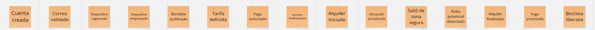


---

### Paso 2 — Agregamos los Comandos

Sobre cada evento colocamos el **comando** (azul) que lo provocó. Los
comandos son intenciones explícitas: *Reservar Bicicleta*, *Desbloquear
Bicicleta*, *Autorizar Pago*. Esta etapa expone qué decisiones toma el
sistema y permite separar lo que el usuario pide de lo que el sistema hace.

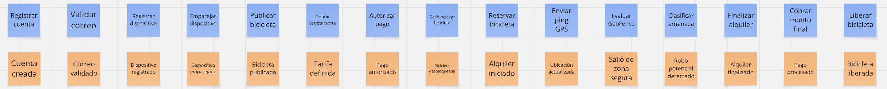


---

### Paso 3 — Agregamos los Actores

Identificamos **quién dispara cada comando**. Aparecen cuatro tipos de
actores en el dominio: el **Estudiante** (alquila), el **Arrendador**
(publica), el **Sistema** (orquestador automatizado) y el **Dispositivo
IoT** (cerradura + GPS). Esto nos permite distinguir qué partes del flujo
son automáticas y cuáles las inicia una persona.

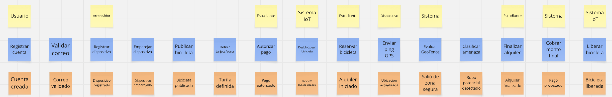


---

### Paso 4 — Agregamos las Políticas

Las **políticas** (púrpura) son reglas reactivas del tipo *"cuando ocurre X
entonces Y"*. Encadenan eventos con nuevos comandos:

- *Si stock < 5 → notificar arrendador.*
- *Al iniciar alquiler → activar tracking.*
- *Si fuera de zona segura → emitir alerta.*
- *Patrón sospechoso → alerta crítica.*
- *Pago OK → liberar bicicleta.*

Hacer las políticas explícitas es lo que convierte un EventStorming en una
verdadera radiografía del dominio.

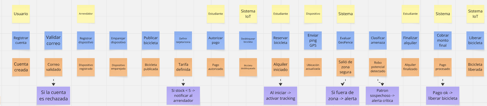


---

### Paso 5 — Agregamos los Read Models

Sumamos las **vistas de lectura** (verde) que los actores consultan
**antes** de disparar comandos:

- **Catálogo de Bicicletas** — el estudiante busca antes de reservar.
- **Mapa en Tiempo Real** — el estudiante encuentra la bici más cercana.
- **Historial de Viajes** — el estudiante revisa sus alquileres pasados.

Distinguir read models del resto evita confundir lectura con escritura, una
fuente común de mal diseño.

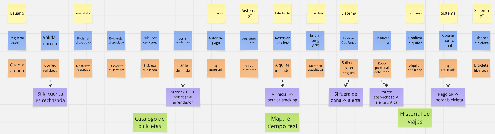


---

### Paso 6 — Agregamos los Sistemas Externos

Los stickies rosa marcan las **dependencias externas** del dominio:

- **Yape / Plin / Visa Niubiz** — pasarelas de pago peruanas.
- **Google Maps / GPS Satélites** — geolocalización.
- **Firebase Cloud Messaging** — notificaciones push.

Documentar estas integraciones desde temprano nos evita acoplar el modelo
de dominio con detalles de infraestructura.

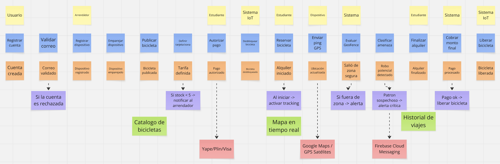


---

### Paso 7 — Agregados y Bounded Contexts

Por último agrupamos los stickies según el **agregado** (lavanda) que los
encapsula y trazamos las fronteras de los **Bounded Contexts** candidatos.
El board final muestra cómo el dominio se divide naturalmente en **7
contextos especializados**:

1. **IAM** — registro y validación de cuentas (Estudiante / Arrendador).
2. **Providing** — publicación de bicicletas, tarifas y zonas operativas.
3. **IoT & Device Control** — comandos al hardware (cerradura, GPS, OTA).
4. **Renting** — orquestador del alquiler end-to-end.
5. **Tracking & Monitoring** — telemetría GPS, geofencing y anti-robo.
6. **Payments** — autorización y procesamiento de pagos.
7. **Notifications** — entrega multicanal (push, email, SMS).


---
## 4.1.1.1 Candidate Context Discovery

En esta sección se describe el proceso seguido por el equipo para descubrir
los *bounded contexts* candidatos de **BiciSmartIOT** a partir del
Design-Level EventStorming. El objetivo fue identificar límites naturales
del dominio de alquiler de bicicletas con IoT integrado, priorizar las
partes con mayor valor estratégico para el negocio y preparar una base
clara para el modelado posterior (Domain Message Flows y Bounded Context
Canvases).

La sesión se realizó en Miro con una duración aproximada de **1 hora 50
minutos** (dentro del límite recomendado de 2 horas). Como insumos se
utilizaron la línea de tiempo de eventos pivotales, los comandos asociados,
los actores identificados y los puntos de dolor detectados en la sesión de
EventStorming anterior.

### Técnica aplicada: Start-with-Value (complementada con Look-for-Pivotal-Events)

Se priorizó **Start-with-Value** para ubicar primero los flujos que
diferencian a BiciSmartIOT en el mercado peruano: alquiler self-service
por minuto, protección anti-robo en tiempo real basada en GPS y
geofencing, y un marketplace que conecta a estudiantes con
arrendadores independientes. De forma complementaria, se revisaron
**eventos pivote** para detectar cambios de estado entre subdominios (por
ejemplo: pago autorizado, desbloqueo de bicicleta, salida de zona segura,
robo potencial detectado, devolución).

El proceso se organizó en tres pasos documentados:

1. **Identificación de valor estratégico:** cada miembro del equipo
   respondió a la pregunta: *"¿Qué parte del sistema genera directamente
   valor para los usuarios y diferencia la solución de otras similares?"*.

   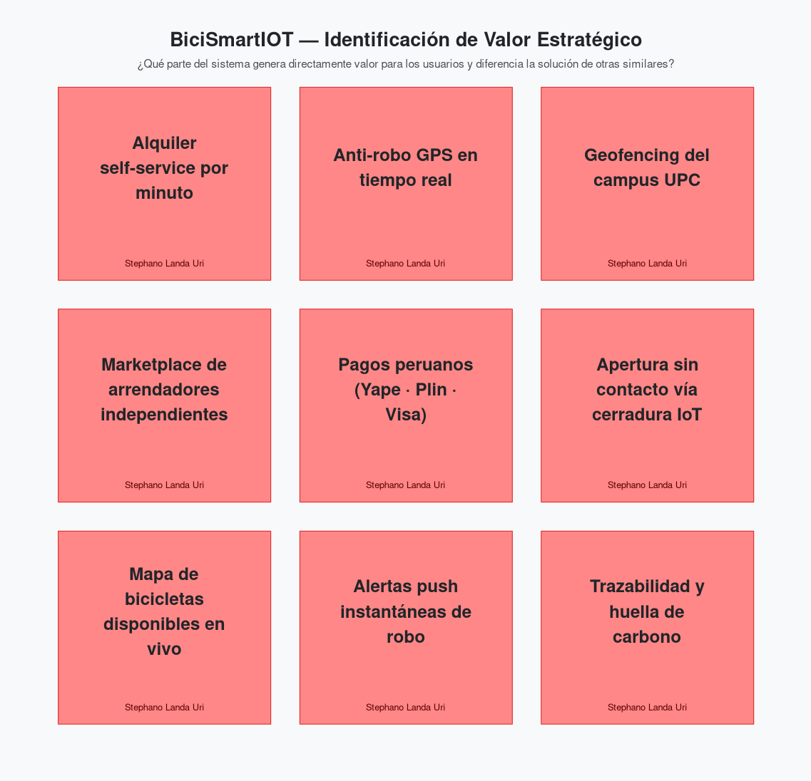

2. **Agrupación de eventos en torno al valor:** luego se agruparon los
   eventos por afinidad de negocio y cohesión funcional, emergiendo
   clústeres naturales alrededor de identidad y acceso, publicación de
   bicicletas, control de dispositivos IoT, alquiler, tracking
   anti-robo, pagos y notificaciones.

   

3. **Clasificación Core, Supporting y Generic:** con los clústeres ya
   estabilizados, se clasificaron los *candidate contexts* según su aporte
   de diferenciación al negocio y su rol dentro del ecosistema. En esta
   fase se distinguieron los contextos núcleo que sostienen la propuesta
   de valor de BiciSmartIOT (alquiler self-service + anti-robo IoT), los
   contextos de soporte operacional y los contextos genéricos de
   plataforma.

   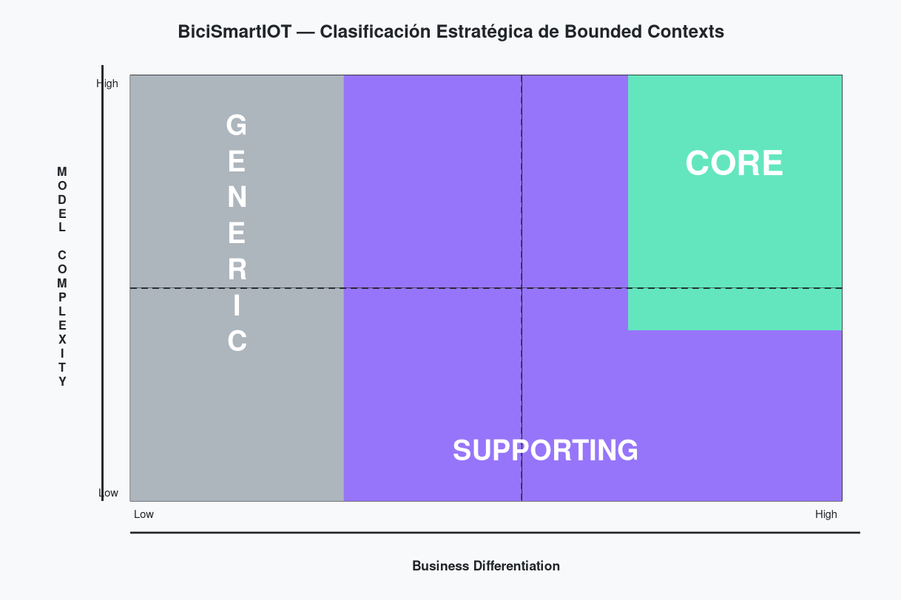

Con esta tercera iteración, el equipo dejó una base consistente para pasar
al detalle de *candidate contexts* y su justificación estratégica en la
siguiente subsección.

### Candidate Contexts identificados

Como resultado de la sesión, se identificaron **siete bounded contexts
candidatos** para BiciSmartIOT:

| Candidate Context | Eventos clave asociados | Clasificación | Descripción | Justificación |
|---|---|---|---|---|
| **IAM** | `User Created`, `Email Verified`, `Renter Approved`, `Session Started` | Generic | Gestión de identidad, autenticación y acceso por rol (Estudiante / Arrendador). | Es transversal y necesario para operar, pero no representa diferenciación de negocio en el mercado de alquiler. |
| **Providing** | `Bicycle Published`, `Fare Defined`, `Operating Zone Set`, `Bicycle Paused` | Supporting | Publicación y mantenimiento del catálogo de bicicletas por parte de los arrendadores. | Habilita la oferta del marketplace, pero la lógica es estándar de e-commerce y no constituye el núcleo diferenciador. |
| **IoT & Device Control** | `Device Registered`, `Device Paired`, `Bicycle Unlocked`, `Bicycle Released`, `Bicycle Locked`, `Device Low Battery` | Core | Comandos al hardware (cerradura + GPS) y emparejamiento con la bicicleta vía MQTT/BLE. | Es indispensable para el modelo *self-service* y la calidad de captura de telemetría que sustenta toda la operación. |
| **Renting** | `Bicycle Reserved`, `Rental Started`, `Rental Finished`, `Reservation Expired` | Core | Orquestación del ciclo de vida del alquiler end-to-end. | Contiene la propuesta de valor principal de BiciSmartIOT: alquilar una bicicleta en segundos sin intervención humana. |
| **Tracking & Monitoring** | `Location Updated`, `Left Safe Zone`, `Suspicious Movement Detected`, `Theft Potential Detected` | Core | Procesamiento de telemetría GPS, geofencing y detección de patrones anómalos. | Es lo que diferencia a BiciSmartIOT del resto: protección anti-robo en tiempo real basada en datos. |
| **Payments** | `Payment Authorized`, `Payment Processed`, `Payment Failed`, `Refund Issued` | Supporting | Cobros y conexión con pasarelas peruanas (Yape, Plin, Visa Niubiz). | Es clave para monetización y activación del servicio, aunque no constituye el núcleo diferencial de la plataforma. |
| **Notifications** | `Notification Sent`, `Notification Confirmed`, `False Alarm Marked`, `Delivery Failed` | Generic | Mensajería multicanal: push, email y SMS para alertas e información al usuario. | Capacidad genérica de plataforma resuelta con servicios estándar (FCM, Twilio); no aporta diferenciación al negocio. |

### Clasificación estratégica

Como parte del análisis Start-with-Value, se representó gráficamente la
clasificación de los *bounded contexts* en una matriz de dos ejes:

- **Business Differentiation** (eje X): grado en que el contexto aporta
  valor estratégico o diferenciación frente a otras soluciones del
  mercado.
- **Model Complexity** (eje Y): nivel de complejidad requerido para
  implementar y mantener el contexto.

En esta matriz de clasificación de *bounded contexts*, se distribuyeron
los siete contextos en los tres tipos:

- **Core:** `Renting`, `IoT & Device Control`, `Tracking & Monitoring`.
- **Supporting:** `Providing`, `Payments`.
- **Generic:** `IAM`, `Notifications`.

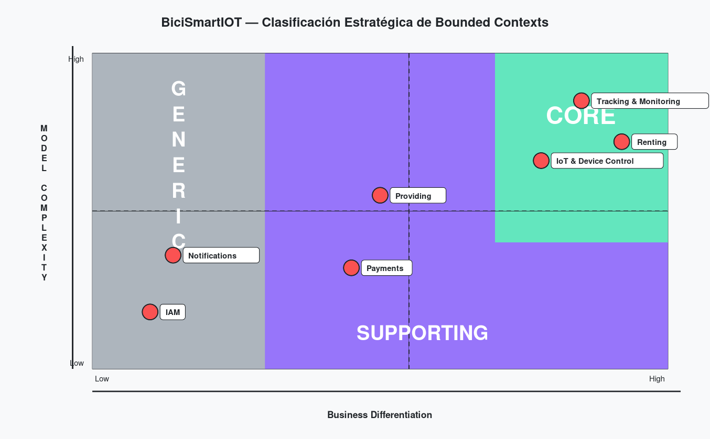

### Resultados

Se definieron **siete bounded contexts candidatos**, de los cuales:

- **3 Core** (`Renting`, `IoT & Device Control`, `Tracking & Monitoring`).
- **2 Supporting** (`Providing`, `Payments`).
- **2 Generic** (`IAM`, `Notifications`).

La aplicación de la técnica Start-with-Value permitió asegurar que la
atención principal del diseño táctico se concentre en `Renting`,
`IoT & Device Control` y `Tracking & Monitoring`, dado que allí reside la
propuesta de valor diferenciadora de BiciSmartIOT: alquiler self-service
de bicicletas con protección anti-robo en tiempo real.

El resto de *contexts* se modelan en las siguientes secciones mediante
**Domain Message Flows** y **Bounded Context Canvases**, garantizando
consistencia y claridad en la arquitectura estratégica.

## 4.1.1.2 Domain Message Flows Modeling

El **Domain Storytelling** es una técnica visual y colaborativa que facilita
la exploración del conocimiento dentro del dominio del negocio, cuyo
propósito principal es generar una comprensión común sobre lo que se
desarrolla en un proceso específico, involucrando tanto a los expertos del
negocio como a los equipos técnicos.

En este sentido, elaboramos los *domain storytelling* tomando como
referencia las interacciones entre los *bounded contexts* identificados en
**BiciSmartIOT**, con el fin de analizar y comprender de manera más clara
la lógica del negocio: alquiler self-service de bicicletas, integración con
hardware IoT y protección anti-robo en tiempo real.

> **Notación utilizada en todos los escenarios.**
> - **Persona** → actor (Estudiante, Arrendador, Administrador).
> - **Nube morada** → Bounded Context (Renting, Payments, IoT & Device
>   Control, Tracking, Notifications, IAM, Providing).
> - **Engranaje** → System (aplicación móvil, web, dispositivo físico,
>   pasarela externa).
> - **Flecha punteada numerada** → mensaje en orden cronológico (de emisor
>   a receptor).
> - **Sticky azul** → Command · **Naranja** → Event · **Verde** → Query.
> - **Caja amarilla** → contenido del mensaje (campos relevantes).

---

### Escenario 1: Arrendador se registra y publica su primera bicicleta

**Objetivo:** un dueño de flota se registra en la plataforma, valida su RUC,
publica una bicicleta y la enlaza con un dispositivo IoT para activar la
oferta en el marketplace.

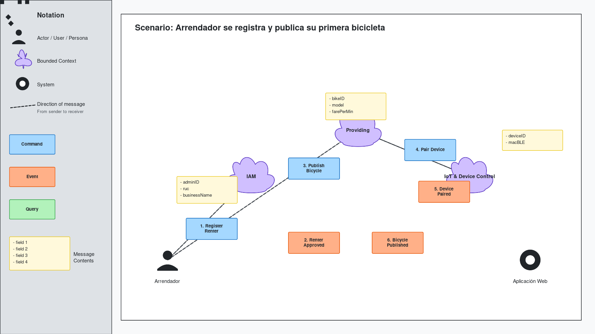

---

### Escenario 2: Estudiante se registra con correo  y recibe la bienvenida

**Objetivo:** un estudiante crea su cuenta usando su correo institucional, el sistema valida el dominio y se le envía una notificación de
bienvenida vía Firebase Cloud Messaging.

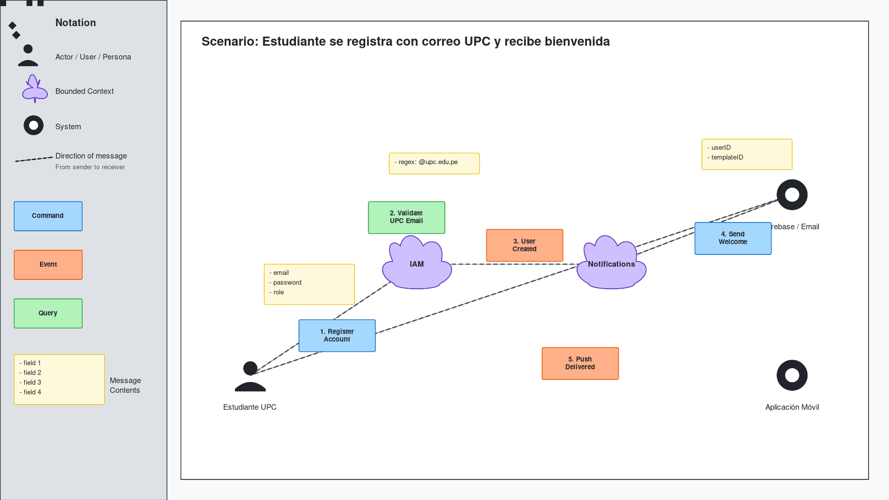

---

### Escenario 3: Estudiante alquila una bicicleta end-to-end

**Objetivo:** el estudiante busca una bicicleta cercana, la reserva,
autoriza el pago en Yape/Plin/Visa Niubiz y el sistema desbloquea
automáticamente la cerradura IoT para iniciar el alquiler.

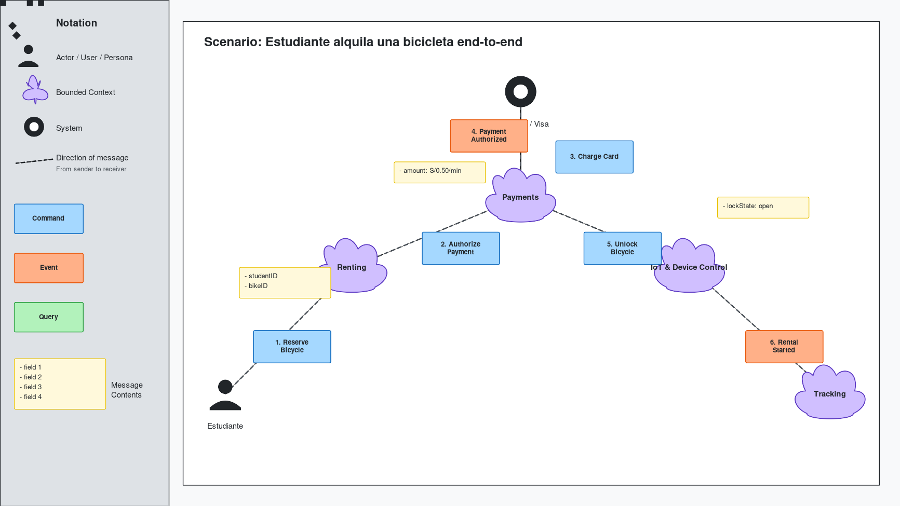

---

### Escenario 4: Verificación de estado del dispositivo IoT antes del alquiler

**Objetivo:** antes de confirmar la reserva, el sistema asegura que el
dispositivo IoT acoplado a la bicicleta tiene batería suficiente y conexión
estable, garantizando la captura de datos en tiempo real durante el viaje.

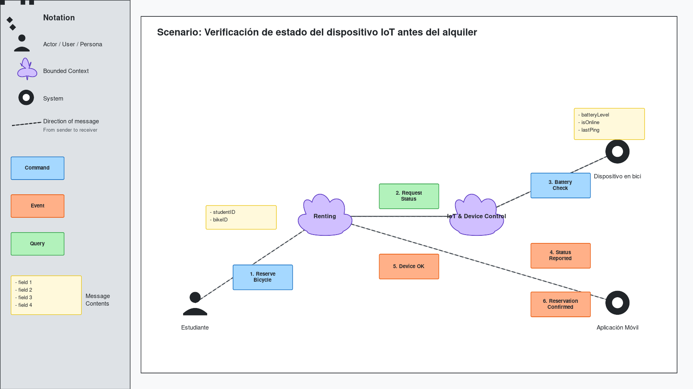

---

### Escenario 5: Detección de robo en tiempo real y alerta crítica

**Objetivo:** el sistema procesa los pings GPS, detecta que la bicicleta
salió de la zona segura con un patrón sospechoso, dispara una alerta crítica
al arrendador y, tras la confirmación, bloquea remotamente la cerradura.

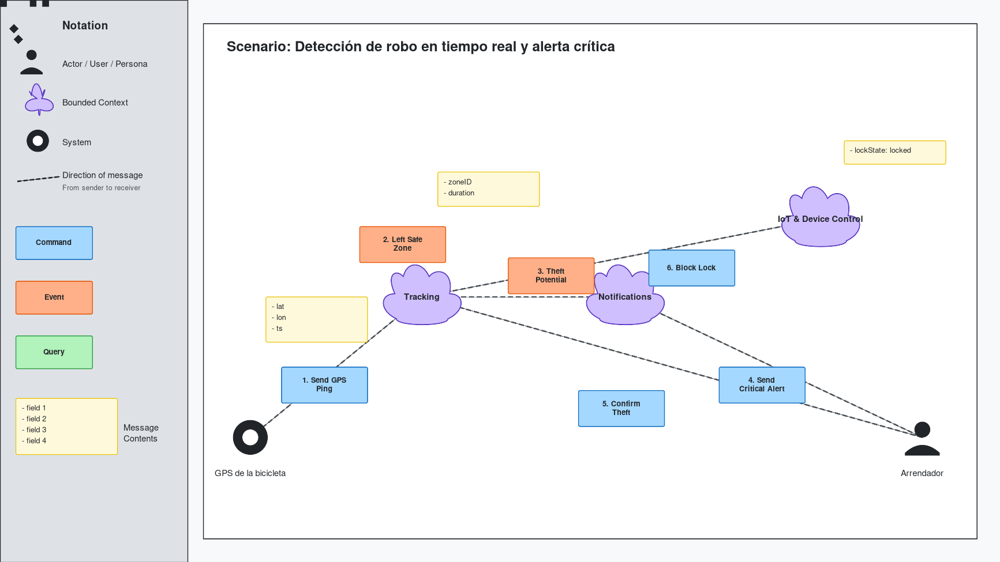

---

### Escenario 6: Finalización del alquiler, cobro final y devolución

**Objetivo:** el estudiante finaliza el alquiler, el dispositivo IoT bloquea
la bicicleta, *Payments* calcula el monto final, *Notifications* envía el
recibo y la plataforma libera la bicicleta para el siguiente alquiler.

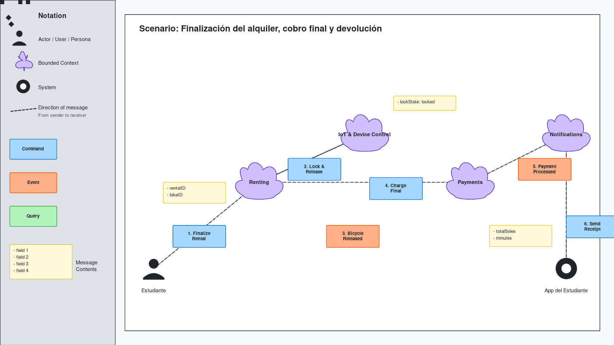

---

> **Cierre.** Estos seis escenarios cubren los flujos críticos del dominio
> de BiciSmartIOT y ejercitan la totalidad de los siete *bounded contexts*
> identificados en la sección 4.1.1.1. La consistencia en la notación
> permite que esta sección sirva como insumo directo para los **Bounded
> Context Canvases** de la sección siguiente, donde cada contexto se
> documenta en detalle.

## 4.1.1.3 Bounded Context Canvases

En esta sección el equipo presenta sus *Bounded Context Canvases*,
empezando por los importantes. Cada canvas sigue el **template oficial V1
de DDD-Crew (Annegret Junker, codecentric AG)** y resume — en una sola
página — el propósito, la clasificación estratégica, los roles, los
mensajes que entran y salen, el lenguaje ubicuo, las decisiones de negocio,
los supuestos, las métricas de verificación y las preguntas abiertas de
cada *bounded context*.

---

### IAM

Contexto **genérico** para la identificación y acceso de los usuarios
(estudiantes y arrendadores).

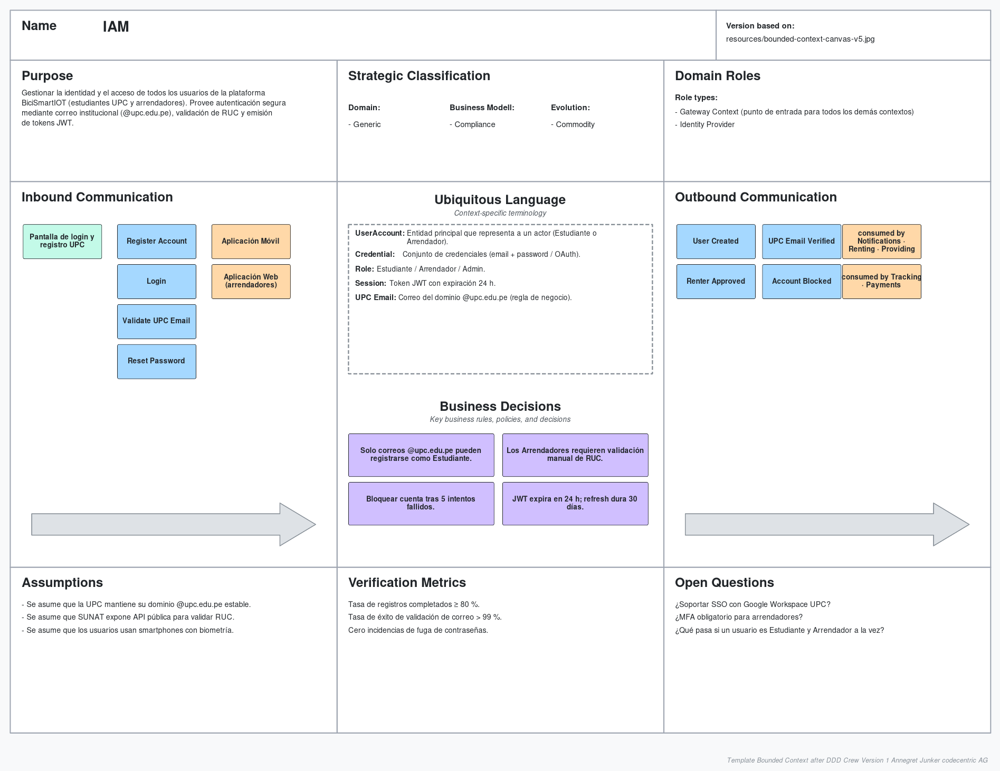

---

### Providing

Contexto **supporting** que administra el catálogo de bicicletas, las
tarifas y las zonas operativas definidas por los arrendadores.

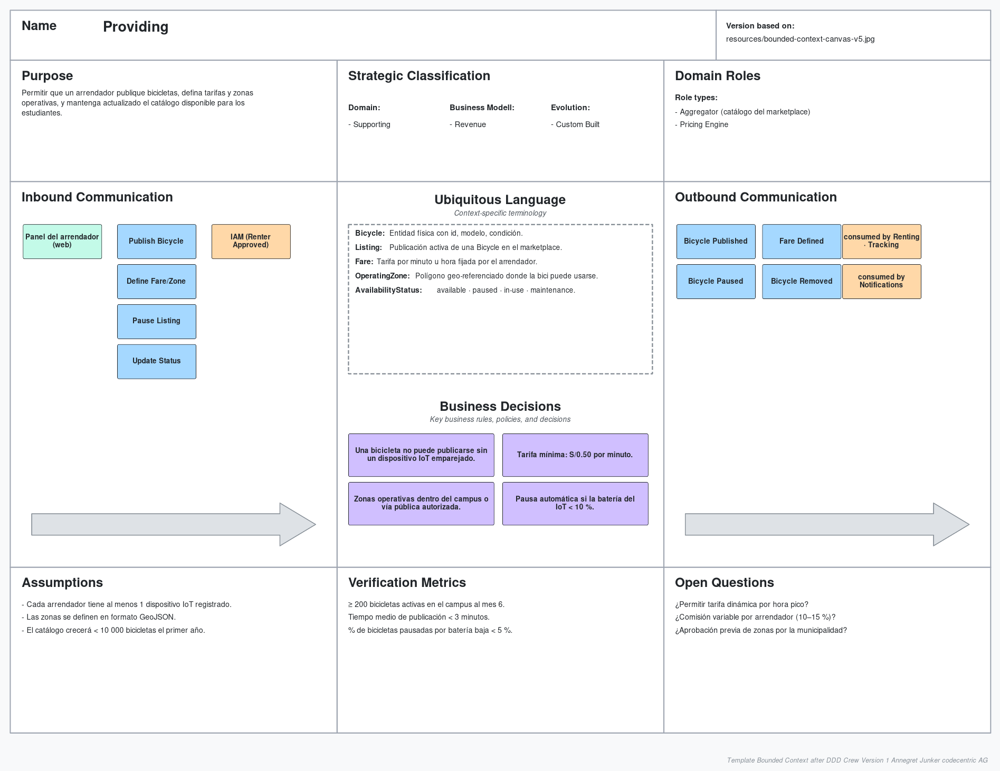

---

### IoT & Device Control

Contexto **core** que registra y opera los dispositivos IoT (cerradura +
GPS) acoplados a cada bicicleta vía MQTT/BLE.

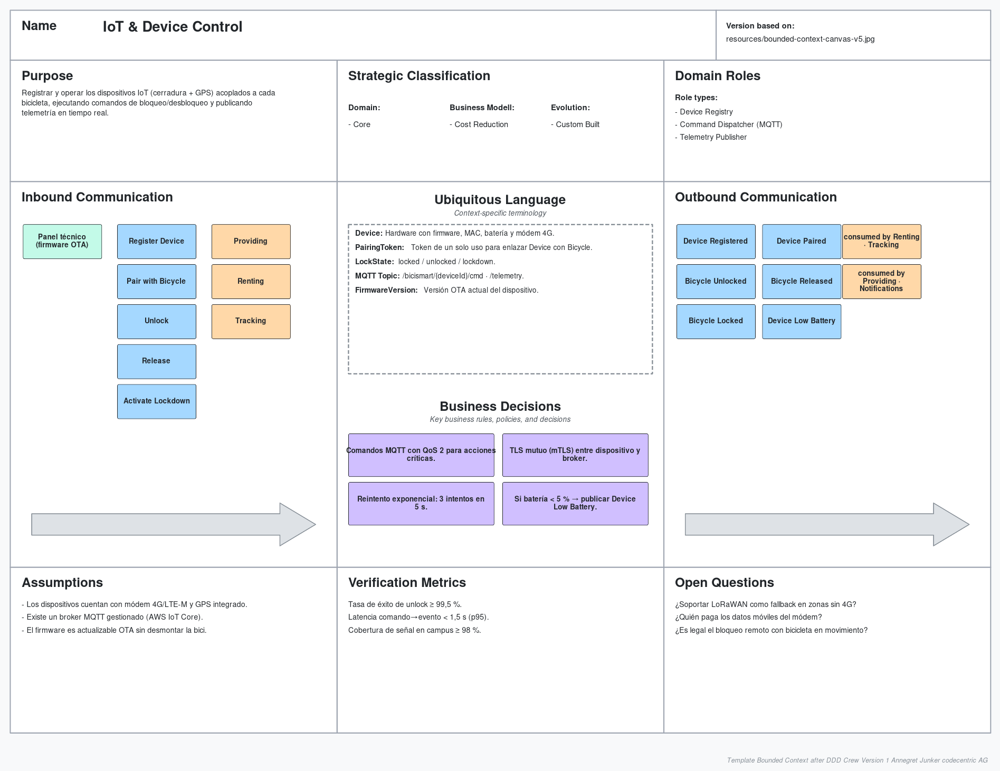

---

### Renting

Contexto **core** que orquesta el ciclo de vida del alquiler — buscar,
reservar, iniciar, monitorear y finalizar — y constituye el flujo
principal de valor de la plataforma.


---

### Tracking & Monitoring

Contexto **core** que procesa la telemetría GPS, evalúa geofences y
detecta patrones de movimiento sospechoso para disparar alertas anti-robo.

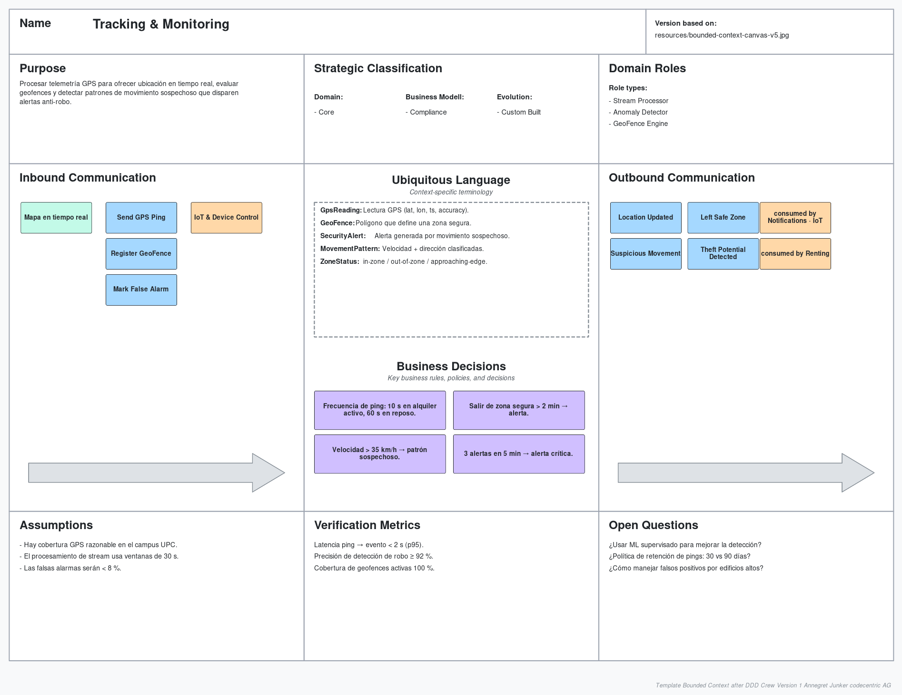

---

### Payments

Contexto **supporting** que calcula cobros, autoriza pagos y procesa
reembolsos integrándose con pasarelas peruanas (Yape, Plin, Visa Niubiz).

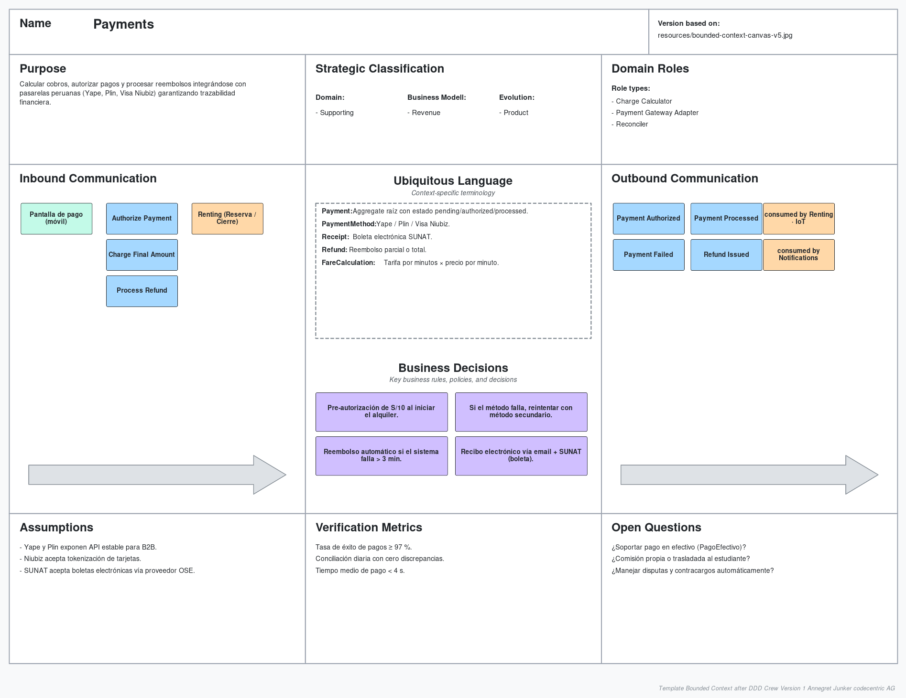

---

### Notifications

Contexto **genérico** que entrega mensajes oportunos al estudiante y al
arrendador a través de push, SMS y email, gestionando confirmaciones y
falsas alarmas.

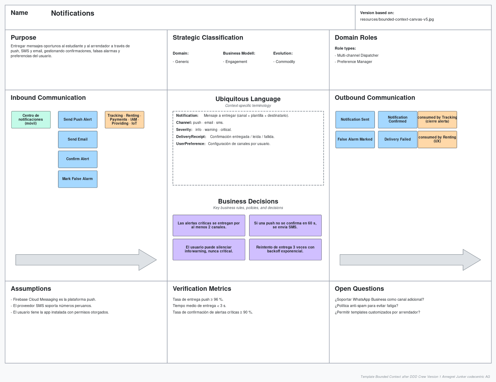

## 4.1.2. Context Mapping

En esta sección desarrollamos un conjunto de context maps para visualizar las relaciones entre los bounded contexts del sistema **BiciSmartIOT**. A partir de la información recolectada (user stories, funcionalidades IoT, pagos, reservas, etc.), exploramos distintas alternativas de diseño, evaluando cómo cambiaría la arquitectura al dividir, agrupar o reorganizar capacidades del sistema.

Durante el análisis se consideraron preguntas clave como:

- ¿Qué sucede si movemos funcionalidades IoT a otro contexto?
- ¿Qué pasa si unimos pagos con reservas?
- ¿Cómo evitar dependencias fuertes entre módulos?
- ¿Qué pasa si duplicamos modelos o usamos un shared service?

Finalmente, evaluamos cada alternativa usando patrones de Domain-Driven Design como:

- Customer/Supplier
- Conformist
- Shared Kernel
- Anti-Corruption Layer (ACL)

Con el objetivo de definir la mejor arquitectura del dominio.

---

###  Opción 1

En esta estructura se mantienen los bounded contexts completamente separados, cada uno enfocado en una funcionalidad específica del sistema.

#### Bounded Contexts
- Authentication & User Management
- Bicycle Management
- Booking & Reservation
- Payments & Billing
- IoT Monitoring

#### Relaciones
- User Management → Booking *(Customer/Supplier)*
- Bicycle Management → Booking *(Customer/Supplier)*
- Booking → Payments *(Customer/Supplier)*
- IoT Monitoring → Bicycle Management *(ACL)*

#### Ventajas
- Alta separación de responsabilidades  
- Escalabilidad independiente  
- Bajo acoplamiento  

#### Desventajas
- Mayor complejidad de integración  
- Sincronización entre contextos más difícil  
- Mayor overhead en comunicación  

---
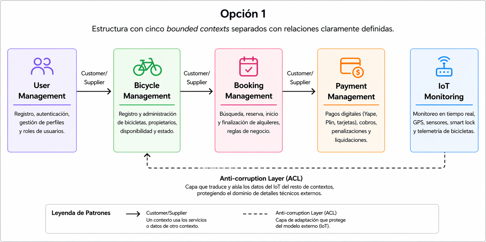

### Opción 2

Esta alternativa propone unir los contextos de Bicycle Management + IoT Monitoring en un solo bounded context.

#### Nuevo Contexto
**Smart Bicycle Management (Bici + IoT)**

#### Relaciones
- User Management → Booking *(Customer/Supplier)*
- Smart Bicycle Management → Booking *(Customer/Supplier)*
- Booking → Payments *(Customer/Supplier)*

#### Ventajas
- Simplificación de arquitectura  
- Comunicación directa entre sensores IoT y bicicletas  
- Menor latencia en monitoreo  

#### Desventajas
- Mezcla de responsabilidades (hardware + lógica de negocio)  
- Mayor complejidad interna  
- Riesgo de crear un “mega contexto” difícil de mantener  

---
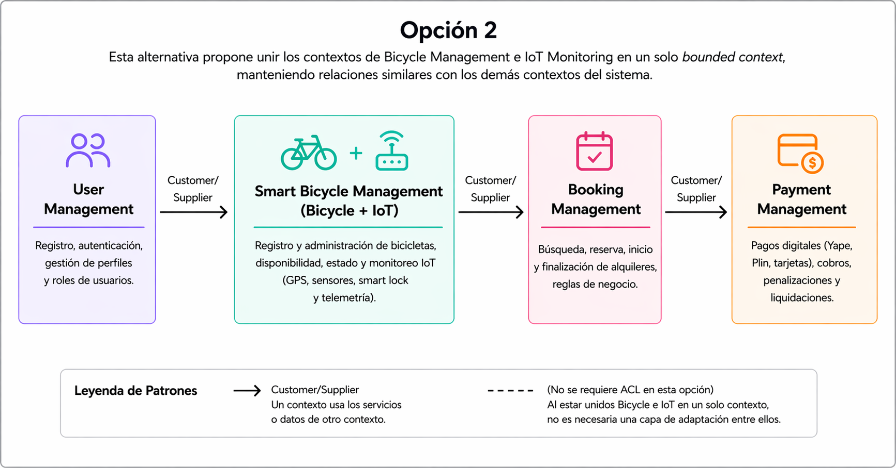

###  Opción 3 

Esta alternativa propone una arquitectura equilibrada con bounded contexts bien definidos y relaciones claras, separando correctamente responsabilidades críticas del sistema.

#### Bounded Contexts definidos

- **User Management**  
  Registro, login, perfil  

- **Bicycle Management**  
  Registro de bicicletas, disponibilidad  

- **Booking Management**  
  Reservas, inicio y fin de alquiler  

- **Payment Management**  
  Pagos digitales (Yape, Plin, tarjeta)  

- **IoT Monitoring**  
  Sensores, GPS, smart lock  

---
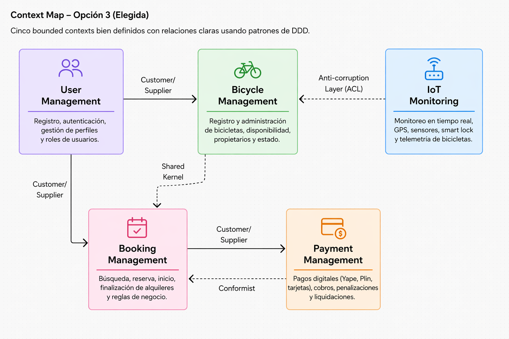

#### Relaciones entre contextos

 **1. User → Booking**  
 *Customer/Supplier*  
User provee información de usuarios y Booking la consume.

 **2. Bicycle → Booking**  
 *Shared Kernel*  
Comparten el modelo de bicicleta y disponibilidad, evitando inconsistencias.

 **3. Booking → Payment**  
 *Customer/Supplier*  
Booking envía información de alquiler para que Payment procese el cobro.

 **4. Booking → Bicycle**  
 *Conformist*  
Booking usa el modelo de Bicycle sin modificarlo.

 **5. IoT Monitoring → Bicycle**  
 *Anti-Corruption Layer (ACL)*  
Se usa una capa intermedia para traducir datos IoT (sensores, GPS) a un formato entendible por el sistema.

 Esto evita que la lógica de negocio dependa directamente del hardware.

---

#### Ventajas
- Separación clara de responsabilidades  
- Escalabilidad por módulos  
- Protección del dominio ante IoT (ACL)  
- Arquitectura mantenible y flexible  

#### Desventajas
- Requiere diseño inicial más cuidadoso  
- Más contratos entre contextos  

---

###  Elección

Elegimos la **Opción 3**, ya que proporciona el mejor equilibrio entre:

- Separación de responsabilidades  
- Escalabilidad del sistema  
- Facilidad de mantenimiento  
- Integración con IoT sin acoplar el dominio  

Al utilizar patrones como **Shared Kernel** y **Anti-Corruption Layer**, se logra una arquitectura robusta donde el sistema puede evolucionar sin afectar otros módulos.

Esto permite que **BiciSmartIOT** sea:

- Escalable  
- Seguro  
- Modular  
- Preparado para crecimiento futuro  

---

## 4.1.3. Software Architecture

### 4.1.3.1. Software Architecture System Landscape Diagram

Este diagrama muestra que BiciSmartIOT opera dentro de un ecosistema compuesto por tres tipos principales de usuarios: estudiantes, arrendadores y administradores. Los estudiantes interactúan con la aplicación para buscar bicicletas cercanas, realizar reservas, iniciar y finalizar alquileres, consultar rutas y realizar pagos digitales. Los arrendadores registran y administran sus bicicletas inteligentes, revisan disponibilidad, historial de alquileres y liquidaciones. Por otro lado, los administradores supervisan usuarios, bicicletas registradas, métricas del sistema y monitoreo IoT.

El sistema principal BiciSmartIOT App se conecta con servicios externos como Google Maps API para geolocalización y rutas, una pasarela de pagos para procesar Yape, Plin o tarjetas, y dispositivos IoT instalados en las bicicletas para obtener ubicación GPS, estado del smart lock, sensores de movimiento y telemetría en tiempo real.

<p align="center">
  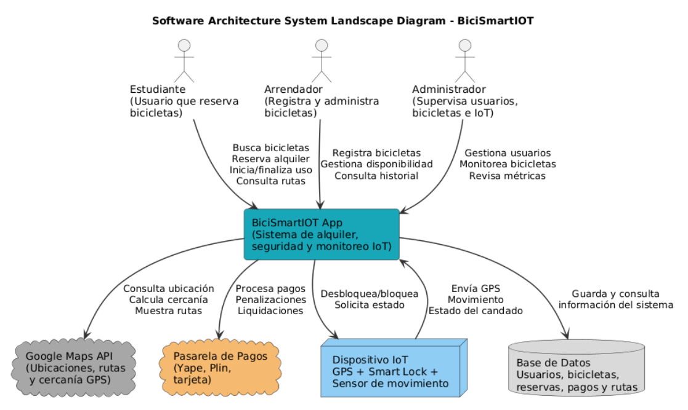
</p>

### 4.1.3.2. Software Architecture Context Level Diagram

Este diagrama muestra que el sistema BiciSmartIOT, representado como una única entidad, interactúa con tres tipos principales de usuarios: estudiantes, que utilizan la aplicación para buscar bicicletas cercanas, reservar, desbloquear y finalizar alquileres; arrendadores, que registran y administran sus bicicletas inteligentes; y administradores, que gestionan usuarios, bicicletas registradas y el monitoreo general del sistema. 

Además, BiciSmartIOT se comunica con sistemas externos como Google Maps API para mostrar ubicaciones y rutas, una pasarela de pagos para procesar pagos digitales mediante Yape, Plin o tarjeta, y dispositivos IoT instalados en las bicicletas para enviar datos en tiempo real como ubicación GPS, estado del candado inteligente y movimiento.

<p align="center">
  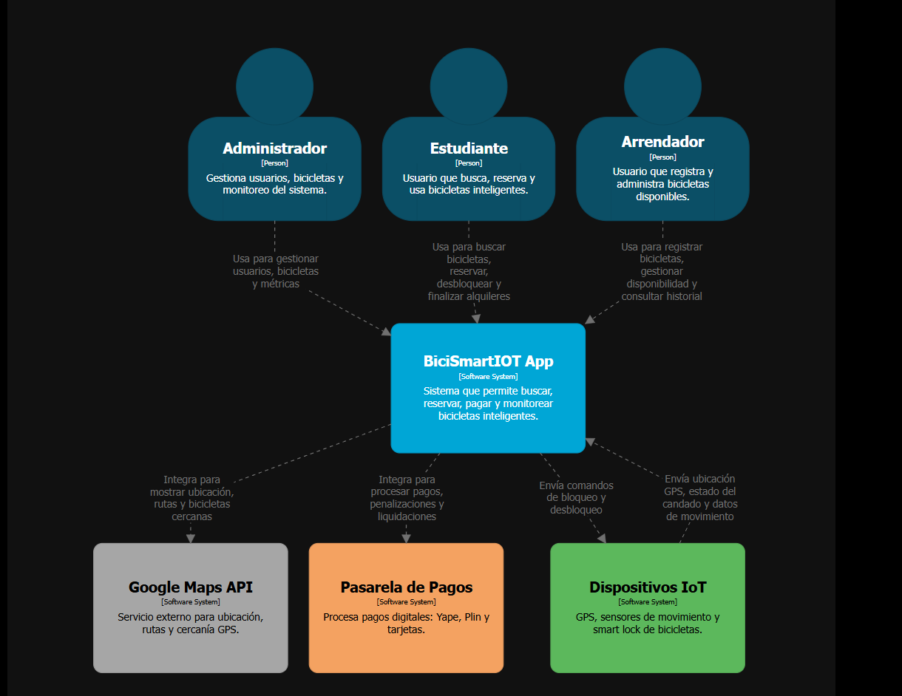
</p>

### 4.1.3.3. Software Architecture Container Level Diagram

Este diagrama muestra que el sistema BiciSmartIOT está compuesto por varios contenedores principales: una aplicación móvil utilizada por estudiantes y arrendadores, una aplicación web administrativa para la gestión del sistema, una API en la nube que centraliza la lógica de negocio, una base de datos que almacena usuarios, bicicletas, reservas, pagos y rutas, y un módulo IoT encargado de procesar la información proveniente de los dispositivos instalados en las bicicletas.

Además, la API se conecta con servicios externos como Google Maps API para mostrar ubicaciones, rutas y bicicletas cercanas, así como con una pasarela de pagos para procesar cobros digitales mediante Yape, Plin o tarjetas. Por otro lado, los dispositivos IoT se comunican mediante un broker MQTT para enviar datos de GPS, sensores de movimiento y estado del smart lock en tiempo real.

<p align="center">
  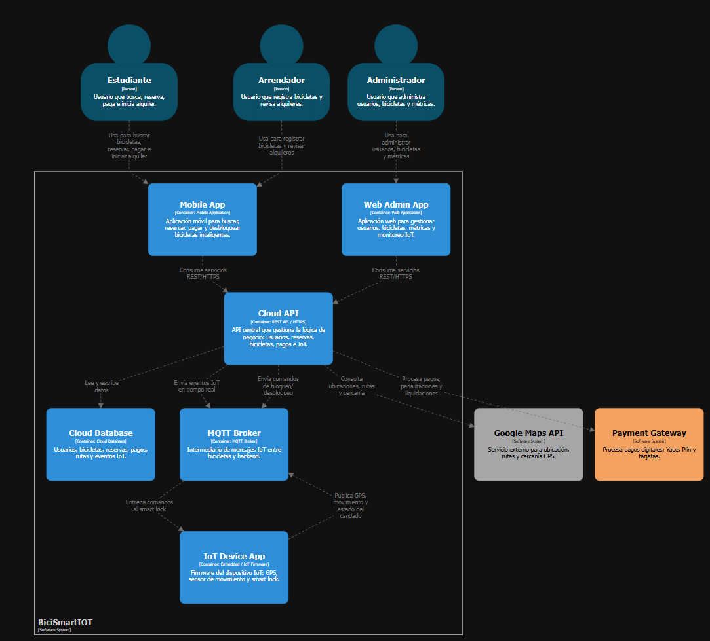
</p>

### 4.1.3.4. Software Architecture Deployment Diagram

Este diagrama muestra que el sistema BiciSmartIOT se despliega en tres entornos principales: Microsoft Azure Cloud, dispositivos cliente y bicicletas físicas con dispositivos IoT. En Azure, el sistema utiliza App Service para alojar la API principal desarrollada en Spring Boot/Java, una base de datos en Azure Database for MySQL para almacenar usuarios, bicicletas, reservas, pagos, rutas y eventos IoT, además de un servicio de documentación Swagger para probar los endpoints de la API.

Los usuarios acceden al sistema mediante una aplicación móvil Android, mientras que los administradores pueden acceder desde una aplicación web administrativa. Las bicicletas cuentan con dispositivos IoT integrados con GPS, sensores de movimiento y smart lock, los cuales envían datos en tiempo real mediante un broker MQTT o Azure IoT Hub. Todas las comunicaciones entre componentes utilizan protocolos seguros como HTTPS y MQTT/TLS.

<p align="center">
  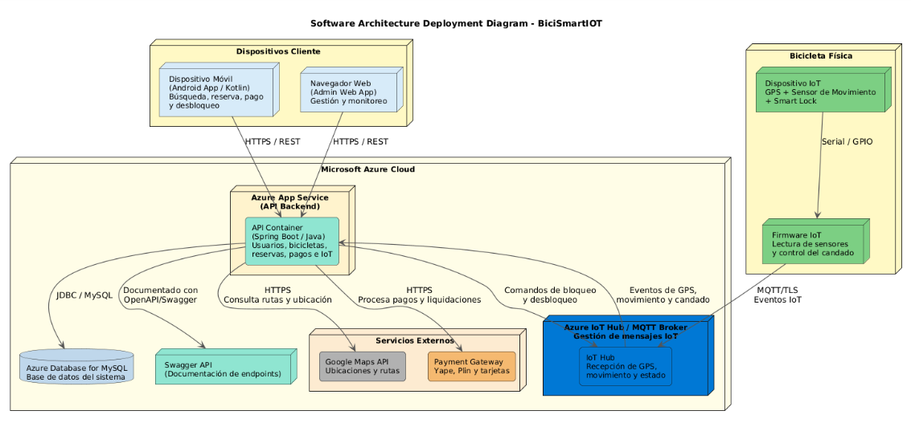
</p>

<div id='4.2.'><h3>4.2. Tactical-Level Domain-Driven Design</h3></div>
<div id='4.2.1.'><h4>4.2.1. Bounded Context: Notifications-Encargado de alertas e información al usuario</h4></div>
<div id='4.2.1.1.'><h5>4.2.1.1. Domain Layer</h5></div>

| Tipo | Nombre | Descripción | Responsabilidad Principal | Relación con otros elementos |
|------|--------|-------------|--------------------------|------------------------------|
| Aggregate | `Notification` | Clase que representa una alerta generada hacia un usuario del sistema. | Ser el punto de entrada para crear, enviar y mantener la integridad del ciclo de vida de una notificación. | Relacionado con `UserNotificationProfile`, `AlertRule` y los demás bounded contexts que producen eventos IoT. |
| Aggregate | `UserNotificationProfile` | Clase que agrupa las preferencias y el historial de notificaciones de un usuario específico. | Gestionar y mantener la coherencia de las configuraciones de alerta y el registro de notificaciones de cada usuario. | Relacionado con `Notification` y `NotificationPreference`. |
| Entity | `NotificationPreference` | Entidad que almacena la configuración de alertas de un usuario (canales habilitados, horario silencioso, tipos activos). | Representar y validar las preferencias del usuario sobre cómo y cuándo recibir notificaciones. | Usada en `UserNotificationProfile` y por `NotificationDispatchService`. |
| Entity | `AlertRule` | Entidad que define bajo qué condición IoT se debe disparar una notificación (ej: movimiento superior a umbral). | Encapsular la lógica de evaluación de eventos IoT para determinar si se genera una alerta. | Usada por `AlertEvaluationService`; se activa a partir de eventos de los bounded contexts de IoT y Tracking. |
| Command | `SendNotificationCommand` | Comando para enviar una notificación a un usuario. | Representar la intención de despachar una alerta por el canal correspondiente. | Usado en `SendNotificationCommandHandler` dentro de la capa de aplicación. |
| Command | `MarkNotificationAsReadCommand` | Comando para marcar una notificación como leída. | Representar la intención del usuario de confirmar que vio la alerta. | Usado en `MarkNotificationAsReadCommandHandler` dentro de la capa de aplicación. |
| Command | `UpdateNotificationPreferencesCommand` | Comando para actualizar las preferencias de notificación de un usuario. | Representar la intención de modificar los canales, horarios y tipos de alerta habilitados. | Usado en `UpdateNotificationPreferencesCommandHandler` dentro de la capa de aplicación. |
| Command | `TriggerAlertCommand` | Comando que se genera al recibir un evento IoT y desencadena la evaluación y creación de una alerta. | Representar la intención de procesar un evento externo y convertirlo en una notificación si corresponde. | Consume eventos de los bounded contexts de IoT Device Management y Tracking & Security. |
| Value Object | `NotificationId` | Identificador único inmutable de una notificación. | Garantizar la unicidad de cada notificación dentro del sistema. | Usado en el aggregate `Notification`. |
| Value Object | `NotificationType` | Enum que define los tipos de alerta posibles: `THEFT_ALERT`, `GEOFENCE_BREACH`, `SOS_SIGNAL`, `LOW_BATTERY`, `INFO`. | Clasificar la naturaleza de la notificación para determinar su urgencia y canal de envío. | Usado en `Notification`, `AlertRule` y `NotificationDispatchService`. |
| Value Object | `NotificationChannel` | Enum que representa el canal de envío: `PUSH`, `SMS`, `IN_APP`, `EMAIL`. | Determinar el medio de comunicación por el que se entrega la alerta al usuario. | Usado en `Notification` y `NotificationPreference`. |
| Value Object | `NotificationStatus` | Enum del estado del ciclo de vida de una notificación: `PENDING`, `SENT`, `DELIVERED`, `READ`, `FAILED`. | Representar el estado actual de una notificación para controlar reintentos y confirmaciones. | Usado en `Notification`. |
| Value Object | `AlertSeverity` | Enum del nivel de urgencia de una alerta: `CRITICAL`, `HIGH`, `MEDIUM`, `LOW`. | Priorizar el canal de envío y la urgencia de la notificación según la severidad del evento IoT. | Usado en `AlertRule`, `Notification` y `NotificationDispatchService`. |
| Value Object | `RecipientInfo` | Objeto que agrupa los datos del destinatario: userId, deviceToken y phoneNumber. | Encapsular de forma inmutable los datos necesarios para identificar y contactar al usuario receptor. | Usado en `Notification` y por los adaptadores de infraestructura (FCM, Twilio). |
| Domain Event | `AlertTriggered` | Evento publicado cuando una `AlertRule` es activada por un evento IoT externo. | Notificar al sistema que se debe iniciar el proceso de envío de una alerta. | Consumido por `AlertProcessingService` en la capa de aplicación. |
| Domain Event | `NotificationSent` | Evento publicado cuando una notificación es enviada exitosamente al canal seleccionado. | Registrar el éxito del envío para auditoría y confirmación del flujo. | Puede ser consumido por otros bounded contexts para trazabilidad. |
| Domain Event | `NotificationFailed` | Evento publicado cuando el envío falla tras los reintentos configurados. | Registrar el fallo para activar lógica de reintento o escalación. | Consumido por la infraestructura de reintentos y logging. |
| Domain Event | `UserAlertAcknowledged` | Evento publicado cuando el usuario confirma haber visto la alerta desde la app. | Cerrar el ciclo de vida de la notificación y actualizar su estado a `READ`. | Consumido por `MarkNotificationAsReadCommandHandler`. |
| Domain Service | `AlertEvaluationService` | Servicio que evalúa los eventos IoT entrantes contra las `AlertRule` definidas. | Determinar si un evento IoT debe generar una notificación y de qué tipo y severidad. | Usa `AlertRule`; es invocado por `TriggerAlertCommandHandler`. |
| Domain Service | `NotificationDispatchService` | Servicio que selecciona el canal de envío óptimo y construye el mensaje de la notificación. | Decidir el canal correcto según la `AlertSeverity` y las `NotificationPreference` del usuario. | Usa `NotificationPreference`, `AlertSeverity` y `NotificationChannel`; invocado por `SendNotificationCommandHandler`. |

<div id='4.2.1.2.'><h5>4.2.1.2. Interface Layer</h5></div>

| Tipo | Nombre | Descripción | Responsabilidad Principal | Relación con otros elementos |
|------|--------|-------------|--------------------------|------------------------------|
| Controller | `NotificationController` | Controlador REST que expone los endpoints del historial de notificaciones del usuario. | Recibir y responder las peticiones HTTP del cliente móvil sobre notificaciones. | Delega en `NotificationApplicationService`; expone `GET /api/v1/notifications` y `GET /api/v1/notifications/{id}`. |
| Controller | `NotificationPreferenceController` | Controlador REST que gestiona las preferencias de notificación del usuario. | Permitir al usuario consultar y actualizar sus configuraciones de alerta. | Delega en `NotificationApplicationService`; expone `GET` y `PUT /api/v1/notifications/preferences`. |
| Event Consumer | `IoTMotionEventConsumer` | Suscriptor al evento `MotionDetected` publicado por el bounded context de dispositivos IoT. | Recibir el evento de movimiento sospechoso y despachar el `TriggerAlertCommand`. | Origen: Bounded Context IoT Device Management. Publica hacia la capa de aplicación. |
| Event Consumer | `GeofenceBreachConsumer` | Suscriptor al evento `GeofenceBreach` publicado por el bounded context de Tracking & Security. | Recibir el evento de salida de geocerca y despachar el `TriggerAlertCommand`. | Origen: Bounded Context Tracking & Security. Publica hacia la capa de aplicación. |
| Event Consumer | `SOSSignalConsumer` | Suscriptor al evento `SOSActivated` publicado por el dispositivo IoT ante detección de impacto o caída. | Recibir la señal de emergencia y despachar el `TriggerAlertCommand` con severidad `CRITICAL`. | Origen: Bounded Context IoT Device Management. Publica hacia la capa de aplicación. |
| Event Consumer | `LowBatteryConsumer` | Suscriptor al evento `LowBatteryDetected` publicado por el dispositivo IoT. | Recibir el aviso de batería baja y generar una notificación informativa al usuario. | Origen: Bounded Context IoT Device Management. Publica hacia la capa de aplicación. |
| DTO | `NotificationResponse` | Objeto de transferencia con los datos de una notificación: id, tipo, mensaje, canal, estado y timestamp. | Serializar la información de una notificación para enviarla como respuesta al cliente. | Usado en `NotificationController`. |
| DTO | `NotificationListResponse` | Objeto de transferencia con la lista paginada de notificaciones y su metadata. | Encapsular la respuesta del historial de notificaciones del usuario. | Usado en `NotificationController`. |
| DTO | `NotificationPreferenceRequest` | Payload de entrada para actualizar preferencias: canales habilitados, modo silencioso y tipos de alerta activos. | Transportar los datos de configuración del usuario hacia la capa de aplicación. | Usado en `NotificationPreferenceController`. |

<div id='4.2.1.3.'><h5>4.2.1.3. Application Layer</h5></div>

| Tipo | Nombre | Descripción | Responsabilidad Principal | Relación con otros elementos |
|------|--------|-------------|--------------------------|------------------------------|
| Application Service | `NotificationApplicationService` | Servicio de aplicación que actúa como punto de entrada principal para los casos de uso del bounded context. | Orquestar la ejecución de commands y queries coordinando el dominio con la infraestructura. | Invocado por los controllers de la Interface Layer; delega en los command y query handlers. |
| Application Service | `AlertProcessingService` | Servicio de aplicación que recibe eventos IoT y coordina su evaluación y conversión en notificaciones. | Procesar eventos externos, invocar `AlertEvaluationService` y despachar el `SendNotificationCommand` si aplica. | Invocado por los Event Consumers; usa `AlertEvaluationService` del Domain Layer. |
| Command Handler | `SendNotificationCommandHandler` | Handler que orquesta la creación y envío de una notificación. | Invocar `NotificationDispatchService`, persistir la `Notification` y publicar el evento `NotificationSent`. | Usa `NotificationDispatchService`, `NotificationRepository` y el publicador de eventos. |
| Command Handler | `MarkNotificationAsReadCommandHandler` | Handler que actualiza el estado de una notificación a `READ`. | Recuperar la notificación, actualizarla y persistir el cambio, publicando `UserAlertAcknowledged`. | Usa `NotificationRepository` y el publicador de eventos. |
| Command Handler | `UpdateNotificationPreferencesCommandHandler` | Handler que persiste las nuevas preferencias de notificación del usuario. | Recuperar el `UserNotificationProfile`, actualizar las preferencias y persistirlas. | Usa `NotificationPreferenceRepository`. |
| Command Handler | `TriggerAlertCommandHandler` | Handler que recibe un evento IoT, lo evalúa y, si corresponde, despacha el `SendNotificationCommand`. | Coordinar la evaluación de la alerta con el dominio y delegar el envío al handler correspondiente. | Usa `AlertEvaluationService`, `AlertRuleRepository` y despacha `SendNotificationCommand`. |
| Query Handler | `GetNotificationHistoryQueryHandler` | Handler que recupera el historial paginado de notificaciones de un usuario. | Consultar el repositorio y devolver la lista de notificaciones formateada. | Usa `NotificationRepository`. |
| Query Handler | `GetNotificationPreferencesQueryHandler` | Handler que recupera las preferencias de notificación del usuario autenticado. | Consultar el repositorio de preferencias y devolver la configuración activa. | Usa `NotificationPreferenceRepository`. |
| Query Handler | `GetNotificationDetailQueryHandler` | Handler que recupera el detalle completo de una notificación específica por su id. | Buscar la notificación en el repositorio y devolverla como respuesta. | Usa `NotificationRepository`. |

<div id='4.2.1.4.'><h5>4.2.1.4. Infrastructure Layer</h5></div>

| Tipo | Nombre | Descripción | Responsabilidad Principal | Relación con otros elementos |
|------|--------|-------------|--------------------------|------------------------------|
| Repository | `NotificationRepositoryImpl` | Implementación del repositorio de notificaciones usando PostgreSQL y JPA. | Persistir, actualizar y recuperar entidades `Notification` de la base de datos. | Implementa la interfaz del dominio; usado por los command y query handlers. |
| Repository | `NotificationPreferenceRepositoryImpl` | Implementación del repositorio de preferencias de notificación usando PostgreSQL y JPA. | Persistir y recuperar entidades `NotificationPreference` de la base de datos. | Implementa la interfaz del dominio; usado por `UpdateNotificationPreferencesCommandHandler`. |
| Repository | `AlertRuleRepositoryImpl` | Implementación del repositorio de reglas de alerta usando PostgreSQL y JPA. | Persistir y recuperar entidades `AlertRule` para la evaluación de eventos IoT. | Implementa la interfaz del dominio; usado por `AlertEvaluationService`. |
| External Adapter | `FirebasePushNotificationAdapter` | Adaptador que integra Firebase Cloud Messaging (FCM) para el envío de notificaciones push. | Enviar notificaciones push a dispositivos Android e iOS mediante FCM. | Usado por `NotificationDispatchService` cuando el canal es `PUSH`. |
| External Adapter | `TwilioSmsAdapter` | Adaptador que integra la API de Twilio para el envío de alertas por SMS. | Enviar mensajes de texto ante alertas críticas como `THEFT_ALERT` o `SOS_SIGNAL`. | Usado por `NotificationDispatchService` cuando el canal es `SMS`. |
| External Adapter | `SendGridEmailAdapter` | Adaptador que integra SendGrid para el envío de notificaciones por correo electrónico. | Enviar resúmenes o reportes de actividad al usuario por email. | Usado por `NotificationDispatchService` cuando el canal es `EMAIL`. |
| Message Consumer | `IoTEventMessageConsumer` | Componente suscriptor al broker de mensajería (Kafka/RabbitMQ) para recibir eventos IoT. | Consumir los topics de eventos provenientes del bounded context de dispositivos y enrutar a los consumers de la Interface Layer. | Se conecta al broker externo; alimenta a `IoTMotionEventConsumer`, `SOSSignalConsumer` y `LowBatteryConsumer`. |
| Message Publisher | `NotificationEventPublisher` | Componente publicador al broker de mensajería que emite domain events del bounded context. | Publicar eventos como `NotificationSent` y `AlertTriggered` para que otros bounded contexts los consuman. | Usado por los command handlers tras completar una operación; publica al broker Kafka/RabbitMQ. |

<div id='4.2.1.5.'><h5>4.2.1.5. Bounded Context Software Architecture Component Level Diagrams</h5></div>

<div id='4.2.1.6.'><h5>4.2.1.6. Bounded Context Software Architecture Code Level Diagrams</h5></div>

<div align="center">
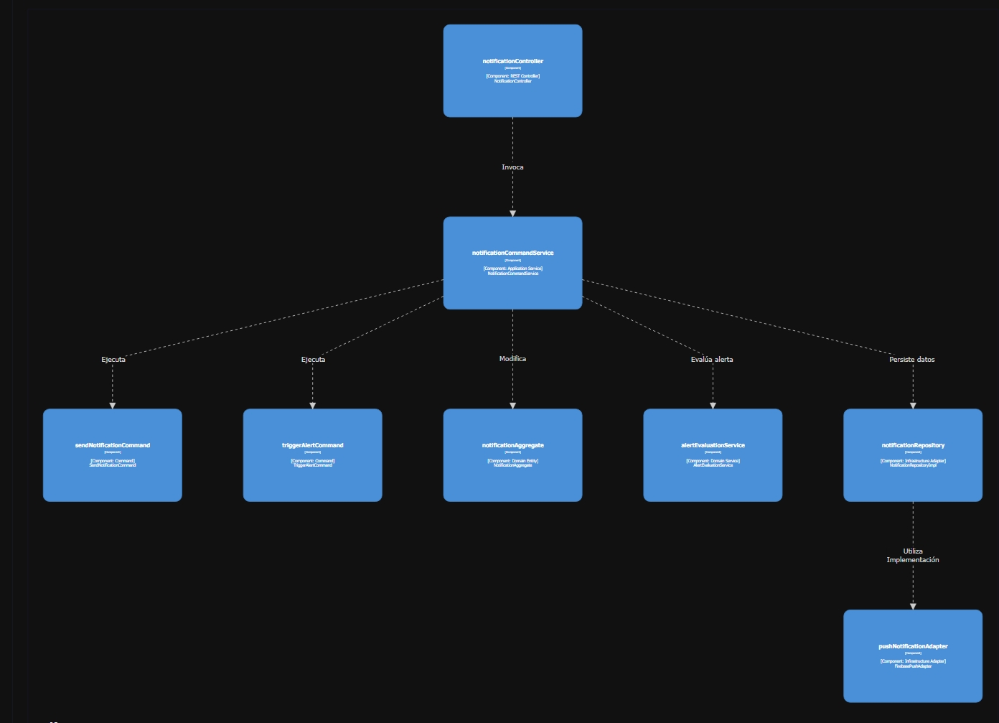
</div>

<div id='4.2.1.6.1.'><h6>4.2.1.6.1. Bounded Context Domain Layer Class Diagrams</h6></div>

<div align="center">
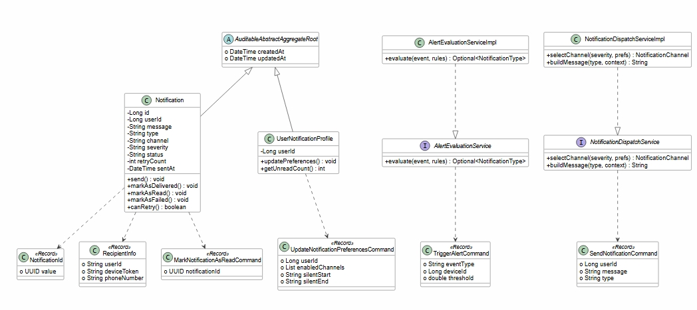
</div>

<div id='4.2.1.6.2.'><h6>4.2.1.6.2. Bounded Context Database Design Diagram</h6></div>

<div align="center">
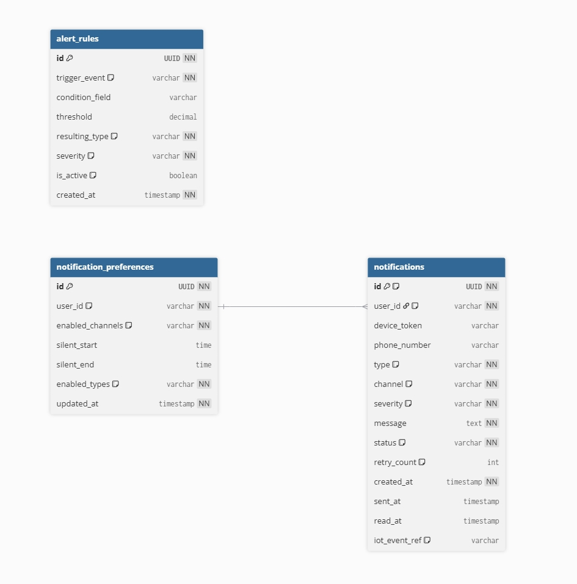
</div>


<div id='4.2.1.'><h4>4.2.1. Bounded Context: Renting</h4></div>
<div id='4.2.1.1.'><h5>4.2.1.1. Domain Layer</h5></div>
Subcapamodel<br>

| Tipo         | Nombre                    | Descripción                                                  | Responsabilidad Principal                             | Relación con otros elementos                                |
| ------------ | ------------------------- | ------------------------------------------------------------ | ----------------------------------------------------- | ----------------------------------------------------------- |
| Aggregate    | Rental                    | Representa un alquiler activo o finalizado de una bicicleta. | Gestionar el ciclo de vida del alquiler.              | Relacionado con Reservation, Payment y Bicycle (Providing). |
| Aggregate    | Reservation               | Representa la reserva previa de una bicicleta.               | Bloquear temporalmente una bicicleta para un usuario. | Relacionado con Rental y User (IAM).                        |
| Value Object | RentalTime                | Intervalo de tiempo del alquiler.                            | Calcular duración del alquiler.                       | Asociado a Rental.                                          |
| Value Object | RentalStatus              | Estado del alquiler (activo, finalizado, cancelado).         | Controlar el flujo del alquiler.                      | Asociado a Rental.                                          |
| Value Object | ReservationStatus         | Estado de la reserva.                                        | Controlar disponibilidad previa.                      | Asociado a Reservation.                                     |
| Command      | CreateReservationCommand  | Crear una reserva de bicicleta.                              | Registrar una nueva reserva.                          | Usa Reservation y User.                                     |
| Command      | CancelReservationCommand  | Cancelar una reserva.                                        | Liberar bicicleta reservada.                          | Usa Reservation.                                            |
| Command      | StartRentalCommand        | Iniciar alquiler.                                            | Activar el conteo de tiempo.                          | Usa Rental y IoT.                                           |
| Command      | EndRentalCommand          | Finalizar alquiler.                                          | Cerrar alquiler y calcular costo.                     | Usa Rental y Payments.                                      |
| Query        | GetAvailableBicyclesQuery | Obtener bicicletas disponibles.                              | Mostrar opciones al usuario.                          | Consulta Providing.                                         |
| Query        | GetUserRentalsQuery       | Obtener historial de alquileres.                             | Consultar uso del usuario.                            | Consulta Rental.                                            |
| Query        | GetReservationDetailQuery | Obtener detalle de reserva.                                  | Mostrar información específica.                       | Consulta Reservation.                                       |

Sub-capa Services<br>

| Tipo      | Nombre                    | Descripción                                        | Responsabilidad Principal                            | Relación con otros elementos                                              |
| --------- | ------------------------- | -------------------------------------------------- | ---------------------------------------------------- | ------------------------------------------------------------------------- |
| Interface | RentalCommandService      | Servicio para comandos relacionados con alquileres | Declarar métodos para iniciar y finalizar alquileres | Implementado por RentalCommandServiceImpl. Usado en capa Application      |
| Interface | ReservationCommandService | Servicio para comandos relacionados con reservas   | Declarar métodos para crear y cancelar reservas      | Implementado por ReservationCommandServiceImpl. Usado en capa Application |
| Interface | RentalQueryService        | Servicio para consultas de alquileres              | Declarar métodos para obtener alquileres             | Implementado por RentalQueryServiceImpl. Usado en capa Application        |
| Interface | ReservationQueryService   | Servicio para consultas de reservas                | Declarar métodos para obtener reservas               | Implementado por ReservationQueryServiceImpl. Usado en capa Application   |

<div id='4.2.1.1.'><h5>4.2.1.2. Interface Layer</h5></div>

Sub-capa REST<br>

| Tipo       | Nombre                                        | Descripción                                                  | Responsabilidad Principal                                                      | Relación con otros elementos                                       |
| ---------- | --------------------------------------------- | ------------------------------------------------------------ | ------------------------------------------------------------------------------ | ------------------------------------------------------------------ |
| Controller | RentalController                              | Controlador REST para gestionar alquileres                   | Recibe solicitudes del cliente relacionadas con alquileres y coordina comandos | Utiliza RentalRequestResource, RentalResponseResource y assemblers |
| Controller | ReservationController                         | Controlador REST para gestionar reservas                     | Maneja solicitudes de creación y cancelación de reservas                       | Utiliza ReservationRequestResource y ReservationResponseResource   |
| Resource   | RentalRequestResource                         | Estructura de una petición para iniciar o finalizar alquiler | Representa datos de entrada del cliente                                        | Usado por RentalController                                         |
| Resource   | RentalResponseResource                        | Estructura de respuesta de alquiler                          | Devuelve datos del alquiler al cliente                                         | Usado por RentalController                                         |
| Resource   | ReservationRequestResource                    | Estructura de petición para crear reserva                    | Representa datos de entrada                                                    | Usado por ReservationController                                    |
| Resource   | ReservationResponseResource                   | Estructura de respuesta de reserva                           | Devuelve datos al cliente                                                      | Usado por ReservationController                                    |
| Assembler  | CreateReservationCommandFromResourceAssembler | Convierte request en comando de reserva                      | Traducir entrada a comando de dominio                                          | Usado por ReservationController                                    |
| Assembler  | RentalResourceFromEntityAssembler             | Convierte entidad Rental en respuesta                        | Traducir dominio a respuesta                                                   | Usado por RentalController                                         |

<div id='4.2.1.1.'><h5>4.2.1.3. Aplications Layer</h5></div>

Sub-capa Internal

| Tipo    | Nombre                        | Descripción                                             | Responsabilidad Principal                   | Relación con otros elementos                                  |
| ------- | ----------------------------- | ------------------------------------------------------- | ------------------------------------------- | ------------------------------------------------------------- |
| Service | RentalCommandServiceImpl      | Implementación del servicio de comandos para alquileres | Ejecutar lógica de inicio y fin de alquiler | Implementa RentalCommandService. Usa entidades y repositorios |
| Service | ReservationCommandServiceImpl | Implementación del servicio de reservas                 | Ejecutar lógica de creación y cancelación   | Implementa ReservationCommandService                          |
| Service | RentalQueryServiceImpl        | Implementación de consultas de alquiler                 | Obtener historial y datos                   | Implementa RentalQueryService                                 |
| Service | ReservationQueryServiceImpl   | Implementación de consultas de reservas                 | Obtener información de reservas             | Implementa ReservationQueryService                            |

<div id='4.2.1.1.'><h5>4.2.1.4. Infrastructure Layer</h5></div>


Sub-capa Infrastructure <br>

| Tipo       | Nombre                | Descripción                           | Responsabilidad Principal         | Relación con otros elementos |
| ---------- | --------------------- | ------------------------------------- | --------------------------------- | ---------------------------- |
| Repository | RentalRepository      | Repositorio para gestionar alquileres | Persistencia de datos de alquiler | Relacionado con Rental       |
| Repository | ReservationRepository | Repositorio para gestionar reservas   | Persistencia de reservas          | Relacionado con Reservation  |


<div id='4.2.1.1.'><h5>4.2.1.5. Bounded Context Software Architecture Component Level Diagrams</h5></div>
<div align="center">

</div>


<div id='4.2.1.1.'><h5>4.2.1.6. Bounded Context Software Architecture Code Level Diagram</h5></div>

<div id='4.2.1.1.'><h5>4.2.1.6.1 Bounded Context Domain Layer Class Diagrams</h5></div>

Este diagrama UML representa la arquitectura del Bounded Context Renting, centrado en la gestión del proceso de alquiler de bicicletas. El modelo sigue principios de diseño orientado a objetos y adopta un enfoque basado en DDD (Domain-Driven Design) junto con CQRS, separando las operaciones de comandos y consultas.

En el núcleo del dominio se encuentran los agregados principales como Rental y Reservation, responsables de gestionar el ciclo de vida del alquiler y las reservas previas. Además, se utilizan Value Objects como RentalTime, RentalStatus y ReservationStatus, que permiten representar el estado y duración del alquiler de forma clara y consistente.

<div align="center">

</div>

<div id='4.2.1.1.'><h5>4.2.1.6.2 Bounded Context Database Design Diagram</h5></div>

<div align="center">

</div>

### RENTALS

**Propósito:** Registro de alquileres de bicicletas

| Campo | Tipo | Descripción |
|-------|------|-------------|
| `id` | Long (PK) | Identificador único del alquiler |
| `user_id` | Long (FK) | Usuario que realiza el alquiler (IAM) |
| `bicycle_id` | Long (FK) | Bicicleta alquilada (Providing) |
| `start_time` | datetime | Inicio del alquiler |
| `end_time` | datetime | Fin del alquiler |
| `status` | varchar | Estado (`ACTIVE`, `FINISHED`, `CANCELLED`) |
| `total_cost` | decimal | Costo total calculado |

**Relaciones:**
- `N:1` con **USERS** (IAM)
- `N:1` con **BICYCLES** (Providing)
- `1:1` opcional con **RESERVATIONS**


### RESERVATIONS


**Propósito:** Reservas previas de bicicletas

| Campo | Tipo | Descripción |
|-------|------|-------------|
| `id` | Long (PK) | Identificador único |
| `user_id` | Long (FK) | Usuario que reserva |
| `bicycle_id` | Long (FK) | Bicicleta reservada |
| `status` | varchar | Estado (`ACTIVE`, `CANCELLED`, `EXPIRED`) |
| `reserved_at` | datetime | Fecha de reserva |
| `expiration_time` | datetime | Tiempo límite de la reserva |

**Relaciones:**
- `N:1` con **USERS** (IAM)
- `N:1` con **BICYCLES** (Providing)
- `1:1` con **RENTALS** (cuando se convierte)


###  PAYMENTS

**Propósito:** Procesamiento de pagos de alquileres

| Campo | Tipo | Descripción |
|-------|------|-------------|
| `id` | Long (PK) | Identificador |
| `rental_id` | Long (FK) | Alquiler asociado |
| `amount` | decimal | Monto |
| `status` | varchar | Estado del pago |
| `payment_date` | datetime | Fecha |

**Relaciones:**
- `1:1` con **RENTALS**

----------------------------------------------------------------
<div id='4.2.2.'><h4>4.2.2. Bounded Context: Payments</h4></div>

<div id='4.2.2.1.'><h5>4.2.2.1. Domain Layer</h5></div>

Subcapamodel<br>

| Tipo         | Nombre                  | Descripción                                      | Responsabilidad Principal                         | Relación con otros elementos          |
| ------------ | ----------------------- | ------------------------------------------------ | ------------------------------------------------- | ------------------------------------- |
| Aggregate    | Payment                 | Representa un pago de un alquiler                | Gestionar el proceso de pago                      | Relacionado con Rental (Renting)      |
| Aggregate    | PaymentMethod           | Método de pago del usuario                       | Gestionar métodos de pago                         | Relacionado con User (IAM)            |
| Value Object | PaymentAmount           | Monto del pago                                  | Representar valor monetario                       | Asociado a Payment                    |
| Value Object | PaymentStatus           | Estado del pago                                 | Controlar flujo del pago                          | Asociado a Payment                    |
| Value Object | PaymentType             | Tipo de método de pago                          | Clasificar método                                 | Asociado a PaymentMethod              |
| Command      | CreatePaymentCommand    | Crear pago                                      | Registrar un nuevo pago                           | Usa Payment y Rental                  |
| Command      | ProcessPaymentCommand   | Procesar pago                                   | Validar y confirmar pago                          | Usa PaymentMethod                     |
| Query        | GetUserPaymentsQuery    | Obtener pagos del usuario                       | Consultar historial                               | Consulta Payment                      |
| Query        | GetPaymentDetailQuery   | Obtener detalle de pago                         | Mostrar información específica                    | Consulta Payment                      |

---

Sub-capa Services<br>

| Tipo      | Nombre                | Descripción                           | Responsabilidad Principal                      | Relación con otros elementos             |
| --------- | --------------------- | ------------------------------------- | ---------------------------------------------- | ---------------------------------------- |
| Interface | PaymentCommandService | Servicio de comandos de pagos         | Declarar operaciones de creación y proceso     | Implementado por PaymentCommandServiceImpl |
| Interface | PaymentQueryService   | Servicio de consultas de pagos        | Declarar operaciones de consulta               | Implementado por PaymentQueryServiceImpl |

---

<div id='4.2.2.2.'><h5>4.2.2.2. Interface Layer</h5></div>

Sub-capa REST<br>

| Tipo       | Nombre                               | Descripción                                | Responsabilidad Principal                        | Relación con otros elementos           |
| ---------- | ------------------------------------ | ------------------------------------------ | ------------------------------------------------ | -------------------------------------- |
| Controller | PaymentController                    | Controlador REST de pagos                  | Gestionar solicitudes de pagos                   | Usa services y resources               |
| Resource   | PaymentRequestResource               | Petición de pago                           | Representar datos de entrada                     | Usado por PaymentController            |
| Resource   | PaymentResponseResource              | Respuesta de pago                          | Devolver información al cliente                  | Usado por PaymentController            |
| Resource   | PaymentMethodRequestResource         | Petición de método de pago                 | Representar datos de entrada                     | Usado por PaymentController            |
| Resource   | PaymentMethodResponseResource        | Respuesta de método de pago                | Devolver datos al cliente                        | Usado por PaymentController            |
| Assembler  | PaymentCommandFromResourceAssembler  | Convierte request a comando                | Traducir entrada a dominio                       | Usado por PaymentController            |
| Assembler  | PaymentResourceFromEntityAssembler   | Convierte entidad a response               | Traducir dominio a salida                        | Usado por PaymentController            |

---

<div id='4.2.2.3.'><h5>4.2.2.3. Application Layer</h5></div>

Sub-capa Internal<br>

| Tipo    | Nombre                    | Descripción                                 | Responsabilidad Principal                 | Relación con otros elementos              |
| ------- | ------------------------- | ------------------------------------------- | ----------------------------------------- | ----------------------------------------- |
| Service | PaymentCommandServiceImpl | Implementación de comandos de pago          | Ejecutar lógica de creación y procesamiento | Implementa PaymentCommandService          |
| Service | PaymentQueryServiceImpl   | Implementación de consultas de pagos        | Obtener historial y detalle               | Implementa PaymentQueryService            |

---

<div id='4.2.2.4.'><h5>4.2.2.4. Infrastructure Layer</h5></div>

Sub-capa Infrastructure<br>

| Tipo       | Nombre                    | Descripción                           | Responsabilidad Principal        | Relación con otros elementos |
| ---------- | ------------------------- | ------------------------------------- | -------------------------------- | ---------------------------- |
| Repository | PaymentRepository         | Repositorio de pagos                  | Persistencia de pagos            | Relacionado con Payment      |
| Repository | PaymentMethodRepository   | Repositorio de métodos de pago        | Persistencia de métodos          | Relacionado con PaymentMethod|

---

<div id='4.2.2.5.'><h5>4.2.2.5. Bounded Context Software Architecture Component Level Diagrams</h5></div>

Este diagrama representa la arquitectura del Bounded Context Payments, mostrando la interacción entre la capa de dominio, aplicación, interfaz e infraestructura para la gestión de pagos.

<div align="center">
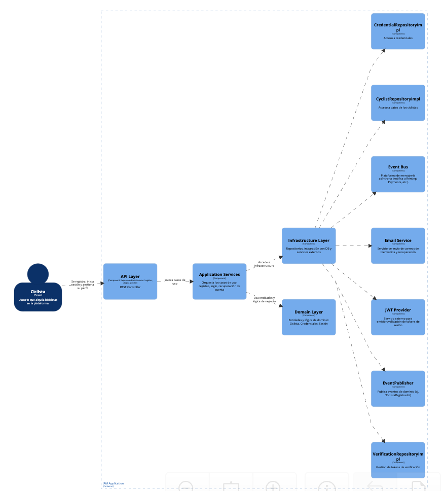
</div>

---

<div id='4.2.2.6.'><h5>4.2.2.6. Bounded Context Software Architecture Code Level Diagram</h5></div>

<div id='4.2.2.6.1'><h5>4.2.2.6.1 Bounded Context Domain Layer Class Diagrams</h5></div>

Este diagrama UML representa la estructura del dominio Payments, mostrando los agregados principales como Payment y PaymentMethod, así como los Value Objects que controlan el estado y tipo de pago.

<div align="center">
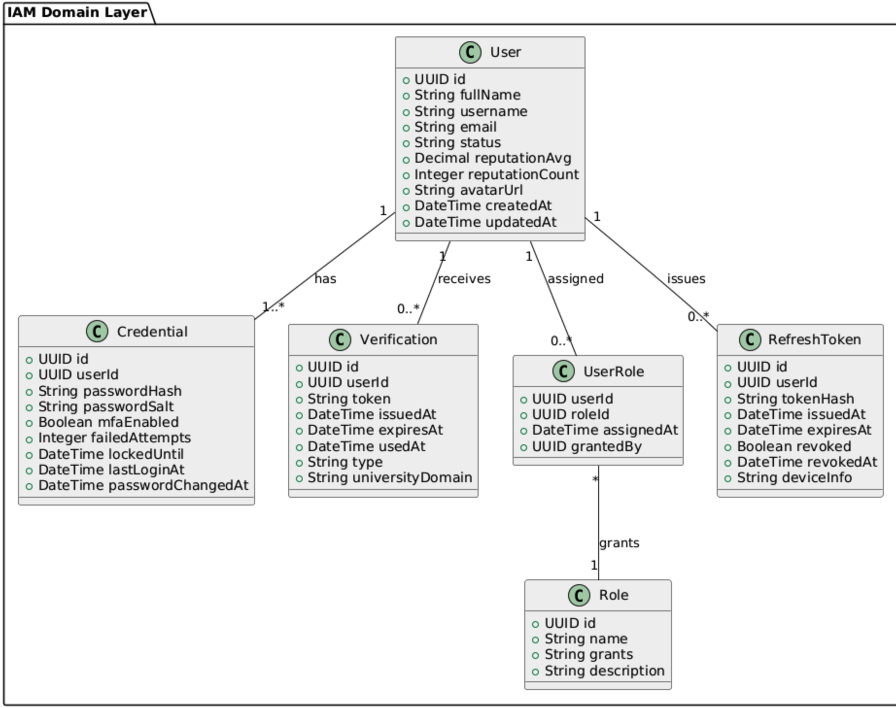
</div>

---

<div id='4.2.2.6.2'><h5>4.2.2.6.2 Bounded Context Database Design Diagram</h5></div>

<div align="center">
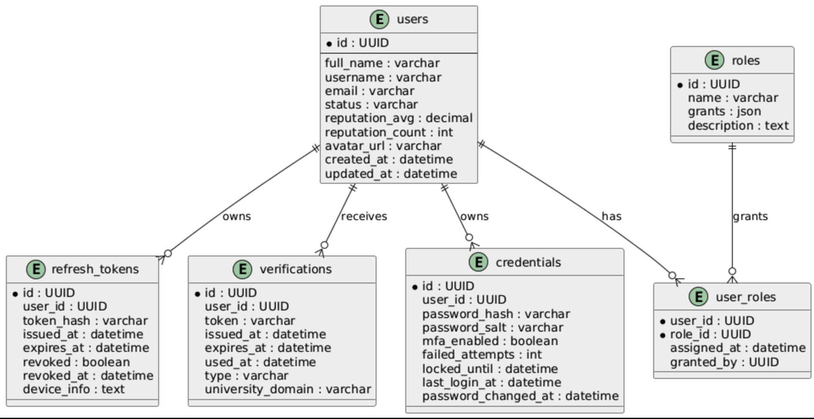
</div>

---

### PAYMENTS

**Propósito:** Registro de pagos de alquileres

| Campo          | Tipo        | Descripción                              |
| -------------- | ----------- | ---------------------------------------- |
| `id`           | Long (PK)   | Identificador del pago                   |
| `rental_id`    | Long (FK)   | Alquiler asociado (Renting)              |
| `amount`       | decimal     | Monto total                             |
| `status`       | varchar     | Estado (`PENDING`, `SUCCESS`, `FAILED`) |
| `method`       | varchar     | Método (`CARD`, `YAPE`, `PLIN`)         |
| `payment_date` | datetime    | Fecha del pago                          |

**Relaciones:**
- `1:1` con **RENTALS**

---

### PAYMENT_METHODS

**Propósito:** Métodos de pago de usuarios

| Campo        | Tipo      | Descripción                          |
| ------------ | --------- | ------------------------------------ |
| `id`         | Long (PK) | Identificador                        |
| `user_id`    | Long (FK) | Usuario (IAM)                        |
| `type`       | varchar   | Tipo (`CARD`, `YAPE`, `PLIN`)        |
| `status`     | varchar   | Estado (`ACTIVE`, `DISABLED`)        |
| `created_at` | datetime  | Fecha de registro                    |

**Relaciones:**
- `N:1` con **USERS** (IAM)


---------------------------------------------------------------
<div id='4.2.3.'><h4>4.2.3. Bounded Context: Providing</h4></div>
<div id='4.2.3.1.'><h5>4.2.3.1. Domain Layer</h5></div>
Subcapamodel<br>

| Tipo         | Nombre                     | Descripción                                                 | Responsabilidad Principal                | Relación con otros elementos                   |
| ------------ | -------------------------- | ----------------------------------------------------------- | ---------------------------------------- | ---------------------------------------------- |
| Aggregate    | Bicycle                    | Representa una bicicleta registrada en la plataforma.       | Centralizar la información del vehículo. | Relacionado con Rental (Renting) y User (IAM). |
| Aggregate    | BicycleCatalog             | Representa el conjunto de bicicletas de un arrendador.      | Gestionar el listado de bicicletas.      | Relacionado con Bicycle.                       |
| Value Object | BicycleStatus              | Estado de la bicicleta (disponible, no disponible, en uso). | Controlar disponibilidad del vehículo.   | Asociado a Bicycle.                            |
| Value Object | BicycleType                | Tipo de bicicleta (eléctrica, montaña, urbana).             | Clasificar bicicletas.                   | Asociado a Bicycle.                            |
| Value Object | Location                   | Ubicación de la bicicleta.                                  | Representar coordenadas geográficas.     | Asociado a Bicycle y Tracking.                 |
| Value Object | Price                      | Tarifa de alquiler.                                         | Definir costo por uso.                   | Asociado a Bicycle.                            |
| Command      | RegisterBicycleCommand     | Registrar una nueva bicicleta.                              | Crear una bicicleta en el sistema.       | Usa Bicycle y User.                            |
| Command      | UpdateBicycleCommand       | Actualizar datos de bicicleta.                              | Modificar información del vehículo.      | Usa Bicycle.                                   |
| Command      | DeleteBicycleCommand       | Eliminar bicicleta.                                         | Dar de baja una bicicleta.               | Usa Bicycle.                                   |
| Command      | ChangeBicycleStatusCommand | Cambiar estado de disponibilidad.                           | Controlar visibilidad en búsquedas.      | Usa Bicycle.                                   |
| Query        | GetBicyclesByOwnerQuery    | Obtener bicicletas de un arrendador.                        | Listar bicicletas propias.               | Consulta Bicycle.                              |
| Query        | GetBicycleDetailQuery      | Obtener detalle de bicicleta.                               | Mostrar información completa.            | Consulta Bicycle.                              |
| Query        | GetAvailableBicyclesQuery  | Obtener bicicletas disponibles.                             | Mostrar bicicletas habilitadas.          | Consulta Bicycle.                              |


Sub-capa Services<br>

| Tipo      | Nombre                | Descripción                           | Responsabilidad Principal    | Relación con otros elementos                                     |
| --------- | --------------------- | ------------------------------------- | ---------------------------- | ---------------------------------------------------------------- |
| Interface | BicycleCommandService | Servicio para comandos de bicicletas  | Declarar métodos de gestión  | Implementado por BicycleCommandServiceImpl. Usado en Application |
| Interface | BicycleQueryService   | Servicio para consultas de bicicletas | Declarar métodos de consulta | Implementado por BicycleQueryServiceImpl. Usado en Application   |


<div id='4.2.3.1.'><h5>4.2.3.2. Interface Layer</h5></div>

Sub-capa REST <br>

| Tipo       | Nombre                                    | Descripción                          | Responsabilidad Principal               | Relación con otros elementos |
| ---------- | ----------------------------------------- | ------------------------------------ | --------------------------------------- | ---------------------------- |
| Controller | BicycleController                         | Controlador REST para bicicletas     | Gestiona operaciones CRUD de bicicletas | Usa services y resources     |
| Resource   | BicycleRequestResource                    | Estructura de petición de bicicleta  | Representa datos de entrada             | Usado por BicycleController  |
| Resource   | BicycleResponseResource                   | Estructura de respuesta de bicicleta | Devuelve datos al cliente               | Usado por BicycleController  |
| Assembler  | CreateBicycleCommandFromResourceAssembler | Convierte request en comando         | Traducir entrada a dominio              | Usado por BicycleController  |
| Assembler  | BicycleResourceFromEntityAssembler        | Convierte entidad a response         | Traducir dominio a salida               | Usado por BicycleController  |


<div id='4.2.3.1.'><h5>4.2.3.3. Aplications Layer</h5></div>

Sub-capa Internal<br>

| Tipo    | Nombre                    | Descripción                              | Responsabilidad Principal                          | Relación con otros elementos     |
| ------- | ------------------------- | ---------------------------------------- | -------------------------------------------------- | -------------------------------- |
| Service | BicycleCommandServiceImpl | Implementación de comandos de bicicletas | Ejecutar lógica de registro, edición y eliminación | Implementa BicycleCommandService |
| Service | BicycleQueryServiceImpl   | Implementación de consultas              | Obtener datos de bicicletas                        | Implementa BicycleQueryService   |


<div id='4.2.3.1.'><h5>4.2.3.4. Infrastructure Layer</h5></div>


Sub-capa Infrastructure <br>

| Tipo       | Nombre            | Descripción               | Responsabilidad Principal | Relación con otros elementos |
| ---------- | ----------------- | ------------------------- | ------------------------- | ---------------------------- |
| Repository | BicycleRepository | Repositorio de bicicletas | Persistencia de datos     | Relacionado con Bicycle      |


<div id='4.2.3.1.'><h5>4.2.3.5. Bounded Context Software Architecture Component Level Diagrams</h5></div>

<div align="center">

</div>

<div id='4.2.3.1.'><h5>4.2.3.6. Bounded Context Software Architecture Code Level Diagram</h5></div>

<div id='4.2.3.1.'><h5>4.2.3.6.1 Bounded Context Domain Layer Class Diagrams</h5></div>

Este diagrama UML representa la arquitectura del Bounded Context Providing, enfocado en la gestión de bicicletas dentro de la plataforma. El modelo sigue principios de diseño orientado a objetos y adopta un enfoque basado en DDD (Domain-Driven Design) junto con CQRS, separando las operaciones de comandos y consultas.

En el núcleo del dominio se encuentran los agregados principales como Bicycle y BicycleCatalog, responsables de gestionar la información y organización de las bicicletas. Además, se utilizan Value Objects como BicycleStatus, BicycleType, Location y Price, que permiten modelar el dominio de forma más clara y consistente, evitando el uso de tipos genéricos sin contexto.


<div align="center">

</div>


<div id='4.2.3.1.'><h5>4.2.3.6.2 Bounded Context Database Design Diagram</h5></div>


<div align="center">

</div>

BICYCLES

Propósito: Registro de bicicletas del sistema

| Campo      | Tipo      | Descripción                   |
| ---------- | --------- | ----------------------------- |
| id         | Long (PK) | Identificador de la bicicleta |
| owner_id   | Long (FK) | Arrendador                    |
| type       | varchar   | Tipo de bicicleta             |
| status     | varchar   | Estado                        |
| price      | decimal   | Tarifa                        |
| latitude   | decimal   | Ubicación                     |
| longitude  | decimal   | Ubicación                     |
| created_at | datetime  | Fecha de registro             |

BICYCLE_HISTORY

Propósito: Historial de cambios de estado y uso

| Campo      | Tipo      | Descripción      |
| ---------- | --------- | ---------------- |
| id         | Long (PK) | Identificador    |
| bicycle_id | Long (FK) | Bicicleta        |
| status     | varchar   | Estado           |
| timestamp  | datetime  | Fecha del cambio |

## 4.2.4. Bounded Context: Tracking & Monitoring

El bounded context Tracking & Monitoring está encargado del seguimiento en tiempo real de las bicicletas, permitiendo registrar ubicación GPS, visualizar rutas recorridas, controlar el estado actual de la bicicleta y monitorear eventos generados por sensores IoT. Este contexto se relaciona con las user stories de ubicación en tiempo real, seguimiento de recorrido, estado de bicicleta e historial de rutas. Además, se conecta con el contexto de Providing, ya que la ubicación de la bicicleta está asociada al registro de bicicletas y al tracking del sistema.

### 4.2.4.1. Domain Layer

En esta capa se definen las entidades principales, agregados, value objects, comandos, queries, eventos de dominio y servicios del sistema encargados del seguimiento en tiempo real de bicicletas.

| Tipo           | Nombre                          | Descripción                                                                 | Responsabilidad Principal                                                           | Relación con otros elementos                            |
| -------------- | ------------------------------- | --------------------------------------------------------------------------- | ----------------------------------------------------------------------------------- | ------------------------------------------------------- |
| Aggregate      | TrackingSession                 | Representa una sesión activa de seguimiento de una bicicleta.               | Controlar el inicio, actualización y finalización del seguimiento en tiempo real.   | Relacionado con Bicycle, RouteHistory y LocationUpdate. |
| Aggregate      | RouteHistory                    | Representa el historial de recorridos realizados por una bicicleta.         | Guardar las rutas recorridas para consultas posteriores.                            | Relacionado con TrackingSession y Bicycle.              |
| Entity         | LocationUpdate                  | Registra una actualización puntual de ubicación GPS.                        | Almacenar latitud, longitud, precisión y fecha de actualización.                    | Pertenece a TrackingSession.                            |
| Entity         | BicycleMonitoringStatus         | Representa el estado operativo actual de una bicicleta.                     | Determinar si la bicicleta está disponible, en uso, detenida, offline o con alerta. | Se relaciona con Bicycle y eventos IoT.                 |
| Value Object   | Coordinates                     | Objeto que contiene latitud y longitud.                                     | Representar una ubicación geográfica inmutable.                                     | Usado por LocationUpdate y RouteHistory.                |
| Value Object   | GPSAccuracy                     | Representa el nivel de precisión de la señal GPS.                           | Validar si una ubicación puede ser usada correctamente.                             | Asociado a LocationUpdate.                              |
| Value Object   | TrackingStatus                  | Estado del seguimiento: ACTIVE, PAUSED, FINISHED.                           | Controlar el ciclo de vida del tracking.                                            | Asociado a TrackingSession.                             |
| Value Object   | MonitoringStatus                | Estado de bicicleta: AVAILABLE, IN_USE, STOPPED, OFFLINE, ALERT.            | Representar el estado actual de la bicicleta.                                       | Asociado a BicycleMonitoringStatus.                     |
| Command        | StartTrackingCommand            | Comando para iniciar el seguimiento de una bicicleta.                       | Activar una nueva sesión de tracking.                                               | Usa TrackingSession y Bicycle.                          |
| Command        | UpdateLocationCommand           | Comando para registrar una nueva ubicación GPS.                             | Guardar una actualización de coordenadas en tiempo real.                            | Usa LocationUpdate.                                     |
| Command        | StopTrackingCommand             | Comando para finalizar el seguimiento.                                      | Cerrar la sesión y guardar la ruta final.                                           | Usa TrackingSession y RouteHistory.                     |
| Command        | UpdateMonitoringStatusCommand   | Comando para actualizar el estado de una bicicleta.                         | Cambiar el estado actual de la bicicleta según eventos IoT.                         | Usa BicycleMonitoringStatus.                            |
| Query          | GetCurrentLocationQuery         | Consulta para obtener la ubicación actual de una bicicleta.                 | Mostrar la posición actual en el mapa.                                              | Consulta LocationUpdate.                                |
| Query          | GetRouteHistoryQuery            | Consulta para obtener rutas anteriores.                                     | Recuperar el historial de recorridos.                                               | Consulta RouteHistory.                                  |
| Query          | GetBicycleMonitoringStatusQuery | Consulta para obtener el estado actual de una bicicleta.                    | Mostrar disponibilidad, conexión o uso actual.                                      | Consulta BicycleMonitoringStatus.                       |
| Domain Event   | LocationUpdated                 | Evento generado cuando se actualiza la ubicación GPS.                       | Notificar que existe una nueva posición de bicicleta.                               | Consumido por mapas, monitoreo y notificaciones.        |
| Domain Event   | TrackingStarted                 | Evento generado al iniciar el seguimiento.                                  | Registrar el inicio del monitoreo.                                                  | Relacionado con Renting e IoT.                          |
| Domain Event   | TrackingFinished                | Evento generado al finalizar el seguimiento.                                | Cerrar la ruta recorrida.                                                           | Relacionado con RouteHistory.                           |
| Domain Event   | BicycleStatusChanged            | Evento generado cuando cambia el estado de una bicicleta.                   | Comunicar cambios de disponibilidad o uso.                                          | Relacionado con Providing y Notifications.              |
| Domain Service | RouteCalculationService         | Servicio que calcula distancia y duración de rutas.                         | Procesar coordenadas para obtener recorrido, distancia y tiempo.                    | Usa LocationUpdate y RouteHistory.                      |
| Domain Service | MonitoringStatusService         | Servicio que evalúa eventos IoT para determinar el estado de una bicicleta. | Detectar bicicleta en uso, detenida, offline o con alerta.                          | Usa BicycleMonitoringStatus y eventos IoT.              |

### 4.2.4.2. Interface Layer

| Tipo           | Nombre                                     | Descripción                                              | Responsabilidad Principal                                        | Relación con otros elementos                     |
| -------------- | ------------------------------------------ | -------------------------------------------------------- | ---------------------------------------------------------------- | ------------------------------------------------ |
| Controller     | TrackingController                         | Controlador REST para operaciones de seguimiento.        | Exponer endpoints para iniciar, actualizar y finalizar tracking. | Usa TrackingApplicationService.                  |
| Controller     | MonitoringController                       | Controlador REST para consultar estados de bicicletas.   | Permitir al cliente consultar estado y ubicación actual.         | Usa MonitoringApplicationService.                |
| Event Consumer | GPSLocationEventConsumer                   | Consumidor de eventos GPS enviados por dispositivos IoT. | Recibir coordenadas y enviar UpdateLocationCommand.              | Consume eventos del contexto IoT Device Control. |
| Event Consumer | MotionDetectedEventConsumer                | Consumidor de eventos de movimiento.                     | Detectar si una bicicleta está en uso o detenida.                | Relacionado con sensores IoT.                    |
| DTO            | TrackingSessionResponse                    | Respuesta con datos de una sesión de tracking.           | Enviar información de la sesión al cliente.                      | Usado por TrackingController.                    |
| DTO            | LocationUpdateRequest                      | Payload con latitud, longitud, precisión y timestamp.    | Transportar datos GPS hacia la aplicación.                       | Usado por TrackingController.                    |
| DTO            | CurrentLocationResponse                    | Respuesta con la ubicación actual de la bicicleta.       | Mostrar la posición actual en el mapa.                           | Usado por MonitoringController.                  |
| DTO            | RouteHistoryResponse                       | Respuesta con el recorrido histórico.                    | Mostrar rutas anteriores al usuario.                             | Usado por TrackingController.                    |
| DTO            | BicycleMonitoringStatusResponse            | Respuesta con el estado actual de la bicicleta.          | Mostrar disponibilidad, uso o alerta.                            | Usado por MonitoringController.                  |
| Assembler      | TrackingSessionResourceFromEntityAssembler | Convierte entidad TrackingSession a respuesta.           | Traducir dominio a DTO.                                          | Usado por TrackingController.                    |
| Assembler      | LocationUpdateCommandFromResourceAssembler | Convierte request en comando.                            | Traducir entrada HTTP a comando de aplicación.                   | Usado por TrackingController.                    |

### 4.2.4.3. Application Layer

| Tipo                | Nombre                                 | Descripción                                       | Responsabilidad Principal                            | Relación con otros elementos                            |
| ------------------- | -------------------------------------- | ------------------------------------------------- | ---------------------------------------------------- | ------------------------------------------------------- |
| Application Service | TrackingApplicationService             | Servicio principal para casos de uso de tracking. | Orquestar comandos y consultas de seguimiento.       | Invocado por TrackingController.                        |
| Application Service | MonitoringApplicationService           | Servicio principal para monitoreo de bicicletas.  | Coordinar consultas de estado y ubicación.           | Invocado por MonitoringController.                      |
| Command Handler     | StartTrackingCommandHandler            | Handler para iniciar una sesión de seguimiento.   | Crear TrackingSession y publicar TrackingStarted.    | Usa TrackingSessionRepository.                          |
| Command Handler     | UpdateLocationCommandHandler           | Handler para registrar coordenadas GPS.           | Guardar LocationUpdate y publicar LocationUpdated.   | Usa LocationUpdateRepository.                           |
| Command Handler     | StopTrackingCommandHandler             | Handler para finalizar tracking.                  | Cerrar sesión y generar RouteHistory.                | Usa TrackingSessionRepository y RouteHistoryRepository. |
| Command Handler     | UpdateMonitoringStatusCommandHandler   | Handler para actualizar estado de bicicleta.      | Modificar BicycleMonitoringStatus según eventos IoT. | Usa MonitoringStatusService.                            |
| Query Handler       | GetCurrentLocationQueryHandler         | Handler para obtener ubicación actual.            | Recuperar la última ubicación GPS registrada.        | Usa LocationUpdateRepository.                           |
| Query Handler       | GetRouteHistoryQueryHandler            | Handler para consultar historial de rutas.        | Obtener rutas previas por usuario o bicicleta.       | Usa RouteHistoryRepository.                             |
| Query Handler       | GetBicycleMonitoringStatusQueryHandler | Handler para consultar estado actual.             | Recuperar disponibilidad, conexión o alerta.         | Usa BicycleMonitoringStatusRepository.                  |

### 4.2.4.4. Infrastructure Layer

| Tipo              | Nombre                            | Descripción                          | Responsabilidad Principal                                       | Relación con otros elementos                      |
| ----------------- | --------------------------------- | ------------------------------------ | --------------------------------------------------------------- | ------------------------------------------------- |
| Repository        | TrackingSessionRepository         | Repositorio de sesiones de tracking. | Persistir sesiones activas y finalizadas.                       | Relacionado con TrackingSession.                  |
| Repository        | LocationUpdateRepository          | Repositorio de ubicaciones GPS.      | Guardar coordenadas recibidas en tiempo real.                   | Relacionado con LocationUpdate.                   |
| Repository        | RouteHistoryRepository            | Repositorio de historial de rutas.   | Almacenar rutas finalizadas.                                    | Relacionado con RouteHistory.                     |
| Repository        | BicycleMonitoringStatusRepository | Repositorio de estados de bicicleta. | Persistir estado actual de monitoreo.                           | Relacionado con BicycleMonitoringStatus.          |
| External Adapter  | GoogleMapsAdapter                 | Adaptador para servicios de mapas.   | Mostrar ubicaciones y rutas en mapa.                            | Usado por consultas de ubicación.                 |
| Message Consumer  | IoTTrackingMessageConsumer        | Consumidor de mensajes IoT.          | Recibir GPS, movimiento y estado desde MQTT/IoT Hub.            | Alimenta los event consumers.                     |
| Message Publisher | TrackingEventPublisher            | Publicador de eventos del contexto.  | Emitir LocationUpdated, TrackingStarted y BicycleStatusChanged. | Consumido por Notifications, Providing y Renting. |

### 4.2.4.5. Bounded Context Software Architecture Component Level Diagrams

Este diagrama representa la arquitectura interna del bounded context **Tracking & Monitoring**, mostrando cómo se organizan sus principales componentes por capas. En la capa de interfaz se encuentran los controladores encargados de recibir solicitudes desde la aplicación móvil y el panel administrativo, así como los consumidores de eventos provenientes de dispositivos IoT.

La capa de aplicación coordina los casos de uso principales, como iniciar el seguimiento de una bicicleta, actualizar su ubicación, consultar su estado actual y recuperar el historial de rutas. La capa de dominio contiene los elementos centrales del negocio, como **TrackingSession**, **LocationUpdate**, **RouteHistory** y **BicycleMonitoringStatus**, los cuales permiten controlar el seguimiento en tiempo real y el estado operativo de cada bicicleta.

Finalmente, la capa de infraestructura se encarga de la persistencia de datos, la integración con Google Maps y la recepción de eventos IoT. Este diseño permite separar responsabilidades, facilitar el mantenimiento del sistema y asegurar que el monitoreo de bicicletas pueda evolucionar sin afectar otros bounded contexts.

<p align="center">
  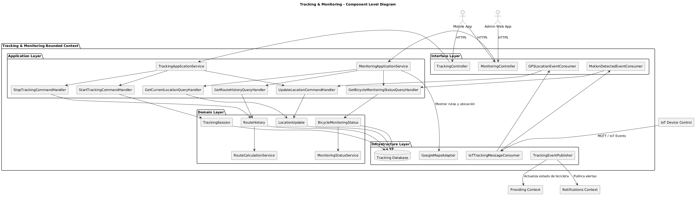
</p>

### 4.2.4.6. Bounded Context Software Architecture Code Level Diagrams

Este diagrama muestra con mayor detalle la estructura de código del bounded context **Tracking & Monitoring**, representando las principales clases, entidades, value objects, comandos, consultas, eventos de dominio y servicios de dominio utilizados en el seguimiento de bicicletas.

El agregado principal es **TrackingSession**, encargado de gestionar el ciclo de vida del seguimiento, desde su inicio hasta su finalización. La entidad **LocationUpdate** registra cada actualización GPS recibida desde los dispositivos IoT, mientras que **RouteHistory** conserva el resumen del recorrido realizado. Además, **BicycleMonitoringStatus** permite conocer el estado actual de la bicicleta, como disponible, en uso, detenida, sin conexión o en alerta.

El diseño sigue el enfoque **CQRS** (separación entre comandos y consultas), donde los comandos modifican el estado del sistema y las consultas recuperan información sin alterarla. También se utilizan eventos de dominio como **LocationUpdated**, **TrackingStarted** y **TrackingFinished**, que permiten comunicar cambios importantes a otros contextos como Notifications, Renting y Providing.

<p align="center">
  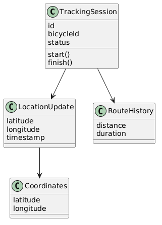
</p>

#### 4.2.4.6.1. Bounded Context Domain Layer Class Diagrams

Este diagrama UML representa la arquitectura del bounded context Tracking & Monitoring. Se organiza bajo principios de diseño orientado a objetos y sigue el enfoque CQRS, separando comandos para modificar el estado del sistema y consultas para obtener información de monitoreo.

El agregado principal es TrackingSession, encargado de controlar el ciclo de vida del seguimiento de una bicicleta. LocationUpdate registra las coordenadas GPS recibidas desde los dispositivos IoT, mientras que RouteHistory almacena el recorrido finalizado. Además, BicycleMonitoringStatus permite conocer el estado actual de la bicicleta, como disponible, en uso, detenida, offline o en alerta.

Este contexto interactúa con:
- Providing, para actualizar la ubicación y estado de las bicicletas.
- Renting, para iniciar o finalizar el seguimiento durante un alquiler.
- IoT & Device Control, para recibir datos GPS, movimiento y conexión.
- Notifications, para generar alertas ante eventos importantes.

<p align="center">
  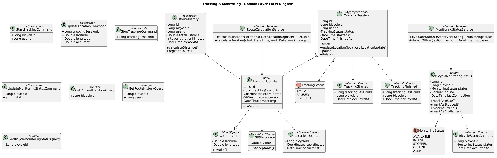
</p>

#### 4.2.4.6.2. Bounded Context Database Design Diagram

La base de datos del bounded context Tracking & Monitoring permite almacenar sesiones de seguimiento, actualizaciones GPS, historial de rutas, estado actual de monitoreo y eventos generados durante el recorrido.

La tabla tracking_sessions registra cada sesión activa o finalizada. La tabla location_updates almacena las coordenadas recibidas periódicamente. La tabla route_histories conserva el resumen de los recorridos realizados. La tabla bicycle_monitoring_status mantiene el estado actual de cada bicicleta, mientras que tracking_events registra eventos relevantes como pérdida de conexión, movimiento sospechoso o cambios de estado.

<p align="center">
  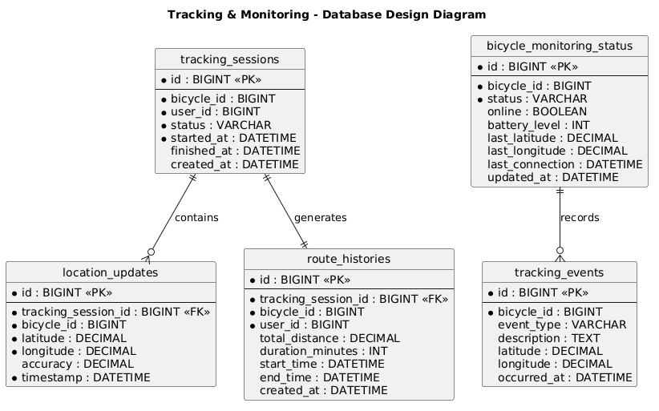
</p>

## 4.2.5. Bounded Context: IoT & Device Control

Este *bounded context* es **core** y se encarga de la **interacción con el
hardware y los sensores**: registra los dispositivos IoT acoplados a cada
bicicleta, los empareja con su bicicleta correspondiente, ejecuta comandos
físicos (unlock / lock / lockdown) vía MQTT y publica la telemetría que
alimenta a *Tracking & Monitoring*.

---

### 4.2.5.1. Domain Layer

#### Sub-capa model

| Tipo | Nombre | Descripción | Responsabilidad Principal | Relación con otros elementos |
|---|---|---|---|---|
| Aggregate | **Device** | Representa un dispositivo IoT (cerradura + GPS) acoplado a una bicicleta. | Gestionar el ciclo de vida del dispositivo y su estado físico. | Relacionado con Pairing, Bicycle (Providing) y TelemetryReading. |
| Aggregate | **Pairing** | Representa el vínculo seguro entre un Device y una Bicycle. | Mantener la relación device ↔ bicicleta y validar tokens. | Relacionado con Device y Bicycle (Providing). |
| Aggregate | **TelemetryReading** | Representa una lectura de telemetría (batería, conexión, GPS). | Almacenar la telemetría histórica del dispositivo. | Asociado a Device. Consumido por Tracking. |
| Value Object | **LockState** | Estado físico de la cerradura (`LOCKED` / `UNLOCKED` / `LOCKDOWN`). | Controlar el estado actual de la cerradura. | Asociado a Device. |
| Value Object | **DeviceStatus** | Estado operativo (`ONLINE` / `OFFLINE` / `LOW_BATTERY`). | Gestionar disponibilidad para alquiler. | Asociado a Device. |
| Value Object | **FirmwareVersion** | Versión semántica del firmware OTA (major.minor.patch). | Controlar las actualizaciones OTA. | Asociado a Device. |
| Value Object | **BatteryLevel** | Nivel de batería en porcentaje (0-100). | Decidir cuándo pausar el dispositivo. | Asociado a Device y TelemetryReading. |
| Value Object | **PairingToken** | Token de un solo uso con expiración. | Asegurar que el pairing sea único e irrepetible. | Asociado a Pairing. |
| Command | **RegisterDeviceCommand** | Registrar un nuevo dispositivo IoT en la plataforma. | Crear la entidad Device. | Usa Device. |
| Command | **PairDeviceCommand** | Emparejar un Device con una Bicycle. | Crear un Pairing válido. | Usa Pairing y Device. |
| Command | **UnlockBicycleCommand** | Enviar comando MQTT de desbloqueo a la cerradura. | Activar la cerradura. | Usa Device. |
| Command | **ReleaseBicycleCommand** | Devolver la bicicleta al cierre del alquiler. | Liberar la cerradura. | Usa Device. |
| Command | **ActivateLockdownCommand** | Activar modo bloqueo anti-robo de forma remota. | Bloquear remotamente. | Usa Device. |
| Command | **UpdateFirmwareCommand** | Lanzar una actualización OTA al dispositivo. | Actualizar versión de firmware. | Usa Device. |
| Query | **GetDeviceStatusQuery** | Obtener el estado actual del dispositivo. | Mostrar estado al sistema. | Consulta Device. |
| Query | **GetPairingByBicycleQuery** | Obtener el pairing por bicicleta. | Encontrar el Device asociado. | Consulta Pairing. |
| Query | **GetTelemetryHistoryQuery** | Obtener el historial de telemetría de un dispositivo. | Análisis y diagnósticos. | Consulta TelemetryReading. |

#### Sub-capa Services

| Tipo | Nombre | Descripción | Responsabilidad Principal | Relación con otros elementos |
|---|---|---|---|---|
| Interface | **DeviceCommandService** | Servicio para comandos relacionados con dispositivos. | Declarar métodos para registrar, desbloquear, bloquear y actualizar firmware. | Implementado por `DeviceCommandServiceImpl`. Usado en capa Application. |
| Interface | **PairingCommandService** | Servicio para comandos relacionados con emparejamientos. | Declarar métodos para emparejar y desemparejar dispositivos. | Implementado por `PairingCommandServiceImpl`. Usado en capa Application. |
| Interface | **DeviceQueryService** | Servicio para consultas de dispositivos. | Declarar métodos para obtener estado y configuración. | Implementado por `DeviceQueryServiceImpl`. Usado en capa Application. |
| Interface | **TelemetryQueryService** | Servicio para consultas de telemetría. | Declarar métodos para obtener historial y agregaciones. | Implementado por `TelemetryQueryServiceImpl`. Usado en capa Application. |

---

### 4.2.5.2. Interface Layer

#### Sub-capa REST

| Tipo | Nombre | Descripción | Responsabilidad Principal | Relación con otros elementos |
|---|---|---|---|---|
| Controller | **DeviceController** | Controlador REST para gestionar dispositivos. | Recibe solicitudes del cliente sobre registro, unlock, lock y firmware. | Utiliza `DeviceCommandService`, `DeviceQueryService` y los assemblers de Device. |
| Controller | **PairingController** | Controlador REST para gestionar emparejamientos. | Maneja solicitudes de creación y cancelación de pairings. | Utiliza `PairingCommandService` y los assemblers de Pairing. |
| Resource | **DeviceRequestResource** | Estructura de petición para registro o comando físico. | Representa los datos de entrada del cliente. | Usado por `DeviceController`. |
| Resource | **DeviceResponseResource** | Estructura de respuesta del dispositivo. | Devuelve el estado del Device al cliente. | Usado por `DeviceController`. |
| Resource | **PairingRequestResource** | Estructura de petición para crear un pairing. | Representa los datos de entrada del cliente. | Usado por `PairingController`. |
| Resource | **PairingResponseResource** | Estructura de respuesta de pairing. | Devuelve los datos al cliente. | Usado por `PairingController`. |
| Assembler | **RegisterDeviceCommandFromResourceAssembler** | Convierte el request en comando de dominio. | Traducir la entrada a `RegisterDeviceCommand`. | Usado por `DeviceController`. |
| Assembler | **DeviceResourceFromEntityAssembler** | Convierte la entidad Device en respuesta. | Traducir el dominio a la respuesta REST. | Usado por `DeviceController`. |

---

### 4.2.5.3. Application Layer

#### Sub-capa Internal

| Tipo | Nombre | Descripción | Responsabilidad Principal | Relación con otros elementos |
|---|---|---|---|---|
| Service | **DeviceCommandServiceImpl** | Implementación del servicio de comandos para dispositivos. | Ejecutar la lógica de registro, unlock, lock y actualización OTA. | Implementa `DeviceCommandService`. Usa repositorios y `MqttBrokerAdapter`. |
| Service | **PairingCommandServiceImpl** | Implementación del servicio de pairing. | Ejecutar la lógica de emparejamiento y validación de tokens. | Implementa `PairingCommandService`. Usa `PairingRepository` y `BleProvisioningAdapter`. |
| Service | **DeviceQueryServiceImpl** | Implementación de consultas de dispositivos. | Obtener estado y configuración. | Implementa `DeviceQueryService`. |
| Service | **TelemetryQueryServiceImpl** | Implementación de consultas de telemetría. | Obtener historial y agregaciones. | Implementa `TelemetryQueryService`. |

---

### 4.2.5.4. Infrastructure Layer

#### Sub-capa Infrastructure

| Tipo | Nombre | Descripción | Responsabilidad Principal | Relación con otros elementos |
|---|---|---|---|---|
| Repository | **DeviceRepository** | Repositorio para gestionar dispositivos. | Persistencia de datos del Device. | Relacionado con Device. |
| Repository | **PairingRepository** | Repositorio para gestionar emparejamientos. | Persistencia de pairings. | Relacionado con Pairing. |
| Repository | **TelemetryRepository** | Repositorio para gestionar lecturas de telemetría. | Persistencia de TelemetryReading. | Relacionado con TelemetryReading. |
| Adapter | **MqttBrokerAdapter** | Cliente MQTT para enviar comandos al hardware. | Publicar comandos en `/bicismart/{deviceId}/cmd` con QoS 2 y mTLS. | Conecta con AWS IoT Core. |
| Adapter | **BleProvisioningAdapter** | Cliente BLE para emparejamiento inicial. | Provisionar credenciales del Device vía Bluetooth Low Energy. | Conecta con la app móvil del arrendador. |
| Adapter | **OtaUpdateAdapter** | Adaptador de actualizaciones OTA. | Empujar firmware al dispositivo de forma segura. | Conecta con bucket S3 de firmware. |

---

### 4.2.5.5. Bounded Context Software Architecture Component Level Diagrams

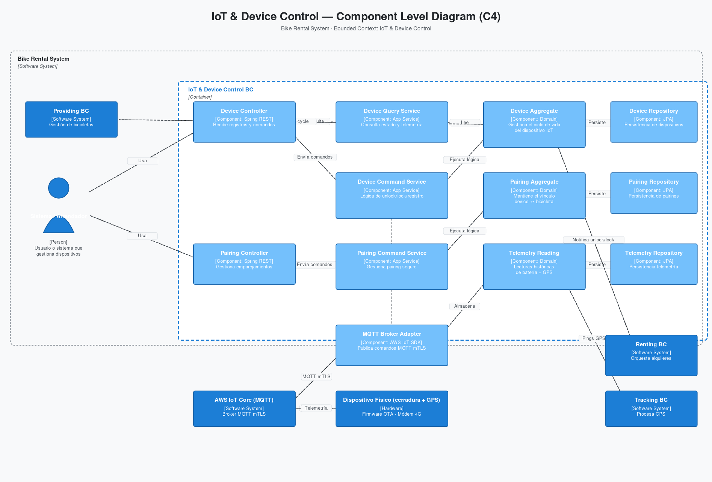

> *Figura 4.2.5.1 — Diagrama de componentes (C4) del Bounded Context IoT & Device Control. Se observan los controladores REST, los servicios de comandos y queries, los aggregates del dominio, los repositorios JPA y el adaptador MQTT que conecta con AWS IoT Core y los dispositivos físicos.*

---

### 4.2.5.6. Bounded Context Software Architecture Code Level Diagrams

#### 4.2.5.6.1 Bounded Context Domain Layer Class Diagrams

Este diagrama UML representa la arquitectura del flujo de control de
dispositivos IoT. Se basa en principios de diseño orientado a objetos y
sigue el enfoque **CQRS** (Command Query Responsibility Segregation).

Las entidades principales son **Device**, **Pairing** y **TelemetryReading**,
que gestionan el ciclo de vida del hardware acoplado a cada bicicleta.

Se interactúa con otros *bounded contexts* como:

- **Providing** (relación con Bicycle al emparejar)
- **Renting** (recibe los comandos de unlock/release durante el alquiler)
- **Tracking & Monitoring** (consume los pings GPS publicados)

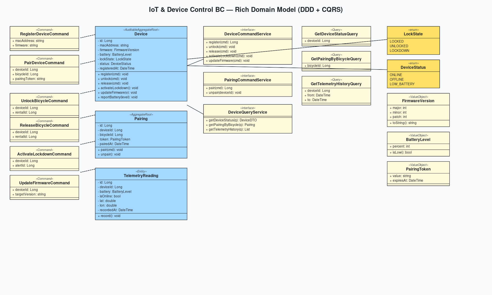

> *Figura 4.2.5.2 — Diagrama UML del Domain Layer del BC IoT & Device Control con sus aggregates, commands, queries, services y value objects.*

---

#### 4.2.5.6.2 Bounded Context Database Design Diagram

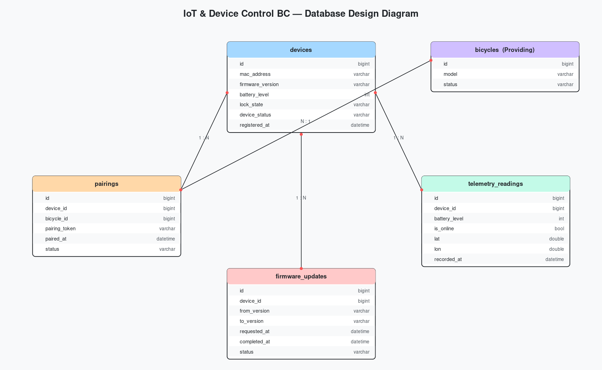

> *Figura 4.2.5.3 — Diseño de base de datos del BC IoT & Device Control. La entidad central `devices` se relaciona con `pairings` (emparejamientos device ↔ bicicleta), `telemetry_readings` (telemetría histórica) y `firmware_updates` (gestión de OTA).*

##### DEVICES

**Propósito:** Registro maestro de dispositivos IoT acoplados a las bicicletas.

| Campo | Tipo | Descripción |
|---|---|---|
| `id` | Long (PK) | Identificador único del dispositivo. |
| `mac_address` | varchar | Dirección MAC física del módulo IoT. |
| `firmware_version` | varchar | Versión semántica del firmware (`x.y.z`). |
| `battery_level` | int | Nivel de batería 0-100. |
| `lock_state` | varchar | Estado (`LOCKED`, `UNLOCKED`, `LOCKDOWN`). |
| `device_status` | varchar | Estado (`ONLINE`, `OFFLINE`, `LOW_BATTERY`). |
| `registered_at` | datetime | Fecha de registro inicial. |

**Relaciones:**

- `1:N` con **PAIRINGS**
- `1:N` con **TELEMETRY_READINGS**
- `1:N` con **FIRMWARE_UPDATES**

##### PAIRINGS

**Propósito:** Vínculo seguro entre un Device y una Bicycle.

| Campo | Tipo | Descripción |
|---|---|---|
| `id` | Long (PK) | Identificador único. |
| `device_id` | Long (FK) | Dispositivo emparejado. |
| `bicycle_id` | Long (FK) | Bicicleta emparejada (Providing). |
| `pairing_token` | varchar | Token de un solo uso. |
| `paired_at` | datetime | Fecha de emparejamiento. |
| `status` | varchar | Estado (`ACTIVE`, `REVOKED`). |

**Relaciones:**

- `N:1` con **DEVICES**
- `N:1` con **BICYCLES** (Providing)

##### TELEMETRY_READINGS

**Propósito:** Lecturas históricas de telemetría del dispositivo.

| Campo | Tipo | Descripción |
|---|---|---|
| `id` | Long (PK) | Identificador único. |
| `device_id` | Long (FK) | Dispositivo emisor. |
| `battery_level` | int | Nivel de batería en el momento. |
| `is_online` | bool | Estado de conexión. |
| `lat` | double | Latitud GPS. |
| `lon` | double | Longitud GPS. |
| `recorded_at` | datetime | Timestamp de la lectura. |

**Relaciones:**

- `N:1` con **DEVICES**

##### FIRMWARE_UPDATES

**Propósito:** Bitácora de actualizaciones OTA aplicadas a cada dispositivo.

| Campo | Tipo | Descripción |
|---|---|---|
| `id` | Long (PK) | Identificador. |
| `device_id` | Long (FK) | Dispositivo actualizado. |
| `from_version` | varchar | Versión anterior. |
| `to_version` | varchar | Versión nueva. |
| `requested_at` | datetime | Inicio de la actualización. |
| `completed_at` | datetime | Fin de la actualización (nullable). |
| `status` | varchar | Estado (`PENDING`, `IN_PROGRESS`, `COMPLETED`, `FAILED`). |

**Relaciones:**

- `N:1` con **DEVICES**


# Capítulo V: Solution UI/UX Design 


### 5.1.1. General Style Guidelines
Define las normas visuales fundamentales que rigen todo el producto. Incluye la definición de la paleta de **colores** (primarios, secundarios y de estado), la **tipografía** (fuentes, pesos y jerarquías visuales) y la **iconografía**, asegurando que cada elemento gráfico tenga un propósito claro y coherente.


### 5.1.2. Web, Mobile and IoT Style Guidelines
Establece reglas específicas adaptadas a cada plataforma. Se enfoca en la **adaptabilidad (responsive design)** para la web, patrones de **interacción táctil** para dispositivos móviles y interfaces simplificadas de alta visibilidad para dispositivos **IoT**, asegurando una experiencia óptima independientemente del hardware utilizado.

## 5.2. Information Architecture
La Arquitectura de la Información (IA) se centra en organizar, estructurar y etiquetar el contenido de forma efectiva. Su objetivo es ayudar a los usuarios a encontrar información y completar tareas con el menor esfuerzo cognitivo posible.

### 5.2.1. Organization Systems
Describe cómo se categoriza y agrupa la información dentro de la solución. Define si la estructura será **jerárquica** (árbol de decisiones), **secuencial** (paso a paso) o **matricial**, permitiendo que la navegación sea lógica y predecible para el usuario.

### 5.3.1 Landing Page Wireframe.

Wireframe Landing Page (Desktop)

<p align="center">
  
</p>

<p align="center">
  
</p>

<p align="center">
  
</p>

<p align="center">
  
</p>

### 5.3.2 Landing Page Mock-up.

## Mockups Landing Page (Desktop)

Sección Principal de la landing page:

<div style="page-break-before: always;"></div>

  

</p>

Sección Problemática y Características clave:

<p align="center">

  

  
  


</p>

Sección Beneficios:

<p align="center">

  

</p>

Sección "Acerca de":

<p align="center">
  
</p>


Sección de Precios y Formulario de contacto:

<p align="center">
  
  
</p>

<p align="center">

  

</p>

Sección de Descargas de aplicación móvil y pie de página:

<p align="center">

  

</p>

## 5.4.1. Applications Wireframes

### 5.4.1.2 Mobile Applications Wireframes

Ciclista 

<p align="center">
  
</p>

<p align="center">
  
</p>

<p align="center">
  
</p>

<p align="center">
  
</p>

<p align="center">
  
</p>

<p align="center">
  
</p>

Arrendador 

<p align="center">
  
</p>

<p align="center">
  
</p>

<p align="center">
  
</p>

<p align="center">
  
</p>

<p align="center">
  
</p>

<p align="center">
  
</p>

### 5.4.1.3 Desktop Applications Wireframes

## 5.4.2. Applications Wireflow Diagrams

Applications Wireflows Diagrams (Desktop)

User Goal: Autenticación y gestión de cuenta


User Goal: Alquiler de bicicleta


User goal: Historial de alquiler de bicicleta


User Goal: Finalización de bicicleta


User Goal:agregar bicicleta


#### Versión móvil del usuario


<div style="page-break-after: always;"></div>


<div style="page-break-after: always;"></div>

## 5.4.3. Applications Mock-ups

### 5.4.4.1 Mobile Applications Mock-ups

<p align="center">
  
</p>

<p align="center">
  
</p>

<p align="center">
  
</p>

<p align="center">
  
</p>

<p align="center">
  
</p>

<p align="center">
  
</p>

### 5.4.4.2 Desktop Applications Mock-ups

<p align="center">
  
</p>

<p align="center">
  
</p>

<p align="center">
  
</p>

<p align="center">
  
</p>

<p align="center">
  
</p>

<p align="center">
  
</p>

<p align="center">
  
</p>

## 5.4.4. Applications User Flow Diagrams

Esta sección presenta los diagramas de User Flow, organizados por rol y centrados en los objetivos principales del usuario. Cada flujo muestra la ruta de éxito (happy path), las decisiones críticas y las rutas alternativas ante casos de error o cancelación.

#### User Flow del Cliente: Alquilar una Bicicleta


##### Descripción

El flujo de usuario cliente se estructura alrededor del objetivo central: alquilar una bicicleta de forma rápida y segura. El diagrama incluye el acceso al sistema, la búsqueda y selección de bicicleta, el pago, la ejecución del viaje y el cierre del alquiler con comprobante.

##### Explicación del flujo

**Objetivo principal:** El visitante se registra o inicia sesión para poder acceder a la plataforma y comenzar a usar el servicio de alquiler de bicicletas.

**Ruta principal (Happy Path):** Registrarse o iniciar sesión → Acceder a la plataforma → Explorar bicicletas disponibles → Seleccionar una bicicleta → Confirmar condiciones → Realizar pago → Desbloquear bicicleta → Usar la bicicleta → Finalizar el alquiler.

**Rutas alternativas:**
- Si no tiene cuenta, primero debe registrarse y luego acceder.
- Si el pago falla, debe reintentarlo antes de continuar.
- Si rechaza las condiciones, puede volver a explorar otras bicicletas.

---

#### User Goal 1: Registrarse e iniciar sesión en la aplicación


**Descripción:** El estudiante desea crear una cuenta para acceder a las funcionalidades del sistema y gestionar sus alquileres de forma personalizada.

**Flujo:** El usuario abre la aplicación y selecciona la opción “Registrarse”. Ingresa sus datos personales y confirma el registro. Luego inicia sesión con sus credenciales y accede a su panel principal.

**Pantallas involucradas:**
- Registro de usuario
- Inicio de sesión
- Panel principal

**Comportamientos adicionales:** Si los datos ingresados son inválidos, se muestra un mensaje de error y se solicita corrección. Una vez autenticado, el sistema guarda la sesión activa para próximos ingresos automáticos.

<div style="page-break-after: always;"></div>

#### User Goal 2: Buscar y filtrar vehículos cercanos


**Descripción:** El estudiante desea explorar las opciones disponibles de bicicletas o scooters cercanos, aplicando filtros por tipo, precio o distancia para encontrar la mejor alternativa.

**Flujo:** El usuario accede al panel principal, abre la pantalla de búsqueda o mapa y aplica filtros para encontrar las opciones cercanas que mejor se ajusten a su necesidad.

**Pantallas involucradas:**
- Panel principal
- Pantalla de búsqueda / mapa
- Detalle del vehículo seleccionado

**Comportamientos adicionales:** El sistema obtiene la ubicación actual del usuario y actualiza los resultados en tiempo real. Si no hay vehículos disponibles, se muestra un mensaje informativo con la opción de ampliar el rango de búsqueda.

<div style="page-break-after: always;"></div>

#### User Goal 3: Realizar y confirmar una reserva


**Descripción:** El estudiante selecciona un vehículo disponible, define el horario y confirma la reserva para garantizar su uso en el periodo deseado.

**Flujo:** El usuario abre el detalle del vehículo, accede a la pantalla de reserva, define la fecha u horario y confirma la reserva.

**Pantallas involucradas:**
- Detalle del vehículo
- Pantalla de reserva
- Confirmación de reserva

**Comportamientos adicionales:** Si otro usuario reserva el mismo vehículo antes de la confirmación, se notifica la indisponibilidad. Al confirmar, el estado del vehículo cambia automáticamente a “reservado”.

<div style="page-break-after: always;"></div>

#### User Goal 4: Pagar el alquiler y recibir confirmación


**Descripción:** El estudiante completa el pago del alquiler mediante la pasarela integrada y recibe una confirmación inmediata de la transacción.

**Flujo:** El usuario accede a la pantalla de pago, ingresa el método de pago y confirma la transacción. Luego recibe el comprobante digital y la confirmación del alquiler.

**Pantallas involucradas:**
- Pantalla de pago
- Confirmación de pago
- Recibo o comprobante

**Comportamientos adicionales:** Si el pago falla, el sistema permite reintentar o elegir otro método de pago. Tras un pago exitoso, se genera un comprobante digital y se actualiza el historial del usuario.

<div style="page-break-after: always;"></div>

#### User Goal 5: Ver y responder calificaciones y reseñas


**Descripción:** El estudiante consulta las valoraciones y comentarios realizados por otros usuarios sobre su servicio, y puede responder para mantener la comunicación.

**Flujo:** El usuario abre la sección de reseñas, revisa los comentarios asociados a su actividad y responde cuando es necesario.

**Pantallas involucradas:**
- Pantalla de reseñas
- Detalle de reseña
- Panel principal

**Comportamientos adicionales:** Al responder una reseña, el sistema notifica al usuario que su comentario fue atendido.

<div style="page-break-after: always;"></div>

#### User Goal 1: Registrarse como arrendador


**Descripción:** El arrendador crea una cuenta para ofrecer sus vehículos en la plataforma y administrar su disponibilidad.

**Flujo:** El arrendador abre la aplicación, selecciona registrarse, completa los datos de contacto y confirma el alta del perfil.

**Pantallas involucradas:**
- Registro de arrendador
- Inicio de sesión
- Panel principal

**Comportamientos adicionales:** El sistema valida los datos de contacto y activa el perfil tras la verificación del correo electrónico.

<div style="page-break-after: always;"></div>

#### User Goal 2: Gestionar vehículos publicados


**Descripción:** El arrendador puede agregar, editar o eliminar vehículos, además de cambiar su estado de disponibilidad según la situación.

**Flujo:** El arrendador accede al panel principal, abre la sección de vehículos publicados y realiza las acciones de edición o actualización necesarias.

**Pantallas involucradas:**
- Panel principal
- Pantalla “Mis vehículos”
- Formulario de edición de vehículo

**Comportamientos adicionales:** Los cambios se reflejan en la vista pública del catálogo. Si el vehículo está reservado, el sistema impide su eliminación hasta finalizar el alquiler activo.

<div style="page-break-after: always;"></div>

#### User Goal 3: Consultar historial de alquileres


**Descripción:** El arrendador revisa los registros de alquileres pasados para llevar control de sus operaciones y analizar la demanda de cada vehículo.

**Flujo:** El arrendador accede al historial, revisa los alquileres almacenados y aplica filtros por fecha o vehículo.

**Pantallas involucradas:**
- Panel principal
- Pantalla de historial de alquileres

**Comportamientos adicionales:** Se permite filtrar el historial por rango de fechas o por vehículo.

<div style="page-break-after: always;"></div>

#### User Goal 4: Revisar ingresos automáticos


**Descripción:** El arrendador visualiza los ingresos generados por los alquileres, con la posibilidad de filtrarlos por periodo o por tipo de vehículo.

**Flujo:** El arrendador entra a la sección de ingresos, consulta el resumen económico y revisa el detalle de transacciones cuando lo necesita.

**Pantallas involucradas:**
- Panel principal
- Pantalla de ingresos
- Detalle de transacciones

**Comportamientos adicionales:** Los ingresos se actualizan en tiempo real conforme a nuevas reservas. Si no hay movimientos en el periodo seleccionado, el sistema muestra un mensaje informativo.

<div style="page-break-after: always;"></div>

#### User Goal 5: Ver y responder calificaciones y reseñas


**Descripción:** El arrendador consulta las valoraciones y comentarios realizados por los usuarios sobre sus vehículos, y puede responder para mantener una buena reputación.

**Flujo:** El arrendador abre la sección de reseñas, revisa los comentarios recibidos y responde cuando es necesario.

**Pantallas involucradas:**
- Pantalla de reseñas
- Detalle de reseña
- Panel principal

**Comportamientos adicionales:** Al responder una reseña, el sistema notifica al usuario que su comentario fue atendido.

<div style="page-break-after: always;"></div>

## 5.5. Applications Prototyping

  

Link Prototipo:[Ver video](https://upcedupe-my.sharepoint.com/:v:/g/personal/u202220219_upc_edu_pe/IQB-a0BnCjSUR4ZwVEeGGSbBAadbmXSWQ-wATjE8joK3vC4?e=3pUhev&nav=eyJyZWZlcnJhbEluZm8iOnsicmVmZXJyYWxBcHAiOiJTdHJlYW1XZWJBcHAiLCJyZWZlcnJhbFZpZXciOiJTaGFyZURpYWxvZy1MaW5rIiwicmVmZXJyYWxBcHBQbGF0Zm9ybSI6IldlYiIsInJlZmVycmFsTW9kZSI6InZpZXcifX0%3D)
<br>
enlacees:<br>
[Arrendador](https://stitch.withgoogle.com/preview/5914202302097093610?node-id=becd46efba38487c905a1fd753300f5c)<br>
[Arrendatario](https://stitch.withgoogle.com/preview/5914202302097093610?node-id=b293857dd63f455cb7a9769a07d61c5d)<br>
[Admin](https://stitch.withgoogle.com/preview/5914202302097093610?node-id=630eab06a50841eca5b4bc454a0a4975)<br>


## 5.6. IoT Device Design

### Introducción y Criterios de Diseño

Esta sección presenta la propuesta de diseño físico y diseño de circuito para el nodo IoT instalado en cada bicicleta de BiciSmartIOT. El objetivo del prototipo es validar, en entorno Wokwi, la interacción entre sensores, actuadores y lógica de control para cubrir tres funciones críticas del sistema: desbloqueo remoto, detección de uso y bloqueo seguro al cierre del alquiler.

Los principales criterios para las decisiones de diseño del hardware son:

- Seguridad operativa: el dispositivo debe responder de forma confiable a comandos de bloqueo y desbloqueo, manteniendo estados consistentes (`LOCKED`, `UNLOCKED`, `LOCKDOWN`).
- Telemetría en tiempo real: el hardware debe capturar eventos de movimiento y estado para alimentar el monitoreo de uso de la bicicleta.
- Bajo consumo y simplicidad de integración: se prioriza un microcontrolador con conectividad inalámbrica y soporte amplio de librerías para acelerar el prototipado.
- Escalabilidad funcional: el diseño debe permitir añadir sensores y reglas (por ejemplo, batería baja o alerta por manipulación) sin rediseñar toda la arquitectura.
- Viabilidad de simulación: los componentes seleccionados deben estar disponibles o ser representables en Wokwi para validar comportamiento antes del montaje físico.

<div style="page-break-after: always;"></div>

### Relación con la Arquitectura de Información y Guía de Estilos

El diseño de la interfaz física IoT (IoT Device Physical Interfaces) se alinea con la arquitectura del bounded context IoT & Device Control. En este modelo:

- La app y el backend envían comandos de control al dispositivo.
- El dispositivo publica eventos de telemetría para tracking y monitoreo.
- El estado físico de la bicicleta se refleja en la aplicación móvil en tiempo cercano a real.

En la capa de experiencia de usuario, la semántica de estados del hardware se integra con la interfaz visual de la plataforma:

- Estado seguro: indicador equivalente a operación correcta o bicicleta bloqueada.
- Estado activo: indicador equivalente a bicicleta en uso o desbloqueada.
- Estado de alerta: indicador equivalente a evento crítico (bloqueo remoto, manipulación o error de operación).

<div style="page-break-after: always;"></div>

### Propuesta de Diseño de Circuito (Hardware Schematic)

Para la validación lógica de componentes y conexiones se propone un esquemático en Wokwi con un ESP32 como núcleo del sistema.

Componentes recomendados para el prototipo en Wokwi (alineados a BiciSmartIOT):

1. ESP32 DevKit v1: microcontrolador principal del dispositivo de bicicleta.
2. Servo SG90: simulación del smart lock para comandos `unlock/lock/lockdown`.
3. MPU6050: sensor de movimiento para detectar bicicleta en uso (US28).
4. GPS simulado por Serial (coordenadas mock): tracking de ubicación en la simulación.
5. LED RGB (o 3 LEDs): semaforo de estado operativo (`LOCKED`, `UNLOCKED`, `LOCKDOWN`).
6. Pulsador opcional: simulacion de accion local de seguridad o emparejamiento inicial.

<div style="page-break-after: always;"></div>

#### Mapeo sugerido de pines (Wokwi)

- `GPIO 21` -> SDA del MPU6050
- `GPIO 22` -> SCL del MPU6050
- `GPIO 18` (etiqueta `D18` en Wokwi) -> señal de control del servo (smart lock simulado)
- `VIN` en Wokwi -> alimentacion del servo a 5V
- `GPIO 4` -> canal rojo LED RGB (con resistencia de 220 ohm)
- `GPIO 2` -> canal verde LED RGB (con resistencia de 220 ohm)
- `GPIO 15` -> canal azul LED RGB (con resistencia de 220 ohm)
- `GPIO 13` -> pulsador (modo `INPUT_PULLUP`)

Notas de montaje en Wokwi:

- Conectar `VCC` y `GND` de todos los módulos correctamente.
- En Wokwi, usa `VIN` como referencia de 5V para el servo.
- Si no usas LED RGB, reemplazar por tres LEDs individuales (uno por estado).
- Usar eventos por monitor serial con formato `GPS:lat,lon` para simular tracking.

<div style="page-break-after: always;"></div>

### Configuración que debes poner en Wokwi

Para que la simulacion represente tu arquitectura real (App -> Backend -> IoT Device Control), en Wokwi debes preparar lo siguiente:

1. Crear un proyecto nuevo con placa `ESP32`.
2. Agregar los componentes: `Servo`, `MPU6050`, `RGB LED` y `Pushbutton` opcional.
3. Cablear según el mapeo de pines propuesto.
4. Programar una maquina de estados minima del dispositivo:
	- `LOCKED`
	- `UNLOCKED`
	- `LOCKDOWN`
5. Simular comandos del backend por monitor serial (equivalente a MQTT):
	- `CMD:UNLOCK` -> cambia a `UNLOCKED` y posiciona servo en apertura.
	- `CMD:LOCK` -> cambia a `LOCKED` y cierra servo.
	- `CMD:LOCKDOWN` -> fuerza bloqueo de seguridad.
6. Definir reglas de telemetria alineadas a tus historias:
	- US27 (inicio automatico): cuando llega `CMD:UNLOCK` y hay movimiento, registrar `RENTAL_STARTED`.
	- US28 (bicicleta en uso): si MPU6050 supera umbral, publicar `MOTION_DETECTED`; si cae por debajo, `MOTION_IDLE`.
	- Tracking: generar coordenadas mock y publicar `LOCATION_UPDATE` periodico.
7. Imprimir todos los eventos en monitor serial para evidenciar trazabilidad de extremo a extremo.

<div style="page-break-after: always;"></div>

#### Estructura de mensajes recomendada en Wokwi (para que coincida con tu arquitectura)

- Comandos de entrada simulados:
  - `CMD:UNLOCK`
  - `CMD:LOCK`
  - `CMD:LOCKDOWN`
- Eventos de salida del dispositivo:
  - `EVT:LOCK_STATE=LOCKED|UNLOCKED|LOCKDOWN`
  - `EVT:MOTION=DETECTED|IDLE`
  - `EVT:GPS=-12.0464,-77.0428`
  - `EVT:RENTAL=STARTED|PAUSED|CLOSED`

<div style="page-break-after: always;"></div>

### Flujos de Interacción del Prototipo IoT

El hardware cubre interacciones físicas que se sincronizan con las vistas de la aplicación móvil, definiendo los siguientes flujos principales:

<div style="page-break-after: always;"></div>

#### 1. Flujo de Desbloqueo e Inicio de Alquiler

- Paso 1: el backend emite comando `CMD:UNLOCK` (simulado por Serial en Wokwi).
- Paso 2: el actuador cambia a `UNLOCKED` y el LED cambia a estado activo.
- Paso 3: al detectar movimiento inicial, se publica `EVT:RENTAL=STARTED` (US27).

<div style="page-break-after: always;"></div>

#### 2. Flujo de Monitoreo de Uso

- Paso 1: el MPU6050 reporta aceleracion sobre umbral y emite `EVT:MOTION=DETECTED`.
- Paso 2: el dispositivo envia telemetria de uso y ubicacion (`EVT:GPS=...`).
- Paso 3: si no hay movimiento por un tiempo definido, emite `EVT:MOTION=IDLE` (US28).

<div style="page-break-after: always;"></div>

#### 3. Flujo de Cierre y Bloqueo Seguro

- Paso 1: el backend envia `CMD:LOCK` al finalizar alquiler.
- Paso 2: el actuador retorna a `LOCKED`.
- Paso 3: se publica `EVT:LOCK_STATE=LOCKED` y `EVT:RENTAL=CLOSED`.

<div style="page-break-after: always;"></div>

#### 4. Flujo de Seguridad (Lockdown)

- Paso 1: ante evento critico o comando remoto, se envia `CMD:LOCKDOWN`.
- Paso 2: el dispositivo activa estado `LOCKDOWN` y LED en rojo.
- Paso 3: se publica `EVT:LOCK_STATE=LOCKDOWN` para alertar a la plataforma.

<div style="page-break-after: always;"></div>

### Evidencias (capturas de Wokwi)

Para cerrar correctamente la sección 5.6, a continuación se insertan las capturas generadas en la simulación Wokwi que validan los flujos descritos:

- Circuito y montaje del prototipo:

	
	*Figura — Montaje con ESP32, servo, sensor MPU6050, LED y pulsador.*

- Desbloqueo remoto (comando → efecto):

	
	*Figura — `CMD:UNLOCK` y `EVT:LOCK_STATE=UNLOCKED` (servo abierto / LED activo).* 

- Detección de movimiento y registro de inicio de alquiler:

	
	*Figura — `EVT:MOTION=DETECTED` y `EVT:RENTAL=STARTED` como telemetría del MPU6050.*

- Cierre de alquiler y bloqueo:

	
	*Figura — `CMD:LOCK` y `EVT:RENTAL=CLOSED` (servo en posición cerrada).*

- Evento GPS simulado (tracking):

	
	*Figura — `EVT:GPS=...` (coordenadas mock enviadas por Serial para validar la integración de tracking).* 

Estas capturas sirven como registro de prueba (equivalente a mensajes publicados en un broker MQTT) y deben acompañarse en el informe de las líneas del monitor serial que muestran los mensajes `CMD:*` y `EVT:*` para garantizar trazabilidad.


  

# 6.2. Landing Page, Services & Applications Implementation.
## 6.1. Software Configuration Management

### Requirements Management

- **Discord** y **WhatsApp**: Estas plataformas fueron esenciales para la comunicación interna del equipo, siendo WhatsApp especialmente útil por su facilidad para gestionar grupos de trabajo.

- **Trello**: Se utilizó para planificar y dar seguimiento al avance del proyecto mediante tableros que representaban el backlog del producto y otras tareas organizativas.

### Product UX/UI

- **Figma**: Herramienta principal para el diseño de wireframes y prototipos, tanto en versiones de escritorio como móviles.

- **Miro**: Se utilizó como apoyo en la creación de los *Scenario Mapping* para ambos segmentos objetivo considerados en el desarrollo del proyecto.

### Software Development

- **Visual Studio Code**: Editor principal utilizado para el desarrollo y programación del *landing page*.

- **GitHub** y **Git Bash**: Herramientas empleadas para el control de versiones y el desarrollo colaborativo del repositorio del proyecto.

- **HTML y CSS**: Lenguajes fundamentales utilizados para la estructura (HTML) y el diseño visual (CSS) del *landing page*.

### Software Documentation

- **Google Drive**: Plataforma utilizada para el almacenamiento compartido de documentación e informes colaborativos.

- **Google Meet** y **Zoom**: Google Meet fue utilizado principalmente para las reuniones virtuales del equipo, mientras que Zoom se empleó para las grabaciones de entrevistas y presentaciones relacionadas con el desarrollo del proyecto.

- **Lucidchart**: Herramienta utilizada para la creación de diagramas de flujo y modelado visual del sistema, incluyendo diagramas de clases.

- **Structurizr**: Plataforma utilizada para la creación del modelo C4 en sus distintos niveles (contexto, contenedores y componentes), trabajando en conjunto con Visual Studio Code.

- **Vertabelo**: Herramienta empleada para el diseño de la base de datos y la elaboración de diagramas lógicos.
  
## 6.2.1. Sprint 1
### 6.2.1.1. Sprint Planning 1.

El Sprint Planning 1 establece la organización inicial del equipo para
desarrollar el MVP de **BiciSmartIOT**. Se definen el objetivo del Sprint,
las User Stories que serán trabajadas, la capacidad del equipo y los
entregables esperados. Este proceso permite una planificación clara y el
alineamiento de todo el equipo hacia un mismo objetivo para la entrega de
valor.

| Campo | Información |
|---|---|
| **Sprint #** | Sprint 1 |
| **Date** | 2026-04-18 |
| **Time** | 05:00 PM |
| **Location** | Virtual (Discord y Zoom) |
| **Prepared By** | Oscar Espinoza, Stephano Landauri, Renzo Uribe, Cameron Bustamante, Fabrisio Belahoni |
| **Attendees (to planning meeting)** | Oscar Espinoza, Stephano Landauri, Renzo Uribe, Cameron Bustamante, Fabrisio Belahoni |
| **Sprint n − 1 Review Summary** | No aplica (Primer Sprint del proyecto BiciSmartIOT). |
| **Sprint n − 1 Retrospective Summary** | No aplica (Primer Sprint del proyecto BiciSmartIOT). |
| **Sprint n Goal** | Entregar la versión corregida y mejorada de los artefactos presentados previamente, e implementar y desplegar la primera versión del Landing Page y de las Frontend Web Applications.<br><br>**Sprint Goal:**<br>Our focus is on launching the first public deployment of BiciSmartIOT.<br>We believe it delivers the platform's first product visibility through a working Landing Page and a navigable Frontend Web Application.<br>This will be confirmed when visitors can browse the Landing Page, create an account, sign in, explore the bicycle catalog, view bicycle details, access their personal panel and consult the GPS tracking screen successfully. |
| **Sprint n Velocity** | 82 Story Points |
| **Sprint Goal & User Stories** | **User Stories:**<br>HU01, HU02, HU03, HU04, HU05, HU06, HU07, HU08, HU09, HU10, HU11, HU12, HU13, HU14, HU15, HU16, HU17, HU18, TS01, TS02, TS03, TS04, TS05, TS06, TS07, TS08 |
| **Sum of Story Points** | 82 Story Points |

### 6.2.1.2. Aspect Leaders and Collaborators.

| Team Member (Last Name, First Name) | GitHub Username | Landing Page | Web Application |
|---|---|---|---|
| Bustamante Leveau, Cameron Charlotte | CameronBustamanteLeveau2 | C | C |
| Uribe Livia, Renzo Sebastián | JKOlimpo | C | C |
| Espinoza Quijandría, Oscar Leonardo | Carbocnito5443 | C | C |
| Landauri Preciado, Stephano Mayzron | Mayrzon02 | C | C |
| Belahonia Miranda, Fabrisio | devfab17 | C | C |

### 6.2.1.3. Sprint Backlog 1.

## 5.2.1.3. Sprint Backlog 1

El Sprint Backlog 1 consolida todas las funcionalidades principales de
**BiciSmartIOT**, enfocándose en completar la primera experiencia de
usuario: registro, login, exploración del catálogo de bicicletas, detalle
de cada unidad, panel personal del usuario, seguimiento GPS en tiempo
real, dashboard del arrendador, sección de planes, testimonios y FAQ. En
paralelo, se consolida la versión corregida y mejorada de los artefactos
DDD presentados previamente.

| User Story | Work-Item / Task | Description | Estimation (Hours) | Assigned To | Status |
|---|---|---|---|---|---|
| HU01 | T1  | Crear sección Hero del Landing con CTA principal | 5 | Oscar (Landing) | Done |
| HU02 | T2  | Crear sección Planes de Renta con 3 cards | 4 | Oscar (Landing) | Done |
| HU03 | T3  | Crear sección Testimonios con carousel | 3 | Fabrisio (Animaciones) | Done |
| HU04 | T4  | Crear sección FAQ con acordeón | 3 | Renzo (Frontend) | Done |
| HU05 | T5  | Crear pantalla de Registro de cuenta | 5 | Cameron (Auth) | Done |
| HU06 | T6  | Crear pantalla de Iniciar Sesión | 5 | Cameron (Auth) | Done |
| HU07 | T7  | Crear pantalla de Catálogo de Bicicletas con grid | 6 | Renzo (Frontend) | Done |
| HU08 | T8  | Crear pantalla de Detalle de Bicicleta | 5 | Renzo (Frontend) | Done |
| HU09 | T9  | Crear Panel personal con métricas de actividad | 6 | Stephano (Dashboard) | Done |
| HU10 | T10 | Crear pantalla de Seguimiento GPS en tiempo real | 5 | Stephano (IoT) | Done |
| HU11 | T11 | Crear Dashboard de gestión del arrendador con gráficos | 6 | Stephano (Dashboard) | Done |
| HU12 | T12 | Crear prototipo Mobile responsive | 4 | Fabrisio (Animaciones) | Done |
| HU13 | T13 | Implementar Navbar y Footer globales | 3 | Renzo (Frontend) | Done |
| HU13 | T14 | Definir paleta de colores Kinetic y tipografía | 3 | Fabrisio (Diseño) | Done |
| HU13 | T15 | Crear biblioteca de componentes UI reutilizables | 5 | Fabrisio (Diseño) | Done |
| HU14 | T16 | Rehacer EventStorming en 7 pasos incrementales | 6 | Stephano (DDD) | Done |
| HU15 | T17 | Rehacer Candidate Context Discovery con 3 técnicas | 4 | Stephano (DDD) | Done |
| HU16 | T18 | Rehacer Domain Message Flows como Domain Storytelling | 5 | Stephano (DDD) | Done |
| HU17 | T19 | Crear 7 Bounded Context Canvases V5 | 6 | Stephano (DDD) | Done |
| HU18 | T20 | Documentar Context Mapping con patrones DDD | 4 | Oscar (DDD) | Done |
| TS01 | T21 | Configurar repositorio GitHub y branching strategy | 2 | Cameron (DevOps) | Done |
| TS02 | T22 | Configurar tokens de diseño y theme dark | 3 | Fabrisio (Diseño) | Done |
| TS03 | T23 | Configurar pipeline CI/CD con GitHub Actions | 4 | Cameron (DevOps) | Done |
| TS04 | T24 | Desplegar Landing Page en hosting | 2 | Cameron (DevOps) | Done |
| TS05 | T25 | Desplegar Frontend Web Application | 3 | Cameron (DevOps) | Done |
| TS06 | T26 | Configurar dominio + certificado SSL/HTTPS | 2 | Cameron (DevOps) | Done |
| TS07 | T27 | Documentar componentes UI en la guía de estilos | 4 | Fabrisio (Diseño) | Done |
| TS08 | T28 | Redactar documentación del Sprint 1 (informe) | 3 | Oscar (Documentación) | Done |

### 6.2.1.4. Development Evidence for Sprint Review.

## LANDING PAGE:

Debido a la refactorización de un código, además de la realización de solo una persona por elección y consentimiento de todo el grupo, solo se presenta el commit de subida al repositorio principal de la organización.
Landing:

| Repository | Branch | Commit ID | Commit Message | Commit Message Body | Committed on (Date) |
|---|---|---|---|---|---|
| [https://github.com/TF-SolucionesIoT/LandingPage](https://github.com/BiciSmartIoT/front-end.git) | main | 47fea191f279d7aeac5bd1cf043b4b887c3b48e2 | first commit | first commit | 12/05/2026 |

web:

## WEB APPLICATION:

| Repository | Branch | Commit ID | Commit Message | Commit Message Body | Committed on (Date) |
|---|---|---|---|---|---|
| [https://github.com/TF-SolucionesIoT/Front-End-IOT](https://github.com/BiciSmartIoT/front-end.git) | main | 79d7aea8 | first commit | first commit | 12/05/2026 |
| [https://github.com/TF-SolucionesIoT/Front-End-IOT](https://github.com/BiciSmartIoT/front-end.git) | main | 9992216 | Thanks, now that you add a chart/dashboard for “SpO₂” |  | 12/05/2026 |
| [https://github.com/TF-SolucionesIoT/Front-End-IOT](https://github.com/BiciSmartIoT/front-end.git) | main | 329ec31 | In the “Vitals” section, when clicking on “Heart Rate”, “SpO₂”, or “Blood” |  | 12/05/2026 |
| [https://github.com/TF-SolucionesIoT/Front-End-IOT](https://github.com/BiciSmartIoT/front-end.git) | main | a341a86 | In the “Treatments” section, add a button labeled “Add Treatment” that a |  | 12/05/2026 |
| [https://github.com/TF-SolucionesIoT/Front-End-IOT](https://github.com/BiciSmartIoT/front-end.git) | main | 8d09a7b | Add a new section called “Syntomic” to display a history of symptoms wit |  | 12/05/20269 |
| [https://github.com/TF-SolucionesIoT/Front-End-IOT](https://github.com/BiciSmartIoT/front-end.git)| main | 7c0093a | Add a new section called “Alteration” to display a history of alteration |  | 12/05/2026 |


### 6.2.1.5. Testing Suite Evidence for Sprint Review.

Para este sprint, no nos centramos en elaborar los servicios web, por lo tanto, no hay pruebas unitarias, de integración y de aceptación.

### 6.2.1.6. Execution Evidence for Sprint Review.

A continuación, se muestran las evidencias de ejecución de la landing page y de la primera versión de la aplicación web.

Landing Page y App Web:

<div align="center">


<br><br>


<br><br>


<br><br>


<br><br>


<br><br>


</div>

Link de Video:https://youtu.be/g29aSgglfV0

### 6.2.1.7. Services Documentation Evidence for Sprint Review.

Para este sprint, no nos centramos en elaborar los servicios web, por lo tanto, no hay evidencia de documentación de dichos servicios.

### 6.2.1.8. Software Deployment Evidence for Sprint Review.

En este primer sprint, se desplegaron tanto la Landing Page como la primera versión de la aplicación web frontend utilizando Cloudflare Pages, un servicio de Cloudflare que permite publicar sitios web estáticos y aplicaciones frontend de manera rápida, segura y escalable. Para ambos despliegues, se vinculó el repositorio correspondiente desde GitHub hacia Cloudflare Pages, permitiendo que cada cambio realizado en la rama principal del proyecto pueda actualizarse automáticamente en el entorno desplegado. De esta manera, el equipo pudo contar con versiones públicas y accesibles del landing y del frontend para validar el avance del producto.

De manera general, el proceso de despliegue consiste en ingresar a Cloudflare, seleccionar la opción Pages, conectar la cuenta de GitHub y escoger el repositorio del proyecto. Luego, se configura la rama principal desde donde se realizará el despliegue, se define el comando de construcción correspondiente si el proyecto lo requiere, y se indica la carpeta de salida generada por el build. Finalmente, Cloudflare Pages ejecuta el proceso de despliegue y genera una URL pública para acceder al sitio. Este procedimiento fue aplicado tanto para la Landing Page como para la aplicación web frontend.

<div align="center">


<br><br>


<br><br>


<br><br>


<br><br>


<br><br>


</div>

Depliegue: 

<div align="center">


<br><br>


<br><br>


</div>

### 6.2.1.9. Team Collaboration Insights during Sprint.

<div align="center">


</div>

## 6.2.2. Sprint 2

El Sprint 2 se enfoca en consolidar la integración entre la aplicación, los servicios web y los componentes IoT de **BiciSmartIOT**. A diferencia del Sprint 1, que priorizó la primera versión visual del Landing Page y de la aplicación web, este sprint concentra el trabajo en endpoints backend, la incorporación de un **Edge Gateway** para recibir y reenviar eventos IoT, documentación OpenAPI, simulación de eventos IoT, pruebas funcionales, despliegue actualizado y evidencias de colaboración del equipo.

### 6.2.2.1. Sprint Planning 2.

El Sprint Planning 2 permitió organizar el trabajo necesario para avanzar desde una solución principalmente visual hacia una solución integrada. Se priorizaron las historias relacionadas con autenticación, gestión de bicicletas, reservas, control IoT, monitoreo GPS, alertas, notificaciones y panel administrativo. Además, se definieron tareas de documentación, testing y despliegue para cumplir con los criterios solicitados en la revisión del sprint.

| Campo | Información |
|---|---|
| **Sprint #** | Sprint 2 |
| **Sprint Planning Background** | Se parte de la versión desplegada del Landing Page y de la primera versión de la aplicación web desarrollada en Sprint 1. Para este sprint se prioriza la integración de servicios, documentación técnica, testing y evidencias de despliegue. |
| **Date** | 2026-06-14 |
| **Time** | 05:00 PM |
| **Location** | Virtual (Discord y Google Meet) |
| **Prepared By** | Oscar Espinoza, Stephano Landauri, Renzo Uribe, Cameron Bustamante, Fabrisio Belahoni |
| **Attendees (to planning meeting)** | Oscar Espinoza, Stephano Landauri, Renzo Uribe, Cameron Bustamante, Fabrisio Belahoni |
| **Sprint n - 1 Review Summary** | En Sprint 1 se logró publicar la primera versión del Landing Page y de la aplicación web, incluyendo navegación, vistas principales, catálogo, detalle de bicicletas, panel de usuario, tracking GPS simulado y despliegue en Cloudflare Pages. |
| **Sprint n - 1 Retrospective Summary** | El equipo identificó como oportunidad de mejora distribuir con mayor claridad las tareas técnicas, documentar commits con mensajes más descriptivos, preparar evidencias visuales durante el desarrollo y adelantar la documentación de servicios para evitar concentrarla al final del sprint. |
| **Sprint n Goal** | Integrar la aplicación frontend con servicios web y flujos IoT principales, incorporar un Edge Gateway entre el dispositivo y el backend, documentar endpoints con OpenAPI, validar el funcionamiento mediante pruebas y publicar una versión actualizada del producto.<br><br>**Sprint Goal:**<br>Our focus is on integrating BiciSmartIOT's application with backend services, an Edge Gateway and IoT workflows.<br>We believe it delivers a functional product increment where users can authenticate, manage bicycles, reserve rentals, interact with smart lock flows, monitor GPS information and receive system alerts.<br>This will be confirmed when the application consumes documented APIs, the Edge Gateway receives and forwards IoT events, and the updated deployment is accessible for Sprint Review. |
| **Sprint n Velocity** | 95 Story Points |
| **Sprint Goal & User Stories** | **User Stories / Technical Stories:**<br>TS01, TS02, TS03, TS04, TS06, TS07, TS08, TS09, TS10, TS11, US25, US26, US29, US31 |
| **Sum of Story Points** | 95 Story Points |

### 6.2.2.2. Aspect Leaders and Collaborators.

Para este sprint se definieron aspectos de trabajo asociados a los productos y componentes que forman parte del incremento: servicios backend, aplicación web, integración IoT, documentación/testing y despliegue. La matriz permite identificar quién lidera cada aspecto y quiénes colaboran en su implementación.

| Team Member (Last Name, First Name) | GitHub Username | Backend Services | Edge Gateway | Web Application | IoT Integration | Testing & Documentation | Deployment |
|---|---|---|---|---|---|---|---|
| Bustamante Leveau, Cameron Charlotte | CameronBustamanteLeveau2 | C | C | C | C | C | L |
| Uribe Livia, Renzo Sebastián | JKOlimpo | C | C | L | C | C | C |
| Espinoza Quijandría, Oscar Leonardo | Carbocnito5443 | L | L | C | C | L | C |
| Landauri Preciado, Stephano Mayzron | Mayrzon02 | C | C | C | L | C | C |
| Belahonia Miranda, Fabrisio | devfab17 | C | C | C | C | C | C |

### 6.2.2.3. Sprint Backlog 2.

El Sprint Backlog 2 consolida las tareas técnicas y funcionales necesarias para avanzar en la integración de **BiciSmartIOT**. El alcance se centra en construir servicios web para autenticación, bicicletas, reservas y monitoreo; conectar la experiencia de usuario con dichos servicios; procesar eventos IoT de smart lock, GPS y sensores; preparar pruebas y documentar endpoints para la revisión del sprint.

**Imagen requerida:** colocar aquí una captura del board del Sprint 2 en la herramienta de gestión utilizada. Guardar la imagen como `assets/images/sprint2/sprint2_board.png`.

<div align="center">


</div>

**URL del Board:** Reemplazar con el enlace público del board de Sprint 2.

| Sprint # | User Story | Work-Item / Task | Description | Estimation (Hours) | Assigned To | Status |
|---|---|---|---|---|---|---|
| Sprint 2 | TS01 | T29 - Implementar endpoints IAM | Crear endpoints de registro, login, validación de credenciales y emisión de token para usuarios del sistema. | 8 | Oscar (Backend) | Done |
| Sprint 2 | TS02 | T30 - Implementar gestión de bicicletas | Crear operaciones CRUD para bicicletas registradas por arrendadores. | 8 | Oscar (Backend) | Done |
| Sprint 2 | TS03 | T31 - Implementar búsqueda geolocalizada | Exponer endpoint para consultar bicicletas cercanas mediante coordenadas GPS. | 6 | Renzo (Frontend/Integration) | Done |
| Sprint 2 | TS04 | T32 - Implementar reservas y alquileres | Crear endpoints para reservar, iniciar y finalizar alquileres. | 8 | Oscar (Backend) | Done |
| Sprint 2 | TS06 | T33 - Integrar Smart Lock | Simular comandos `CMD:UNLOCK`, `CMD:LOCK` y eventos de estado del candado inteligente. | 7 | Stephano (IoT) | Done |
| Sprint 2 | TS07 | T34 - Procesar GPS en tiempo real | Registrar eventos de ubicación y mostrarlos en la pantalla de seguimiento. | 7 | Stephano (IoT) | Done |
| Sprint 2 | TS08 | T35 - Procesar eventos de sensores | Registrar eventos de movimiento, uso y estado del dispositivo IoT. | 6 | Stephano (IoT) | Done |
| Sprint 2 | TS09 | T36 - Implementar alertas IoT | Definir eventos críticos como movimiento no autorizado, bloqueo y fin de alquiler. | 5 | Fabrisio (Alerts) | Done |
| Sprint 2 | TS10 | T37 - Implementar notificaciones | Preparar notificaciones para reservas, alquileres, pagos e incidencias. | 5 | Fabrisio (Notifications) | Done |
| Sprint 2 | TS11 | T38 - Actualizar panel admin | Incorporar métricas de usuarios, bicicletas, reservas y eventos IoT. | 6 | Renzo (Frontend) | Done |
| Sprint 2 | TS08 / TS09 | T38.1 - Implementar Edge Gateway | Crear un gateway intermedio para recibir eventos del circuito ESP32 y reenviarlos de forma controlada hacia los servicios IoT del backend. | 6 | Oscar (Edge Gateway) | Done |
| Sprint 2 | US25 | T39 - Desbloquear bicicleta desde app | Conectar la acción de desbloqueo con el flujo de Smart Lock simulado. | 5 | Renzo (Frontend/IoT) | Done |
| Sprint 2 | US26 | T40 - Bloquear bicicleta al finalizar | Ejecutar el flujo de bloqueo al cerrar el alquiler. | 5 | Stephano (IoT) | Done |
| Sprint 2 | US29 | T41 - Mostrar ubicación en tiempo real | Visualizar la ubicación actual de la bicicleta en la pantalla de tracking. | 6 | Renzo (Frontend) | Done |
| Sprint 2 | US31 | T42 - Mostrar estado de bicicleta | Actualizar el estado disponible, reservada, en uso o bloqueada. | 4 | Cameron (Integration) | Done |
| Sprint 2 | TS01-TS11 | T43 - Documentar API con OpenAPI | Preparar documentación de endpoints, parámetros, ejemplos y respuestas. | 6 | Oscar (Documentation) | Done |
| Sprint 2 | TS01-TS11 | T44 - Diseñar suite de pruebas | Definir pruebas unitarias, integración y aceptación para servicios críticos. | 5 | Fabrisio (Testing) | Done |
| Sprint 2 | TS03-TS11 | T45 - Actualizar despliegue | Publicar nueva versión de Landing Page, Web Application y servicios relacionados. | 4 | Cameron (Deployment) | Done |

### 6.2.2.4. Development Evidence for Sprint Review.

Durante el Sprint 2 se avanzó en la integración entre la aplicación web, los servicios backend, el Edge Gateway y la documentación del proyecto. Para evidenciar el trabajo desarrollado, se consideran los repositorios oficiales del equipo: **front-end**, **back-end**, **api-gateway** e **Informe**. Los commits listados muestran avances relacionados con la preparación del frontend para despliegue, conexión con backend, configuración de servicios cloud, incorporación del gateway para integración IoT y actualización del informe con evidencias del producto.

**Repositorios considerados:**

- Front-end: [https://github.com/BiciSmartIoT/front-end](https://github.com/BiciSmartIoT/front-end)
- Back-end: [https://github.com/BiciSmartIoT/back-end](https://github.com/BiciSmartIoT/back-end)
- Edge Gateway: [https://github.com/BiciSmartIoT/api-gateway](https://github.com/BiciSmartIoT/api-gateway)
- Informe: [https://github.com/BiciSmartIoT/Informe](https://github.com/BiciSmartIoT/Informe)

**Resumen de avances por repositorio:**

- **front-end:** se configuró la aplicación para exportación estática y despliegue en Cloudflare Pages, se apuntó el frontend hacia el backend desplegado y se realizaron mejoras visuales en la experiencia de usuario.
- **back-end:** se preparó el backend para despliegue en Railway, se incorporó la configuración necesaria para aceptar el origen del frontend publicado y se consolidó el primer avance funcional del servicio backend.
- **api-gateway:** se incorporó el Edge Gateway encargado de recibir los eventos generados por el dispositivo IoT y reenviarlos hacia el backend, desacoplando la comunicación del ESP32 respecto de los servicios principales.
- **Informe:** se actualizaron evidencias, rutas de imágenes y contenido del reporte para mantener trazabilidad entre la implementación y la documentación final.

| Repository | Branch | Commit ID | Commit Message | Commit Message Body | Committed on (Date) |
|---|---|---|---|---|---|
| [BiciSmartIoT/front-end](https://github.com/BiciSmartIoT/front-end) | main | `f166e00ab069e4b41fe806a1fcb246c5088606cf` | Configure frontend for Cloudflare Pages static export | Configuración del frontend para generar una versión estática compatible con Cloudflare Pages y facilitar la publicación del producto. | 2026-05-15 |
| [BiciSmartIoT/front-end](https://github.com/BiciSmartIoT/front-end) | main | `8f072c79424dc5c51ba5df86614a2329e9eddc60` | Point frontend to deployed backend | Actualización de la configuración del frontend para consumir el backend desplegado, permitiendo validar la integración entre aplicación y servicios. | 2026-05-15 |
| [BiciSmartIoT/front-end](https://github.com/BiciSmartIoT/front-end) | main | `3a2de0a46362c5d39841e80086542472781e8400` | internalization | Ajustes internos de la aplicación frontend para mejorar la estructura y preparación de la experiencia de usuario. | 2026-05-14 |
| [BiciSmartIoT/front-end](https://github.com/BiciSmartIoT/front-end) | main | `3e93998e98cc7a72b1a4323c7cd3bc75c2006a56` | mejoras visuales en dashboard | Mejora visual del dashboard para presentar de forma más clara la información relevante del sistema. | 2026-05-14 |
| [BiciSmartIoT/back-end](https://github.com/BiciSmartIoT/back-end) | main | `3be2c444fd8edb403e53afd6fd461152b65ae479` | Allow Cloudflare frontend origin | Habilitación del origen del frontend publicado en Cloudflare para permitir peticiones al backend desde el entorno desplegado. | 2026-05-15 |
| [BiciSmartIoT/back-end](https://github.com/BiciSmartIoT/back-end) | main | `2c2173c9c8c267f2bf7cfd96012179de3e801a9e` | Prepare backend for Railway deployment | Preparación del backend para despliegue en Railway, incluyendo configuración necesaria para ejecución en entorno cloud. | 2026-05-15 |
| [BiciSmartIoT/back-end](https://github.com/BiciSmartIoT/back-end) | main | `1b39a0b8ba8c93d7c537454bb39eee271584fc1f` | Primer commit del backend | Registro inicial del proyecto backend, utilizado como base para la implementación de servicios de la solución. | 2026-05-12 |
| [BiciSmartIoT/api-gateway](https://github.com/BiciSmartIoT/api-gateway) | main | `92a8de4249aa0337df0bc4e21c482cd17d594310` | Initial API gateway for IoT integration | Implementación inicial del Edge Gateway para recibir eventos del dispositivo IoT y enviarlos al backend de BiciSmartIOT. | 2026-06-19 |
| [BiciSmartIoT/Informe](https://github.com/BiciSmartIoT/Informe) | main | `e6723b08f2ef7f56cf488ececcb5a4974726760d` | Update image path in Team Collaboration Insights section | Corrección de rutas de imágenes para asegurar que las evidencias de colaboración se visualicen correctamente en el informe. | 2026-05-15 |
| [BiciSmartIoT/Informe](https://github.com/BiciSmartIoT/Informe) | main | `7675a42ae703db92906f25f38a31f2b98ddda820` | Update README.md | Actualización general del README del informe con ajustes de contenido y formato. | 2026-05-15 |
| [BiciSmartIoT/Informe](https://github.com/BiciSmartIoT/Informe) | main | `97ebf4189ff709ebfd55b5ec4db37b6cc3725b18` | Chapter 5 | Incorporación de lineamientos UI/UX y wireframes de aplicaciones, relacionados con la evidencia visual del producto. | 2026-05-15 |

### 6.2.2.5. Testing Suite Evidence for Sprint Review.

Para el Sprint 2 se define una suite de pruebas orientada a validar los servicios web y los flujos críticos de integración entre aplicación, backend e IoT. Las pruebas incluyen validaciones unitarias para reglas de negocio, pruebas de integración para endpoints y pruebas de aceptación con escenarios BDD en lenguaje Gherkin.

| Test Type | Related User Story / Technical Story | Scenario | Expected Result | Status |
|---|---|---|---|---|
| Unit Test | TS01 | Validación de credenciales de usuario | El servicio autentica credenciales válidas y rechaza credenciales inválidas. | Designed |
| Unit Test | TS02 | Validación de bicicleta registrada | El sistema permite crear bicicletas con datos válidos y rechaza datos incompletos. | Designed |
| Integration Test | TS04 | Reserva de bicicleta disponible | El endpoint crea una reserva solo si la bicicleta se encuentra disponible. | Designed |
| Integration Test | TS06 | Comando de desbloqueo Smart Lock | El backend emite el comando de desbloqueo y registra el evento de estado. | Designed |
| Integration Test | TS07 | Registro de ubicación GPS | El sistema recibe coordenadas y actualiza la ubicación de la bicicleta. | Designed |
| Acceptance Test | US25 | Desbloqueo desde la aplicación | El usuario inicia alquiler y la bicicleta cambia a estado desbloqueado. | Designed |
| Acceptance Test | US26 | Bloqueo al finalizar alquiler | El usuario finaliza el alquiler y la bicicleta cambia a estado bloqueado/disponible. | Designed |
| Acceptance Test | US29 | Visualización de ubicación | El usuario visualiza la ubicación actual de la bicicleta en la pantalla de tracking. | Designed |

**Ejemplo de escenario BDD:**

```gherkin
Feature: Smart Lock control during rental

  Scenario: User unlocks a reserved bicycle
    Given the user has an active reservation
    And the bicycle is locked
    When the user starts the rental from the application
    Then the backend sends the command CMD:UNLOCK
    And the bicycle status changes to in use
    And the application displays the rental as active
```

| Repository | Branch | Commit ID | Commit Message | Commit Message Body | Committed on (Date) |
|---|---|---|---|---|---|
| [BiciSmartIoT/back-end](https://github.com/BiciSmartIoT/back-end.git) | main | Reemplazar con Commit ID real | test: add service and integration tests | Pruebas para autenticación, bicicletas, reservas, Smart Lock y tracking GPS. | 14/06/2026 |
| [BiciSmartIoT/front-end](https://github.com/BiciSmartIoT/front-end.git) | main | Reemplazar con Commit ID real | test: add acceptance flow validations | Validaciones de flujo para reservas, desbloqueo, bloqueo y seguimiento GPS. | 14/06/2026 |

### 6.2.2.6. Execution Evidence for Sprint Review.

Las siguientes capturas evidencian la ejecución de la versión desplegada de la aplicación web durante el Sprint 2. Se muestran los flujos principales para seleccionar el tipo de usuario, explorar las unidades disponibles, supervisar una sesión activa, consultar la telemetría del dispositivo IoT y administrar la flota del proveedor.

<div align="center">


*Figura — Selección del rol Rider o Provider en la aplicación desplegada.*

<br><br>


*Figura — Catálogo de bicicletas y vehículos disponibles, con estado, precio y acceso al detalle.*

<br><br>


*Figura — Sesión de alquiler activa con tiempo restante, batería, velocidad, rango y seguimiento GPS.*

<br><br>


*Figura — Dashboard IoT con conexión ESP32, estado de bloqueo, último evento e historial de alertas.*

<br><br>


*Figura — Vista My Fleet para consultar métricas y registrar las unidades del proveedor.*

</div>

**Link de video de ejecución:** Reemplazar con el enlace al video de Sprint Review publicado en YouTube, Microsoft Stream o Clipchamp.

### 6.2.2.7. Services Documentation Evidence for Sprint Review.

Durante el Sprint 2 se documentan los endpoints principales mediante OpenAPI/Swagger. Esta documentación permite probar las operaciones del backend con datos de muestra y validar que la aplicación pueda consumir los servicios requeridos para los flujos de alquiler, tracking e IoT.

Adicionalmente, se incorporó un **Edge Gateway** alojado en el repositorio [BiciSmartIoT/api-gateway](https://github.com/BiciSmartIoT/api-gateway). Este componente actúa como punto de entrada para los eventos enviados por el circuito ESP32. Su responsabilidad es recibir la información generada en el borde, aplicar la configuración de comunicación correspondiente y reenviar los eventos hacia los endpoints IoT del backend. De esta manera, el dispositivo no necesita comunicarse directamente con todos los servicios internos y se mantiene una separación clara entre la capa física y la plataforma cloud.

**URL de documentación OpenAPI/Swagger:** [https://back-end-production-7214.up.railway.app/swagger-ui/index.html](https://back-end-production-7214.up.railway.app/swagger-ui/index.html)

| Endpoint | HTTP Verb | Syntax | Parameters | Sample Response | Related Story |
|---|---|---|---|---|---|
| Authentication - Login | POST | `/api/iam/auth/login` | Credenciales del usuario | `200 OK` con datos de autenticación del usuario. | TS01 |
| Users - Register | POST | `/api/iam/auth/register` | Datos personales, credenciales y rol | `201 Created` con el nuevo usuario registrado. | TS01 |
| Providers - Onboard | POST | `/api/iam/providers/onboard` | Información requerida para convertir al usuario en proveedor | `200 OK` con el perfil actualizado. | TS01 / TS02 |
| Vehicles - List | GET | `/api/vehicles` | Autorización del usuario | `200 OK` con la lista de vehículos disponibles. | TS02 |
| Vehicles - Search | GET | `/api/vehicles/search` | Coordenadas y criterios de búsqueda | `200 OK` con vehículos cercanos a una ubicación. | TS03 |
| Vehicles - Create | POST | `/api/vehicles` | Datos, disponibilidad y propietario del vehículo | `201 Created` con el vehículo registrado. | TS02 |
| Renting - Reserve | POST | `/api/renting/bookings` | Vehículo y datos de la reserva | `201 Created` con una nueva reserva. | TS04 |
| Renting - Start | POST | `/api/renting/bookings/{bookingId}/start` | `bookingId` | `200 OK` con el alquiler iniciado. | TS04 / US25 |
| Renting - Finish | POST | `/api/renting/bookings/{bookingId}/finish` | `bookingId` | `200 OK` con el alquiler finalizado. | TS04 / US26 |
| Payments - Authorize | POST | `/api/payments/charges/authorize` | Datos del método de pago y monto | `200 OK` con el cargo autorizado. | TS05 |
| Metrics - Overview | GET | `/api/metrics/overview` | Autorización del usuario | `200 OK` con estadísticas globales agregadas. | TS11 |
| IoT - Events | GET | `/api/iot/events` | Autorización y filtros disponibles | `200 OK` con eventos IoT recientes. | TS07 / TS08 |
| IoT - Register Event | POST | `/api/iot/events` | Datos enviados por el API Gateway o dispositivo | `201 Created` o `202 Accepted` con el evento registrado. | TS08 / TS09 |
| IoT - Latest Event | GET | `/api/iot/events/latest` | Autorización del usuario | `200 OK` con el evento IoT más reciente. | TS07 / TS09 |

**Flujo de integración del Edge Gateway:**

1. El circuito ESP32 genera un evento de telemetría o seguridad.
2. El Edge Gateway recibe el evento desde el dispositivo.
3. El gateway estructura y reenvía la información al endpoint `POST /api/iot/events`.
4. El backend registra el evento y lo expone mediante `GET /api/iot/events` y `GET /api/iot/events/latest`.
5. La aplicación web consulta la información para actualizar el dashboard IoT y el historial de alertas.

Las capturas siguientes muestran la documentación OpenAPI desplegada, organizada por bounded contexts y disponible para realizar pruebas interactivas de los servicios.

<div align="center">


*Figura — Documentación Swagger de los bounded contexts IAM y Providing.*

<br><br>


*Figura — Endpoints de Vehicles, Renting y Payments para vehículos, reservas, alquileres y pagos.*

<br><br>


*Figura — Endpoints de Metrics e IoT para estadísticas agregadas y eventos del circuito ESP32.*

</div>

| Repository | Branch | Commit ID | Commit Message | Commit Message Body | Committed on (Date) |
|---|---|---|---|---|---|
| [BiciSmartIoT/back-end](https://github.com/BiciSmartIoT/back-end.git) | main | Reemplazar con Commit ID real | docs: add openapi documentation | Documentación de endpoints de autenticación, bicicletas, reservas, IoT, notificaciones y métricas. | 14/06/2026 |

### 6.2.2.8. Software Deployment Evidence for Sprint Review.

Durante el Sprint 2 se actualiza el despliegue del producto para incluir la nueva versión del Landing Page, Web Application y servicios relacionados. El proceso considera la publicación de frontend, configuración del backend, variables de entorno, conexión con base de datos, exposición de documentación Swagger y verificación de los flujos principales desde un entorno accesible para Sprint Review.

Actividades realizadas:

- Actualización del repositorio y rama principal para la nueva versión del frontend.
- Configuración del build y publicación de la Web Application.
- Configuración de variables de entorno para URL de API, ambiente y claves públicas.
- Publicación o preparación del backend para exponer servicios REST y documentación Swagger.
- Incorporación del Edge Gateway como punto de entrada para eventos del dispositivo IoT.
- Configuración del gateway para reenviar los eventos recibidos hacia la URL desplegada del backend.
- Validación del flujo de navegación desde Landing Page hacia la aplicación.
- Validación de endpoints críticos desde Swagger/Postman y desde la aplicación.

**Imagen requerida:** colocar capturas del despliegue y configuración.

<div align="center">


<br><br>


<br><br>


<br><br>


</div>

**URLs de despliegue:** reemplazar con las URLs reales.

| Product | Deployment URL | Status |
|---|---|---|
| Landing Page | Reemplazar con URL real | Published |
| Web Application | Reemplazar con URL real | Published |
| Backend Services | Reemplazar con URL real | Published / Prepared |
| Edge Gateway | [Repositorio api-gateway](https://github.com/BiciSmartIoT/api-gateway) | Implemented |
| OpenAPI Documentation | Reemplazar con URL real | Published / Prepared |

### 6.2.2.9. Team Collaboration Insights during Sprint.

Durante el Sprint 2, el equipo organizó el trabajo en torno a frentes técnicos claros: backend, frontend, IoT, testing, documentación y despliegue. Esta distribución permitió que cada integrante participe en actividades de implementación y que los avances puedan integrarse en una versión revisable del producto.

La colaboración se apoyó en GitHub para el control de versiones, en reuniones virtuales para sincronizar decisiones técnicas y en el board de tareas para dar seguimiento al estado de cada work-item. Para la revisión final, deben incluirse capturas de los analíticos de GitHub que evidencien la participación del equipo mediante commits, pull requests, ramas y contribuciones.

Las siguientes capturas corresponden a los analíticos de GitHub utilizados como evidencia de colaboración del Sprint 2: contribuciones por integrante, commits del repositorio del informe y network graph de ramas.

<div align="center">


*Figura — Contributors del repositorio, con commits y contribuciones por integrante durante el periodo revisado.*

<br><br>


*Figura — Commits over the last year del repositorio BiciSmartIoT/Informe.*

<br><br>


*Figura — Network graph con ramas y merges recientes del repositorio.*

</div>

Interpretación de los analíticos:

- Los commits del sprint deben demostrar participación distribuida entre los integrantes del equipo.
- Las ramas o pull requests deben reflejar el trabajo por aspecto: backend, frontend, IoT, documentación, testing y despliegue.
- La concentración de commits cerca del cierre del sprint debe analizarse como oportunidad de mejora para registrar avances de forma más continua.
- La evidencia de colaboración debe relacionarse con la matriz de líderes y colaboradores definida en la sección 6.2.2.2.

## Conclusiones

El desarrollo de BiciSmartIoT aborda una problemática real de la micromovilidad mediante la aplicación de tecnologías del Internet de las Cosas (IoT), permitiendo la interconexión entre dispositivos físicos y sistemas digitales para mejorar la seguridad de los ciclistas. A través de sensores, conectividad y procesamiento de datos en tiempo real, se logra un monitoreo continuo del estado y ubicación de la bicicleta.

El proyecto evidencia cómo el enfoque IoT permite transformar un objeto tradicional en un sistema inteligente, capaz de detectar eventos, generar alertas y comunicarse con aplicaciones móviles. Esto demuestra el valor del IoT en escenarios reales, donde la captura y análisis de datos en tiempo real son clave para la toma de decisiones y la prevención de incidentes.

Desde la perspectiva arquitectónica, la integración de dispositivos IoT con plataformas backend y aplicaciones móviles, junto con el uso de principios como separación por contextos y diseño modular, permite construir una solución escalable y flexible. Esto facilita la interoperabilidad entre componentes como sensores, gateways y servicios en la nube.

Asimismo, el proyecto resalta la importancia de aspectos críticos en sistemas IoT, como la eficiencia energética, la conectividad continua y la gestión de eventos en tiempo real, elementos fundamentales para garantizar un funcionamiento confiable en entornos urbanos.

En conclusión, BiciSmartIoT demuestra el potencial del Internet de las Cosas para generar soluciones innovadoras en la micromovilidad, integrando hardware y software en un ecosistema inteligente que mejora la seguridad, optimiza la gestión de información y abre oportunidades para futuras aplicaciones dentro de entornos urbanos conectados.


## Bibliografía

- Özkan, O., Babur, Ö., & van den Brand, M. (2023). Domain-Driven Design in Software Development: A Systematic Literature Review on Implementation, Challenges, and Effectiveness. arXiv [https://arxiv.org/abs/2310.01905?](https://arxiv.org/abs/2310.01905?)
  
- Jaiswal, S. K., & Agrawal, R. (2024). Domain-Driven Design (DDD) – Bridging the Gap between Business Requirements and Object-Oriented Modeling. International Journal of Innovative Research in Engineering and Management, 11(2), 79–83. [https://www.mendeley.com/catalogue/1f528922-e954-3d7d-9a33-1570ec4959f0/](https://www.mendeley.com/catalogue/1f528922-e954-3d7d-9a33-1570ec4959f0/)
  
- Losa García, A. (2023). Diseño e implementación de una arquitectura de software para una aplicación de análisis del mercado eléctrico [Trabajo universitario, Universitat Politècnica de València] [https://riunet.upv.es/handle/10251/198322](https://riunet.upv.es/handle/10251/198322)
 

## Anexos.

### Jira

- Link Product Backlog:
  
[https://upc-team-rhhq7so6.atlassian.net/jira/software/projects/US/boards/1/backlog?atlOrigin=eyJpIjoiZWM3ZmY5NTA3ZGU0NDIwNzg4OWNjNzFhZTEwM2I1YWIiLCJwIjoiaiJ9](https://upc-team-rhhq7so6.atlassian.net/jira/software/projects/US/boards/1/backlog?atlOrigin=eyJpIjoiZWM3ZmY5NTA3ZGU0NDIwNzg4OWNjNzFhZTEwM2I1YWIiLCJwIjoiaiJ9)

### Miro

- Link Event Storming - Message Flow - Context Mapping:
  [https://miro.com/welcomeonboard/bzlvNUFBNC84d2tOeUhyalU5N1ZmcXZ6MEJFSDI3ZWNRVjNIZGs1QzMzODR3WnkwUFgwamtEQ09zSFJPME9YL0pvcUZwNDFuQ2o5K0N6N2FmREx1bWpPZ21SQTBZMnA0ZnA5SElYVGdUeGxpcjF2QWxwczZqYVFlVjVvcDNPUVNBS2NFMDFkcUNFSnM0d3FEN050ekl3PT0hdjE=?share_link_id=963990692894](https://miro.com/welcomeonboard/bzlvNUFBNC84d2tOeUhyalU5N1ZmcXZ6MEJFSDI3ZWNRVjNIZGs1QzMzODR3WnkwUFgwamtEQ09zSFJPME9YL0pvcUZwNDFuQ2o5K0N6N2FmREx1bWpPZ21SQTBZMnA0ZnA5SElYVGdUeGxpcjF2QWxwczZqYVFlVjVvcDNPUVNBS2NFMDFkcUNFSnM0d3FEN050ekl3PT0hdjE=?share_link_id=963990692894)

- Link Bounded Context Canvas:
  
[https://miro.com/welcomeonboard/My9hUE5GVzB4QWNmZ2V0UGhwdEJYZ2pZUm1nREpDNlBocXFhQ1JTU1JpdGFaTVMzK1dCUEJnRnJVdVNTSitIMWxBUmM0akJBZVlXQjRKNTNLaCtFMmpPZ21SQTBZMnA0ZnA5SElYVGdUeGtpMWtsWkR2VnJuZ1lYcnNONzBmSWhBS2NFMDFkcUNFSnM0d3FEN050ekl3PT0hdjE=?share_link_id=93301827789](https://miro.com/welcomeonboard/My9hUE5GVzB4QWNmZ2V0UGhwdEJYZ2pZUm1nREpDNlBocXFhQ1JTU1JpdGFaTVMzK1dCUEJnRnJVdVNTSitIMWxBUmM0akJBZVlXQjRKNTNLaCtFMmpPZ21SQTBZMnA0ZnA5SElYVGdUeGtpMWtsWkR2VnJuZ1lYcnNONzBmSWhBS2NFMDFkcUNFSnM0d3FEN050ekl3PT0hdjE=?share_link_id=93301827789)

### Domain-Driven Software Architecture / C4 Diagrams

- Link a Structurizr:
[https://structurizr.com/share/106219/13db1628-7b4d-4d6a-abfb-f37559b7c04b](https://structurizr.com/share/106219/13db1628-7b4d-4d6a-abfb-f37559b7c04b)

### Figma

- Figmas Landing Page:
  
[https://www.figma.com/design/1ocJneCEXxx2KhRRFpnmIa/Landing-Page---App-Movil?node-id=0-1&t=9TnkBaXYcU0P3wkw-1](https://www.figma.com/design/1ocJneCEXxx2KhRRFpnmIa/Landing-Page---App-Movil?node-id=0-1&t=9TnkBaXYcU0P3wkw-1)

- Figmas Mobile App:
  
[https://www.figma.com/proto/SC6RkHiZJlWAASax41hHuC/Untitled?node-id=87-1899&p=f&t=JnHcl5VBKm8r38WJ-1&scaling=min-zoom&content-scaling=fixed&page-id=24%3A6075&starting-point-node-id=54%3A3736](https://www.figma.com/proto/SC6RkHiZJlWAASax41hHuC/Untitled?node-id=87-1899&p=f&t=JnHcl5VBKm8r38WJ-1&scaling=min-zoom&content-scaling=fixed&page-id=24%3A6075&starting-point-node-id=54%3A3736)

### Landing Page

[https://1acc0238-2520-12612-g4-bikelab.github.io/BikeLab_Landing/](https://1acc0238-2520-12612-g4-bikelab.github.io/BikeLab_Landing/)

### Entrevistas:

https://upcedupe-my.sharepoint.com/:v:/g/personal/u202220219_upc_edu_pe/IQD7wtivAYpDTZwMfQqnEvyJAQNAH0HprycbeRPEep9VSnU?nav=eyJyZWZlcnJhbEluZm8iOnsicmVmZXJyYWxBcHAiOiJTdHJlYW1XZWJBcHAiLCJyZWZlcnJhbFZpZXciOiJTaGFyZURpYWxvZy1MaW5rIiwicmVmZXJyYWxBcHBQbGF0Zm9ybSI6IldlYiIsInJlZmVycmFsTW9kZSI6InZpZXcifX0%3D&e=i2TXMO

